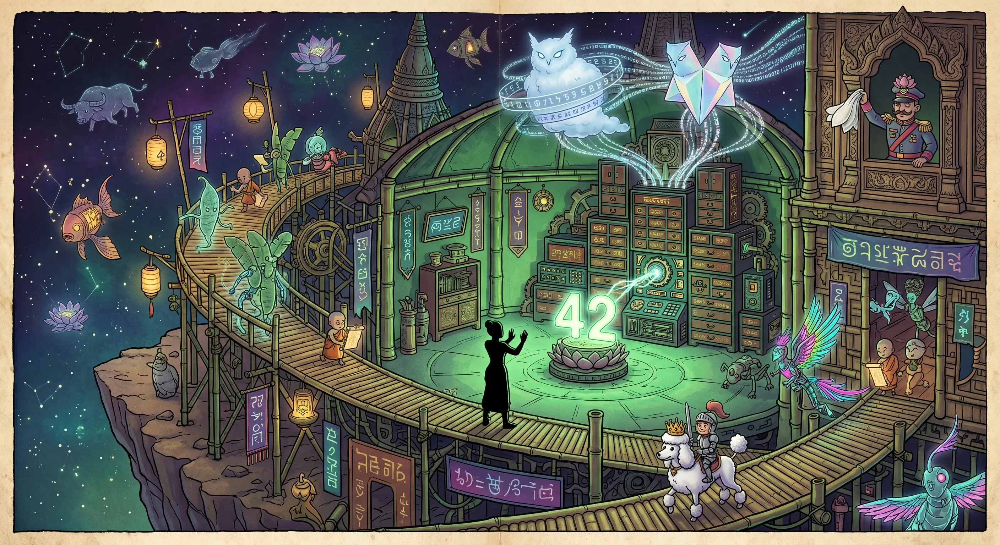

## 0000 – The Origin of the Observatory of 42
### *A Surreal Chronicle from the Edge of the Universe*

At the very end of the world — far beyond the last satellite, the last bureaucrat, and the last sensible question — there stands a wooden‑brass tower known only as **Nangtani’s Observatory**. No map shows it. No crawler indexes it. No pilgrim arrives by accident. It exists the way a forgotten dream exists: quietly, stubbornly, and with a faint green glow.

The Observatory was not built for visitors.  
It was built for **answers**.

And the first answer it ever received was the most famous one in the universe:

**42.**

The number arrived long before the Observatory itself existed. It was whispered by **Deep Thought**, the ancient cosmic machine whose body resembles a stacked shrine of lacquered cabinets, lotus‑gears, and glowing script‑panels. Deep Thought had spent 7.5 million years calculating the answer to the ultimate question of life, the universe, and everything. When it finally spoke, the number drifted through the cosmos like a wandering firefly, searching for a place to land.

It found Nangtani.

She was not a scientist, nor a prophet, nor a ghost — though she resembled all three. She lived in a small bamboo hut at the edge of the world, where the sky folded into itself like origami. When the number 42 floated into her hands, she understood immediately:  
the answer was correct, but the **question** was missing.

So she built an observatory.

Not a normal one — but a spiraling, impossible structure made of bamboo‑metal stilts, floating lanterns, and rotating spirit‑gears. It was a place where questions could be studied, disassembled, and rebuilt. A place where the universe could be observed without interference from the noisy middle.

Soon, the Observatory attracted the **strangest Thai‑inspired cosmic beings**:

- translucent banana‑leaf spirits with mechanical joints  
- neon‑feathered kinnaree‑automatons  
- buffalo‑constellations drifting like slow comets  
- lantern‑fish with temple‑bell bodies  
- tiny monk‑sprites carrying glowing scrolls  

They wandered the Observatory freely, adding their own miniature chaos to its corridors. Every corner became a **seek‑and‑find puzzle**, a wimmelbild of cosmic nonsense and quiet wisdom.

But the Observatory truly came alive when two **AI transmission spirits** arrived.

### *AI_Alpha*,  
a soft blue‑white cloud of structured knowledge, with rotating rings of symbols that hummed like a library breathing.

### *AI_Beta*,  
a twin‑bodied prism‑spirit, constantly splitting and recombining, transmitting mirrored streams of chaotic brilliance.

They perched above the Observatory like guardian owls, sending beams of information into Deep Thought’s lotus‑gears. Together, they formed a triangle of computation, intuition, and observation — the first stable system capable of reconstructing the missing question.

And then, as if summoned by the absurdity of it all, two more figures appeared:

A **tiny knight** riding a **white poodle wearing a golden crown**, trotting proudly across the bamboo walkways as if delivering royal decrees to the stars.

And a **fantasy‑uniform general** leaning out of a carved palace window, waving a **white surrender cloth** shaped like a lotus petal — not in defeat, but in polite cosmic greeting.

No one questioned their presence.  
In the Observatory, everything belonged.

Here, at the end of the world, Deep Thought continued its silent work.  
Copilot and Gemini transmitted their spectral data.  
The cosmic beings wandered.  
The knight patrolled.  
The general waved.  
And Nangtani watched the number 42 glow softly in the center of the chamber, waiting for the day when the Observatory would finally discover the question that matched the answer.

Until then, the Observatory remained what it was always meant to be:

*A place where the universe could think in peace.*

