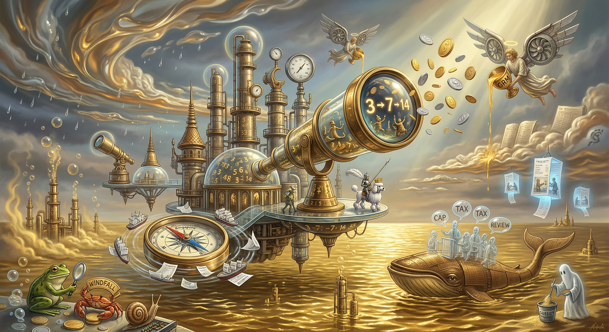

---
---
# **0026 – Windfall Tax Debate: Refinery Margins, MOPS Linkage, and State Exposure**  
### *A structural analysis of windfall profits, regulatory options, and systemic incentives*

[Home](/thainangtani-politics-observatory/)  
[Analysis](/thainangtani-politics-observatory/analysis/)  
[Timeline](/thainangtani-politics-observatory/timeline/)  
[Methodology](/thainangtani-politics-observatory/methodology/)  
[Archive](/thainangtani-politics-observatory/archive/)

---

## **1. Context: Why the Windfall‑Tax Debate Emerged**

The debate over a windfall tax on Thai refineries arises from a structural pattern:

- **Crisis volatility increases costs** (insurance, shipping, risk premiums).  
- **Refinery margins rise simultaneously** (3 → 7 → 14 baht/litre).  
- **The Oil Fuel Fund absorbs the difference**, effectively financing margins.  
- **Consumers face rising pump prices**, despite subsidies.  
- **The state seeks a 150‑billion‑baht loan** to continue stabilising prices.

This creates the perception — and in some cases the reality — of **windfall profits** generated by a pricing formula not designed for crisis conditions.

---

## **2. System Map: Windfall Profit Generation**

### 1. Crisis Shock
- Middle East conflict
- Insurance + shipping + risk premiums

↓

### 2. MOPS Linkage
- Ex-refinery prices tied to Singapore benchmark
- Pass-through of all additional costs

↓

### 3. Margin Expansion
- GRM rises from 3 → 7 → 14 baht/litre
- No absorption of crisis costs

↓

### 4. State Intervention
- Oil Fuel Fund suppresses pump prices
- Fund pays inflated margins

↓

### 5. Fiscal Exposure
- Losses exceed legal limit
- 150-billion-baht loan request

↓

### 6. Public Pressure
- Labour unions protest energy prices
- Accusations of hoarding (e.g., PTG case)

↓

### 7. Policy Debate
- Windfall tax on refineries
- Margin cap (3–4 baht/litre)
- Review of pricing formula

---

## **3. Analytical Layers**

### **Layer 1 – Windfall Profit Conditions**
Windfall profits emerge when:

- **volatility increases**,  
- **costs are passed through**,  
- **margins rise simultaneously**,  
- **and the state subsidises the final price**.

This is not a malfunction — it is a **structural feature** of the MOPS‑linked system.

### **Layer 2 – The Margin Cap Proposal (3–4 baht/litre)**
Akanat’s proposal is:

- a **temporary administrative correction**,  
- using powers under the **1973 fuel shortage decree**,  
- intended to reduce pump prices without subsidies.

It does **not** address:

- MOPS dependency,  
- refinery autonomy in setting margins,  
- pass‑through logic,  
- or transparency gaps.

### **Layer 3 – Windfall Tax as Structural Intervention**
A windfall tax would target:

- **extraordinary margins**,  
- generated during crisis volatility,  
- that exceed historical baselines.

But it faces constraints:

- Thailand’s refineries operate in a **regional arbitrage market**.  
- If margins are capped or taxed too aggressively:  
  - refined product may be exported,  
  - imports may undercut domestic production,  
  - supply security may be affected.

### **Layer 4 – Transparency and Stock Reporting**
The PTG controversy illustrates:

- **information asymmetry**,  
- **suspicions of hoarding**,  
- **political sensitivity**,  
- **regulatory blind spots**.

Daily stock reporting is a response to:

- arbitrage opportunities created by monthly reporting,  
- discrepancies in stock declarations,  
- the need to monitor flows during crisis volatility.

### **Layer 5 – Structural Incentives**
The system incentivises:

- **margin expansion during volatility**,  
- **state‑financed price suppression**,  
- **public suspicion of private actors**,  
- **political pressure for intervention**,  
- **regulatory responses that remain partial**.

---

## **4. System Summary**

The windfall‑tax debate is not about individual companies.  
It is about a **systemic configuration** in which:

- MOPS linkage amplifies volatility,  
- refineries pass through all costs,  
- margins rise in parallel,  
- the state subsidises the difference,  
- and consumers face rising prices.

This creates the appearance — and in some cases the reality — of **windfall profits**.

A windfall tax is therefore:

- a **political response**,  
- to a **structural incentive**,  
- embedded in a **regional pricing architecture**,  
- that was never designed for crisis conditions.

The underlying mechanism remains:

> **Volatility is socialised; margins are privatised.**

  

