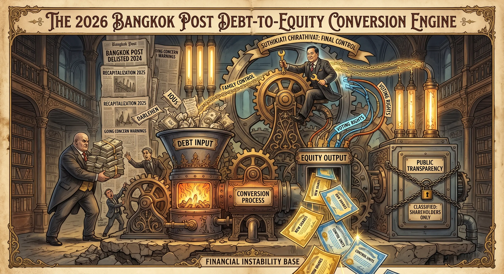

## 0044 – Bangkok Post: Debt‑to‑Equity Conversion and Ownership Realignment (2024–2026)
### *How unpayable loans were transformed into ownership and reshaped the company’s structure*

---

## 1. Overview  
Between 2024 and 2026, the Bangkok Post underwent a financial restructuring driven by **insolvency**, **negative equity**, and **dependence on creditor financing**.  
The company could not repay its loans, leading to a sequence of **debt‑to‑equity conversions** that transferred ownership to its creditors.

This document explains:

- who provided the financing  
- how much money was involved  
- why the company could not repay  
- how debt was converted into equity  
- what the creditors ultimately own  
- how this reshaped the ownership structure

---

## 2. Financial Condition (2024–2025)  
The Bangkok Post entered 2024 in a state of **balance‑sheet insolvency**.

Key indicators:

- **Equity (2024 audited): –444m Baht**  
- **Accumulated losses (mid‑2025): 954m Baht**  
- **Cash on hand (2024): 3.66m Baht**  
- **Total liabilities (mid‑2025): 558m Baht**  

The company lacked liquidity, profitability, and the ability to service or repay its debts.

---

## 3. Creditors and Loan Exposure  
Two creditors financed the Bangkok Post during its loss‑making years.

### *a) Suthikiati Chirathivat (Executive Chairman)*  
Provided substantial private loans to maintain operations.

- **298m Baht** (converted in 2025)  
- **321.82m Baht** (outstanding in 2025)  
- **Total exposure: ~620m Baht**

### *b) Bangkok Bank*  
Extended institutional credit.

- **71m Baht** (converted in 2025)  
- **71.36m Baht** (outstanding in 2025)  
- **Total exposure: ~71m Baht**

### *Total debt owed to both creditors: ~700m Baht*

---

## 4. Inability to Repay  
The Bangkok Post could not repay these loans due to:

- negative equity  
- insufficient cash flow  
- declining revenue  
- persistent operating losses  
- lack of external investment  
- absence of collateral with sufficient value  

Under normal conditions, this would result in default.  
Instead, the company initiated a restructuring process.

---

## 5. Debt‑to‑Equity Conversion  
The central mechanism of the restructuring was the **conversion of debt into equity**.

### *a) Definition*  
A creditor relinquishes the right to repayment and receives newly issued shares.

### *b) Balance‑sheet effect*  
- liabilities decrease  
- equity increases  
- solvency improves on paper  
- no new cash enters the company  
- ownership shifts to the creditors  
- minority shareholders are diluted

### *c) Application at the Bangkok Post*  
The company issued new shares to its creditors in exchange for the cancellation of outstanding debt.

---

## 6. Ownership Changes (2025–2026)

### *a) 2025 Conversion*  
Debt converted:

- 298m Baht (Suthikiati)  
- 71m Baht (Bangkok Bank)

Resulting ownership:

- **58%** Suthikiati  
- **15%** Bangkok Bank  
- **27%** minority shareholders

### *b) 2026 Conversion (AGM Notice, 8 April 2026)*  
Capital increase:

- **500m → 1.238bn Baht**  
- **738m new shares** issued  
- allocated exclusively to Suthikiati and Bangkok Bank  
- paid through **conversion of existing debt**, not new cash

Expected ownership:

- **>70%** Suthikiati  
- **12–15%** Bangkok Bank  
- **<15%** minority shareholders

The creditors become the controlling owners.

---

## 7. Material Assets and Actual Value  
The Bangkok Post’s material assets are limited.

### *a) Main building (Rama IV / Klong Toey)*  
Estimated market value: **300–500m Baht**

### *b) Printing equipment*  
Old, depreciated, low resale value: **near zero**

### *c) Office equipment, IT, vehicles*  
Fully depreciated, minimal value

### *d) Brand “Bangkok Post”*  
Strategically significant but:

- not recorded as an asset  
- no market valuation  
- value depends on reputation, not physical assets

### *Total material value: approximately 350–500m Baht*

This is significantly lower than the **~700m Baht** in loans converted into equity.

---

## 8. Interpretation  
The restructuring reflects:

- **insolvency** (negative equity, unpayable debt)  
- **creditor financing** (private and institutional)  
- **balance‑sheet repair** through debt cancellation  
- **ownership concentration** via equity issuance  
- **institutional rather than commercial value** of the newspaper  

The process did not restore operational profitability.  
It redefined the company’s ownership and governance structure.

---

## 9. Notes  
This document describes the financial and structural mechanisms of the restructuring.  
It does not address editorial content, political positions, or individual actors beyond their financial roles.

