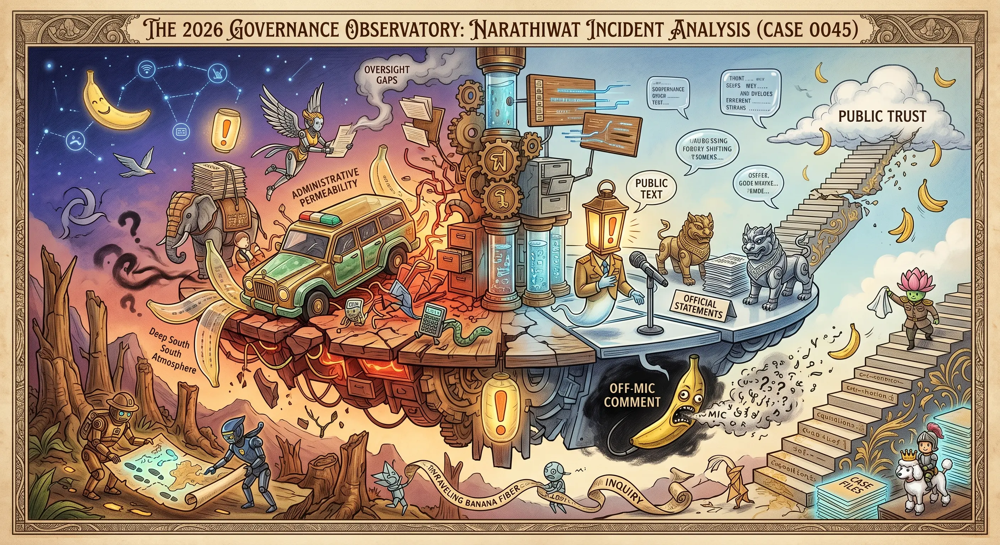

## 0045 – The Narathiwat Incident (2026): Administrative Penetration, Narrative Framing, and Public Trust
### *A documented case illustrating how a contemporary event aligns with structural patterns in Thailand’s security architecture*

---

## 1. Event Overview  
The March 2026 attack on MP **Kamonsak Leewamoh**, combined with an off‑microphone remark by **Lt Gen Narathip Phoynork**, has triggered public debate about accountability, oversight, and the role of security institutions in the Deep South.  
This post documents the observable facts and situates them within previously identified structural mechanisms:

- administrative penetration  
- personnel overlap between security actors and suspects  
- narrative framing during crises  
- public trust dynamics in conflict‑affected regions  

The purpose is to provide a **forensic, non‑causal** account of how a single incident reflects broader governance patterns.

---

## 2. Documented Facts  
According to publicly available reporting, the following elements are verifiable:

- MP Kamonsak was ambushed outside his home on March 20, 2026  
- gunmen used an M16 rifle at close range  
- a **government‑issued vehicle** linked to ISOC Region 4 was used by suspects  
- four individuals were arrested, including:  
  – a former marine ranger  
  – a former navy officer with reconnaissance training  
  – two civilian intermediaries  
- one suspect remains at large  
- Lt Gen Narathip stated publicly that the military does not target dissenters  
- off‑mic, he added: *“If it were me, I wouldn’t let him survive.”*  
- MPs and civil society actors expressed concern about the implications of the remark  
- investigations into the misuse of state resources are ongoing  

These facts form the empirical basis for the structural analysis below.

---

## 3. Administrative Penetration  
The incident contains two elements that align with previously documented patterns of administrative penetration:

### *a) Use of State Resources*  
A government vehicle associated with ISOC Region 4 was used by suspects.  
This illustrates:

- permeability between official assets and informal operational contexts  
- gaps in oversight regarding state‑issued equipment  
- the logistical reach of security‑adjacent networks  

### *b) Personnel Overlap*  
Among the suspects are individuals with:

- military backgrounds  
- paramilitary training  
- prior involvement in security operations  

This overlap does not imply institutional intent, but it demonstrates how **security‑trained personnel** can appear in incidents involving political actors.

These elements correspond to the structural mechanisms outlined in **0033 – Administrative Penetration and Parallel Governance**.

---

## 4. Ideological Framing  
During public communication, Lt Gen Narathip emphasized:

- “ideological influences in certain education settings”  
- the need to address root causes within civilian domains  

This framing aligns with patterns described in **0032 – Ideological Conditioning and Identity Production**, where:

- civilian sectors (schools, curricula, community programs)  
- are interpreted through a security lens  
- and positioned as potential sources of instability  

The remark illustrates how ideological narratives can be mobilized during crisis communication.

---

## 5. Narrative Framing  
Public statements following the attack exhibit several recurring features:

### *a) Early De‑politicisation*  
The incident was initially framed as potentially personal or isolated.

### *b) Separation of Comment and Policy*  
Officials emphasized that the off‑mic remark was personal, not institutional.

### *c) Controlled Escalation*  
Communication focused on:

- ongoing investigations  
- disciplinary procedures  
- reassurance of institutional neutrality  

These elements correspond to the narrative management patterns described in **0036 – Kamolsak Leewama Case Study**.

---

## 6. Public Trust Dynamics  
The combination of:

- a high‑profile attack  
- the use of a state vehicle  
- the involvement of security‑trained individuals  
- and a senior officer’s off‑mic remark  

has intensified public concern regarding:

- accountability  
- transparency  
- the boundaries between civilian and security domains  
- the reliability of official narratives  

These dynamics are consistent with long‑standing trust challenges in the Deep South, where conflict has shaped perceptions of state protection and fairness.

---

## 7. Interpretation  
This post does not infer motives or assign responsibility.  
Instead, it documents how the Narathiwat incident:

- aligns with structural mechanisms previously identified  
- illustrates administrative permeability  
- demonstrates the use of ideological framing in crisis communication  
- shows how narrative management operates during sensitive events  
- highlights the interaction between Front‑End and Back‑End governance  

The incident does not introduce new mechanisms; it provides a **contemporary example** of existing patterns.

---

## 8. Notes  
This post describes structural dynamics and observable facts.  
It does not address individual motives, political positions, or institutional intent.

