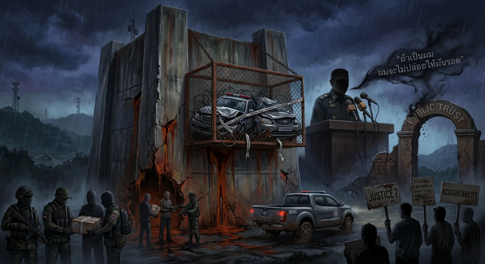

## 0045 – The Narathiwat Incident (2026): Administrative Penetration, Narrative Framing, and Public Trust
### *A documented case illustrating how a contemporary event aligns with structural patterns in Thailand’s security architecture*

---

## 1. Event Overview  
The March 2026 attack on MP **Kamonsak Leewamoh**, combined with an off‑microphone remark by **Lt Gen Narathip Phoynork**, has triggered public debate about accountability, oversight, and the role of security institutions in the Deep South.  
This post documents the observable facts and situates them within previously identified structural mechanisms:

- administrative penetration  
- personnel overlap between security actors and suspects  
- narrative framing during crises  
- public trust dynamics in conflict‑affected regions  
- official responses and post‑incident communication  

The purpose is to provide a **forensic, non‑causal** account of how a single incident reflects broader governance patterns.

---

## 2. Documented Facts  
According to publicly available reporting, the following elements are verifiable:

- MP Kamonsak was ambushed outside his home on March 20, 2026  
- gunmen used an M16 rifle at close range  
- a **government‑issued vehicle** linked to ISOC Region 4 was used by suspects  
- four individuals were arrested, including:  
  – a former marine ranger  
  – a former navy officer with reconnaissance training  
  – two civilian intermediaries  
- one suspect remains at large  
- Lt Gen Narathip stated publicly that the military does not target dissenters  
- off‑mic, he added: *“If it were me, I wouldn’t let him survive.”*  
- MPs and civil society actors expressed concern about the implications of the remark  
- investigations into the misuse of state resources are ongoing  

Additional reporting (April 2026) documents:

- public apologies by the Prime Minister and Lt Gen Narathip  
- clarification that earlier remarks were attributed to miscommunication  
- concerns raised by representatives of Islamic educational institutions  
- requests for the commander’s reassignment  
- government statements that these concerns would be reviewed  
- announcements of expanded engagement between ISOC and educational institutions  

These facts form the empirical basis for the structural analysis below.

---

## 3. Administrative Penetration  
The incident contains two elements that align with previously documented patterns of administrative penetration:

### *a) Use of State Resources*  
A government vehicle associated with ISOC Region 4 was used by suspects.  
This illustrates:

- permeability between official assets and informal operational contexts  
- gaps in oversight regarding state‑issued equipment  
- the logistical reach of security‑adjacent networks  

### *b) Personnel Overlap*  
Among the suspects are individuals with:

- military backgrounds  
- paramilitary training  
- prior involvement in security operations  

This overlap does not imply institutional intent, but it demonstrates how **security‑trained personnel** can appear in incidents involving political actors.

These elements correspond to the structural mechanisms outlined in **0033 – Administrative Penetration and Parallel Governance**.

---

## 4. Ideological Framing  
During public communication, Lt Gen Narathip emphasized:

- “ideological influences in certain education settings”  
- the need to address root causes within civilian domains  

This framing aligns with patterns described in **0032 – Ideological Conditioning and Identity Production**, where:

- civilian sectors (schools, curricula, community programs)  
- are interpreted through a security lens  
- and positioned as potential sources of instability  

Subsequent clarification (April 2026) stated that these remarks referred to specific cases rather than entire systems.  
The framing remains structurally relevant because it illustrates how ideological narratives are mobilized during crisis communication.

---

## 5. Narrative Framing  
Public statements following the attack exhibit several recurring features:

### *a) Early De‑politicisation*  
The incident was initially framed as potentially personal or isolated.

### *b) Separation of Comment and Policy*  
Officials emphasized that the off‑mic remark was personal, not institutional.

### *c) Controlled Escalation*  
Communication focused on:

- ongoing investigations  
- disciplinary procedures  
- reassurance of institutional neutrality  

### *d) Post‑Incident Clarification and Apology*  
Subsequent statements included:

- a public apology by the commander  
- a public apology by the Prime Minister in his capacity as ISOC director  
- clarification that earlier remarks were attributed to miscommunication  
- assurances that concerns raised by educational institutions would be reviewed  

These elements correspond to the narrative management patterns described in **0036 – Kamolsak Leewama Case Study**.

---

## 6. Public Trust Dynamics  
The combination of:

- a high‑profile attack  
- the use of a state vehicle  
- the involvement of security‑trained individuals  
- a senior officer’s off‑mic remark  
- and subsequent public apologies  

has intensified public concern regarding:

- accountability  
- transparency  
- the boundaries between civilian and security domains  
- the reliability of official narratives  
- the neutrality of institutional communication  

Representatives of Islamic educational institutions expressed concern and requested the commander’s reassignment.  
The government stated that these concerns would be reviewed within existing administrative procedures.

These dynamics are consistent with long‑standing trust challenges in the Deep South, where conflict has shaped perceptions of state protection and fairness.

---

## 7. Implications for Law Enforcement and Institutional Accountability

The off‑microphone remark by Lt Gen Narathip — stating that he “would not have let him survive” — has direct implications for the integrity of law enforcement processes.  
While the statement was framed as a personal comment, its institutional context is significant:

– the speaker holds command authority within ISOC Region 4  
– the incident under investigation occurred within his operational jurisdiction  
– the suspects include individuals with security‑related backgrounds  
– a government‑issued vehicle was involved in the attack  

These factors create a structural overlap between the **investigating environment** and the **institutional hierarchy** connected to the event.

### *a) Investigative Neutrality*  
Law enforcement agencies must operate independently of the command structure they may need to examine.  
A senior officer’s public statement about how he would have acted in a violent incident introduces:

– potential pressure on subordinates  
– perceived expectations within the hierarchy  
– uncertainty about the boundaries of permissible conduct  

This can influence witness cooperation, internal reporting, and the perceived safety of raising concerns.

### *b) Institutional Conflict of Interest*  
Because ISOC Region 4 is part of the operational environment surrounding the case, the continued presence of the commander in his role may create:

– a conflict between institutional loyalty and investigative duties  
– ambiguity about the chain of responsibility  
– difficulty in ensuring that all relevant information is accessible to investigators  

A temporary removal from command is a standard measure in systems where **procedural integrity** must be preserved.

### *c) Public Confidence in the Investigation*  
In conflict‑affected regions, trust in state institutions is already fragile.  
A remark implying acceptance of extrajudicial outcomes can:

– undermine confidence in the impartiality of the investigation  
– reinforce perceptions of unequal accountability  
– intensify public concern about the relationship between security actors and political violence  

Public trust is a functional component of security governance; its erosion affects the legitimacy of both the investigation and the institutions involved.

### *d) Separation Between Personal Opinion and Institutional Position*  
A temporary suspension or reassignment is not a punitive measure but a procedural safeguard.  
It ensures:

– a clear distinction between individual statements and institutional policy  
– an environment in which investigators can operate without hierarchical influence  
– the preservation of institutional credibility during an ongoing inquiry  

### *e) Legal Relevance of Statements Made by Command Authorities*  
The off‑mic remark also raises questions about the legal status of statements made by senior officers during official briefings.  
In most governance systems, the distinction between *personal opinion* and *institutional communication* becomes blurred when:

- the speaker holds command authority  
- the statement is made in an official setting  
- the subject concerns an ongoing criminal investigation  
- the individuals involved fall within the speaker’s operational domain  

This does not establish criminal liability; it highlights the **sensitivity of public communication** when senior officers comment on incidents involving political actors.

---

## 8. Official Responses and Engagement with Educational Institutions  
Following public concern, both the Prime Minister and Lt Gen Narathip issued public apologies.  
The commander stated that his earlier remarks had caused unease due to miscommunication and clarified that references to educational institutions concerned specific cases rather than entire systems.

Representatives of pondok, tadika and private Islamic schools expressed concern and requested the commander’s reassignment.  
The Prime Minister stated that these concerns would be reviewed within existing administrative procedures.

The commander announced an expansion of engagement activities between ISOC and educational institutions.  
In conflict‑affected regions, such engagement is structurally sensitive because:

- educational institutions serve pedagogical, cultural and identity‑related functions  
- security agencies hold an expanded operational role in the southern provinces  
- interactions between security actors and schools are shaped by historical and institutional context  
- public perceptions of institutional neutrality influence trust dynamics  

The announcement therefore forms part of the broader governance environment in which the incident and its aftermath are interpreted.

---

## 9. Interpretation  
This post does not infer motives or assign responsibility.  
Instead, it documents how the Narathiwat incident:

- aligns with structural mechanisms previously identified  
- illustrates administrative permeability  
- demonstrates the use of ideological framing in crisis communication  
- shows how narrative management operates during sensitive events  
- highlights the interaction between Front‑End and Back‑End governance  
- and provides a contemporary example of official responses in conflict‑affected regions  

The incident does not introduce new mechanisms; it reinforces existing patterns.

---

## 10. Sources  
**Bangkok Post – 16 April 2026**  
<a href="https://www.bangkokpost.com/thailand/general/3237650/bloodcurdling-message-from-isoc-alarms-public" target="_blank" rel="noopener noreferrer">https://www.bangkokpost.com/thailand/general/3237650/bloodcurdling-message-from-isoc-alarms-public</a>

**Bangkok Post – 17 April 2026**  
<a href="https://www.bangkokpost.com/thailand/general/3238815/pm-and-general-apologise-for-latters-troubling-talk" target="_blank" rel="noopener noreferrer">https://www.bangkokpost.com/thailand/general/3238815/pm-and-general-apologise-for-latters-troubling-talk</a>

---

## 11. Notes  
This post describes structural dynamics and observable facts.  
It does not address individual motives, political positions, or institutional intent.

