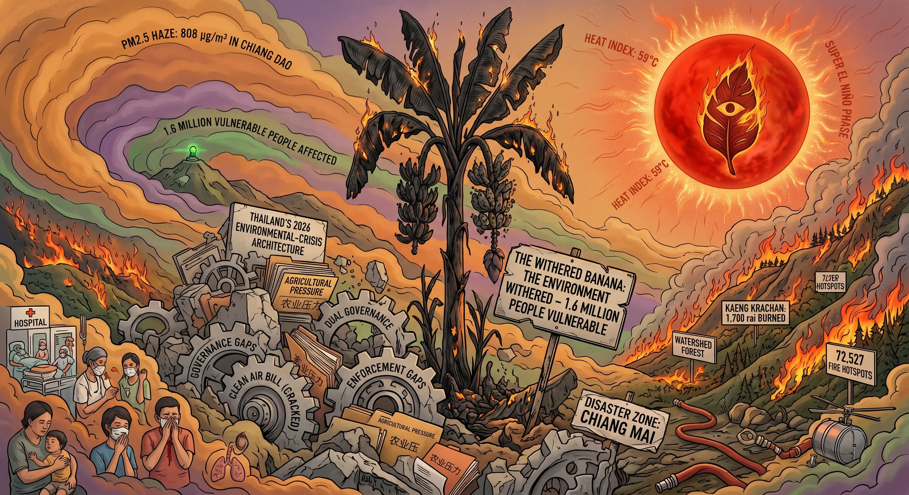

## 0047 – Thailand’s 2026 Environmental‑Crisis Architecture
### *How heat, haze, wildfires and governance gaps converge into a multi‑layered systemic emergency*

-----

## 1. Scope and Context

Thailand is experiencing a rare convergence of environmental stressors in 2026.  
Three parallel developments reinforce each other:

- extreme heat driven by a potential **Super El Niño**  
- widespread **wildfires** across northern and western provinces  
- a severe **PM2.5 haze crisis** affecting millions  

This article documents:

- the climatic drivers behind extreme heat and prolonged drought  
- the structural mechanisms of wildfire ignition and spread  
- the health impacts of PM2.5 exposure in valley‑based urban regions  
- the governance dynamics surrounding the Clean Air Bill  
- the interaction between land‑use pressure, enforcement gaps and atmospheric conditions  

The purpose is to analyze the **architecture of a compound environmental crisis**, situating these events within the broader framework of **Dual Governance in environmental management**.

-----

## 2. Documented Facts

Reporting from the *Bangkok Post* (April 2026) establishes several verifiable elements:

- PM2.5 levels in Chiang Dao district reached **808 µg/m³**, over 20 times the safety threshold.  
- Chiang Mai ranked **second globally** for air pollution during peak haze days.  
- Over **1.6 million vulnerable people** across 11 provinces were affected by hazardous air quality.  
- Northern Thailand recorded **72,527 wildfire hotspots** since December — a 25% year‑on‑year increase.  
- A major fire in Kaeng Krachan National Park burned **1,700 rai** of protected watershed forest.  
- Evidence of illegal land clearing was found in multiple plots within the park.  
- Experts warn that a **Super El Niño** may push heat indices to **59°C**, posing severe health risks.  
- Hospitals in Chiang Mai reported **more than double** the usual number of pollution‑related cases.  
- Opposition parties renewed efforts to advance the **Clean Air Bill**, while some government MPs raised economic and legal concerns.  
- Chiang Mai declared multiple districts as **disaster zones** due to wildfires and haze.

-----

## 3. Climatic Drivers of the 2026 Crisis

### *3.1 Super El Niño and Extreme Heat*

Meteorological specialists warn that Thailand may enter a **Super El Niño** phase in late 2026, producing:

- temperatures around **39°C**  
- humidity above **60%**  
- heat indices approaching **59°C**  

At these levels, core body temperature can reach **40°C within 10–15 minutes**, creating a high risk of heat stroke.

### *3.2 Drought and Delayed Rainfall*

Super El Niño conditions are expected to:

- delay the onset of the rainy season  
- intensify drought  
- reduce soil moisture  
- increase wildfire susceptibility  

These climatic factors form the **background layer** of the crisis architecture.

-----

## 4. Wildfire Dynamics and Land‑Use Pressure

### *4.1 Hotspot Escalation*

Northern Thailand recorded **2,165 active hotspots** on April 14 alone.  
The majority occurred in:

- conservation forests  
- national reserves  

Provinces with the highest counts:

- Nan  
- Chiang Rai  
- Lampang  
- Chiang Mai  
- Tak  

### *4.2 Kaeng Krachan Case Study*

A major fire in Kaeng Krachan National Park revealed:

- illegal tree felling  
- deliberate burning to prepare land for cultivation  
- two separate clearing sites  
- terrain requiring **five hours of trekking** for responders  

The fire burned **1,700 rai** of Class 1A watershed forest.

### *4.3 Terrain‑Driven Amplification*

Steep slopes and inaccessible valleys:

- slow response times  
- limit equipment transport  
- require helicopter water drops  
- allow fires to climb toward ridgelines  

This creates a **structural vulnerability** in mountainous regions.

-----

## 5. PM2.5 Exposure and Health Impacts

### *5.1 Extreme Concentrations*

Chiang Dao district recorded **808 µg/m³**, one of the highest values globally in 2026.  
All 17 northern provinces exceeded safety limits.

### *5.2 Healthcare System Strain*

Hospitals reported:

- doubled outpatient numbers  
- increased cases of:  
  - asthma  
  - acute respiratory distress  
  - nasal inflammation  
  - nosebleeds  
  - eye irritation  
  - allergic skin reactions  

### *5.3 Valley Exposure Mechanism*

Cities located in valleys — such as Chiang Mai — experience:

- temperature inversions  
- stagnant air  
- smoke accumulation from surrounding slopes  

This creates **smoke‑invasion events** at temperatures near **40°C**, combining heat stress with particulate exposure.

-----

## 6. Governance Responses and Policy Dynamics

### *6.1 Clean Air Bill – Support*

Opposition parties emphasize:

- clean air as a basic right  
- the need for year‑round standards  
- protection for vulnerable groups  
- improved equipment and welfare for firefighters  
- structural reforms in agriculture and industry  

### *6.2 Clean Air Bill – Concerns*

Some government MPs warn that the bill may:

- grant excessive powers to officials  
- overlap with existing laws  
- impose economic burdens  
- create new committees and agencies  
- lack clarity in enforcement mechanisms  

### *6.3 Enforcement Gap*

Multiple actors highlight that:

- Thailand has extensive environmental legislation  
- the core issue is **weak enforcement**, especially in remote forest areas  
- illegal land clearing remains a persistent ignition source  

This reflects a **dual governance tension** between formal regulation and practical implementation.

-----

## 7. Observable Patterns in Crisis Formation

Across the documented elements, several structural patterns emerge:

- **Compound Risk:** Heat, haze and wildfires reinforce each other.  
- **Valley Entrapment:** Topography amplifies PM2.5 exposure.  
- **Land‑Use Pressure:** Illegal clearing remains a primary ignition driver.  
- **Operational Fatigue:** Firefighters face prolonged deployments and injuries.  
- **Governance Fragmentation:** Multiple agencies with overlapping mandates.  
- **Policy Polarization:** Clean Air Bill debates reveal economic and legal tensions.  

-----

## 8. Analytical Synthesis

The 2026 environmental crisis in Thailand is not a sequence of isolated events but a **multi‑layer architecture**:

1. **Climatic Layer:** Super El Niño intensifies heat and drought.  
2. **Land‑Use Layer:** Illegal clearing and agricultural burning ignite fires.  
3. **Topographic Layer:** Valleys trap smoke and heat.  
4. **Health Layer:** PM2.5 exposure overwhelms hospitals.  
5. **Governance Layer:** Enforcement gaps and policy fragmentation limit response capacity.  

This architecture demonstrates that environmental crises emerge from the **interaction of natural conditions and human systems**, not from climate alone.

-----

## 9. Notes

This article focuses exclusively on documented environmental, climatic and governance mechanisms.  
It does not infer individual motives or assign moral responsibility.

