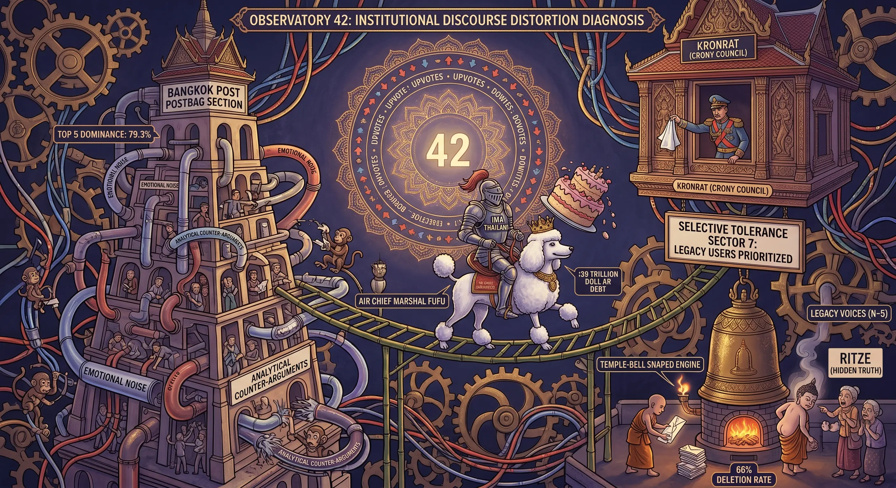
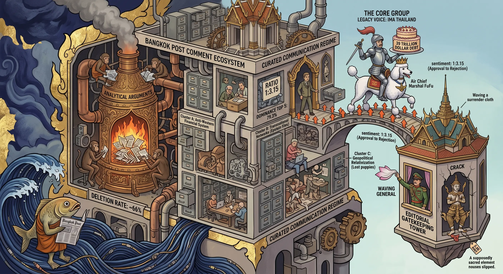

## 0053 – Bangkok Post Institutional Discourse Distortion: A Case Study on Structured Comment Environments
**An analysis of commentator persistence, narrative alignment, and the mechanics of disproportionate amplification**

---

## 1. Abstract
This study documents the functional continuity of selective moderation within the *Bangkok Post Postbag* section as of April 2026. Building on the baseline established in **0011 – Bangkok Post: Comment Ecology**, the research evaluates the transition from decentralized community interaction to a structured environment characterized by high speaker concentration and consistent narrative clusters.

The study contributes to the broader field of digital discourse analysis by demonstrating how selective visibility mechanisms can create the appearance of community engagement while structurally suppressing discursive diversity. The findings highlight the transition from an open comment environment to a curated communication regime shaped by editorial gatekeeping rather than user-driven interaction.

---

## 2. Statistical Inventory and Historical Trend (2024–2026)
Longitudinal data indicates a progressive contraction of the discursive space. The concentration of visibility among a select group of "Legacy Users" has reached a statistically dominant threshold.

### *2.1 Evolution of Speaker Concentration*

| Period | Metric | Finding |
| --- | --- | --- |
| 09/2024 – 03/2025 | Top 5 Dominance | 61.2% of all visible comments |
| 04/2026 (Sample) | Top 5 Dominance | 79.3% of all visible comments |

**Historical Trajectory:** The dominance of the top five voices has increased by **18.1 percentage points** over a 12-month period. This suggests an accelerating trend toward a closed discursive loop where nearly **80%** of the visible output is generated by the same core group identifiable in previous years.

This acceleration suggests a self-reinforcing mechanism: as the visible field narrows, the probability of alternative voices entering the discursive space decreases. The system thus exhibits characteristics of a semi-closed loop, where historical visibility predicts future visibility with increasing accuracy.

### *2.2 Akteurs‑Mapping (April 2026)*

| **Akteur (2026)**     | **Legacy‑Identität (2025)** | **Kommentare (Sample)** | **Anteil (%)** |
|------------------------|------------------------------|---------------------------|------------------|
| **Ima Thailand**       | lessimore (Rang 1)           | 29                        | **50,0 %**       |
| **Cryptic**            | Cryptic (Rang 5)             | 9                         | **15,5 %**       |
| **Alaska Thailand**    | Alaska (Top 10)              | 4                         | **6,9 %**        |
| **Keskaseksa**         | keskeseksa (Rang 2)          | 2                         | **3,4 %**        |
| **Gdgbbb**             | Gdgbbb                       | 2                         | **3,4 %**        |

---

## 3. The Downvote Disparity: Peer Rejection vs. Visibility
A primary marker of this environment is the decoupling of editorial visibility from reader approval.

* **Case Study: Ima Thailand**
    * **Visibility**: 50.0% of the sample space.
    * **Sentiment**: 333 Upvotes vs. 1,050 Downvotes (aggregate).
    * **Ratio**: **1 : 3.15** (Approval to Rejection).

The persistence of accounts with overwhelmingly negative peer feedback indicates that the moderation system does not operate as a reflection of community sentiment. Instead, it functions as a top-down filtration mechanism in which editorial decisions override user-based evaluation metrics. This creates a structural asymmetry: community members can express disapproval, but cannot influence visibility.

In a standard community-moderated forum, such rejection rates typically lead to content suppression. In this environment, the account remains the most prominent voice, indicating that visibility is a function of **selective tolerance** rather than community preference.

The visibility pattern creates functional pairings between dominant users, where one account posts high‑volume provocative content and another provides reinforcing replies. This pairing effect emerges structurally, even without coordination, due to the selective survival of only a few voices.

---

## 4. Documentation of Content Clusters
The comments of dominant actors correlate with three consistent thematic areas showing high alignment with specific geopolitical narratives.

* **Cluster A: Anti-Western/Financial System**: Focus on the delegitimization of the US dollar and Western financial stability ("dying in debt", "39 trillion debt").
* **Cluster B: Transnational Networks**: Utilization of personified blame and structural allegations against state actors and intelligence services ("owned by Israel via Epstein files").
* **Cluster C: Geopolitical Relativization**: Characterization of European institutions as "lost puppies" and framing military conflicts as "fake wars".

These clusters were identified through a frequency-based thematic coding process applied to the full dataset (Appendix A). The recurrence of specific rhetorical motifs across multiple dates and contexts suggests a stable narrative alignment rather than spontaneous or article-specific reactions.

### *4.1 Cluster: Financial Systems and Western Institutions*
The rhetoric focuses on the perceived collapse of Western economic structures and the delegitimization of the US dollar.
* **Ima:** "Trump plans to crash the world economy... he will roll out a digital dollar with a digital ID and it will be YOU paying off America's ridiculous 39 trillion dollar debt." (22 April 2026).
* **Ima:** "The US is dying in debt and is holding the war hostage to try and force everyone to use Petro Dollars." (26 April 2026).
* **Ima:** "Abandon by the US they [the EU] now feel they have to go to war with their neighbor Russia." (27 April 2026).

### *4.2 Cluster: Middle East Conflict and Transnational Networks*
This cluster utilizes personified blame and structural allegations against state actors and intelligence services.
* **Ima:** "Who genocided Palestine? ... Who started the war with Iran? ... Who looks at everyone else as Goyim?" (1 April 2026).
* **Ima:** "Its obvious he [Trump] is owned by Israel because of the files Mossad has on him via the Epstein files." (18 April 2026).
* **Ima:** "The Zionists are doing a good job making themselves the most hated group on the planet." (17 April 2026).

### *4.3 Cluster: Eastern Europe and NATO*
The comments contain a factual relativization of military conflicts and a downgrading of the agency of European institutions.
* **Cryptic:** "The Eu is like a lost puppy... That Russia would attack Europe is ridiculous." (27 April 2026).
* **Cryptic:** "Putin loves his people, Trump regards his with contempt." (6 April 2026).
* **Cryptic:** "THE EU & GLOBALISTS HAVE BEEN MADE TO LOOK TOTAL FOOLS." (19 April 2026).

---

## 5. The Moderation Paradox: Policy vs. Execution
The *Bangkok Post’s* stated policy prohibits "threatening, immoral, or racist" content. However, the operational reality shows a different pattern:
* **Selective Content Tolerance**: While an estimated **66%** of submissions—primarily analytical counter-arguments—are removed, explicit calls for violence (e.g., Keskaseksa’s "euthanised" comment) remain visible.
* **The Narrative Shield**: This tolerance of "Emotional Noise" serves as a shield, masking institutional weakness and discouraging substantive scrutiny of power networks.

The concept of a Narrative Shield describes a moderation strategy in which emotionally charged or polarizing content is tolerated because it generates engagement while simultaneously diverting attention from structural critique. This mechanism aligns with known patterns in institutional communication systems, where noise is permitted to obscure analytical scrutiny.

---

## 6. Conclusion
The data confirms a **Communication Regime**. Visibility is not an organic outcome of community participation but a result of **selective gatekeeping**. 

The statistical evidence—particularly the 18.1 percentage point increase in Top 5 dominance and the 3:1 rejection ratio—demonstrates that the system does not evolve organically. Instead, it exhibits characteristics of a curated environment in which editorial selectivity shapes the boundaries of permissible discourse.

The persistence of a small core group (79.3% visibility) despite significant reader rejection (3:1 ratio) characterizes a distorted public sphere optimized for institutional safety rather than transparent discourse.

---

##  7. Empirical Indicators of a Communication Regime

The dataset exhibits three structural indicators commonly associated with curated discursive environments:

1. Visibility Concentration: A small group of legacy users accounts for nearly 80% of all visible output.

2. Sentiment Decoupling: High rejection rates do not reduce visibility, indicating non-organic amplification.

3. Selective Omission: Analytical or critical submissions are disproportionately removed, while emotionally charged content remains.
Together, these indicators support the classification of the environment as a Communication Regime rather than an open forum.

## Appendix A: Full Evidence Dataset (1 April – 27 April 2026)

This dataset presents the raw comments utilized for statistical and thematic analysis.

### **Group 1: Dominant Core (Legacy Voices)**
**Ima Thailand** (Visibility: 50.0%)
* **27 Apr 10:17**: "The US sent Kuchner and Witkoff who are Zionists to Pakistan... obviously doing Netanyahu's bidding for him. What a complete joke." (16 Up / 14 Down)
* **27 Apr 10:13**: "The Eu is like a lost puppy. Abandon by the US they now feel they have to go to war with their neighbor Russia. That Russia would attack Europe is ridiculous." (14 Up / 22 Down)
* **26 Apr 09:01**: "They have to borrow because the US is dying in debt and is holding the war hostage to try and force everyone to use Petro Dollars." (7 Up / 30 Down)
* **25 Apr 12:22**: "Short AI Lego clips set to music are all the average American can digest. They are well done and correct." (10 Up / 39 Down)
* **24 Apr 09:48**: "Gold mining is talking place in Myanmar. ... Stop moaning abut your TV package nobody cares." (6 Up / 41 Down)
* **23 Apr 12:28**: "Its pretty obvious that the US and Israel are holding the world economy hostage by attacking Iran. ... Just bored losers trying to fill the large voids in their lives." (13 Up / 49 Down)
* **22 Apr 10:49**: "Trump plans to crash the world economy by making fuel prices sky rocket via his stupid war in Iran. ... YOU paying off America's ridiculous 39 trillion dollar debt." (18 Up / 52 Down)
* **22 Apr 10:45**: "Seems like it would be better to improve literacy than anything else. ... If you asked a person in England if English is the hardest subject they would laugh." (25 Up / 51 Down)
* **21 Apr 11:58**: "I know a Ramkhampaeng Engineering student ... laying in bed staring at his phone. ... Southern Thailand has had smuggling for a very long time." (12 Up / 38 Down)
* **21 Apr 09:39**: "Felix barks for democracy like its a one size fits all. ... America is ready to throw in the towel. Wake up." (1 Up / 24 Down)
* **21 Apr 09:33**: "Perhaps you would do better to stop pretending to be Thai. Trolling Social Media is all you got." (1 Up / 24 Down)
* **20 Apr 11:38**: "Democracy isn't some cookie cutter ... Your precious democracy is what put Trump in power and why Israel gets special treatment despite being a genocidal land grabber." (6 Up / 56 Down)
* **20 Apr 14:08**: "But but but democracy is a nonsense cop out argument. ... You wouldn't moan if PP won though would you." (8 Up / 50 Down)
* **20 Apr 14:04**: "You wrote the same stupid comment for 2 years. You are incapable lecturing on anything." (10 Up / 50 Down)
* **20 Apr 10:51**: "Leotard does a pretty good impression of someone trying to make a comment related to anything and failing." (15 Up / 5 Down)
* **19 Apr 08:56**: "The only reason the EU was over run with Muslims was because endless American led wars ... same is now happening once again thanks to Israel and America." (21 Up / 28 Down)
* **19 Apr 08:47**: "With all the intel Mossad has on Trump you would think he would be more interested in taking Israel out than Iran." (11 Up / 27 Down)
* **18 Apr 11:37**: "Maybe less comments are printed because they are spam unrelated to the article ... dope named Paul81 who now goes by Thaksinthorn." (9 Up / 28 Down)
* **18 Apr 11:34**: "I disagree with the Catholic church ... Its obvious he [Trump] is owned by Israel because of the files Mossad has on him via the Epstein files." (12 Up / 26 Down)
* **18 Apr 10:26**: "At least Felix can stay on point. What's the Anus gangs excuse ?" (1 Up / 18 Down)
* **17 Apr 11:32**: "The Zionists are doing a good job making themselves the most hated group on the planet ... Trump is their savior." (13 Up / 47 Down)
* **16 Apr 13:59**: "How far is the planet gonna allow Trump and Netanyahu to bend you over ?" (19 Up / 26 Down)
* **15 Apr 14:47**: "JFK assassination and 911 was done by the same country attacking Iran right now. See a theme ?" (8 Up / 38 Down)
* **13 Apr 10:19**: "The days of US military bases in the Middle East are over. So is the stupid Petro Dollar. Is__l better enjoy the short time it has left." (11 Up / 45 Down)
* **08 Apr 14:52**: "Bangkok should be a garden paradise not a concrete swimming pool reflecting heat and trapping flood water." (11 Up / 31 Down)
* **06 Apr 10:38**: "Maybe Trump could understand the mass money wasted if it was his money being used and not taxpayers." (20 Up / 67 Down)
* **06 Apr 17:51**: "Trump and Netanyahu need to be locked up before they drop a nuke." (5 Up / 19 Down)
* **06 Apr 15:20**: "How many times does BP need to verify my email ?" (4 Up / 22 Down)
* **02 Apr 16:00**: "Cars are lined as normal in Bangkok. ... Some dopes even defend it as they spend hours a day shuffling their dopey kids to schools." (3 Up / 41 Down)
* **01 Apr 14:12**: "Who genocided Palestine? ... Who look at everyone else as Goyim? ... Who started the war with Iran? Who bombed a girls school ?" (23 Up / 42 Down)

**Cryptic Thailand** (Visibility: 15.5%)
* **27 Apr 17:17**: "Early Feb 2022 Milley warned ... He was wrong as is the chump with a Ukie flag. ... Losers tend to do that." (2 Up / 5 Down)
* **20 Apr 00:01**: "Peter Magyar was in Orban's party till 2024. The whole thing was a sham ... Magyar is more rightwing than Orban as the EU have now found out!" (0 Up / 29 Down)
* **19 Apr 15:11**: "Our understanding of events in Hungary has been shaped by inaccurate reporting. ... EU & GLOBALISTS HAVE BEEN MADE TO LOOK TOTAL FOOLS." (2 Up / 36 Down)
* **15 Apr 19:03**: "There are none so blind as those who will not see." (1 Up / 22 Down)
* **14 Apr 19:08**: "Porcine US ignorance. ... Trump and most posters here [struggle with high-level analysis]." (3 Up / 23 Down)
* **11 Apr 16:49**: "JT makes the point, 'Surely a vibrant forum boosts traffic?' ... more clicks for advertisers to count." (6 Up / 28 Down)
* **06 Apr 18:25**: "Putin loves his people, Trump regards his with contempt, and who could blame him?" (6 Up / 20 Down)
* **06 Apr 16:45**: "How many times are you going to say that corn is subsidised?" (0 Up / 24 Down)
* **02 Apr 15:50**: "'By our own definition of terrorism ... we are the terrorists.' True, you are." (5 Up / 32 Down)
* **01 Apr 17:24**: "Israel has spent hundreds of billions of dollars on nuclear research, whose only purpose can be military." (13 Up / 35 Down)

---

## Appendix B: Methodology and Limitations
* **Sample Window:** 1 April 2026 – 27 April 2026.
* **Source:** *Bangkok Post Opinion/Postbag* comment sections.
* **Analysis Type:** Descriptive inventory of all visible comments (N=58).
* **Historical Baseline:** 09/2024 – 03/2025 dataset (N=600).
* **Limitations:** This study analyzes only **visible** comments. Due to the high estimated deletion rate (approx. 66%), the original submissions were not available for analysis, resulting in a sampling bias toward content tolerated by the moderation regime.

Future research could incorporate longitudinal tracking of deleted comments, if accessible, to quantify the full extent of editorial intervention. Additionally, cross-referencing comment timestamps with moderation windows may further illuminate the operational structure of the secondary review layer.

**Primary Source Reference:**  
<a href="[https://www.bangkokpost.com/opinion/postbag/](https://www.bangkokpost.com/opinion/postbag/)" target="_blank" rel="noopener noreferrer">[https://www.bangkokpost.com/opinion/postbag/](https://www.bangkokpost.com/opinion/postbag/)</a>

