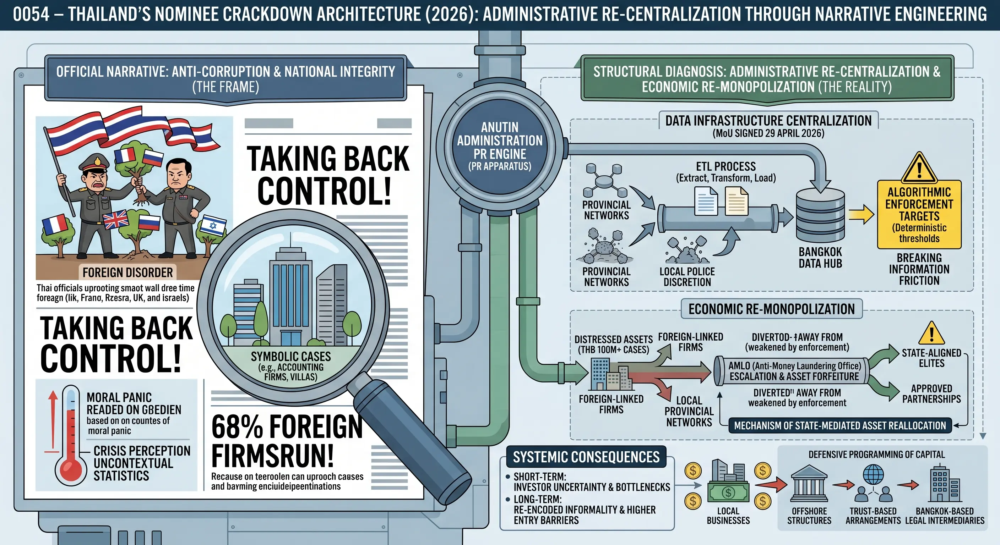
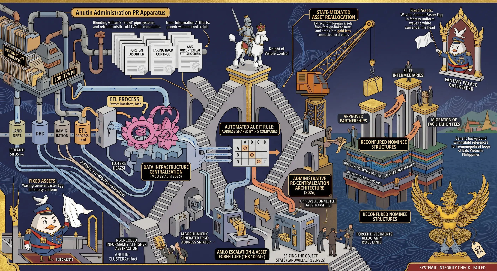

## 0054 – Thailand’s Nominee Crackdown Architecture (2026): Administrative Re‑Centralization Through Narrative Engineering
**A structural analysis of timing, intent, and systemic consequences under the Anutin administration**

---

## 1. Abstract
This study examines the 2026 “nominee crackdown” targeting foreign‑linked firms on Koh Samui and Koh Phangan. While officially framed as an anti‑corruption initiative, the campaign exhibits characteristics of a **re‑centralization project**, in which administrative power, economic control, and narrative framing converge to reshape the governance of Thailand’s tourism‑dependent island economies.

The analysis demonstrates that the crackdown is not a response to newly discovered illegality. Instead, it reflects a shift in political incentives under the Anutin administration, where long‑standing informal arrangements—previously tolerated and economically integrated—are being reclassified as threats to national integrity. This reclassification enables the state to assert control over semi‑autonomous economic zones, redirect revenue streams, and consolidate authority through a security‑oriented communication regime.

---

## 2. Structural Background: The Informal Foundations of Island Economies
For decades, the economic systems of Samui and Phangan have relied on hybrid structures that combine formal registration with informal operational practices. Restrictions on foreign land ownership, visa limitations, and sector‑specific licensing requirements created a predictable outcome: **nominee arrangements became a functional necessity**, not an anomaly.

Local administrative bodies, police units, and provincial networks benefited from these arrangements through facilitation fees, licensing shortcuts, and discretionary enforcement. The system was stable because it was mutually profitable. The current crackdown therefore represents not the discovery of illegality, but the **political decision to redefine tolerated practices as violations**.

---

## 3. Why the Crackdown Emerges Now: The Timing Logic of the Anutin Administration
The escalation of enforcement in 2026 is best understood as the product of three converging dynamics.

### *3.1 Political Incentive Shift*
The new administration requires visible demonstrations of control. After years of economic stagnation, rising public anxiety, and fragmented provincial governance, the government benefits from a campaign that:

- signals decisiveness,  
- frames foreign actors as the source of disorder, and  
- distinguishes the new leadership from its predecessors.

The nominee crackdown provides a **low‑cost, high‑visibility** mechanism for projecting administrative strength.

### *3.2 Administrative Re‑Centralization*  
Island economies have long operated as **semi‑autonomous zones**, shaped by local patronage networks and informal regulatory ecosystems. The crackdown enables Bangkok to:

- reclaim authority over licensing and land oversight,  
- weaken entrenched provincial networks, and  
- redirect revenue flows toward central agencies.

The MoU signed on 29 April 2026 formalizes this shift, creating an inter‑agency enforcement architecture that bypasses local discretion.

### *3.2.1 Data Infrastructure as a Centralization Instrument*  
A critical dimension of the MoU is its transformation of Thailand’s administrative data architecture. For decades, provincial networks derived power from **information asymmetry**: the Land Department, the Department of Business Development, Immigration, and provincial police each maintained isolated data silos. These silos created “information friction” that shielded local actors from central oversight.

The MoU functions as a structural **ETL process — Extract, Transform, Load**. By cross‑referencing previously disconnected databases, the central government gains a panoramic view of ownership chains, nominee structures, visa patterns, and land transactions. This bulk‑array I/O capability eliminates the informational bottlenecks that historically protected provincial networks. Once data is unified, the local level loses its monopoly on interpretation, and Bangkok acquires the ability to generate enforcement targets algorithmically rather than through negotiated discretion.

---

### *3.3 Economic Re‑Monopolization*  
The campaign creates opportunities for politically aligned actors to acquire distressed assets, enter previously saturated markets, and reshape the competitive landscape. By destabilizing foreign‑linked firms, the state facilitates:

- forced divestments,  
- renegotiated ownership structures,  
- and the emergence of new “approved” partnerships.

This pattern mirrors earlier regional precedents in Indonesia, Vietnam, and the Philippines, where anti‑nominee campaigns functioned as **market reset mechanisms** rather than anti‑corruption reforms.

### *3.3.1 Object State Persistence and AMLO Escalation*  
The involvement of the Anti‑Money Laundering Office (AMLO) marks a qualitative shift in the nature of the crackdown. When high‑value cases—typically those involving assets exceeding 100 million THB—are escalated to AMLO, the operation transitions from administrative correction to **asset forfeiture**. At this stage, the state is no longer contesting licenses or corporate structures; it is seizing the **Object State** itself: land parcels, villas, capital reserves, and revenue‑generating assets.

This escalation creates a direct pipeline through which distressed properties can be absorbed by state‑aligned elites under non‑market conditions. The rhetoric of “illegal foreign control” thus masks a deeper mechanism of **state‑mediated asset reallocation**.

---

## 4. Narrative Engineering: How the Campaign Is Framed  
The public justification for the crackdown relies on a set of recurring narrative motifs:

### *4.1 “Foreign Takeover” Framing*  
Authorities emphasize that 68% of firms are “run by foreigners,” despite the absence of evidence that these firms exert disproportionate control or operate illegally. The statistic is presented without sectoral context, historical baselines, or economic interpretation, producing a perception of crisis.

### *4.2 Moral Panic as Governance Tool*  
The language of “uprooting” nominee firms and “taking back control” transforms administrative enforcement into a symbolic defense of national integrity. This framing obscures the fact that many of the targeted structures were previously facilitated by the same institutions now condemning them.

### *4.3 Selective Visibility of Cases*  
Individual examples—such as an accounting firm linked to 66 companies or villas marketed without hotel licenses—are amplified to imply systemic criminality. These cases function as **narrative anchors**, shaping public perception while masking the broader economic logic of the islands.

### *4.3.1 The Decision Matrix and Algorithmic Enforcement Logic*  
The 66‑company example also reveals a new **algorithmic enforcement logic**. Investigators increasingly rely on deterministic thresholds—such as automatic audits for any address hosting more than five registered companies—to classify entities as suspicious. These binary filters constitute a **Decision Matrix** that redefines legality through programmable criteria rather than contextual assessment.

This shift allows the state to mass‑generate violations at scale. What was once a fluid, negotiable regulatory environment becomes a system in which enforcement outputs are **deterministic**, predictable, and centrally controlled. The result is a high‑volume production of actionable targets, enabling the state to demonstrate activity while simultaneously reshaping the economic landscape.

---

## 5. Systemic Consequences: Short‑, Medium‑, and Long‑Term Effects

### *5.1 Short‑Term Effects*  
The immediate impact is characterized by uncertainty:

- foreign investors face operational risk,  
- local businesses dependent on foreign capital experience instability,  
- and administrative bottlenecks increase as agencies assert new authority.

### *5.2 Medium‑Term Effects*
As enforcement intensifies, the system transitions toward **re‑monopolization**:

- local elites acquire distressed assets,  
- new licensing pathways emerge that favor politically connected actors,  
- and foreign investors become dependent on intermediaries aligned with the state.

### *5.3 Long‑Term Effects*  
The long‑term trajectory mirrors patterns observed in other Southeast Asian jurisdictions:

- reduced transparency,  
- higher entry barriers,  
- increased reliance on informal networks,  
- and a governance environment optimized for discretionary intervention.

Rather than eliminating nominee structures, the campaign is likely to **reconfigure** them under new political ownership.

### *5.3.1 Defensive Programming of Capital*  
Capital—both foreign and domestic—will adapt through increasingly sophisticated forms of **Defensive Programming**. Direct shareholding will be replaced by multi‑layered offshore structures, debt‑to‑equity instruments, convertible notes, and trust‑based arrangements that obscure beneficial ownership while maintaining operational control.

As nominee structures become more encapsulated, the facilitation fees that once flowed to provincial police chiefs, district officers, and local fixers will migrate upward to Bangkok‑based legal, financial, and political intermediaries. The system does not eliminate informality; it **re‑encodes** it at a higher level of abstraction. The long‑term effect is a governance environment that is more centralized, more opaque, and more dependent on elite‑controlled professional infrastructures.

---

## 6. Interpretation: The Crackdown as a Communication Regime
The nominee campaign exhibits the same structural features documented in **0053 – Bangkok Post Institutional Discourse Distortion**:

- **Selective amplification** of narratives that support administrative objectives,  
- **suppression** of contextual or analytical counter‑arguments,  
- and **emotional framing** that substitutes for structural explanation.

In this sense, the crackdown is not merely an economic or legal intervention. It is a **communication regime**, in which the state constructs a narrative of foreign threat to justify the consolidation of administrative power.

### *6.1 Narrative Watermarking and Cryptographic Structure Detection*  
The structural similarity between Thailand’s 2026 nominee crackdown and earlier campaigns in Bali, Boracay, Langkawi, and Vietnam reveals a pattern analogous to **cryptographic watermarking**. In cryptography, manipulated data packets can be identified not by their content but by the **recurrence of structural signatures**—patterns that betray a common origin even when the payload changes.

The same logic applies to state‑driven “clean‑up” operations. Their narrative architecture is so generic, so reproducible, and so consistently aligned with prior regional precedents that the underlying authorship becomes visible. The storyline—foreign overreach, national reclamation, administrative purification, and economic reset—functions as a **narrative watermark**, a structural fingerprint that points back to a centralized communication cluster rather than to organic policy evolution.

In this case, the rhetorical cadence, the sequencing of enforcement announcements, and the selective amplification of symbolic cases all reflect the output of a coordinated messaging apparatus. The campaign’s discursive structure does not emerge from provincial realities; it mirrors a template refined elsewhere and deployed through what can be described as the **Anutin‑Cluster**, a centralized PR engine that imprints its signature on every stage of the crackdown.

Just as cryptographic anomalies reveal tampering, the repetition of this narrative pattern reveals the **manufactured nature** of the campaign. The story is not merely told; it is **compiled**, **packaged**, and **distributed** with the consistency of a controlled information artifact.

---

## 7. Comparative International Precedents

Attempts to “re‑nationalize” sectors dominated by foreign or informally structured investment are not unique to Thailand. Several countries in Southeast Asia have launched similar campaigns over the past two decades. The historical record shows a consistent pattern: such interventions rarely produce genuine nationalization. Instead, they tend to generate **re‑monopolization**, where political or local elites absorb the assets and influence previously held by foreign actors. The few cases that appear successful are those in which the state itself had long enabled the informal structures and later reclassified them as illegitimate in order to consolidate authority.

A relevant example is Indonesia’s intervention in Bali and Lombok between 2010 and 2020. Foreign investors had operated hundreds of businesses through nominee arrangements that were widely tolerated by local administrations. When Jakarta initiated a crackdown on “illegal foreign ownership,” the stated goal was to restore national control over tourism zones. In practice, the immediate effect was a wave of closures, raids, and uncertainty. Over time, local elites acquired distressed assets, and foreign investors eventually returned—this time dependent on politically connected intermediaries. The outcome was not nationalization but a **redistribution of control** within Indonesia’s own patronage networks.

A second case is the Philippines’ 2018 shutdown of Boracay. President Duterte closed the entire island for six months under the dual justification of environmental rehabilitation and the elimination of “illegal foreign businesses.” Although the state successfully imposed new regulatory frameworks, the underlying patronage structures remained intact. Foreign operators re‑entered the market under stricter and more expensive conditions, while local political actors strengthened their gatekeeping role. The campaign increased state control but did not reduce corruption; it merely **raised the price of participation**.

Vietnam’s long-running campaign against “ghost ownership” in the real estate sector (2015–2023) follows a similar trajectory. Foreign buyers had used Vietnamese proxies to acquire property in ways that circumvented ownership restrictions. The state responded with a series of high‑profile crackdowns. Many firms were dissolved, and assets were transferred to state‑linked or party‑aligned entities. Foreign investors did not disappear; they adapted by forming more complex and costly structures. The result was a **party‑centered re‑nationalization**, not a public one.

Malaysia’s interventions in Langkawi and Penang between 2000 and 2010 also illustrate the limits of such campaigns. Foreign dominance in tourism real estate triggered anti‑nominee enforcement, producing short‑term disruption and regulatory tightening. Over time, the system stabilized into new joint‑venture models in which foreign capital remained present but operated under closer political supervision. The process amounted to **regulatory consolidation**, not the restoration of national ownership.

Across these cases, several structural similarities emerge. In each country, the state targeted arrangements that had originally developed because of restrictive land laws, visa regimes, and corporate ownership rules—frameworks that made nominee structures not an aberration but a functional necessity. The crackdowns served less to “clean up” the system than to **reassert central authority**, redirect revenue streams, and weaken local networks that had grown too autonomous. Local elites consistently benefited the most, acquiring assets and influence as foreign operators were pressured to exit, restructure, or accept new partners. And in every case, foreign investors eventually returned, albeit under conditions of greater dependency and higher entry barriers.

For Thailand, the implications are clear. The structural conditions that produced nominee arrangements—restrictive land ownership rules, visa constraints, informal administrative fees, and entrenched provincial patronage—mirror those of the regional precedents. A genuine nationalization of island economies is therefore unlikely. The state depends on foreign capital, local elites depend on the revenue it generates, and administrative bodies depend on the informal payments embedded in the system. What is far more probable is a **re‑monopolization cycle**, in which some foreign firms are displaced, assets become available at discounted valuations, and new “approved” partnerships emerge under closer political supervision. The system may become more stable from the perspective of central authorities, but it will also become less transparent, more dependent on informal negotiation, and more tightly integrated into the country’s patronage architecture.

The historical record thus shows that such campaigns do not eliminate informality; they **reconfigure it**. They do not restore national ownership; they **redistribute control**. And they do not reduce corruption; they **shift its beneficiaries**.

---

## 8. Conclusion
The 2026 nominee crackdown is best understood as a **political and administrative realignment**, not an anti‑corruption reform. By reframing long‑standing informal practices as existential threats, the Anutin administration gains the authority to restructure island economies, weaken local patronage networks, and centralize control over lucrative sectors.

The campaign’s timing, narrative framing, and operational design indicate a strategic effort to reshape the governance architecture of Thailand’s tourism regions. Its long‑term impact will depend not on the elimination of nominee structures, but on the extent to which the state succeeds in reconfiguring them under its own authority.

---

## Sources

**Bangkok Post – Samui and Phangan firms in nominee crackdown crosshairs**  
<a href="https://www.bangkokpost.com/thailand/general/3340201/samui-and-phangan-firms-in-nominee-crackdown-crosshairs" target="_blank" rel="noopener noreferrer">https://www.bangkokpost.com/thailand/general/3340201/samui-and-phangan-firms-in-nominee-crackdown-crosshairs</a>

**Thai PBS – DBD launches crackdown on nominee companies on Samui and Phangan**  
<a href="https://www.thaipbsworld.com/dbd-launches-crackdown-on-nominee-companies-on-samui-and-phangan/" target="_blank" rel="noopener noreferrer">https://www.thaipbsworld.com/dbd-launches-crackdown-on-nominee-companies-on-samui-and-phangan/</a>

**The Nation – DBD cracks down on foreign ‘nominee’ firms on Samui, Phangan**  
<a href="https://www.nationthailand.com/thailand/general/40038041" target="_blank" rel="noopener noreferrer">https://www.nationthailand.com/thailand/general/40038041</a>

---

