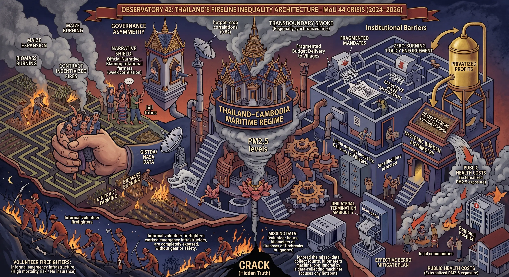
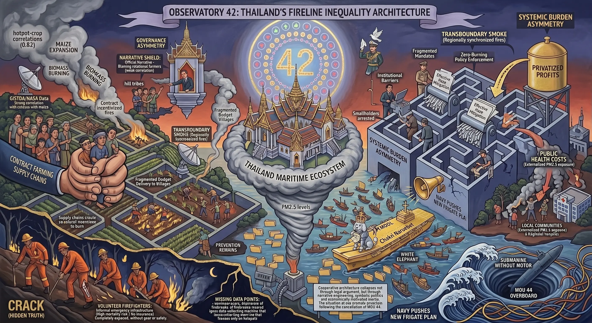

## 0055 – The MoU 44 Crisis (2024–2026): Legal Ambiguity, Military Narratives and the Collapse of a Bilateral Architecture

*Last updated: 15 September 2026, 12:20:23 (ICT)*

**A structural analysis of legal status, narrative construction, and post‑MoU conflict dynamics**

---

## 1. Scope and context
Between late 2024 and mid‑2026, the Thai–Cambodian maritime dispute transitioned from a stable, procedural framework into a legally ambiguous and narrative‑driven confrontation. MoU 44, which had functioned for two decades as a mechanism for managing overlapping maritime claims, was reframed as a threat to national sovereignty. This reframing centred on Koh Kood, an island that is neither disputed nor included in the MoU’s geographic scope.  

The shift did not arise from new facts or legal developments but from a reconfiguration of political incentives, military signalling, and public communication. The crisis illustrates how procedural architectures can collapse when symbolic narratives override technical frameworks.

---

## 2. What MoU 44 actually is
MoU 44, signed in 2001, is a **non‑binding Memorandum of Understanding** between Thailand and Cambodia. It establishes a procedural roadmap for addressing overlapping maritime claims in the Gulf of Thailand and outlines the intention to negotiate a Joint Development Area (JDA) for hydrocarbons. The MoU’s purpose is to manage uncertainty, prevent escalation, and create a structured environment for technical negotiations.

### *2.1 Core provisions*
The MoU commits both states to pursue joint development of offshore resources, to negotiate a maritime boundary through a Joint Technical Committee, and to ensure that all interim measures are taken *without prejudice* to either side’s legal claims. Its architecture is cooperative rather than determinative.

### *2.2 What MoU 44 does not do*
MoU 44 does not include Koh Kood, does not alter sovereignty over any island, does not establish a final maritime boundary, and contains no termination clause. It is a procedural instrument, not a territorial settlement.

---

## 3. The Koh‑Kood narrative: how an island outside the MoU became its centre
The elevation of Koh Kood into the centre of the MoU debate represents a significant narrative transformation. Although the island has belonged to Thailand uncontested since 1907 and lies entirely outside the MoU’s operational zone, it became the symbolic anchor for claims that MoU 44 endangered national territory.

### *3.1 The factual baseline*
The factual record is clear: Koh Kood has never been claimed by Cambodia, and the overlapping maritime area defined in MoU 44 lies to the south of the island. Thai ministries and former negotiators consistently affirmed this. The island has no legal or geographic connection to the MoU.

### *3.2 The constructed narrative*
Despite this clarity, nationalist actors reframed the MoU as a threat to Koh Kood. A maritime polygon was rhetorically treated as if it were a “threatened island,” transforming a technical maritime issue into a symbolic sovereignty narrative. This inversion allowed a non‑issue to become a politically mobilising device.

### *3.3 Symbolism and escalation*
By positioning Koh Kood as a sovereignty symbol, the navy redirected attention away from the actual stakes — resource development, maritime delimitation, and strategic control. The narrative undermined the civilian negotiation framework and facilitated a more assertive maritime posture.

*Heading changed 15 September 2026. This section previously read “Anatomy of a manufactured lie.” The word asserted knowledge and intent to deceive, neither of which is demonstrable here, and the section does not need it: what it documents is that an island lying outside the instrument’s scope became the centre of the argument about it. That is an effect, and it carries the point on its own.*

---

## 4. The political narrative: Abolition vs. revision
The political dimension of the crisis is defined by a documented rhetorical contradiction. For years, the Bhumjaithai Party (BJT) advocated the **abolition** of MoUs 43 and 44. This position was reaffirmed by Anutin on 9 January 2026. Later, however, the same actors claimed that the party had “consistently supported revision.”

### *4.1 Documented “abolition” line*
The abolition stance was explicit and repeated. It framed MoU 44 as a harmful legacy requiring decisive removal and served as a mobilising tool in domestic politics.

### *4.2 Later “revision” line*
The subsequent shift to a “revision” narrative attempted to mitigate diplomatic costs. The contradiction is factual: two incompatible positions were presented as consistent.

### *4.3 Strategic double communication*
This duality reflects a pattern of differentiated messaging: hardline rhetoric for domestic audiences and moderated language for international observers. The result is a dual narrative architecture that obscures political intent.

---

## 5. The legal narrative: The myth of a valid termination
The legal dimension of the crisis centres on the ambiguous status of MoU 44 and the unilateral nature of Thailand’s termination.

### *5.1 Absence of a termination clause*
MoU 44 contains no termination provision. Under customary international law, unilateral withdrawal is permissible only under specific conditions — mutual consent, fundamental change of circumstances, impossibility of performance, or material breach. None were invoked.

### *5.2 Thailand’s conduct — and the nature of MoU 44*
Thailand terminated the MoU unilaterally without citing any recognised legal justification. Crucially, MoU 44 is a **non‑binding instrument**, not a treaty. This creates a structural paradox: the MoU was politically framed as a binding threat to sovereignty, yet legally treated as disposable when convenient. The state invoked its informality to justify termination while simultaneously portraying it as dangerously binding.

### *5.3 The official claim*
The assertion that Thailand had the “right to revoke” the MoU remains unsubstantiated. No legal argument was articulated, and the claim functions primarily as a political statement rather than a legal position.

### *5.4 The dated record (added 17 July 2026)*
The termination is not a projected outcome but a completed act, and its sequence is electoral rather than legal:

- **Before 8 February 2026** — Anutin pledges the cancellation of MoU 44 at his final campaign rally ahead of the general election. The abolition enters office as a **campaign promise**, not as a response to a legal event.
- **5 May 2026** — the **cabinet approves the abrogation** of MoU 44. Thailand voids the 2001 maritime instrument **unilaterally**.
- **Same period** — Anutin frames the act as a sovereignty guarantee: “Once there is no MoU 44, there will no longer be any maritime line crossing Koh Kood that could create doubt or concern,” and “Koh Kood belongs to Thailand.” This closes the circle described in §3: the manufactured Koh‑Kood threat is retired by removing the instrument that never contained it.
  ✅ *Source located 15 September 2026: **The Nation, “MOU 44 row deepens — Anutin says Koh Kood remains Thai”, 9 May 2026** (nationthailand.com/news/asean/40065999), read in full. The words are from a post on Anutin’s personal Facebook account, written at the ASEAN Summit in Cebu, pushing back against “false claims circulating on social media” after he had informed Hun Manet of the cancellation.*
  ⭐ *The date matters: **9 May, four days after the cabinet decision of 5 May**. At the point of decision the stated ground was different — Anutin: the cancellation was “not related to the border conflict with Cambodia, but part of my policy. It has been 25 years and there has been no progress”; the Foreign Ministry said Cambodia’s UNCLOS ratification had given the impetus (Thai PBS World). **The island does not appear in the justification of the decision; it appears in the presentation of the result.** That sequence is the finding, and it is stronger than the single quotation.*
  ⚠️ *Note of the same date: at the moment of abrogation the stated justification was different. Anutin: the cancellation was “not related to the border conflict with Cambodia, but part of my policy. It has been 25 years and there has been no progress.” The Foreign Ministry said Cambodia’s ratification of UNCLOS had given Thailand the impetus, so both could “start anew based on the framework of UNCLOS” (Thai PBS World). Neither statement mentions the island. The Koh‑Kood framing of the abolition is therefore **not** documented at the point of decision; what is documented is the asymmetry — MoU 43 kept, MoU 44 voided (The Nation, 7 February 2026).*
- **MoU 43 (land) is retained.** Only the maritime instrument was voided; the land‑border MoU remains in force. This asymmetry matters — it undercuts any reading of the termination as a general repudiation of bilateral architecture and points instead at the **hydrocarbon zone** as the operative stake (§6.2).

**Analytical consequence:** the chronology forecloses the “reaction to Cambodian conduct” defence. The commitment predates the act by three months and was made to voters, not to Phnom Penh.

---

## 6. The military narrative: Escalation through symbolism
The military dimension reveals how narrative construction translated into operational posture.

### *6.1 Undermining civilian authority*
By framing MoU 44 as a sovereignty threat, the navy delegitimised the civilian government’s negotiation strategy and positioned itself as the defender of national integrity. This narrative shift enabled a more assertive maritime stance and increased military influence over policy.

### *6.2 From narrative to posture — and the economic deep structure*
The collapse of MoU 44 froze the Joint Development Area, leaving offshore gas undeveloped. This outcome reinforces Thailand’s dependence on LNG imports and benefits existing energy monopolies. The geopolitical narrative surrounding Koh Kood thus masks deeper economic incentives: the status quo is structurally profitable.

---

## 7. The referendum narrative: Manufactured consent
The referendum narrative illustrates how public opinion was mobilised to legitimise treaty breach.

### *7.1 The NIDA polls (corrected 15 September 2026)*
An earlier version of this section stated that “a NIDA poll showed that 61% supported revoking the MoUs, while nearly 70% admitted they did not understand them.” Both figures have now been checked against the institute’s own releases, and both need restating.

Two surveys measured this, and their design is identical: nationwide, respondents aged 18 and over across all regions, **n=1,310** in each case, drawn by multi-stage sampling from NIDA Poll’s master sample, conducted by telephone at a stated confidence level of 97.0%.

**On 1–2 October 2025**, respondents were asked whether they agreed that a **referendum** should be held on revoking MOU 43 and MOU 44. **60.76%** agreed as to both instruments, **20.92%** disagreed outright, **12.60%** gave no answer or said the matter did not interest them, **4.96%** were unsure, and under one per cent wanted a referendum on one instrument only. The question therefore measured assent to a **procedure**, not support for an outcome — and **17.56%** committed themselves to neither.

In the same survey, **45.73%** said they did not understand MOU 44 **at all** and a further 24.96% said they barely understood it; for MOU 43 the figures were 44.12% and 24.96%. NIDA’s own headline reports this as **“nearly half”**, and that is the figure to cite: the roughly 70% used previously is a sum of two answer options, which is our arithmetic and not the institute’s published result. Asked whether they wanted to understand the two instruments better, **65.50%** said yes to both.

**Eleven months earlier, on 12–13 November 2024**, the same institute asked about the dispute over MOU 44 and Koh Kood specifically: **58.86%** said they did not understand it at all, with a further 19.31% barely. The two surveys are not worded identically and should be read as a trend rather than a difference: comprehension rose, and remained absent in roughly seven respondents in ten.

**What the figures support.** Not that a majority demanded abrogation — that was never asked. What they support is narrower and harder: a majority was willing to have a question settled by plebiscite that, on its own account, it did not understand. And the decision was ultimately taken by cabinet on 5 May 2026, with no referendum held.

*The November 2024 survey also asked whether the government could be trusted to protect the national interest in negotiations with Cambodia; 62.85% said little or none. ⚠️ That question was put only to the 288 respondents who had said they understood the dispute well or fairly well. It is not a finding about the public and must not be cited as one.*

### *7.2 Shifting responsibility*
By invoking a referendum, political elites shifted responsibility for international legal consequences onto the public. The state could claim to follow “the will of the people,” even though the people lacked the information necessary to evaluate the issue — and the invocation was as far as it went, since the instrument was voided by cabinet decision on 5 May 2026 with no referendum held *(added 15 September 2026)*.

---

## 8. The frozen conflict architecture after MoU 44
The termination of MoU 44 dismantled the bilateral architecture that had stabilised the maritime dispute for two decades.

### *8.1 Loss of bilateral architecture*
The Joint Technical Committee and the joint development roadmap were removed, creating a procedural vacuum in the overlapping maritime area.

### *8.2 Shift to UNCLOS mechanisms*
UNCLOS conciliation is non‑binding, slow, and unable to impose a boundary. It constrains unilateral action but does not resolve the dispute. The result is a legally constrained stalemate.

### *8.3 Militarised stability*
With the procedural framework gone, de‑facto control becomes more important than legal mechanisms. Military presence increases, and civil society in border regions becomes more exposed to militarisation. The conflict becomes “frozen,” but not stable.

### *8.4 The conciliation is not an alternative to the MoU — it is the clause Thailand signed in 2011 (added 15 September 2026)*
Section 8.2 treated UNCLOS conciliation as a residual mechanism and the outcome as a “legally constrained stalemate.” The documentary record now available requires four corrections.

**First, the forum follows from a Thai declaration, not from the abrogation.** On 15 May 2011, ratifying UNCLOS, Thailand declared under Article 298 that it “does not accept any of the procedures provided for in Part XV, Section 2” for disputes “relating to sea boundary delimitations.” The same subparagraph states the price of that exclusion: a State making such a declaration shall, where no agreement is reached in negotiations within a reasonable period, “at the request of any party to the dispute, accept submission of the matter to conciliation under Annex V, section 2.” Compulsory conciliation is the reciprocal of the opt‑out. Thailand has never made a declaration under Article 287 choosing a forum; it reserved that step in 2011 “at an appropriate time” and has not taken it.

**Second, the proceedings are live, and dated.** Cambodia signed UNCLOS in 1983 but ratified only on **6 February 2026**, itself excluding delimitation disputes under Article 298(1)(a) — which, by Article 298(3), barred it from bringing such a dispute against another State Party. It withdrew that exclusion on **26 May 2026** (depositary notification C.N.174.2026.TREATIES‑XXI.6) and instituted proceedings **seven days later, on 2 June 2026**, by a Notification under Article 11 of Annex V. Thailand filed its Response on **19 June 2026**. The case is registered as **PCA Case No. 2026‑35**, with the Permanent Court of Arbitration acting as Registry by agreement of both parties; the Commission held its first meeting with the parties in Singapore on **14–16 September 2026**. The sequence is documented; the intent behind it is not, and should not be asserted.

**Third, “non‑binding” is the smaller half.** The report does not bind the parties (Annex V, Article 7(2)). But a notified party “shall be obliged to submit” to the proceedings (Article 11(2)); failure to reply or appear “shall not constitute a bar” (Article 12); **the Commission, not the parties, decides its own competence** (Article 13); the report must state conclusions on all questions of fact and law relevant to the dispute and is deposited with the UN Secretary‑General (Article 7(1)); and under Article 298(1)(a)(ii) the parties “shall negotiate an agreement on the basis of that report.” What does **not** follow is escalation: absent agreement, referral to a binding procedure requires mutual consent. Any claim that arbitration follows automatically is refutable on the text.

**Fourth, the only precedent cuts against the logic of the abrogation.** In the Timor Sea conciliation (PCA Case No. 2016‑10) Australia objected that no boundary negotiations had taken place and that conciliation was therefore unavailable. The Commission rejected every objection unanimously on 19 September 2016, holding that such a requirement “would effectively grant a party the right to veto any recourse to compulsory conciliation by refusing to negotiate.” Withdrawal from a negotiating framework does not close the procedure; it satisfies its precondition. That conciliation, formally non‑binding throughout, ended in a **binding treaty of 6 March 2018** whose preamble records that it was reached “with the assistance of the Conciliation Commission,” and under which Timor‑Leste’s share of upstream revenue from Greater Sunrise rose from the **50 per cent** fixed by the 2006 CMATS treaty to **70 or 80 per cent**.

**What the abrogation did and did not remove.** It did not remove a legal shield. Article 298(1)(a)(iii) exempts disputes to be settled under an agreement **binding** on the parties, and §5.2 of this node holds MoU 44 to be non‑binding; the Timor Commission in any event assessed such instruments not by their content but by “the alternative arrangements for the settlement of disputes that such an agreement makes available,” and MoU 44 made available a technical committee, not a binding procedure. What the abrogation removed was the one forum in which Thailand sat as one of two parties. **Section 8.1 is therefore right about the loss and §8.2 wrong about the consequence: the vacuum did not stay a vacuum.**

**What Thailand said on the first day.** On 15 September 2026 the Bangkok Post reported the foreign minister’s opening statement. Two sentences are on the record: *"This conciliation process does not concern sovereignty over land, which includes the island of Koh Kut"*, and *"Thailand rejects Cambodia’s 1972 continental shelf claim line, which is without legal basis."* The paper adds that he asked for the proceedings to be confined to the maritime boundary and that he had said beforehand that any delimitation would show the island to be Thai.

The first sentence reaches for the one exit the Convention leaves open. Article 298(1)(a)(i) excludes from compulsory conciliation any dispute that "necessarily involves the concurrent consideration of any unsettled dispute concerning sovereignty or other rights over continental or insular land territory". **But note the form of the statement, and do not overstate it:** as reported, Thailand did not say the Commission lacks competence. It said the process does not concern land sovereignty — a statement about scope, made while participating. Thailand filed its Response on 19 June and appeared in Singapore. Whether it also raised a formal objection to competence does not appear from this report.

**And the decision is not Thailand’s to take.** Annex V, Article 13: a disagreement as to whether the Commission has competence "shall be decided by the commission". In the only precedent, Australia’s objections were rejected unanimously.

*A note on the state of the record.* Cambodia’s Notification of 2 June 2026 and Thailand’s Response of 19 June 2026 have not been published, and neither opening statement has been published in full; the quotations above are a newspaper’s selection. Cambodia’s opening statement is not in hand at all. What is public is the Registry’s account of the filings, the treaty‑depositary record, and the Convention text.

---

## 9. International legal and diplomatic implications
The collapse of MoU 44 has significant implications for Thailand’s treaty practice, regional governance, and international reputation.

### *9.1 Treaty practice and credibility*
Unilateral termination without legal justification weakens Thailand’s reliability as a treaty partner and complicates future negotiations.

### *9.2 Regional governance*
The loss of MoU 44 undermines ASEAN’s already fragile rules‑based maritime governance and encourages zero‑sum approaches to overlapping claims.

### *9.3 External perceptions*
Observers note a widening gap between Thailand’s rules‑based rhetoric and its unilateral actions, raising concerns about regional stability.

---

## 10. Analytical synthesis
The MoU 44 crisis is a multi‑layered structure of narrative construction, legal ambiguity, economic incentives, and shifting power dynamics. MoU 44 functioned as a stabilising procedural framework; its collapse resulted not from legal necessity but from political narrative engineering. Koh Kood became a symbolic anchor, political actors reframed abolition as revision, and the military used sovereignty symbolism to expand its influence. The freeze of the Joint Development Area benefits LNG‑import structures, while referendum rhetoric redistributed responsibility for treaty breach onto an under‑informed public.

At its core, the crisis demonstrates that cooperative architecture collapses not through legal argument, but through narrative construction and structural incentives.

---

## Sources

### Added 15 September 2026 (§7.1 — the two NIDA surveys)

**NIDA Poll – “จะทำประชามติแล้ว…เข้าใจ MOU 43 และ MOU 44 หรือยัง” (“A referendum is coming — do you understand MOU 43 and MOU 44 yet?”), published 5 October 2025, fieldwork 1–2 October 2025, n=1,310, nationwide, telephone interview from the institute’s master sample, stated confidence 97.0%. Source for the 60.76% referendum figure and the comprehension figures**  
<a href="https://nidapoll.nida.ac.th/en/polls/nida-poll-thai-referendum-mou-43-mou-44-understanding/" target="_blank" rel="noopener noreferrer">https://nidapoll.nida.ac.th/en/polls/nida-poll-thai-referendum-mou-43-mou-44-understanding/</a>

**NIDA Poll – “มีใครเข้าใจประเด็นโต้แย้งเรื่อง MOU 44 และเกาะกูด บ้าง” (“Does anyone understand the dispute over MOU 44 and Koh Kood?”), published 13 November 2024, fieldwork 12–13 November 2024, n=1,310, nationwide, telephone interview, stated confidence 97.0%. Source for the November 2024 comprehension figures and for the 288-respondent trust question**  
<a href="https://nidapoll.nida.ac.th/en/polls/thailand-cambodia-mou-44-koh-kood-public-understanding-nida-poll-2024/" target="_blank" rel="noopener noreferrer">https://nidapoll.nida.ac.th/en/polls/thailand-cambodia-mou-44-koh-kood-public-understanding-nida-poll-2024/</a>

### Added 15 September 2026 (§8.4 — primary documents)

**United Nations Treaty Collection, Chapter XXI.6 – United Nations Convention on the Law of the Sea: status, declarations and reservations. Source for Thailand’s ratification of 15 May 2011 and its Article 298 declaration; for Cambodia’s ratification of 6 February 2026 (depositary notification C.N.85.2026.TREATIES‑XXI.6) and the withdrawal of its Article 298(1)(a) declaration of 26 May 2026 (C.N.174.2026.TREATIES‑XXI.6)**  
<a href="https://treaties.un.org/pages/ViewDetailsIII.aspx?src=TREATY&mtdsg_no=XXI-6&chapter=21&Temp=mtdsg3&clang=_en" target="_blank" rel="noopener noreferrer">https://treaties.un.org/pages/ViewDetailsIII.aspx?src=TREATY&amp;mtdsg_no=XXI-6&amp;chapter=21&amp;clang=_en</a>

**UNCLOS, Part XV (Settlement of Disputes), Article 298 – optional exceptions, and the conciliation condition attached to declarations under paragraph 1(a)**  
<a href="https://www.un.org/depts/los/convention_agreements/texts/unclos/part15.htm" target="_blank" rel="noopener noreferrer">https://www.un.org/depts/los/convention_agreements/texts/unclos/part15.htm</a>

**UNCLOS, Annex V (Conciliation), Section 2 – Articles 11 to 14: obligation to submit, effect of non‑appearance, competence, and the application of Section 1 including the twelve‑month report under Article 7**  
<a href="https://www.un.org/depts/los/convention_agreements/texts/unclos/annex5.htm" target="_blank" rel="noopener noreferrer">https://www.un.org/depts/los/convention_agreements/texts/unclos/annex5.htm</a>

**Permanent Court of Arbitration – Press Release, PCA Case No. 2026‑35, Conciliation between the Kingdom of Cambodia and the Kingdom of Thailand, The Hague, 9 September 2026. Source for the institution date of 2 June 2026, Thailand’s Response of 19 June 2026, the composition of the Commission and the Registry arrangement**  
<a href="https://docs.pca-cpa.org/2026/09/2812e8e2-2026-35-pca-press-release-first-meeting.pdf" target="_blank" rel="noopener noreferrer">https://docs.pca-cpa.org/2026/09/2812e8e2-2026-35-pca-press-release-first-meeting.pdf</a>

**Permanent Court of Arbitration, PCA Case No. 2016‑10 – Timor Sea Conciliation (Timor‑Leste v. Australia): Decision on Australia’s Objections to Competence, 19 September 2016; Report and Recommendations, 9 May 2018; and the Maritime Boundary Treaty of 6 March 2018 at Annex 28 to the Report**  
<a href="https://pca-cpa.org/en/cases/132/" target="_blank" rel="noopener noreferrer">https://pca-cpa.org/en/cases/132/</a>

### Original sources

**Bangkok Post – Thailand scraps sea boundary pact with Cambodia**  
<a href="https://www.bangkokpost.com/thailand/general/3249990/thailand-scraps-sea-boundary-pact-with-cambodia" target="_blank" rel="noopener noreferrer">https://www.bangkokpost.com/thailand/general/3249990/thailand-scraps-sea-boundary-pact-with-cambodia</a>

**The Diplomat – Thailand Unilaterally Voids Maritime Boundary Agreement With Cambodia (May 2026)**  
<a href="https://thediplomat.com/2026/05/thailand-unilaterally-voids-maritime-boundary-agreement-with-cambodia/" target="_blank" rel="noopener noreferrer">https://thediplomat.com/2026/05/thailand-unilaterally-voids-maritime-boundary-agreement-with-cambodia/</a>

**Thai PBS World – Anutin says Cabinet approves abrogation of MOU44**  
<a href="https://world.thaipbs.or.th/detail/61231" target="_blank" rel="noopener noreferrer">https://world.thaipbs.or.th/detail/61231</a>

**The Nation – Anutin Pledges to Scrap Maritime MOU in Final Election Rally Push**  
<a href="https://www.nationthailand.com/news/politics/40062219" target="_blank" rel="noopener noreferrer">https://www.nationthailand.com/news/politics/40062219</a>

**The Nation – MOU 44 row deepens: Anutin says Koh Kood remains Thai**  
<a href="https://www.nationthailand.com/news/asean/40065999" target="_blank" rel="noopener noreferrer">https://www.nationthailand.com/news/asean/40065999</a>

**9DASHLINE – The patriot's paradox: Thailand's withdrawal from MOU 44, cheap nationalism, and elite interests**  
<a href="https://www.9dashline.com/article/the-patriots-paradox-thailands-withdrawal-from-mou-44-cheap-nationalism-and-elite-interests" target="_blank" rel="noopener noreferrer">https://www.9dashline.com/article/the-patriots-paradox-thailands-withdrawal-from-mou-44-cheap-nationalism-and-elite-interests</a>

---

