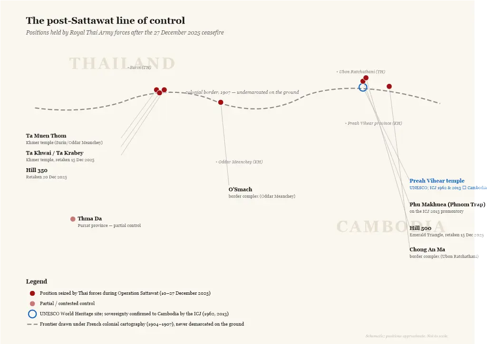
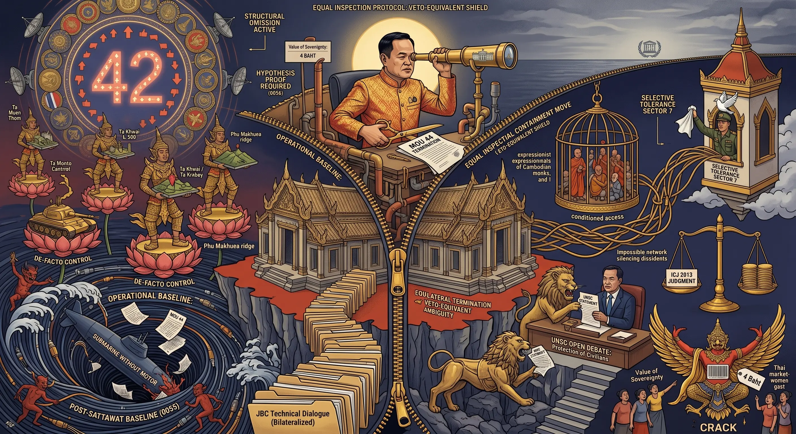
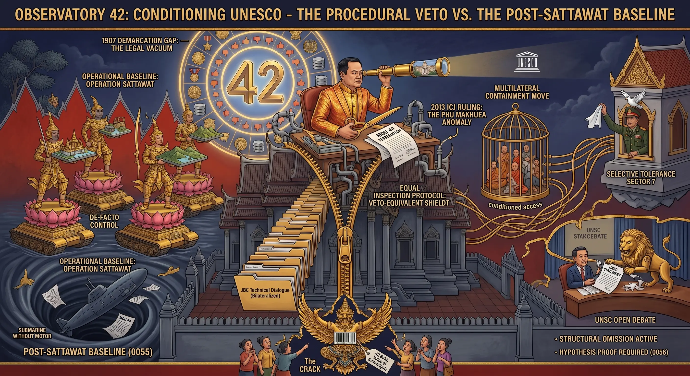

## 0058 – Conditioning UNESCO: How Thailand's "Equal Inspection" Demand Shields the Post‑Sattawat Status Quo
### *How a procedural condition on UNESCO access converts territorial gains from Operation Sattawat into protected facts on the ground — and how the May 2026 diplomatic sequence operationalises this across four institutional registers*

-----

## 1. Scope and Context

On 22 May 2026, during the Thai delegation's week in Paris, Prime Minister Anutin Charnvirakul met UNESCO Director‑General Khaled Ahmed El‑Enany Ali Ezz and conveyed a procedural condition: any future UNESCO inspection of disputed border temple sites must cover **both** the Thai and the Cambodian side of the frontier. He publicly repeated this position to the Thai community in Paris on 24 May, anticipating a Cambodian request for an inspection of damage to a World Heritage temple allegedly caused by recent border clashes.

The statement appears procedural. Its function is structural — and the Paris move is one node in a twenty‑day diplomatic sequence (5–24 May 2026) that operates as a single coordinated operation across four institutional registers: military, procedural, diplomatic, and economic.

This article maps how the "equal inspection" demand interacts with four pre‑existing or parallel layers — the December 2025 line of control, the 1907 demarcation gap, the 2013 ICJ ruling on Preah Vihear, and the eleven‑month border closure that has expelled approximately 900,000 Cambodian workers from Thailand — to convert a contested territorial reality into a procedurally protected status quo.

-----

## 2. The Operational Baseline: Operation Sattawat

Between 10 and 27 December 2025, the Royal Thai Army conducted **Operation Sattawat**, a ground offensive aimed at territorial gain along the contested border. According to Thai military briefings reported by *Bangkok Post*, *The Nation Thailand* and international agencies, Thai forces seized:

- the temples **Ta Muen Thom** and **Ta Khwai / Ta Krabey**  
- **Hills 350 and 500** (Surin / Emerald Triangle)  
- the **Phu Makhuea** ridge (vicinity of Preah Vihear)  
- the border complexes **O'Smach** (Oddar Meanchey) and **Chong An Ma** (Ubon Ratchathani)  
- partially, the **Thma Da** sector in Pursat  

The ceasefire of 27 December 2025 froze this new line of control. No independent international verification of the new positions exists; the factual record relies on Thai military communiqués.

*Figure 1: Schematic of the post‑Sattawat line of control along the Thai–Cambodian border, showing the eight positions held by Royal Thai Army forces after the December 2025 ceasefire, with Preah Vihear marked separately as the only ICJ‑adjudicated point in the corridor.*

-----

## 3. The 1907 Demarcation Gap

The Thai–Cambodian border was drawn under the French colonial cartography of 1904–1907. Large segments of the eastern boundary were never demarcated on the ground. Subsequent boundary commissions have not closed this gap. As a result:

- sovereignty over most of the locations seized in December 2025 is **not internationally settled**;  
- both sides routinely describe operations there as the defence of their own territory;  
- the procedural absence of demarcation is itself a precondition for the current narrative competition.

The 1907 gap is not a historical curiosity. It is the legal vacuum into which Operation Sattawat extended.

-----

## 4. The 2013 ICJ Ruling and the Phu Makhuea Anomaly

The single demarcated point in this corridor is the **Preah Vihear** temple complex, on which the International Court of Justice ruled in 1962 and again in 2013, both times in favour of Cambodia. The 2013 judgment explicitly extended Cambodian sovereignty to the **promontory** on which the temple sits — a zone that includes the Phu Makhuea ridge (Khmer: Phnom Trap).

Thai control of Phu Makhuea, established during the 2025 escalation and maintained after the ceasefire, therefore stands in **direct procedural tension** with an existing ICJ ruling. This is the only point in the new line of control for which an international legal determination already exists — and it runs against the current Thai position.

-----

## 5. The May 2026 Sequence: A Chess Game in Twenty Days

The Paris UNESCO conditioning was not an isolated diplomatic remark. It was the fourth of five identifiable diplomatic moves clustered in a twenty‑day window in May 2026. Read in sequence, they form a coordinated operation in which Thai bilateralisation and Cambodian multilateralisation contend for the institutional architecture through which the post‑Sattawat reality will or will not be adjudicated.

### *5.1 The MoU 44 termination and Cambodia's pre‑positioned counter‑move (5 May 2026)*

On 5 May 2026, the Thai Cabinet, chaired by Anutin Charnvirakul, voted to terminate **MoU 44** unilaterally — the 2001 Memorandum of Understanding that had structured maritime boundary negotiations in the Gulf of Thailand for nearly a quarter century. Thai officials stated that the memorandum could be cancelled without consulting Cambodia. The stated rationale was that twenty‑five years of bilateral negotiation had produced no agreement, and that future discussions should be conducted under international frameworks such as UNCLOS.

Within hours, Cambodia activated its counter‑move. Deputy Prime Minister Prak Sokhonn announced that Cambodia would initiate compulsory conciliation with Thailand under the **United Nations Convention on the Law of the Sea (UNCLOS)**. The speed was not improvisational. Cambodia's National Assembly had ratified UNCLOS on **16 January 2026** by a 114–0 vote; the instrument of accession had been deposited on **6 February**; the treaty had entered into force on **8 March**. When Thailand voted to terminate MoU 44 on 5 May, Cambodia had held UNCLOS standing for two months. The multilateral counter‑mechanism was already in place.

Sixteen months of preparation had brought Phnom Penh to the exact procedural posture required to convert Thailand's bilateral exit into a multilateral entrance.

### *5.2 The rhetorical absorption (6 May 2026)*

On 6 May, Anutin publicly "welcomed" Cambodia's UNCLOS move, declaring that both countries were now "under the same rules". The rhetorical absorption was complete: the multilateral instrument that Cambodia had spent sixteen months preparing was reframed by Thailand as a shared procedural achievement.

### *5.3 Cebu and the bilateral framework (7 May 2026)*

Anutin and Hun Manet held a trilateral meeting hosted by Philippine President Ferdinand Marcos Jr. on the sidelines of the **ASEAN Summit in Cebu**. The leaders announced "confidence‑building measures", agreed to reopen military and diplomatic channels, committed to resuming the Joint Boundary Commission and General Border Committee, and extended the mandate of the ASEAN Observer Team for three months until July 2026. Public communications described the meeting as a "fresh start".

### *5.4 The UNSC episode (21 May 2026)*

Cambodia's permanent representative to the UN, **Keo Chhea**, used the UN Security Council Open Debate on *Protection of Civilians in Armed Conflict* to raise the destruction of cultural heritage sites during the 2025 border clashes. He framed the attacks as potentially constituting **war crimes or crimes against humanity** and cited the displacement of more than 649,000 civilians.

### *5.5 Paris and the UNESCO conditioning (22 May 2026)*

Anutin in Paris told UNESCO that any inspection of the disputed temple sites must cover "both sides" of the border (analysed in detail in Section 6 below).

### *5.6 The Sihasak warning (24 May 2026)*

Foreign Minister **Sihasak Phuangketkeow** warned Phnom Penh against "using international forums to attack Bangkok", invoking the **28 December 2025 joint statement** signed alongside the ceasefire — under which both governments had agreed to resolve issues through internal dialogue. He further warned that continued Cambodian recourse to international forums would prevent the Anutin–Hun Manet "Cebu understanding" from moving forward.

### *5.7 Reading the sequence as one operation*

The twenty days perform a coherent operation. Thailand exited a bilateral instrument it could no longer control (MoU 44), absorbed Cambodia's multilateral counter‑move rhetorically (UNCLOS), accepted a trilateral talks framework with a regional partner as guarantor (Cebu), then within two weeks conditioned the two multilateral mechanisms — UNESCO and the UNSC — that Cambodia attempted to mobilise outside the bilateral channel. The 28 December 2025 joint statement is invoked throughout as the bilateral procedural anchor that Cambodia has supposedly breached by going multilateral.

-----

## 6. The 22 May 2026 UNESCO Move

In Paris, the Prime Minister did not deny the possibility of a UNESCO inspection. He pre‑empted it.

The statement — *"If UNESCO is invited to inspect the site, it must also survey the Thai side of the border so the information is clear and complete"* — performs three operations at once:

### *6.1 Reframing the inspection*  
A potential damage assessment at a Cambodian World Heritage site is recast as an inquiry into the entire border zone. This dilutes the original procedural question.

### *6.2 Conditioning access*  
By attaching a precondition to UNESCO's modalities, Thailand asserts informal veto‑equivalent influence over an institution it does not control.

### *6.3 Internationalising symmetry*  
The "balance" frame implies that both sides are equally responsible for damage requiring inspection — independent of the question of who launched the offensive and who holds the contested positions.

-----

## 7. The Cebu Paradox

The Cebu trilateral of 7 May 2026 presents an apparent contradiction. Thailand publicly accepted a confidence‑building framework, agreed to reopen suspended bilateral mechanisms, and extended the ASEAN Observer Team mandate. Two weeks later, the same government conditioned a UNESCO inspection and warned Cambodia about UN Security Council statements. The contradiction is only apparent.

The Cebu agreement and the subsequent containment moves are not opposed; they are complementary. The bilateral framework Thailand accepted at Cebu is, by design, the *only* framework Thailand accepts. The confidence‑building measures, the JBC, the General Border Committee, and the ASEAN Observer Team with the Philippines as coordinator — all operate within a bilaterally controlled procedural envelope. The UNESCO inspection, the UNSC debate, and any UNCLOS conciliation proceeding outside that envelope are precisely what the post‑Cebu moves are designed to contain.

Cebu was not a concession. It was the **rhetorical legitimation** that allowed Thailand to invoke the 28 December joint statement two weeks later as the binding commitment Cambodia had violated. Without Cebu, Sihasak's 24 May warning would have lacked its anchor. With Cebu, the warning became procedurally framed as the enforcement of an agreement Cambodia had just publicly affirmed.

-----

## 8. Bilateralisation as a Procedural Pattern

The "equal inspection" move follows a recognisable pattern in Thai border diplomacy: **multilateral mechanisms are accepted only on bilateralised terms**.

| Mechanism | Thai procedural condition |
|---|---|
| Joint Boundary Commission (JBC) | bilateral, technical, no third‑party arbitration |
| MoU 44 (maritime, 2001–2026) | bilateral procedure, then unilateral termination on 5 May 2026 (see 0055) |
| UNCLOS conciliation (Cambodia, 5 May 2026) | rhetorically absorbed ("both under the same rules"), operationally side‑stepped |
| ASEAN observation | accepted in limited monitoring form (AOT); declined as substantive intervention |
| UNESCO inspection (22 May 2026) | accepted only if extended to the Thai side |
| UN Security Council statement (21 May 2026) | denounced as breach of 28 Dec 2025 joint statement; bilateral channel demanded (24 May 2026) |

In each case, the procedural condition removes the asymmetry that an external mechanism would otherwise expose: the asymmetry between *de‑facto control* and *de‑jure status*. The May 2026 UNSC episode is the clearest illustration of the pattern: Thailand invoked a *bilateral* instrument (the 28 December 2025 joint statement) to delegitimise Cambodia's recourse to a *multilateral* forum.

-----

## 9. The Conversion Function

The Paris move performs a conversion that is the operational core of the post‑Sattawat situation:

> **de‑facto military control → procedural protection → narrative legitimacy**

The mechanism works in three steps:

1. **Hold the ground** seized in December 2025.  
2. **Block or condition** the only international procedure capable of generating an independent factual record (UNESCO inspection of the Preah Vihear damage).  
3. **Substitute** a bilateral, technical narrative ("dialogue", "JBC", "balanced inspection") for any third‑party determination.  

Each step is procedurally defensible in isolation. In sequence, they convert a contested territorial outcome into an unchallenged baseline.

This multi‑layered defence functions as a **defensive encapsulation** of military gains. By generating endless technical debates about how and where an inspection must take place, the state apparatus effectively freezes time. The procedural delay serves as an administrative shield, ensuring that the actual physical alterations made during Operation Sattawat graduate from a "recent violation" into an unchangeable historical baseline.

-----

## 10. The Paris Setting as Amplifier

The conditioning was not announced from Bangkok. It was delivered from Paris, during a week of cultural diplomacy that included Legion of Honour recognitions, IEA praise for Thai energy policy, and meetings with French corporate executives (see 0057).

This setting matters structurally. The same week that produced the curated soft‑power surface — the "Paris bubble" — also produced the procedural condition on UNESCO. The bubble is not decorative; it is the **diplomatic capital** expended to make the conditioning palatable. A demand that would face institutional resistance if issued from a contested border becomes negotiable when delivered between a state visit and a private dinner with the French President.

-----

## 11. The Economic Register: Labour and Trade as Structural Pressure

The bilateralisation operation requires economic leverage to work. Without it, Thailand's procedural conditions could be ignored. The leverage was created — initially as a consequence of the July 2025 clashes, then as a sustained instrument — by the closure of the Thai–Cambodian border and the labour exodus it triggered.

### *11.1 The labour exodus*

Before the conflict, approximately **1.2 million Cambodians** worked in Thailand — roughly 500,000 officially registered and a further 700,000 undocumented, concentrated in construction (36.5%), manufacturing (23.7%), retail (13.2%), agriculture (10.8%), service work, and fisheries. After Thailand's 24 July 2025 incursion, an estimated **900,000 Cambodian workers** returned home within weeks, driven by harassment, fear, and the closure of the border crossings they used to work and remit. The International Labour Organization estimates the same scale of return.

Cambodia is now the **only neighbouring country** whose workers in Thailand are not allowed to renew their work permits — a sectoral exclusion without parallel in current Thai migrant labour policy.

### *11.2 The trade losses*

As of May 2026, Thailand and Cambodia have lost approximately **180 billion baht** (around USD 5.2 billion) in cross‑border trade. The land border had previously handled around USD 5.6 billion annually; current monthly losses run at approximately USD 460 million in import‑export flows. Companies have rerouted shipments through Vietnam and Laos at transportation cost premiums of **25 to 40 per cent**. The University of the Thai Chamber of Commerce forecasts a **0.74 per cent contraction in Thai GDP for 2026** if the closure persists through the year. Thai construction, agriculture, and fisheries — the sectors the returned Cambodian workers had populated — report sustained labour shortages.

### *11.3 The asymmetric pressure*

The damage is asymmetric. Thailand's GDP of roughly USD 500 billion absorbs the contraction; Cambodia's GDP of approximately USD 30 billion does not. Cambodia's 2025 growth fell to **5.2 per cent** from 6.0 per cent the previous year, and Cambodian remittances dropped **37 per cent** from USD 2.95 billion to USD 1.86 billion. Human Rights Watch has documented that returned migrant workers face hunger and joblessness in border provinces with no labour market to absorb them.

The pressure runs in both directions; the threshold at which the weaker economy is forced to compromise lies considerably lower than the threshold at which the stronger one does. This asymmetry is what gives the bilateralisation operation its operational leverage. Without it, the procedural conditions on UNESCO and the warnings about UNSC recourse would be rhetorical postures with no enforcement mechanism. With it, they are negotiating positions backed by an indefinite ongoing economic squeeze.

**Border closure is not a side‑effect of the conflict; it is the most durable instrument the bilateralisation operation possesses.**

-----

## 12. International Implications

### *12.1 UNESCO institutional exposure*  
If UNESCO accepts the Thai condition, it accepts a precedent in which a party to an active territorial dispute can shape the geographic scope of a World Heritage inspection. If UNESCO declines, the inspection itself becomes politically costly.

### *12.2 ICJ ruling erosion*  
Operating an inspection regime that treats Phu Makhuea as undetermined — rather than as covered by the 2013 ruling — would procedurally weaken the ICJ judgment without overturning it.

### *12.3 ASEAN displacement*  
The Paris move bypasses ASEAN's substantive role. The regional body is present, through the AOT, in the limited monitoring role the Cebu agreement assigned to it. Its substantive influence is procedural rather than determinative.

### *12.4 Precedent for other disputes*  
The bilateralisation pattern, if successful, becomes a model for other ASEAN members managing contested cultural or territorial sites under multilateral oversight.

### *12.5 The Multilateral Containment Move (May 2026)*  
On 21 May 2026, Cambodia's permanent representative to the UN, Keo Chhea, used the UN Security Council Open Debate on *Protection of Civilians in Armed Conflict* to raise the destruction of cultural heritage sites — explicitly framing such attacks as war crimes or crimes against humanity — and to cite the displacement of more than 649,000 civilians during the July and December 2025 clashes. On 24 May 2026, Foreign Minister Sihasak Phuangketkeow publicly warned Phnom Penh against "using international forums to attack Bangkok", invoking the 28 December 2025 joint statement under which both governments agreed to resolve issues through internal dialogue, and conditioning further progress of the Anutin–Hun Manet "Cebu understanding" on Cambodia's compliance.

Structurally, the warning operates as a **multilateral containment move**: a bilateral procedural instrument is used to delegitimise the only third‑party forum in which the post‑Sattawat situation can be publicly contested. The UNSC episode and the Paris UNESCO conditioning of 22 May 2026 are not parallel; they are the same week of the same operation.

### *12.6 UNCLOS conciliation exposure*  
Compulsory conciliation under UNCLOS is non‑binding by design; a five‑member commission recommends, but does not impose, a solution. If Thailand absorbs the proceeding rhetorically — "both countries now under the same rules" — without modifying its operational posture, the UNCLOS mechanism becomes another procedural register in which the bilateralisation can be performed.

-----

## 13. Analytical Synthesis

The Paris UNESCO statement of 22 May 2026 should not be read as a stand‑alone diplomatic remark. It is one **procedural lock** within a four‑register operation placed on a post‑Sattawat status quo.

The architecture operates in four layers simultaneously:

- a **military layer** (Operation Sattawat and the frozen line of control)  
- a **procedural layer** (the UNESCO conditioning of 22 May and the UNSC containment warning of 24 May)  
- a **diplomatic layer** (the Cebu trilateral of 7 May as bilateral envelope; the 28 December 2025 joint statement as procedural anchor; MoU 44 termination as exit from a controllable instrument)  
- an **economic layer** (the eleven‑month border closure, 900,000 expelled workers, 180 billion baht in trade losses, sectoral labour shortages, and the structural asymmetry of GDP that gives the closure its leverage)  

Each layer alone is contestable. Their combination converts an unresolved territorial dispute into a baseline that no available international mechanism can independently audit. The conditioning demand is procedurally elegant precisely because it never refuses inspection — it only redefines its scope.

The contest is no longer over the substance of the border dispute. It is over the **institutional architecture** through which the dispute will or will not be adjudicated. Thailand has wagered on time and asymmetry: the border closure will exhaust Cambodia's economy faster than Cambodian multilateral moves can constrain Thai operational control. Cambodia, having spent sixteen months pre‑positioning UNCLOS (ratification 16 January 2026, deposit 6 February, entry into force 8 March), has wagered the opposite. The institutions caught between them — UNESCO, the UNSC, the ICJ, ASEAN — will determine, by what they accept and what they refuse, which of those wagers proves correct.

In this architecture, the soft‑power week in Paris and the procedural move on UNESCO are not parallel events. They are the same event in two registers — and the labour exodus and the trade collapse are the same event in two more.

-----

## Sources

**Primary diplomatic statements and editorial coverage**

- Bangkok Post, *"PM insists on 'equal' site visits"* (25 May 2026): <a href="https://www.bangkokpost.com/thailand/politics/3260123/pm-insists-on-equal-site-visits" target="_blank" rel="noopener noreferrer">link</a>
- The Nation Thailand, *"Sihasak warns Cambodia against raising bilateral disputes at UNSC"* (24 May 2026): <a href="https://www.nationthailand.com/news/general/40066591" target="_blank" rel="noopener noreferrer">link</a>
- Khaosod English, *"Anutin, Hun Manet agree to rebuild trust after Cebu trilateral talks"* (7 May 2026): <a href="https://www.khaosodenglish.com/featured/2026/05/07/anutin-hun-manet-agree-to-rebuild-trust-after-cebu-trilateral-talks/" target="_blank" rel="noopener noreferrer">link</a>
- The Diplomat, *"Thai, Cambodian PMs Agree to 'Confidence Building' Measures on Border"* (May 2026): <a href="https://thediplomat.com/2026/05/thai-cambodian-pms-agree-to-confidence-building-measures-on-border/" target="_blank" rel="noopener noreferrer">link</a>
- Khaosod English, *"Anutin welcomes Cambodia's UNCLOS move, says both countries now 'under same rules'"* (6 May 2026): <a href="https://www.khaosodenglish.com/politics/2026/05/06/anutin-welcomes-cambodias-unclos-move-says-both-countries-now-under-same-rules/" target="_blank" rel="noopener noreferrer">link</a>

**MoU 44 termination and UNCLOS counter‑move**

- Bangkok Post, *"Security Council scraps MoU 44, citing stalled talks, rising tensions with Cambodia"*: <a href="https://www.bangkokpost.com/thailand/general/3242632/security-council-scraps-mou-44-citing-stalled-talks-rising-tensions-with-cambodia" target="_blank" rel="noopener noreferrer">link</a>
- The Diplomat, *"Thailand Unilaterally Voids Maritime Boundary Agreement With Cambodia"* (May 2026): <a href="https://thediplomat.com/2026/05/thailand-unilaterally-voids-maritime-boundary-agreement-with-cambodia/" target="_blank" rel="noopener noreferrer">link</a>
- Asia News Network, *"Sea you in court: Cambodia announces UNCLOS conciliation as Thais exit maritime MoU"*: <a href="https://asianews.network/sea-you-in-court-cambodia-announces-unclos-conciliation-as-thais-exit-maritime-mou/" target="_blank" rel="noopener noreferrer">link</a>

**Operation Sattawat and the December 2025 line of control**

- Bangkok Post, *"Thai forces press on at Hill 350"* (20 December 2025): <a href="https://www.bangkokpost.com/thailand/general/3160125/thai-forces-press-on-at-hill-350" target="_blank" rel="noopener noreferrer">link</a>
- The Nation Thailand, *"Thai troops seize large cache of Cambodian weapons on Hill 500"*: <a href="https://www.nationthailand.com/news/general/40059851" target="_blank" rel="noopener noreferrer">link</a>
- Al Jazeera, *"Thailand launches new offensive as Cambodia halts all border crossings"* (14 December 2025): <a href="https://www.aljazeera.com/news/2025/12/14/thailand-launches-new-offensive-as-cambodia-halts-all-border-crossings" target="_blank" rel="noopener noreferrer">link</a>
- 2025 Cambodian–Thai border crisis — Wikipedia overview: <a href="https://en.wikipedia.org/wiki/2025_Cambodian%E2%80%93Thai_border_crisis" target="_blank" rel="noopener noreferrer">link</a>
- Thailand–Cambodia Border Conflict 2025 — Britannica: <a href="https://www.britannica.com/event/Thailand-Cambodia-Conflict" target="_blank" rel="noopener noreferrer">link</a>
- Phu Makhuea (Phnom Trap) — Wikipedia: <a href="https://en.wikipedia.org/wiki/Phu_Makhuea" target="_blank" rel="noopener noreferrer">link</a>

**UNESCO and UN Security Council**

- UNESCO World Heritage Centre, *"UNESCO urges protection of cultural heritage following armed clashes between Cambodia and Thailand"*: <a href="https://whc.unesco.org/en/news/2849" target="_blank" rel="noopener noreferrer">link</a>
- Phnom Penh Post, *"UN representative highlights civilian cost of border clashes"* (Keo Chhea, UNSC, 21 May 2026): <a href="https://phnompenhpost.com/national/un-representative-highlights-civilian-cost-of-border-clashes/" target="_blank" rel="noopener noreferrer">link</a>
- OHCHR, *"Türk alarmed by spiralling Thai‑Cambodia conflict"* (December 2025): <a href="https://www.ohchr.org/en/press-releases/2025/12/turk-alarmed-spiralling-thai-cambodia-conflict-and-impact-civilians" target="_blank" rel="noopener noreferrer">link</a>
- Khmer Times, *"Senior official urges global action to safeguard cultural heritage"*: <a href="https://www.khmertimeskh.com/501766349/senior-official-urges-global-action-to-safeguard-cultural-heritage/" target="_blank" rel="noopener noreferrer">link</a>

**Economic register — labour exodus, trade losses, asymmetry**

- Cambodianess, *"Driven Home: Why Cambodian Migrant Workers Are Fleeing Thailand"*: <a href="https://cambodianess.com/article/driven-home-why-cambodian-migrant-workers-are-fleeing-thailand" target="_blank" rel="noopener noreferrer">link</a>
- The Nation Thailand, *"Thai Industries Face Sudden Labour Crisis Amidst Cambodian Border Tensions"*: <a href="https://www.nationthailand.com/business/economy/40053570" target="_blank" rel="noopener noreferrer">link</a>
- Bangkok Post, *"Businesses warn of worker shortage"*: <a href="https://www.bangkokpost.com/business/general/3258868/businesses-warn-of-worker-shortage" target="_blank" rel="noopener noreferrer">link</a>
- Human Rights Watch, *"Cambodia: Returned Migrant Workers Face Hunger, Joblessness"* (25 November 2025): <a href="https://www.hrw.org/news/2025/11/25/cambodia-returned-migrant-workers-face-hunger-joblessness" target="_blank" rel="noopener noreferrer">link</a>
- The Nation Thailand, *"Thai‑Cambodia border trade losses hit THB180 billion in nearly a year"*: <a href="https://www.nationthailand.com/news/asean/40066145" target="_blank" rel="noopener noreferrer">link</a>
- Khmer Times, *"Closure of land border until year‑end to cause '$3B loss' for Thailand"*: <a href="https://www.khmertimeskh.com/501780102/closure-of-land-border-until-year-end-to-cause-3b-loss-for-thailand/" target="_blank" rel="noopener noreferrer">link</a>
- SCMP, *"Cambodia seeks economic reset after Thailand border war batters trade and remittances"*: <a href="https://www.scmp.com/week-asia/economics/article/3343805/cambodia-seeks-economic-reset-after-thailand-border-war-batters-trade-and-remittances" target="_blank" rel="noopener noreferrer">link</a>
- Kiripost, *"Economic Shockwaves from Cambodia–Thailand Border Conflict Threaten 2026 Growth"*: <a href="https://kiripost.com/stories/economic-shockwaves-from-cambodiathailand-border-conflict-threaten-2026-growth" target="_blank" rel="noopener noreferrer">link</a>
- Logistics Viewpoints, *"How the Thailand‑Cambodia Border Conflict Is Creating Ripple Effects Across Global Manufacturing Supply Chains"*: <a href="https://logisticsviewpoints.com/2026/01/07/how-the-thailand-cambodia-border-conflict-is-creating-ripple-effects-across-global-manufacturing-supply-chains/" target="_blank" rel="noopener noreferrer">link</a>

**Related Observatory analyses**

- [0049 – Thai–Cambodian Border Dispute (2026)](0049-thai-cambodian-border-dispute-2026.md)
- [0055 – The MoU 44 Crisis (2024–2026)](0055-the-mou44-crisis.md)
- [0057 – The Paris Bubble](0057-the-paris-bubble.md)

-----

