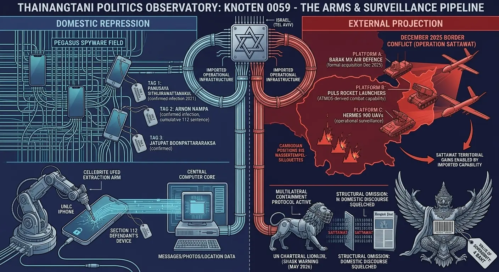

## 0059 – The Israeli–Thai Surveillance and Arms Pipeline: Civil Society Exposure and the Foreign Infrastructure of Repression
**How Israeli surveillance, defence, and forensic technology have become structural components of the Thai state's apparatus for monitoring and prosecuting domestic civil society — and what this means for the opposition movement**

-----

## 1. Scope and Context

The Thai state's capacity to surveil, intimidate, and prosecute its opposition does not run on domestic technology alone. A substantial portion of the material infrastructure that enables Section 112 enforcement, parliamentary opposition harassment, civil society monitoring, and external military projection is **imported from Israel** — via commercial supply chains that operate largely outside parliamentary oversight, public discourse, or international regulatory enforcement.

This chapter maps that pipeline. It documents:

- the surveillance layer (Pegasus, Cellebrite)
- the defence layer (Elbit Systems components, IAI air defence, drones)
- the institutional opacity that protects both
- the civil-society exposure it creates
- the documented victims, named in published forensic investigations
- the connection to the broader repression architecture analysed elsewhere in this observatory (0012, 0028–0037, 0041, 0050)

The argument is not a foreign-policy assessment of the Thailand–Israel diplomatic relationship. It is a structural-analytical claim about the **material basis of contemporary Thai repression** — and about the strategic vulnerability of Thailand's opposition movement, which operates under conditions of permanent technical exposure created by an under-discussed commercial pipeline.

-----

## 2. The Surveillance Layer

### *2.1 The GeckoSpy Investigation (July 2022)*

In November 2021, Apple issued threat notifications to a group of Thai civil society members, alerting them that their devices had likely been targeted by state-sponsored attackers. Multiple recipients contacted civil society organisations, which triggered a joint forensic investigation by **The Citizen Lab** (University of Toronto), **Amnesty International Security Lab**, **iLaw**, and **Digital Reach**.

The investigation, published on 18 July 2022 as **GeckoSpy: Pegasus Spyware Used against Thailand's Pro-Democracy Movement**, produced forensic confirmation of at least **30 individuals infected with NSO Group's Pegasus spyware** between October 2020 and November 2021. The infections coincided directly with the period of Thailand's largest pro-democracy and monarchy-reform mobilisation.

### *2.2 Documented Targets*

The forensically confirmed targets included activists, academics, lawyers, and NGO workers. Among the named victims:

- **Panusaya "Rung" Sithijirawattanakul** — central figure of the United Front of Thammasat and Demonstration, co-author of the 10-point declaration of 10 August 2020 (see 0041, Section 1.6); also one of the three respondents in Constitutional Court Decision 19/2564 (10 November 2021)
- **Jatupat "Pai" Boonpattararaksa** — head of the Thalufah pro-democracy movement, previously sentenced under Section 112 for sharing a BBC profile of King Vajiralongkorn in 2016
- **Arnon Nampa** — human rights lawyer, leading figure in the 2020 monarchy-reform speeches, currently serving a cumulative sentence of **31 years and 9 months** under Section 112 (see 0041, Section 4)
- Multiple unnamed lawyers, academics, NGO workers

The overlap between Pegasus-targeted individuals and Section 112 defendants is not coincidental: the surveillance and the prosecution operate on the same cohort, in the same time window, around the same set of expressive acts.

### *2.3 The Operator Question*

The Citizen Lab investigation did not produce forensic identification of the operator. However, two structural facts narrow the field:

- NSO Group's stated policy is to sell Pegasus **exclusively to government clients**, vetted by the Israeli Defence Export Control Agency
- The targeting pattern — activists, lawyers, and academics involved in domestic Thai pro-democracy and Section 112 reform efforts — corresponds to no plausible foreign intelligence interest

Citizen Lab concluded: *"it is reasonable to conclude that the discovery of Pegasus spyware indicates the presence of a government operator."* No Thai government agency has publicly acknowledged operating Pegasus. No parliamentary investigation has been initiated. No procurement record has been disclosed.

### *2.4 Cellebrite UFED and Mobile Forensic Extraction*

Beyond targeted spyware, **Cellebrite UFED** — the mobile-device forensic-extraction tool produced by the Israeli firm Cellebrite — is operational in Thailand. Documented use cases include Thai police forensics training conducted with Cellebrite hardware as early as 2018. Cellebrite's commercial presence in Thailand is confirmed.

Cellebrite UFED extracts the full contents of seized mobile devices: messages (including from encrypted apps when devices are unlocked or weakly protected), photos, location history, browser history, contacts, and deleted content. In the context of Section 112 enforcement, where any digital expression can constitute the offence, this capability is operationally significant: an arrested defendant's device is no longer a personal record but a complete prosecutorial file.

A parallel Citizen Lab investigation published in February 2026 documented Cellebrite tools used on a **Kenyan activist's phone in police custody**, demonstrating the global pattern in which Cellebrite forensics are deployed against political dissent, not solely against criminal investigation.

### *2.5 The Evidence Chain to Section 112*

The growing share of Section 112 prosecutions based on digital expression — **Mongkol Thirakot's 50-year sentence (later raised above 54 years) for 27 Facebook posts**, the Mongkol pattern, the "Busbas" and "Tonphai" December 2025 records (see 0041, Section 4) — depends on the technical capability to:

1. Identify the speaker (account-attribution forensics)
2. Preserve the evidence (URL captures, server requests, device extraction)
3. Sequence multiple posts into a coherent prosecutorial narrative
4. Authenticate the digital evidence in court

Each step has technical components for which Israeli-supplied or Israeli-derived tools are operational in Thailand. The 54-year cumulative term of Mongkol Thirakot is not abstract: it is the product of an evidence-extraction and authentication pipeline whose tool layer is largely imported.

-----

## 3. The Defence Layer

### *3.1 Established Cooperation*

Thailand–Israel defence cooperation has been continuous and substantial. Documented platforms in active Thai military use include:

- **M758 Autonomous Truck-Mounted Gun** — based on Elbit Systems' ATMOS, partially produced under licence in Thailand
- **D11A multiple rocket launcher** — a localised version of Elbit Systems' PULS
- **M361 Autonomous Truck-Mounted Mortar** — featuring Elbit Systems' Spear 120mm mortar
- **Hermes 900 unmanned aerial vehicles** (Elbit Systems) — surveillance and reconnaissance capability
- **Sea Mini POP sensor payloads** (IAI) — for Royal Thai Navy patrol vessels (six units contracted)
- **F-5 fighter upgrades** discussed with Elbit and IAI in earlier procurement cycles

### *3.2 The December 2025 Barak MX Acquisition*

On 21 December 2025 — **less than three weeks before the 27 December ceasefire that ended the December 2025 Thai–Cambodian border conflict** (see 0058) — the Royal Thai Air Force formalised an acquisition of the Israel Aerospace Industries (IAI) **Barak MX air defence system**, valued at approximately **THB 3.44 billion (USD 108 million)**.

The contract scope: protection against Tactical Ballistic Missiles, Air Breathing Targets, UAVs, fighter aircraft, and cruise missiles, with up to 150 km of defensive coverage.

The timing is significant: the procurement was finalised during the operational phase of the Thai–Cambodian border crisis. The cross-border conflict, which produced the territorial gains of Operation Sattawat (see 0058), occurred while the Thai state was simultaneously formalising a major air-defence acquisition from Israel — and while Israeli weapons systems already in the Thai inventory were reportedly **deployed in the cross-border clashes themselves** (per Diplomat and New Arab reporting on the global reach of Israeli arms during the Thailand-Cambodia clashes).

### *3.3 The Dual-Use Architecture*

The same supply chain feeds two distinct operational theatres:

| Theatre | Tool category | Effect |
|---|---|---|
| **Domestic surveillance** | Pegasus, Cellebrite, Hermes 900 reconnaissance UAVs | identification, prosecution, intimidation of civil society |
| **External military projection** | Barak MX, PULS-derived rocket launchers, ATMOS-derived artillery, Spear mortars | combat capability in border conflicts (Cambodia 2025) |

There is no operational separation. The same procurement relationships, the same diplomatic channels, the same export-licensing infrastructure on the Israeli side, and the same Thai military and security agencies on the receiving side handle both flows. The civil society monitored at home and the Cambodian positions struck across the border are products of the same pipeline.

-----

## 4. The Institutional Opacity

### *4.1 No Parliamentary Disclosure*

The Pegasus operator has not been officially identified. No Thai parliamentary committee has produced a public report. No formal investigation by the National Anti-Corruption Commission, the Ombudsman, or the National Human Rights Commission has been concluded. Procurement records for surveillance technology are routinely classified under defence and security exemptions to public information law.

This is not unusual in comparative perspective — surveillance procurement is opaque in many jurisdictions — but in the Thai case the opacity coexists with **documented use against named civil society actors**, which raises the normative threshold for accountability significantly.

### *4.2 The Discourse Layer*

Coverage of the GeckoSpy report in English-language Thai press was minimal in 2022 and has not been substantially revisited since. The Bangkok Post and The Nation Thailand carried brief news items at publication; sustained editorial engagement, investigative follow-up, or op-ed analysis was largely absent.

The structural narrowing of public discourse documented elsewhere in this observatory — the comment moderation regime (0011, 0027, 0053), the editorial filtering of Postbag letters (0011, Section 10), the technical architecture of the BP website (0038) — applies to this topic as well. The discursive space in which a sustained accountability conversation could occur is structurally constrained.

### *4.3 International Mechanisms*

The available international accountability mechanisms operate with significant limitations in this case:

- **EU dual-use export regulations** apply to exports from EU member states; Israeli exports are not covered
- **US sanctions on NSO Group** (Entity List designation, November 2021) restricted US-based business with NSO but did not prevent NSO operations in other jurisdictions; Thai access continued at least into 2024
- **UN Human Rights mechanisms** have published reports critical of commercial spyware proliferation; enforcement is voluntary
- **The European Court of Human Rights** has no jurisdiction over Thai state action
- **The ICJ and ICC** have no jurisdiction over private commercial sales between consenting state actors
- **Thailand has not ratified the UN Convention against Torture's Optional Protocol** that would permit independent monitoring of detention conditions where Cellebrite-extracted evidence is processed

The result: a robust documentation infrastructure (Citizen Lab, Amnesty, Access Now, EFF) coexists with an absent enforcement infrastructure. Evidence is published; consequences do not follow.

-----

## 5. The Targeted Movement

### *5.1 The Activist Cluster as Continuous Cohort*

The same names recur across multiple stages of the repression architecture:

| Individual | 2020 Protest Role | Decision 19/2564 (Nov 2021) | Pegasus Target (GeckoSpy) | Section 112 Outcome |
|---|---|---|---|---|
| **Panusaya Sithijirawattanakul** | UFTD spokesperson, 10-point reader | named respondent | confirmed | multiple charges |
| **Arnon Nampa** | speech-giver, rally lawyer | named respondent | confirmed | 31 years 9 months cumulative |
| **Jatupat Boonpattararaksa** | Thalufah leader | — | confirmed | prior 112 conviction (2016) |
| **Panupong Jadnok** | UFTD speaker | named respondent | (lawyers confirmed) | charges pending |

The pattern is not random. The pro-democracy and monarchy-reform mobilisation of 2020–2021 produced a small, identifiable cohort. That cohort became:

- the subject of Constitutional Court adjudication (Decision 19/2564, see 0041 Section 1.4)
- the target of Pegasus deployment (GeckoSpy, 2020–2021 infections)
- the defendant pool in Section 112 prosecutions (multiple, 2020–2026)
- the source of cumulative sentences exceeding 30 years per individual in some cases

Each stage of repression has Israeli-supplied technical components. Pegasus identifies; Cellebrite extracts; constitutional doctrine criminalises; criminal courts convict.

### *5.2 The Chilling Effect on the Opposition*

The operational fact of Pegasus deployment against the leading figures of the 2020 movement creates effects beyond the individual victims:

- **Lawyer-client privilege compromised** — when Arnon Nampa's communications can be intercepted, every defendant he represents operates under compromised legal counsel
- **Organisational planning visible** — when activist phones are surveilled, internal strategy is no longer private
- **Family pressure vector** — phone contents typically include communications with family members, creating leverage
- **Self-censorship at the next-generation level** — younger activists, observing what happened to the 2020 cohort, adjust their communications and activities

The 2024–2026 People's Party — the political continuation of the Future Forward / Move Forward Party tradition — operates in this environment. Ten of its sitting MPs face Supreme Court adjudication on ethics charges arising from a 2021 amendment proposal (see 0041 Section 3). The Supreme Court's gag order of 24 April 2026 prohibits them from commenting publicly on their own case. Their communications, in this context, occur on devices the security architecture has structurally compromised over the preceding five years.

### *5.3 The Imported Material Basis of the "Infiltrated Society"*

The ISOC analysis in this observatory (0028–0037) describes Thailand as an infiltrated society — one in which security logic penetrates civilian institutions, mass organisations function as social control, and the state's surveillance reach extends into village-level structures. That analysis describes the **architectural form** of infiltration.

This chapter describes the **material substrate**. Infiltration requires technical capability. The capability is, to a substantial degree, imported. The "infiltrated society" is not solely the product of domestic Thai security culture or domestic surveillance development — it is in significant part the product of a commercial pipeline that connects Tel Aviv to Bangkok and delivers tools whose specific design purpose is identification, extraction, and monitoring at scale.

Without this pipeline, the architecture would not have the reach it currently has. With it, the architecture's operational ceiling is set by the technical specifications of foreign products and the willingness of foreign suppliers to continue selling.

-----

## 6. Civil Society Implications

### *6.1 What Is at Stake*

For Thailand's opposition movement — the political opposition (People's Party), the civic activists (continuing successors of UFTD, Thalufah), the human rights legal community (TLHR, Cross Cultural Foundation, Internet Law Reform Dialogue), the academic critics, the pseudonymous analytical writers — the structural conditions of operation include:

- **Permanent identifiability** at the level of any named or registered activity
- **Communications compromise** for any party communicating with previously surveilled individuals
- **Evidence preservation** at scale, for use in retrospective prosecutions whose statute of limitations is generous
- **Asymmetric resource allocation**: the surveillance side has institutional budgets and foreign professional tools; the civil society side has consumer-grade encryption and volunteer OPSEC training

This asymmetry is structural, not contingent. It will not be remedied by domestic political shift unless that shift includes deliberate decoupling from the import pipeline — which would face opposition from the Thai security establishment for which the pipeline is operationally indispensable.

### *6.2 What Protection Exists*

The protection layer for Thai civil society against this pipeline is real but limited:

- **End-to-end encryption** (Signal, ProtonMail, Tutanota) — protects against passive interception, partial protection against Cellebrite extraction if devices are seized while locked with strong passwords
- **Browser-level OPSEC** (Tor, VPN, browser-fingerprint protection like Kamo) — protects against website-side tracking, less effective against active spyware on the device itself
- **Pseudonymity** (under multiple compartmented identities) — protects identity attribution as long as operational discipline holds
- **International documentation** (Citizen Lab, Amnesty Security Lab, Access Now) — produces evidence and global awareness; does not prevent ongoing operations
- **Pegasus-specific countermeasures**: Apple's Lockdown Mode (introduced 2022), iVerify, MVT (Mobile Verification Toolkit by Amnesty) — partial defensive options

The asymmetry remains. Civil society applies consumer protections to a problem produced by professional-grade state-sponsored tools.

### *6.3 The Pseudonymity Question*

A significant fraction of substantive Thai political analysis in 2026 — including this observatory — operates under pseudonyms for safety reasons directly traceable to the architecture documented above. The structural conditions of pseudonymous analytical work include:

- compartmented identities across platforms
- separated email accounts and operational metadata hygiene
- VPN routing for all sensitive operations
- browser-fingerprint rotation (Kamo, anti-tracking extensions)
- avoidance of identifying detail in published work
- careful handling of every digital artefact (document metadata being the recurring failure mode)

These are the working conditions that the import pipeline necessitates. They are not paranoid — they are calibrated to a documented threat.

-----

## 7. Analytical Synthesis

The Israeli–Thai surveillance and arms pipeline is the **material foundation** of the contemporary Thai repression architecture documented elsewhere in this observatory. The institutional patterns analysed in:

- the Section 112 enforcement consolidation (0012, 0041, 0050)
- the ISOC dual-governance and infiltrated-society architecture (0028–0037)
- the clergy-control and provincial-surveillance machinery (0043)
- the constitutional-court and Supreme-Court terminal-node architecture (0016, 0018)

— all rest, in part, on imported technical capability that the Thai state could not have produced domestically at scale. The architecture is procedural and constitutional in its visible form. It is **commercial and foreign in its operational substrate**.

Three observations follow:

**First**, the architecture's external dependence is also its strategic vulnerability. If the import pipeline were disrupted — by Israeli domestic-policy shift, by EU/US regulatory enforcement reaching extraterritorially, by NSO Group commercial collapse, by Cellebrite acquisition by a more restricted parent — the operational reach of the Thai repression apparatus would contract. The fact that no such disruption has occurred, and no such disruption is on visible horizons, is itself part of the architecture's stability.

**Second**, the pipeline's invisibility in Thai public discourse is not accidental. The same media and discourse environments that protect the architecture from public scrutiny (0011, 0027, 0053) protect the pipeline as a sub-topic. The two protections are not separate operations; they are the same operation seen at different levels.

**Third**, the Thai opposition movement operates against an opponent whose technical capabilities are substantially foreign-supplied. This is not a metaphor; it is a procurement fact. The pseudonymous writer using ProtonMail, the activist using Signal, the lawyer using encrypted notes, the parliamentarian using a personal phone — each operates against tools whose specifications, support pipelines, software updates, and operational scope are determined by Israeli commercial decisions and Israeli regulatory permissions, not by Thai institutional accountability.

For the civic future of Thailand, this matters because **the architecture cannot be reformed by Thai constitutional means alone**. Domestic constitutional reform, parliamentary procedure improvement, judicial restraint development — all the standard tools of democratic recovery — would leave the material pipeline intact. The architecture has been engineered with a foreign substrate that no domestic reform can directly address.

The opposition movement's structural position, in this light, requires a recalibration: from a domestic political-reform agenda to a hybrid agenda that combines domestic political work with international advocacy directed at the **export side** of the pipeline. Without the latter, the former remains operationally constrained by tools whose supply chain runs through Tel Aviv, irrespective of which government sits in Bangkok.

-----

## Sources

**Citizen Lab investigation**

- The Citizen Lab, *"GeckoSpy: Pegasus Spyware Used against Thailand's Pro-Democracy Movement"* (18 July 2022): <a href="https://citizenlab.ca/2022/07/geckospy-pegasus-spyware-used-against-thailands-pro-democracy-movement/" target="_blank" rel="noopener noreferrer">link</a>
- Amnesty International, *"Thailand: Pegasus spyware found on phones of dissidents involved in mass protests"* (18 July 2022): <a href="https://www.amnesty.org/en/latest/news/2022/07/pegasus-thailand-activists-protests/" target="_blank" rel="noopener noreferrer">link</a>
- The Diplomat, *"Thai Activists Targeted With Pegasus Spyware, Claims Report"*: <a href="https://thediplomat.com/2022/07/thai-activists-targeted-with-pegasus-spyware-claims-report/" target="_blank" rel="noopener noreferrer">link</a>
- Al Jazeera, *"Pegasus spyware targeted Thai democracy activists: Report"* (18 July 2022): <a href="https://www.aljazeera.com/news/2022/7/18/pegasus-malware-targeted-thai-democracy-activists-report" target="_blank" rel="noopener noreferrer">link</a>
- Rest of World, *"Pegasus used to spy on protesters, a popular actress, and dozens more in Thailand"*: <a href="https://restofworld.org/2022/pegasus-thailand-report-citizen-lab/" target="_blank" rel="noopener noreferrer">link</a>

**Cellebrite and forensic-extraction context**

- The Hacker News, *"Citizen Lab Finds Cellebrite Tool Used on Kenyan Activist's Phone in Police Custody"* (February 2026): <a href="https://thehackernews.com/2026/02/citizen-lab-finds-cellebrite-tool-used.html" target="_blank" rel="noopener noreferrer">link</a>
- Cellebrite UFED product page: <a href="https://cellebrite.com/en/products/ufed/" target="_blank" rel="noopener noreferrer">link</a>

**Defence procurement — Barak MX and broader Israeli arms in Thailand**

- Asian Military Review, *"Thailand selects Barak MX air defence system from Israel"* (December 2025): <a href="https://www.asianmilitaryreview.com/2025/12/thailand-selects-barak-mx-air-defence-system-from-israel-foc/" target="_blank" rel="noopener noreferrer">link</a>
- Breaking Defense, *"Thailand to acquire Israel's IAI Barak MX Air Defense System"* (December 2025): <a href="https://breakingdefense.com/2025/12/thailand-to-acquire-israels-iai-barak-mx-air-defense-system/" target="_blank" rel="noopener noreferrer">link</a>
- Jerusalem Post, *"After Cambodia war, Thailand signs $108m deal for Israel's Barak MX missile system"*: <a href="https://www.jpost.com/defense-and-tech/article-879331" target="_blank" rel="noopener noreferrer">link</a>
- The New Arab, *"Israeli arms use in Thailand-Cambodia clashes shows global reach"*: <a href="https://www.newarab.com/news/israeli-arms-used-thai-cambodia-clashes-shows-global-reach" target="_blank" rel="noopener noreferrer">link</a>
- The Diplomat, *"New Drones Highlight Thailand-Israel Defense Cooperation"*: <a href="https://thediplomat.com/2018/06/new-drones-highlight-thailand-israel-defense-cooperation/" target="_blank" rel="noopener noreferrer">link</a>

**Section 112 enforcement context (cross-referenced from 0041)**

- TLHR (Thai Lawyers for Human Rights), monthly statistical reports: <a href="https://tlhr2014.com/en/home" target="_blank" rel="noopener noreferrer">link</a>
- 112Watch: <a href="https://112watch.org/" target="_blank" rel="noopener noreferrer">link</a>

**Institutional analytical references**

- David Streckfuss, *Truth on Trial in Thailand: Defamation, Treason, and Lèse-Majesté* (Routledge, 2011)
- Tyrell Haberkorn, *In Plain Sight: Impunity and Human Rights in Thailand* (University of Wisconsin Press, 2018)
- Duncan McCargo, *"Network Monarchy and Legitimacy Crises in Thailand"*, *The Pacific Review* 18:4 (2005)
- Puangthong Pawakapan, *Infiltrating Society: The Thai Military's Internal Security Affairs* (ISEAS, 2021)
- Ronald Deibert, *Reset: Reclaiming the Internet for Civil Society* (House of Anansi, 2020) — for the broader commercial-spyware accountability framework

**Related Observatory analyses**

- [0012 – Section 112 and the Blocked Path of Democratic Reform (2021–2026)](0012-section-112-blocked-democratic-reform.md)
- [0028 – ISOC Dual Governance in Thailand](0028-isoc-dual-governance-in-thailand.md) (and the full 0028–0037 ISOC series)
- [0035 – The Security–Monarchy Nexus](0035-isoc-the-security-monarchy-nexus.md)
- [0041 – Section 112 in the Consolidation Phase (2024–2026)](0041-section-112-in-the-consolidation-phase-2024-2026.md)
- [0043 – Control and Fear Inside the Clergy in Thailand](0043-control-and-fear-inside-the-clergy-in-thailand.md)
- [0050 – 112 Symbolic Speech, Public Debate and Institutional Reality (2026)](0050-112-symbolic-speech-public-debate-and-institutional-reality-2026.md)
- [0058 – Conditioning UNESCO: How Thailand's "Equal Inspection" Demand Shields the Post‑Sattawat Status Quo](0058-conditioning-unesco-paris-equal-inspection-demand.md)

-----

