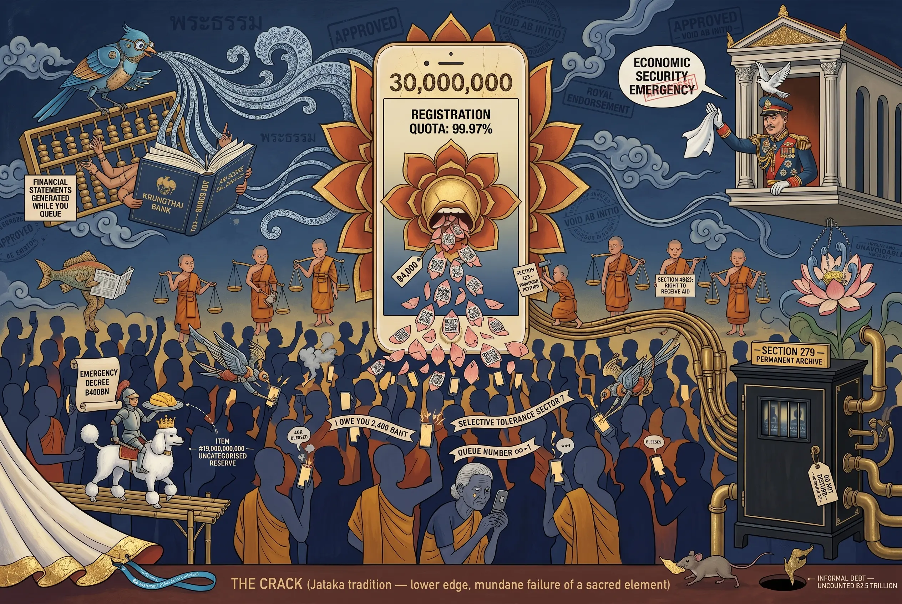
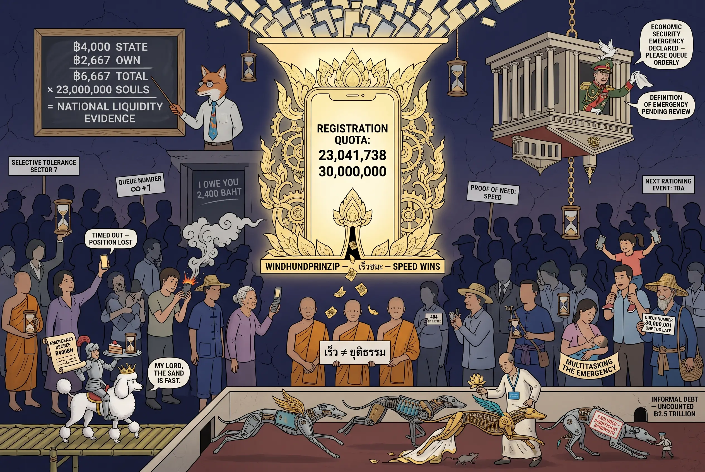
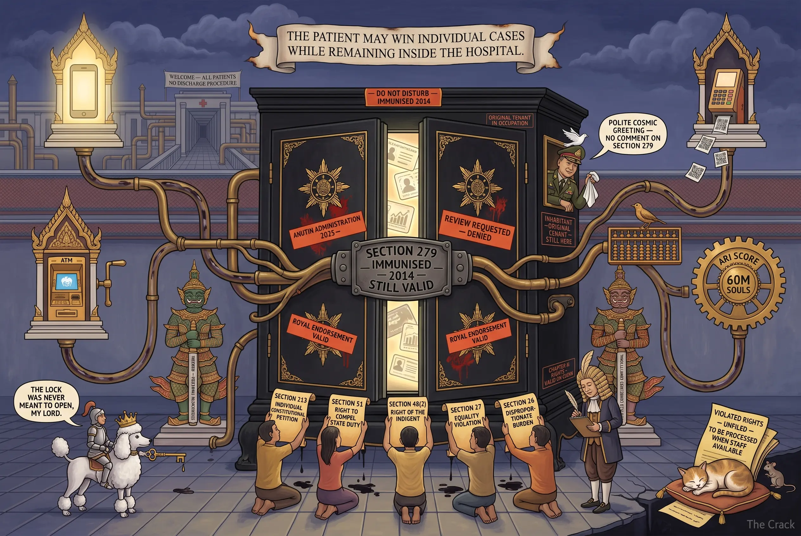

## 0060 – Thai Help Thai Plus: The Constitutional Architecture of a Campaign‑Promise Disguised as Crisis Relief
### *Section 172, Section 57, and the Re‑Personalisation of Public Funds in the 2026 Emergency‑Decree Litigation*

---

## 1. Programmatic note

On 11 May 2026 the People's Party — Thailand's largest opposition formation in the post‑2026 parliament — filed a petition with the Constitutional Court challenging the government's 400‑billion‑baht emergency borrowing decree. The petition was signed by Party leader Natthaphong Ruangpanyawut and **135 sitting Members of Parliament**. The Court accepted the petition; the Cabinet was given seven days to file its defence; and the National Assembly **postponed** its scheduled debate on the decree in anticipation of the ruling.

The decree underwrites a 176‑billion‑baht relief package marketed as "Thai Help Thai Plus" (ไทยช่วยไทยพลัส), which in turn houses the second iteration of "Khon La Khrueng Plus" — a co‑payment scheme branded as cost‑of‑living relief in a self‑declared "price crisis".

This Observatory note examines the **constitutional architecture** of that package: the textual basis of the litigation (Section 172 of the 2017 Constitution), the parallel wahlrechtliche failure (Section 57 of the Organic Act on Political Parties), the symptomatic re‑personalisation of public funds in the Prime Minister's own campaign language, and the structural mismatch between the programme's long‑term technical architecture and the short‑term emergency framing on which its legality depends.

The note builds on the analytical framework set out in [0014 – Constitutional Mechanics I](0014-constitutional-mechanics-I.md), the system‑map of [0024 – Politically Functional Law & Technocratic Framing](0024-politically-functional-law-and-technocratic-framing.md), the budgetary pattern documented in [0034 – Budgetary Exceptionalism and Security Finance](0034-isoc-budgetary-exceptionalism-and-security-finance.md), and the policy‑statement analysis in [0040 – Analytical note on the 2026 policy statement of the Council of Ministers](0040-analytical-note-on-the-2026-policy-statement-of-the-council-of-ministers.md).

---

## 2. The programme and its volume

**Content analysis**

Cabinet approval (early May 2026) authorised a 176‑billion‑baht relief package, financed in two pillars from a 400‑billion‑baht borrowing decree:

- **Welfare‑card pillar (56 bn THB):** Top‑up of 700 baht/month for four months for approximately **13.18 million** holders of the State Welfare Card, raising the monthly transfer to 1,000 baht. Direct‑transfer architecture, no co‑payment.
- **Co‑payment pillar (120 bn THB):** "Khon La Khrueng Plus", a 60/40 government‑user split capped at 200 baht/day or 1,000 baht/month for four months, addressed to approximately **30 million** registered adult citizens via the Pao Tang application.

Total declared beneficiary base: **~43 million** persons. Programme period: 1 June – 30 September 2026. Registration: 25–29 May 2026 via Pao Tang.

Funding source: an **Emergency Decree** authorising the Ministry of Finance to borrow up to 400 billion baht — distinct from, and additional to, the regular FY2026 budget approved through ordinary parliamentary procedure. Public debt is projected to rise from approximately 65 % to **~68 % of GDP**, against a statutory ceiling of 70 % set by the State Fiscal and Financial Disciplines Act 2018.

**Legal/constitutional anchor**

The Cabinet justified recourse to an emergency decree (rather than a supplementary budget bill) by invoking Section 172 of the 2017 Constitution. The relevant text restricts emergency decrees to cases of "urgent and unavoidable necessity" in four enumerated domains:

1. national security,
2. public safety,
3. economic stability,
4. disaster prevention or mitigation.

The Council of Ministers' formal justification rests on the third limb: an alleged "third crisis wave" of high prices and an "economic security emergency". This justification is the textual point at which the litigation strikes.

---

## 3. The constitutional petition: parties, provisions, procedure

**Procedural status**

The petition was lodged by the leader of the second‑largest party in the Assembly (People's Party, 118 seats) together with 135 of its MPs. Procedurally, the Court must rule within **60 days** of receipt. A finding of unconstitutionality requires the affirmative votes of **at least six of the nine sitting judges** (a two‑thirds quorum). A decree found to violate the Constitution is **void ab initio** — meaning that disbursements already made under it lose their legal basis retroactively.

The Royal Endorsement (พระบรมราชโองการ) of the decree had already been issued at the time of filing. The Prime Minister, Anutin Charnvirakul (Bhumjaithai), publicly stated that he was "unfazed" by the challenge. The royal endorsement is a formal act of promulgation; it does **not** insulate the decree from constitutional review under Section 172, which is precisely designed for **ex‑post** judicial scrutiny of executive emergency powers.

**Opposition arguments**

The People's Party's substantive claim is that the four‑limb test of Section 172 is not met:

- The decree finances measures (rooftop‑solar expansion, energy‑transition infrastructure, EV support) whose own technical timelines extend over **years**, not weeks. A measure whose implementation cannot be accelerated by emergency funding cannot, by definition, satisfy an "urgent and unavoidable" test.
- The EV component is already being delivered out of the **regular budget** at a level sufficient to generate a 49 % new‑registration share — empirical demonstration that the ordinary fiscal cycle is functioning.
- The second 200‑billion‑baht tranche has no defined disbursement schedule beyond standard public‑investment lead times; it could plainly be passed as a supplementary appropriation through the ordinary legislative process.
- The co‑payment scheme itself is a **recurrence** of a 2020–2024 instrument (Khon La Khrueng phases 1–5). A recurrence of a pre‑existing programme is, by its character as a known and budgeted policy tool, the antithesis of an "unavoidable" emergency.

The Council of State's silence on these objections — combined with the Cabinet's choice of the decree route rather than a supplementary budget bill — is the operative procedural fact under challenge.

---

## 4. Section 172: the "urgent and unavoidable necessity" test

**Content analysis**

The textual test of Section 172 is conjunctive. It requires both that one of the four substantive limbs is materially triggered **and** that the necessity is *urgent* (immediate in time) **and** *unavoidable* (no ordinary legislative path available within the relevant time horizon). Each component is judicially reviewable.

The third limb — "economic stability" — has been read in earlier jurisprudence (notably in the 2020 COVID‑era decree litigation) to require an objective showing of macroeconomic destabilisation, not a rhetorical declaration of crisis by the executive itself.

**Empirical indicators against the executive's framing**

The macroeconomic indicators publicly available at the time of the decree do not, on their face, evidence systemic instability:

| Indicator | Value (early 2026) | Crisis threshold? |
|---|---|---|
| Headline CPI inflation | 2.9 % (forecast 3.2 %) | No — within BoT corridor |
| GDP growth (annualised) | 2.8 % | No — slow but positive |
| Unemployment | 0.9 % | No — historically low |
| Household debt / GDP (BoT) | 86.7 % | High, but stable |
| Currency stress | None recorded | No |
| Sovereign bond spread | Stable | No |
| Foreign reserves | Adequate | No |

The Bank of Thailand's own monetary‑policy communications during Q1 2026 do not characterise the situation as a stability emergency. The Finance Minister's invocation of "economic security crisis" therefore relies on a **rhetorical re‑labelling** of slow growth and cost‑of‑living pressure as systemic instability — a category extension that exceeds the textual scope of Section 172(3) as previously interpreted.

**Legal/constitutional analysis**

Two doctrinal points follow:

- If the Court reads "economic stability" narrowly (as systemic financial/monetary destabilisation), the decree fails the substantive test.
- If the Court reads it broadly (as any adverse cost‑of‑living development), Section 172 collapses into a general fiscal blank cheque for the executive — effectively erasing the parliamentary budget prerogative. This second reading would constitute a major doctrinal expansion, comparable in scale to the doctrinal expansions audited in [0014 – Constitutional Mechanics I](0014-constitutional-mechanics-I.md) and [0017 – The Jurisprudence of "Prevention"](0017-the-jurisprudence-of-prevention.md).

**Tension**

The Court therefore faces a binary doctrinal choice with significant downstream effects. A permissive ruling would transform Section 172 from an exceptional instrument into a routine fiscal channel. A restrictive ruling would void a programme already in active disbursement.

---

## 5. Section 57 of the Organic Act on Political Parties: the Election Commission's default

**Content analysis**

Section 57 of the Organic Act on Political Parties (2017) imposes on the Election Commission (EC) an affirmative duty to **scrutinise the funding, feasibility, value‑for‑money and risk profile** of every campaign promise made by a registered party before the election. This is not a discretionary review; it is a statutory precondition for the legality of the promise as a campaign artefact.

Bhumjaithai entered the 2026 general election with "Khon La Khrueng Plus" as a **named, costed, headline promise**. Party communications openly priced the long‑run fiscal commitment at up to **300 billion baht**, and Bhumjaithai explicitly conceded that medium‑term **VAT increases** would be required to sustain the commitment — a public admission that the promise was **not financeable from the regular budget envelope**.

**Legal/constitutional analysis**

Two parallel inferences arise:

- The EC's Section 57 review either did not detect the unfinanceability (a competence failure) or detected and disregarded it (a duty‑of‑office failure). In the public record, no formal Section 57 objection by the EC has been documented. The EC is regularly described in mainstream Thai‑English coverage as a "paper tiger" with respect to this duty.
- The subsequent enactment of the promise via emergency decree — rather than through a regular appropriation requiring full parliamentary debate — **completes** the circumvention of the constitutional design that Section 57 and the budget articles together were intended to safeguard.

The two failures are sequentially linked: the wahlrechtliche default at the EC stage made the fiscal default at the decree stage politically possible.

**Tension**

The Section 57 angle is **not formally before the Constitutional Court** in the May 2026 petition. The Court's jurisdiction in this proceeding is confined to Section 172. However, the Section 57 history is highly relevant *evidentially*: it establishes that the programme was **planned, costed, and announced as a campaign instrument months before** the alleged "price crisis" — undermining the executive's claim that the same programme constitutes an unforeseeable emergency response.

---

## 6. The "I owe you 2,400 baht" episode

During the 2026 campaign, Anutin Charnvirakul (Bhumjaithai leader, subsequently Prime Minister) delivered the following formulation in support of the Khon La Khrueng Plus promise:

> *"I still owe the people 2,400 baht, and I ask for the chance to return and settle that debt."*

Thai PBS Verify's fact‑check established two points:

- The 2,400‑baht amount is **not a personal debt** of Mr Charnvirakul. It is a calculable per‑capita allocation from the FY2026 national budget pool that, under existing law, belongs to the State and is appropriated through parliamentary procedure.
- The rhetorical move re‑frames a sovereign budgetary act as an **interpersonal obligation** between politician and voter — what academic commentators in the fact‑check describe as the **transformation of state expenditure into a personal promise**.

**Constitutional reading**

This is more than rhetorical excess. The re‑personalisation operates at three constitutional registers simultaneously:

- It **detaches** the expenditure from its constitutional locus (parliamentary appropriation, Article‑140 / Article‑144 territory) and re‑attaches it to the office‑holder.
- It **collapses** the wahlrechtliche distinction between policy commitment (Section 57 territory) and gift to voters (a category that, in stricter regimes, would trigger anti‑corruption review).
- It **legitimises** the subsequent recourse to emergency procedure: if the money is owed by the politician personally, the parliamentary route appears as obstruction rather than as the constitutional default.

The episode is therefore not a campaign embarrassment but a **constitutional symptom** — the public verbal evidence of the re‑framing that the legal architecture then ratifies.

This pattern fits the system map of [0024 – Politically Functional Law & Technocratic Framing](0024-politically-functional-law-and-technocratic-framing.md): a politically functional re‑labelling that draws legitimacy from a depoliticised, technocratic delivery layer (Pao Tang, Ari Score) while the political function — voter capture — remains the core operation.

---

## 7. Architecture beneath the mantle: why the programme is structurally long‑term

**Content analysis**

The "humanitarian relief" framing rests on a four‑month disbursement window. But the **delivery infrastructure** built under the decree has a permanence and reach that exceeds any four‑month emergency:

- **Pao Tang** (เป๋าตัง): The mandatory G2P front‑end, operated by Krungthai Bank (a state‑majority commercial bank). Mandatory KYC, biometric identification, geofenced transaction tracking, non‑transferable digital wallet. The 2024 predecessor scheme (Digital Wallet) **doubled** Thailand's digital‑ID base from <20 million to >40 million users — empirical evidence that stimulus programmes are functioning as enrolment vehicles for the digital‑ID architecture.
- **Thung Ngen** (ถุงเงิน): The merchant‑side counterpart, with KYC for participating vendors, including informal‑sector food stalls and micro‑retailers historically outside the formal financial system.
- **"Whispering Bird" / Nok Krasip (นกกระซิบ):** Krungthai's AI assistant embedded in Thung Ngen. Functions: daily sales analytics, peak‑hour optimisation, raw‑material price linkage to Ministry of Commerce data, and — explicitly announced — **generation of formal financial statements** that the merchant can submit to state banks for loan applications. The latter feature converts informal cash‑flow into bankable credit history.
- **Ari Score:** A Ministry of Finance AI‑based credit‑scoring system. Data foundation: **60 million individuals** (assets, income, welfare benefits, tax records). Designed to extend credit eligibility to persons currently outside the formal banking system, via four state banks (Krungthai, GSB, SME D Bank, GHB).

**Legal/constitutional analysis**

This stack constitutes a **closed formalisation loop**: enrolment (Pao Tang/Thung Ngen) → behavioural data (Whispering Bird) → credit scoring (Ari Score) → state‑bank lending → further transactional enrolment. The architectural scope is **long‑term, irreversible, and permission‑based on a single emergency event**.

The mismatch is doctrinally decisive: a programme that is *architecturally* a multi‑year state‑capacity expansion cannot simultaneously be *legally* an unforeseen short‑term emergency. The longer the architecture's lifespan, the weaker the Section 172 emergency claim. Conversely, the longer the architecture's reach, the more the emergency frame functions as **a circumvention mechanism** for what would, under ordinary procedure, require a separate statutory base (data protection, banking law, social‑policy enabling legislation).

This corresponds structurally to the budgetary‑exceptionalism pattern documented in [0034 – Budgetary Exceptionalism and Security Finance](0034-isoc-budgetary-exceptionalism-and-security-finance.md), in which discretionary funds insulated from parliamentary oversight underwrite a parallel state architecture. The Thai Help Thai Plus decree extends that pattern from security finance into **fiscal–technological infrastructure**.

---

## 8. Behavioural architecture: rationing expectation and the *Windhund* mechanism

**Content analysis**

The programme's registration cap (30 million slots) combined with first‑come‑first‑served allocation produced an observable behavioural signature. Within hours of opening on 25 May 2026, **23 million** registrations were recorded; Pao Tang's traffic peaked at approximately **700,000 concurrent requests per second**. The maximum per‑person benefit is structurally modest:

| Item | Amount |
|---|---|
| Maximum state subsidy over four months | **4,000 THB** (≈ 110 €) |
| Corresponding user co‑payment (40 % share) | **2,667 THB** (≈ 73 €) |
| Combined consumption envelope | 6,667 THB (≈ 183 €) |
| Registrations within hours of opening | 23 million |
| Peak platform load | ~700,000 req/s |

A 4,000‑baht nominal benefit, spread over four months, that triggers nationwide overnight queueing and platform overload is a behavioural data point in its own right. It implies that the **marginal utility of small public transfers is exceptionally high** for a large fraction of the population — which is itself a measure of acute liquidity stress in everyday household budgets, not of consumer demand for additional spending.

**Behavioural reading**

Two well‑documented mechanisms operate simultaneously:

- **Scarcity mindset** (Mullainathan/Shafir, 2013): when cognitive bandwidth is bound by liquidity stress, even small marginal cash inflows acquire disproportionate weight in decision‑making.
- **Loss aversion** (Kahneman/Tversky): the anticipated pain of being excluded by the 30‑million cap operates more powerfully than the absolute size of the entitlement. The cap converts a modest transfer into a contested rationed resource.

The accurate doctrinal term is **"digital *Windhundverfahren*"** — first‑come‑first‑served allocation under scarcity. In German constitutional jurisprudence, the *Windhundprinzip* is the established label for this allocation rule, historically litigated in the *Numerus Clausus* cases on university‑place rationing and treated as a constitutionally suspect distribution mechanism because it correlates with extrinsic capacities (access speed, network quality, time availability, prior platform enrolment) rather than with substantive entitlement.

**Constitutional implications**

Three constitutional registers are touched simultaneously:

- **Equality (Section 27, 2017 Constitution).** Allocation by registration speed systematically favours users with high‑bandwidth mobile connections, newer smartphones, available time at the registration window, and prior KYC enrolment in Pao Tang. The poorest cohorts — informal labourers without smartphones, elderly users without digital literacy, rural households with weak connectivity — are statistically displaced. The *Windhund* mechanism reproduces, rather than mitigates, the inequality the programme nominally addresses.
- **Section 172 self‑reference.** The executive cites the mass‑registration figures as proof that an emergency situation existed. This is doctrinally circular: a programme that *constructs* scarcity (cap plus countdown) and then reads the resulting stampede as evidence of need supplies its own justification. The constitutional emergency test under Section 172 is meant to apply *ex ante* indicators (the macroeconomic data examined in Section 4), not *ex post* behavioural responses to the policy instrument itself.
- **Reinforcement loop.** Cap → scarcity expectation → mass registration → political legitimation → next iteration with cap → expectation reinforced. The KYC base grows monotonically; the surveillance architecture documented in Section 7 acquires durable user lock‑in not despite the rationing but *because of it*. Each iteration deepens the population's expectation that public resources arrive in discrete, contested, digitally rationed tranches.

**Tension**

This corresponds structurally to the anticipation‑governance pattern audited in [0021 – The Architecture of Anticipation](0021-governance-through-uncertainty.md) and [0022 – The Feedback Loop: How Anticipation Reinforces Institutional Power](0022-how-anticipation-reinforces-institutional-power.md). Both notes describe a regime that governs not by direct command but by **conditioning expectation**. Thai Help Thai Plus is the fiscal–technological extension of the same principle: the population is conditioned to expect that state resources are finite, contested, and distributed by digital competition rather than by right.

A behavioural state in which **23 million citizens treat a 110‑€ four‑month benefit as worth queueing through the night** is not a sign of consumer confidence. It is the empirical signature of a population operating under a **permanent rationing expectation** — a sociopsychological condition that no four‑month relief programme can address, but that every iteration of such a programme structurally reinforces.

---

## 9. Constitutional fracture lines and the litigation pathway
### *Sections 27, 48(2), 26 — the substantive hooks; Sections 51, 212, 213, 5 — the procedural levers; Section 279 — the structural shield*

The Section 172 challenge examined in Sections 3 and 4 attacks the **vehicle** (the emergency decree). The behavioural mechanism analysed in Section 8 generates a second, independent line of constitutional attack — on the **distribution rule itself**, irrespective of whether the funding base survives. Three substantive fracture lines, four procedural levers, and one structural shield define the litigation space.

### 9.1 Fracture line A — Section 27 (Equality)

> *"All persons are equal before the law, and shall have rights and liberties and be protected equally under the law. […] Unjust discrimination against a person on the grounds of differences in […] economic and social standing […] shall not be permitted."* (Section 27 paragraphs 1 and 3)

A distribution rule that operates on the throughput capacity of a single mobile application — Pao Tang's documented peak of 700,000 requests per second — converts allocation into a function of **handset speed, network bandwidth, registration‑window availability, and prior platform enrolment**. Each of these correlates directly with the *economic and social standing* category that Section 27(3) names as a prohibited ground.

The Finance Ministry's defence that the system "remained stable" misses the constitutional point: the prohibited discrimination is not server failure, but the **selection criterion itself**. Speed has been substituted for need.

**Doctrinal sharpening:** Section 27(4) provides an explicit safe harbour for *affirmative action* — measures designed to "eliminate an obstacle to or to promote persons' ability to exercise their rights" or "to protect or facilitate […] underprivileged persons". A welfare programme that wishes to be lawful under Section 27 must qualify under 27(4); a programme that **creates** new access obstacles instead of removing them fails the safe harbour test and falls back into the prohibition of 27(3). The *Windhund* mechanism does precisely the latter.

### 9.2 Fracture line B — Section 48(2) (Right of the indigent to state aid)

> *"An indigent person shall have the right to receive appropriate aids from the State as provided by law."* (Section 48 paragraph 2)

A natural anchor for the equality argument would appear to be Section 71(4) (budget allocation must reflect "different necessities and needs … to ensure fairness"). However, Section 71 sits in **Chapter VI "Directive Principles of State Policies"**, expressly defined by Section 64 as non‑binding directives for policy formulation. Standing alone, it is a weak litigation hook.

Chapter V "Duties of the State" supplies a stronger anchor: Section 48(2) is drafted as a **right** ("shall have the right to receive"), not a directive, and is therefore directly justiciable. The Finance Ministry's own justification — that the measure addresses cost‑of‑living stress for the most vulnerable — establishes the substantive scope of the duty under Section 48(2). Once the programme is constitutionally framed as aid to the indigent, allocation by *Windhund* rather than by need violates the **content** of the Section 48(2) right, not merely the Directive Principle of Section 71.

The proper litigation construction is therefore: **Section 48(2) as anchor, Section 71(4) as interpretive aid, Section 27 as constraint on the distribution mode.**

**Three layers of discrimination.** The Section 48(2) violation operates not only through the *Windhund* mode of allocation analysed in Section 9.1, but at two further levels simultaneously, which compound rather than substitute for each other:

| Layer | Mechanism | Source |
|---|---|---|
| **Categorical** | Allocation by registration speed rather than by need; correlates with handset speed, network quality, available time, prior KYC enrolment | Section 9.1 |
| **Quantitative** | Welfare‑card pillar B36.9 bn genuine new aid (13.18 m × B700 × 4 mo) vs co‑payment pillar B120 bn (30 m × B1,000 × 4 mo). Per capita: B2,800 indigent vs B4,000 middle class — 30 % less for the constitutionally protected group | Cabinet decision, May 2026; Bangkok Post, 26 May 2026 |
| **Regulatory** | Cabinet rule of 1 October 2025 explicitly excludes state welfare cardholders from registering for the Pao Tang co‑payment scheme. The vulnerable population that Section 48(2) protects is, by ministerial decision, denied access to the larger pillar | Nation Thailand, 21 May 2026 |

The regulatory exclusion is the doctrinally sharpest of the three. It converts the discrimination from an incidental effect of design choices into a **named eligibility rule**. The decree of allocation does not merely fail to prioritise the indigent; it **affirmatively bars** them from the principal pillar of the programme. A constitutional right whose holders are excluded by ministerial rule from the larger vehicle for its realisation is not "appropriately" served within the meaning of Section 48(2).

**A note on the substitution-effect counter‑argument.** A possible reading runs: the B700 top‑up to the welfare card might free up household cashflow that could be redeployed elsewhere, indirectly equalising outcomes. This holds only for welfare‑cardholders who *previously* spent B700/month from own cashflow on goods that the top‑up now covers — typically the better‑off segment of the welfare‑card population. For day‑labourers, subsistence farmers, and elderly recipients whose pre‑existing cashflow falls below the substitution threshold, the top‑up is purely *additive*, not *substitutive*. The argument therefore re‑sorts the welfare‑card population by relative wealth rather than equalising the gap with the co‑payment pillar; it amplifies, rather than mitigates, the discrimination at the bottom of the distribution.

### 9.3 Fracture line C — Section 26 + Section 4 (Proportionality and dignity)

> *"The enactment of a law resulting in the restriction of rights or liberties of a person […] shall not be contrary to the rule of law, shall not unreasonably impose burden on or restrict the rights or liberties of a person and shall not affect the human dignity of a person […]"* (Section 26 paragraph 1)
>
> *"Human dignity, rights, liberties and equality of the people shall be protected."* (Section 4 paragraph 1)

The emergency decree, having the force of law under Section 172, is squarely subject to Section 26. Two doctrinal hooks operate:

- **Section 26(1) — unreasonable burden.** The Finance Ministry concedes that the measure exists to "reduce living costs in a high‑inflation environment". Excluding a citizen who has reached the registration cap by milliseconds therefore *removes* the very relief that the State has declared necessary. That is not a marginal disadvantage; it is the withdrawal of a state‑declared subsistence support — an "unreasonable burden" in the precise sense of Section 26(1), and an affront to human dignity in the economic sense within the meaning of Section 4(1).
- **Section 26(2) — general application.** The cited provision adds: *"The law under paragraph one shall be of general application, and shall not be intended to apply to any particular case or person."* A distribution algorithm that picks an arbitrary 30‑million subset from a 43‑million eligible base functions, structurally, as a **partial application** of a notionally general law. The Section 26(2) requirement of generality is met on the face of the decree but breached by its operative implementation.

### 9.4 The litigation pathway

The 2017 Constitution provides at least four procedural levers for activating the three fracture lines:

| Provision | Function | Standing |
|---|---|---|
| **Section 51** | Direct legal action against the responsible State agency to compel performance of a Chapter V duty | Any person or community affected by the State's failure to perform a Chapter V duty (e.g., Section 48(2)) |
| **Section 213** | Individual constitutional petition for violation of a constitutional right or liberty | Any person whose constitutional rights are violated |
| **Section 5** | Supremacy clause: any law, rule, regulation or *act* contrary to the Constitution is **unenforceable** | Reaches not only the decree but every administrative act executing it — including the Pao Tang lockout itself |
| **Section 212** | Court‑initiated reference to the Constitutional Court when adjudicating a case | Any court (typically the Administrative Court hearing a Section 51 claim); reduces the activation burden on individual litigants |

The combination is significant: a single excluded registrant can file a Section 51 action in the Administrative Court invoking Section 48(2); if the court suspects constitutional incompatibility, Section 212 obliges it to refer the matter; Section 213 provides a parallel direct path to the Constitutional Court; and Section 5 ensures that any operative lockout act is *ipso facto* unenforceable pending resolution. The procedural architecture is scalable: it does not require a coordinated mass action — it requires only individual access to administrative justice.

### 9.5 The Section 279 shield: structural asymmetry

> *"All announcements, orders and acts of the National Council for Peace and Order […] shall be considered constitutional, lawful and effective under this Constitution."* (Section 279)

The Anutin emergency decree of May 2026 is **not** directly shielded by Section 279 — it was issued under the civilian government, post‑NCPO. The Section 172 and equality challenges therefore proceed without that doctrinal obstruction.

However, Section 279 shields the **operational infrastructure** without which the programme cannot run:

- **Pao Tang** was developed under NCPO‑era arrangements with Krungthai Bank; the foundational regulatory acts fall within Section 279.
- **The State Welfare Card (Bat Sawatdikan) database** originates in the 2017–2018 NCPO Cabinet — Section 279 territory.
- **The KYC‑digital‑ID architecture** that links Pao Tang to the Ministry of Interior database was established by NCPO orders and subsequent normalisation legislation that incorporates them.

This produces a structural asymmetry that is decisive for the litigation outlook:

> **A Section 213 ruling can strike down the distribution rule. It cannot strike down the data architecture that survives the rule.**

Even if the *Windhund* mechanism is held unconstitutional and re‑engineered, the **KYC base, transactional history, merchant graph, and Ari Score linkage** persist. The surveillance‑side enrolment captured in Section 7 is locked in by Section 279 against the very constitutional review that might invalidate its current fiscal vehicle. This is the doctrinal expression of the pattern documented in [0030 – The Architecture of the Infiltrated Society](0030-isoc-the-architecture-of-the-infiltrated-society.md): a constitutional regime that names extensive rights in Chapters III–V while shielding the *administrative back‑end* from judicial reach via Section 279.

**Synthesis.** The 2017 Constitution offers an unusually rich litigation toolkit against the *Windhund* mechanism — three independent substantive grounds, four convergent procedural levers, and a relatively low standing threshold (Section 213). A coordinated individual litigant has a credible path to invalidating the distribution rule. What the toolkit cannot reach is the **infrastructure beneath**: the Section 279 perimeter ensures that the surveillance, identification, and credit‑scoring stack remains lawful regardless of the constitutional fate of any particular distribution event. The Constitution permits the patient to win the case while remaining inside the hospital.

---

## 10. The hidden debt statistic

**Content analysis**

The official Bank of Thailand household debt ratio (86.7 % of GDP, Q4 2025) excludes informal indebtedness — loan‑shark credit, pawnshop debt outside the regulated nano‑finance sector, employer advances, family network debt, underground micro‑lenders. A 2024 study commissioned by the Joint Standing Committee for Commerce, Industry and Banking (JSCCIB) and conducted by Chulalongkorn University estimated total household indebtedness, **including informal debt**, at **~104 % of GDP** — a gap of approximately **14 percentage points**, or roughly **2.5 trillion baht** absent from the official statistic.

Approximately **40 % of households** carry informal debt; the per‑household average where present ranges from 98,500 baht (Chulalongkorn) to 100,000–200,000 baht (UTCC surveys). Effective interest rates in the informal sector run to 240 % per annum.

**Legal/constitutional analysis**

The doctrinal significance is twofold:

- The fiscal‑discipline calculus underlying the executive's "we are still under the 70 % public‑debt ceiling" argument **understates the real macroeconomic stress** by the size of the informal debt overhang. Macroprudential headroom is thinner than the headline ratio suggests.
- The Ari Score architecture is explicitly designed to **convert informal debt into formal debt**. If successful, the **official household debt ratio will rise** toward the real ratio — not because real indebtedness has grown, but because formerly invisible debt becomes visible. Political communication will likely present this as success ("informal lending replaced by regulated credit"). The underlying risk, given the documented pattern of **dual borrowing** (households holding both formal and informal credit simultaneously), is an absolute increase rather than a substitution.

The Court is not asked to rule on macroeconomic statistics. But the statistical understatement is doctrinally relevant: the executive's "economic stability" claim under Section 172 cannot rest on indicators that systematically omit one‑sixth of GDP in household leverage.

---

## 11. Precedent: how the Constitutional Court has handled comparable cases

**Content analysis**

The Court's docket since 2014 establishes a pattern of intervention in large‑scale, fiscally consequential programmes:

- **2014 — Yingluck Shinawatra rice‑pledging scheme.** Found to have been operated in breach of fiscal discipline; the ruling chain contributed to the constitutional removal of the Prime Minister and a long subsequent line of criminal proceedings against ministers and officials.
- **2024 — Move Forward Party dissolution.** Constitutional removal of a parliamentary majority's leadership over a campaign‑promise (Section 112 amendment) found to violate Section 49.
- **2025 — Pheu Thai's "Digital Wallet" scheme (500 bn THB).** Shelved under combined Constitutional Court and Council of State pressure before disbursement; the same fiscal architecture (large‑scale, digitally distributed, debt‑financed cash transfer) is at issue in the present case.
- **2025 — Anutin elevation as Prime Minister.** Made conditional on a constitutional reform process, signalling judicial willingness to attach constitutional conditions to executive power.

**Legal/constitutional analysis**

The Court is therefore not a passive forum. Its modal posture across the 2014–2025 cycle is one of **active doctrinal intervention** in fiscal and electoral matters, including against governing majorities. The 2025 shelving of Pheu Thai's Digital Wallet is the most directly analogous precedent: it concerned a programme of comparable scale, comparable distribution architecture, and comparable populist framing — and it did not survive ex ante review.

The present case differs procedurally (the Thai Help Thai Plus decree is already in force; Pao Tang registration is open; first disbursements are imminent) and politically (it is the flagship of a sitting Bhumjaithai‑led coalition rather than an opposition pre‑proposal). These differences affect the **costs** of a striking‑down, not its **legal availability**.

---

## 12. What the Court must weigh

**Factors against the decree**

- Macroeconomic indicators do not, on their face, demonstrate the "urgent and unavoidable" character required by Section 172.
- The programme is a re‑run of a pre‑existing instrument (Khon La Khrueng phases 1–5) and was a publicly costed campaign promise — incompatible with the unforeseeability element of "emergency".
- The supporting technical architecture (Pao Tang, Thung Ngen, Whispering Bird, Ari Score) is structurally long‑term and decoupled from any four‑month emergency window.
- The decree route bypasses the budgetary participation of 135 opposition MPs, raising a parallel question under the legislative‑procedure provisions audited in [0014 – Constitutional Mechanics I](0014-constitutional-mechanics-I.md).
- Approximately **19 billion baht** of the welfare‑pillar allocation are not itemised in publicly available cabinet communications — a transparency deficit that compounds the procedural objection.

**Factors against striking down**

- The Royal Endorsement has been issued; voiding the decree would create an institutional rupture.
- Disbursements to ~13 million welfare‑cardholders are imminent or commencing; retrospective voidance carries severe social cost.
- The Court would, in effect, terminate the flagship programme of a sitting coalition government, with predictable political consequences.
- A finding of unconstitutionality may chain into ministerial liability proceedings under Section 144 and the Organic Act on Anti‑Corruption.

**Doctrinal stakes**

A permissive ruling expands Section 172 into a routine fiscal channel and weakens the parliamentary budget prerogative. A restrictive ruling reasserts the textual narrowness of the emergency power and re‑anchors fiscal expansion in ordinary procedure.

---

## 13. Three outcome scenarios

**Scenario A — Full unconstitutionality (6+ judges).** Decree void ab initio. Disbursements lose legal base. Repayment obligations on disbursed amounts unclear in practice; political crisis for the Bhumjaithai coalition; possible Section 144 proceedings against responsible ministers. The Pao Tang / Thung Ngen registration infrastructure retains technical persistence even after the funding falls — the surveillance architecture survives the legal voidance.

**Scenario B — Partial unconstitutionality.** Court finds the second tranche (200 bn THB, energy transition) unjustified under Section 172 but allows the first tranche (relief measures already approved). This is the most procedurally elegant outcome; it preserves the welfare disbursements while disciplining the legislative end‑run. Outcome consistent with the Court's historical preference for **doctrinal containment over institutional rupture**.

**Scenario C — Decree upheld in full.** Section 172 is read expansively as covering any executive‑declared adverse economic development. The parliamentary budget prerogative is structurally weakened. The pattern of decree‑financed populist transfer becomes a normalised governance instrument; the Court signals tolerance for further iterations.

The Court's prior posture (Scenarios A and B more probable than C) does not predict the outcome with certainty, but the historical baseline is **intervention**, not deference.

---

## 14. Implications for the Observatory framework

The Thai Help Thai Plus case sits at the **intersection** of five patterns already mapped by the Observatory:

- **Constitutional functionality:** Section 172, like Section 49 in [0013](0013-section-49.md) and Section 235 in [0016](0016-section-235.md), is being tested as an **operational instrument** rather than a constitutional limit. The pattern of doctrinal interpretation — whether the text is read narrowly or expansively — is the actual locus of constitutional change.
- **Technocratic framing:** The programme exhibits the depoliticisation pattern described in [0024](0024-politically-functional-law-and-technocratic-framing.md): a politically functional act (campaign promise, voter capture) is delivered through technocratic infrastructure (digital ID, AI scoring, G2P transfer) that projects neutrality and modernisation while the political function remains operative.
- **Budgetary exceptionalism:** The use of an emergency decree to fund a planned campaign promise extends the pattern of **out‑of‑normal‑procedure budgeting** documented in [0034](0034-isoc-budgetary-exceptionalism-and-security-finance.md) from the security domain into the social‑policy and digital‑infrastructure domain. The two domains together now share a common financing logic — discretionary, parliamentary‑light, durable.
- **Behavioural conditioning:** Section 8 documents that the 30‑million cap, by design, activates loss aversion and scarcity behaviour at population scale. This is the fiscal–technological extension of the anticipation pattern in [0021](0021-governance-through-uncertainty.md) and [0022](0022-how-anticipation-reinforces-institutional-power.md) — a regime that governs through conditioned expectation rather than command. Mass overnight registration for a 110‑€ benefit is not a sign of policy success; it is a behavioural marker of a population pre‑loaded with permanent rationing expectation, and each iteration of the programme deepens it.
- **Constitutional asymmetry / structural shield:** Section 9.5 documents the doctrinal asymmetry that the 2017 Constitution offers a rich litigation toolkit against the distribution rule (Sections 27, 48(2), 26 via Sections 51, 212, 213, 5) but cannot reach the operational infrastructure that Section 279 shields. This is the same asymmetry that [0030 – The Architecture of the Infiltrated Society](0030-isoc-the-architecture-of-the-infiltrated-society.md) describes: extensive rights named in Chapters III–V; administrative back‑end immunised by transitional provisions. The Constitution permits the patient to win individual cases while remaining inside the hospital.

The Section 172 litigation is therefore not an isolated procedural dispute. It is a **doctrinal test** of whether the constitutional architecture of fiscal discipline survives the political incentive to convert campaign promises into emergency disbursements, and whether the technocratic delivery layer can carry political content into law without that content being subject to ordinary constitutional review.

The May–July 2026 ruling window will therefore produce, irrespective of outcome, a precedent of high architectural significance — either reaffirming the parliamentary budget prerogative as a binding constraint, or formalising its erosion as an accepted feature of post‑2017 Thai constitutionalism.

---

## 15. Sources

- Bangkok Post — *Court accepts petition challenging government's B400bn borrowing decree*: https://www.bangkokpost.com/business/general/3256979/thai-court-accepts-petition-challenging-governments-12-billion-borrowing-decree
- Bangkok Post — *Cabinet approves relief scheme*: https://www.bangkokpost.com/thailand/general/3257673/cabinet-approves-relief-scheme
- Bangkok Post — *Opposition sees fiscal risk in borrowing plan*: https://www.bangkokpost.com/thailand/politics/3251305/opposition-sees-fiscal-risk-in-borrowing-plan
- Bangkok Post — *New subsidy sparks surge in sign‑ups*: https://www.bangkokpost.com/thailand/general/3260714/new-subsidy-sparks-surge-in-signups
- Bangkok Post (Opinion) — *The folly of providing cash handouts*: https://www.bangkokpost.com/opinion/opinion/3254768/the-folly-of-providing-cash-handouts
- Thai Examiner — *Finance Minister defends 400 billion baht loan decree as opposition files Constitutional Court challenge* (12 May 2026): https://www.thaiexaminer.com/thai-news-foreigners/2026/05/12/finance-minister-defends-400-billion-baht-loan-decree-as-opposition-files-constitutional-court-challenge/
- Khaosod English — *Thai lawmakers delay debate on 400 billion baht emergency loan* (14 May 2026): https://www.khaosodenglish.com/politics/2026/05/14/thai-lawmakers-delays-debate-on-400-billion-baht-emergency-loan/
- Thai PBS Verify — *Anutin's "2,400‑baht debt" remark fact‑checked*: https://www.thaipbs.or.th/verify/en/content/8171
- Thai PBS — *อัปเดต "ไทยช่วยไทยพลัส"* (programme details + auxiliary subsidies): https://www.thaipbs.or.th/news/content/505647
- Thai PBS PolicyWatch — *ไทยช่วยไทยพลัส เปิดลงทะเบียน 25 พ.ค.*: https://policywatch.thaipbs.or.th/article/economy-251
- Thairath — *Bhumjaithai Policy Summary: Khon La Khrueng Plus*: https://en.thairath.co.th/scoop/theissue/2903988
- Thairath — *Anutin reveals Royal Endorsement of 400 bn baht loan decree*: https://en.thairath.co.th/news/politic/2931164
- Nation Thailand — *Cabinet approves THB176bn Thai Help Thai Plus cost relief scheme*: https://www.nationthailand.com/business/economy/40066437
- Nation Thailand — *Government readies 500bn baht for Thai Help Thai Plus*: https://www.nationthailand.com/news/policy/40065736
- Nation Thailand — *Khon La Khrueng Plus set for May registration ahead of June launch* (21 May 2026, regulatory exclusion of welfare cardholders from the Pao Tang co‑payment scheme): https://www.nationthailand.com/business/economy/40065444
- Nation Thailand — *Thai household debt hits 86.7 % of GDP* (informal‑share trend): https://www.nationthailand.com/business/economy/40065070
- Nation Thailand — *Election 2026 debt pledges under scrutiny / TDRI*: https://www.nationthailand.com/news/politics/40062116
- Nation Thailand — *Thailand devises Ari Score system to ease household debt crisis*: https://www.nationthailand.com/business/economy/40041452
- Bangkok Post — *Thai household debt climbs to 104 % of GDP* (Chulalongkorn / JSCCIB, formal + informal): https://www.bangkokpost.com/business/general/2935951/thai-household-debt-climbs-to-104-of-gdp
- MDPI — *Credit Segmentation and Household Vulnerability in Thailand: Formal vs Informal Debt Risks* (peer‑reviewed): https://www.mdpi.com/1911-8074/18/11/632
- Krungsri Research — *Thai Household Debt and risks to the economy*: https://www.krungsri.com/en/research/research-intelligence/household-debt
- Krungsri Research — *Thai Household Assets and Debt Post COVID‑19*: https://www.krungsri.com/en/research/research-intelligence/household-wealth-2025
- Biometric Update — *Thailand $13B stimulus boosts digital ID from <20M to >40M users*: https://www.biometricupdate.com/202410/thailand-kicks-off-13b-stimulus-handout-via-digital-wallets
- The Diplomat — *Why Thailand Shelved the 'Digital Wallet' Scheme* (2025): https://thediplomat.com/2025/06/why-thailand-shelved-the-digital-wallet-scheme/
- The Standard — *รู้จัก AI นกกระซิบ บนแอปฯ ถุงเงิน*: https://thestandard.co/ai-nokkrasip-thungngern-small-shops-loans/
- Thansettakij — *ถอดฟีเจอร์เด่น AI นกกระซิบ ในไทยช่วยไทย พลัส*: https://www.thansettakij.com/economy/659538
- Bangkokbiznews — *3 ฟีเจอร์ 'นกกระซิบ' AI แอปถุงเงิน*: https://www.bangkokbiznews.com/economics/1234851
- Krungthai Bank — *Ecosystem Orchestrator* (self‑description): https://krungthai.com/en/sustainability/solution/ecosystem-orchestrator
- Wikipedia — *2026 Thai general election* (seat distribution; Anutin PM 5 Sept 2025): https://en.wikipedia.org/wiki/2026_Thai_general_election
- Verfassungsblog — *Anti‑popular constitutionalism in Thailand*: https://verfassungsblog.de/thailand-new-constitution/
- Mullainathan, S. & Shafir, E. (2013) — *Scarcity: Why Having Too Little Means So Much*, Henry Holt (behavioural foundation for scarcity‑mindset analysis in Section 8).
- Kahneman, D. & Tversky, A. (1979) — *Prospect Theory: An Analysis of Decision under Risk*, Econometrica 47(2): 263–292 (loss‑aversion foundation for Section 8).
- BVerfGE 33, 303 — *Numerus‑Clausus I* (1972), German Federal Constitutional Court (origin of the *Windhundprinzip* doctrine in scarcity‑allocation jurisprudence, referenced in Section 8).
- Constitution of the Kingdom of Thailand, B.E. 2560 (2017), unofficial translation by the Office of the Council of State, Legal Opinion and Translation Section — primary source for Sections 4, 5, 26, 27, 48, 51, 71, 172, 212, 213, 279 referenced throughout Sections 4–9. Mirror: https://www.constituteproject.org/constitution/Thailand_2017?lang=en

---

*Filed under: constitutional mechanics; fiscal architecture; election‑promise jurisprudence; digital‑state infrastructure.*  
*Cross‑references: [0013](0013-section-49.md), [0014](0014-constitutional-mechanics-I.md), [0016](0016-section-235.md), [0017](0017-the-jurisprudence-of-prevention.md), [0021](0021-governance-through-uncertainty.md), [0022](0022-how-anticipation-reinforces-institutional-power.md), [0023](0023-system-map-constitutional-mechanics-thailand-2021-2026.md), [0024](0024-politically-functional-law-and-technocratic-framing.md), [0030](0030-isoc-the-architecture-of-the-infiltrated-society.md), [0034](0034-isoc-budgetary-exceptionalism-and-security-finance.md), [0040](0040-analytical-note-on-the-2026-policy-statement-of-the-council-of-ministers.md).*

