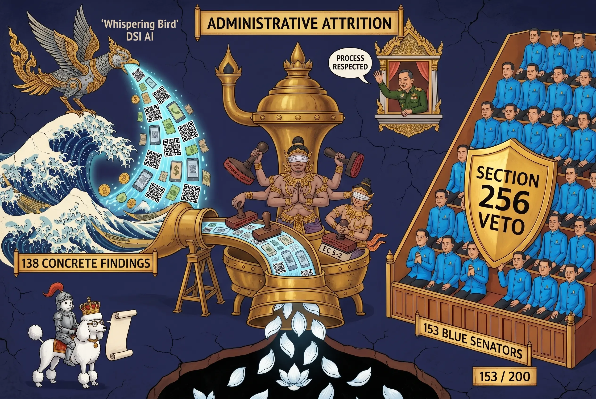

## 0061 – The DSI Senate Investigation 2024–2026: Forensic AI, the 153 Blue Senators, and Administrative Closure under Bhumjaithai
**How a money‑laundering probe with 1,200 suspects, forensic AI on 12,000 transactions and 20,000 phone records, and concrete findings against 138 sitting senators was processed into administrative quiet between September 2025 and May 2026**

---

## 1. Programmatic note

On 26 May 2026, a bloc of 89 senators issued a three‑day ultimatum to opposition leader Natthaphong Ruengpanyawut, demanding apology for his characterisation of the chamber as a "blue Senate" rooted in the 2017 Constitution. The Bangkok Post coverage, [0060 §5](0060-thai-help-thai-plus-constitutional-architecture.md), and the broader Observatory framework all treat the episode as a discrete constitutional dispute. This note reconstructs the **factual substrate beneath it** — the Department of Special Investigation (DSI) probe of the 2024 Senate election, its forensic foundation, and its administrative neutralisation under the Bhumjaithai‑led government from September 2025 onwards.

The thesis is structural, not partisan: between March 2025 and May 2026, a state forensic apparatus, using artificial intelligence on transaction and communications data, produced concrete findings against 138 of the 200 sitting senators. Those findings were then dismantled, not by judicial refutation, but by **administrative attrition** — committee re‑votes, ministerial reassignment, working‑group interposition, and a final EC sub‑committee decision to clear all 229 named suspects. The chamber whose composition the forensic record placed under investigation now functions as the constitutional veto‑holder under Section 256, with **three times the threshold needed** to block constitutional amendment.

This is not an isolated case of institutional dysfunction. It is the empirical complement to the constitutional fracture lines audited in [0014](0014-constitutional-mechanics-I.md), [0017](0017-the-jurisprudence-of-prevention.md), [0024](0024-politically-functional-law-and-technocratic-framing.md), [0030](0030-isoc-the-architecture-of-the-infiltrated-society.md), [0034](0034-isoc-budgetary-exceptionalism-and-security-finance.md), and [0060](0060-thai-help-thai-plus-constitutional-architecture.md). It documents, in compressed form, the mechanism by which forensic evidence is converted into political non‑evidence by institutional sequence.

---

## 2. The Senate as a constitutional construct

**Content analysis**

The 2017 Constitution establishes two distinct Senate regimes, separated by the transitional provision of Section 269:

- **2019–2024 (Section 269):** 250 senators **directly appointed** by the National Council for Peace and Order (NCPO) — the military junta that had ruled Thailand since the 2014 coup. The transitional provision explicitly removed any democratic mandate from the chamber for its first five years.
- **From 2024 (Section 107):** 200 senators selected via an **intra‑professional cooptation mechanism**: candidates are grouped into 20 professional categories; categories vote internally and across categories through multiple rounds at *amphoe*, provincial, and national levels. Direct popular election is excluded by constitutional design.

**Legal/constitutional analysis**

The Section 107 mechanism was designed, in the 2017 drafters' framing, to "depoliticise" the upper chamber by removing it from party competition. The actual operational effect is the opposite: a multi‑round closed cooptation system creates the optimal architecture for **coordinated voting blocs** — small enough at each level to be controllable, large enough nationally to produce a stable majority, and opaque enough in its intermediate stages to defeat post‑hoc audit by conventional means.

**Tension**

The provision was already criticised before its first application. The 2024 election operationalised the criticism — not in theory, but in 200 individual results that, in aggregate, mapped 1:1 onto a single political affiliation.

---

## 3. The 2024 election outcome — quantitative composition

**Content analysis**

Of the 200 senators selected through the Section 107 mechanism in 2024:

| Group | Count | Share | Affiliation |
|---|---|---|---|
| **"Blue Senators"** | **153** | **76.5 %** | Bhumjaithai‑affiliated |
| "New Breed Senators" | 19 | 9.5 % | liberal / progressive camps |
| Unaffiliated | 28 | 14.0 % | declared independent |

These figures are documented in the [Wikipedia entry on the 2024 Thai Senate election scandal](https://en.wikipedia.org/wiki/2024_Thai_Senate_election_scandal), drawing on Thai parliamentary records.

**Legal/constitutional analysis**

Section 256 of the 2017 Constitution requires support from one‑third of the Senate for any constitutional amendment to pass — i.e. **67 senators**. The Bhumjaithai‑affiliated bloc holds 153, which is **2.28 times** the veto threshold. Any amendment opposed by the bloc is structurally impossible regardless of House majority. The chamber whose composition is at issue in the DSI probe is also the chamber whose consent is required to repair the very constitutional mechanism that produced it.

**Tension**

A 76.5 % single‑party affiliation in a body designed by Section 107 to be "non‑partisan" is, on its face, a falsification of the section's drafting premise. Either Section 107 functions as intended and the 76.5 % figure is improbable to the point of statistical implausibility; or the figure is accurate and Section 107 has not functioned as intended. The DSI investigation addresses the second hypothesis with forensic tools.

---

## 4. The DSI investigation — forensic AI on transaction and communications data

**Content analysis**

The Department of Special Investigation (DSI), under Thailand's Ministry of Justice, announced on **6 March 2025** that it would investigate "unlawful gatherings and related money laundering" tied to the 2024 Senate election. The probe was led, organisationally, by Deputy Prime Minister Phumtham Wechayachai (acting on Justice Ministry oversight) and Justice Minister Pol Col Tawee Sodsong.

On **14 May 2025**, the DSI publicly confirmed the operational scope of the probe:

| Forensic dimension | Value |
|---|---|
| Total suspects under investigation | **~1,200** |
| Financial transactions analysed | ~12,000 |
| Phone records analysed | ~20,000 |
| Geographic footprint of money trail | 45 provinces |
| Estimated value of suspected vote‑fixing flows | ~300 million baht |
| Sitting senators with "concrete findings" of coordinated party influence | **138** |
| Total suspects in formal charge group | **229** (138 senators + 91 Bhumjaithai officials, members, associates) |

The forensic methodology relied on AI analysis of CCTV, voting patterns, and the integrated transaction/communications dataset — a methodology that, according to the [East Asia Forum analysis (July 2025)](https://eastasiaforum.org/2025/07/31/thailand-shows-how-ai-might-expose-political-misconduct/), revealed "evidence of collusion that traditional methods may have missed". The investigation's substantive finding was that coordinated vote lists had been distributed and that the actual winners matched those lists with statistical precision incompatible with independent voting.

**Legal/constitutional analysis**

The DSI's mandate under the Special Case Investigation Act 2004 includes money laundering, organised crime, and offences against state security and economic stability. The 2024 Senate probe was lodged under the money‑laundering and "criminal association" sub‑mandates. The investigation was, on its forensic foundation, a textbook special‑case file — large enough in scope, technical enough in methodology, and political enough in target to require precisely the institutional independence the DSI is constitutionally and statutorily granted.

**Tension**

The forensic record produced by the probe is not, in the standard sense, "alleged". It is *documented* — by the DSI's own published methodology and by the institutional confirmations of the EC, DPM, and Justice Minister. The subsequent administrative trajectory does not contest the data; it processes the data into political quiet without contradiction.

---

## 5. The pre‑Anutin trajectory — May to September 2025

**Content analysis**

Four institutional decisions in the four months before Anutin's elevation as PM established the contours of the case:

- **6 March 2025:** DSI announces probe.
- **May 2025:** Special Cases Board (18 members, chaired by DPM Phumtham) votes **11–4 with 3 abstentions** to investigate "money laundering" but **decline** to formally pursue "criminal association" — the first administrative narrowing of the case. This was already a partial disengagement at the Special Cases Board level.
- **May 2025:** EC issues summonses to 6 of 53 senators (Bangkok representatives) for vote‑rigging questioning.
- **Mid‑2025:** Constitutional Court accepts senators' petition against Phumtham and Tawee, alleging DSI misuse for politically motivated criminal probes. The Court **suspends Tawee from DSI oversight** pending ruling. The DSI publicly states the suspension will not derail the probe, and continues the investigation under deputy oversight.

**Legal/constitutional analysis**

The May 2025 Special Cases Board narrowing is the first institutional event in which the **scope** of the probe was reduced. The board did not reject the forensic findings; it limited which provisions of law would be applied to them. This is the doctrinal type captured in [0024 – Politically Functional Law & Technocratic Framing](0024-politically-functional-law-and-technocratic-framing.md): a politically functional act expressed in technocratic procedure.

The Constitutional Court's suspension of Tawee, on senators' petition, is the second institutional event — and a doctrinally striking one: the **subjects of the investigation** (sitting senators) successfully obtained an order suspending the ministerial oversight of the investigation against themselves. Whatever its formal legal merits, the procedural result is that the investigated body achieved partial administrative neutralisation of its own investigator.

**Tension**

By August 2025, the investigation was already in a posture of institutional containment but had not yet been substantively closed. The DSI continued operations; reserve senators (those who would have won seats absent the alleged collusion) were preparing further petitions. The forensic foundation remained intact.

---

## 6. The Anutin effect — September 2025 onwards

**Content analysis**

On **5 September 2025**, Anutin Charnvirakul — leader of Bhumjaithai — was elevated by the National Assembly to the office of Prime Minister, with Confidence and Supply support from the People's Party under explicit conditions including constitutional reform. The same Bhumjaithai‑led government took control of the Ministry of Justice.

Within five weeks, the institutional posture toward the probe inverted:

- **5 October 2025:** the newly appointed Justice Minister forms a "working group" tasked with overseeing sensitive cases — explicitly including the 2024 Senate election probe and the long‑running Khao Kradong land dispute. Veteran Thai politics commentator Chuwit Kamolvisit publicly raises the alarm that the working group functions as an interposition mechanism between the Justice Minister and the DSI's operational autonomy ([Thai Examiner, 5 October 2025](https://www.thaiexaminer.com/thai-news-foreigners/2025/10/05/chuwit-raises-the-alarm-over-a-working-group-into-sensitive-cases-set-up-by-the-new-justice-minister/)).

- **Anutin's public posture:** PM Anutin states that he will "supervise DSI on Khao Kradong and Senate collusion cases to ensure fairness" ([Nation Thailand, 40055041](https://www.nationthailand.com/news/politics/40055041)). The framing converts the DSI's statutory operational independence into a relationship of prime‑ministerial supervision over a politically sensitive file.

- **Bhumjaithai officials' statements:** Anutin dismisses claims that the DSI's narrowing of scope (the May 2025 11–4 vote on criminal association) was linked to a meeting between Bhumjaithai founder Newin Chidchob and former PM Thaksin Shinawatra. The framing of the dismissal itself confirms that the linkage was being publicly raised.

**Legal/constitutional analysis**

The working group structure does not formally violate statutory DSI independence; it operates by re‑routing decisional flow through an intermediate body whose composition and mandate are determined by the Justice Minister. This is the precise pattern documented in [0034 – Budgetary Exceptionalism and Security Finance](0034-isoc-budgetary-exceptionalism-and-security-finance.md): institutional neutralisation expressed through procedural restructuring rather than legal abrogation.

The Bangkok Post's later summary captures the operational consequence in a single sentence: *"Since Bhumjaithai assumed control of the government in September last year, there has been little news of progress in the cases."*

**Tension**

Between September 2025 and May 2026, no formal decision was published that withdrew the DSI's forensic findings, refuted the AI methodology, or exonerated the 138 sitting senators on the merits of the evidence. The transition from active investigation to "little news of progress" occurred through the absence of institutional action, not through its presence.

---

## 7. The EC clearing — May 2026

**Content analysis**

In May 2026 — the month in which the broader Thai Help Thai Plus emergency decree was issued (cf. [0060](0060-thai-help-thai-plus-constitutional-architecture.md)) — the Election Commission's sub‑committee held its decisive vote on the 229‑suspect file:

- **EC sub‑committee vote: 5–2** to reject the findings of the earlier inquiry that had named 138 sitting senators and 91 Bhumjaithai‑affiliated others as suspects of collusion in the 2024 Senate selection ([Bangkok Post, 3216229](https://www.bangkokpost.com/thailand/politics/3216229/ec-panel-clears-all-229-suspects-in-senate-collusion-case)).
- Effect: **all 229 suspects cleared** at the sub‑committee stage. The case file then proceeds to the full seven‑member EC board, which has 90 days to confirm closure or remand.
- **Court clears Phumtham and Tawee** in the parallel proceeding alleging their improper use of the DSI ([Bangkok Post, 3180274](https://www.bangkokpost.com/thailand/general/3180274/court-clears-phumtham-tawee-in-senate-election-case)). The clearance of the original investigators completes the symmetrical institutional inversion: the investigators are exonerated; the investigated are cleared.

**Legal/constitutional analysis**

The May 2026 EC vote does not address the forensic methodology, the 12,000 transactions, the 20,000 phone records, or the AI‑identified coordination pattern. It exists at a different doctrinal layer: not "is the forensic evidence credible?" but "is the *case* viable under EC procedural standards?". The two questions are formally distinct; the operational consequence is identical.

Reserve senators — candidates who would have received Senate seats absent the alleged collusion — publicly call for action on what the Bangkok Post explicitly labels **"stalled vote‑rigging probes"** ([Bangkok Post, 3185939](https://www.bangkokpost.com/thailand/politics/3185939/reserve-senators-call-for-action-on-stalled-voterigging-probes)). Their petitions are absorbed into the same administrative slowness that has characterised the file since September 2025.

**Tension**

The forensic record produced in May 2025 (1,200 suspects, AI on 12,000 transactions and 20,000 phone records, 138 sitting senators with concrete findings, ~300 million baht trail across 45 provinces) is, formally, **neither refuted nor retained**. It is left to age in the administrative gap between the institution that produced it (DSI) and the institutions that have declined to act on it (EC sub‑committee, Justice Ministry working group, Constitutional Court in the parallel investigator‑clearance proceeding).

---

## 8. The 26 May 2026 backlash — institutional self‑defence as confirmation

**Content analysis**

Against this backdrop, the 26 May 2026 ultimatum of 89 senators against opposition leader Natthaphong's "blue Senate" characterisation is not an isolated dispute. It is the **acoustic signature** of the chamber whose existence is documented by the DSI forensic record:

- The 89 senators are a subset of the 153 Bhumjaithai‑affiliated members.
- The 153 are a subset of the 200 total senators selected through the Section 107 mechanism.
- The 138 sitting senators with concrete DSI findings are a subset of the 200 — with a high probability of overlap with the 89 signatories of the ultimatum, given baseline distributional logic.
- The defamation threat targets a description ("blue Senate") whose factual content is established by Wikipedia, Thai parliamentary records, and the DSI forensic file — *not* a contested opinion.

**Legal/constitutional analysis**

The Thai law of criminal defamation (Penal Code Sections 326–328) requires that the statement at issue be (a) defamatory and (b) untrue. A statement whose truth is established by independent forensic documentation cannot, by ordinary doctrinal standards, satisfy criterion (b). The defamation threat therefore functions not as a credible legal claim but as a **disciplinary signal** — the pattern documented in [0019 – Discursive Filtering: The Architecture of Permissible Speech](0019-the-architecture-of-permissible-speech-2021-2026.md) and [0020 – The Chilling Effect on Parliamentary Procedure](0020-the-chilling-effect-on-parliamentary-procedure.md).

**Tension**

The 89‑senator ultimatum is the loudest possible institutional confirmation of Natthaphong's structural claim. A bloc that wished to dispute the characterisation could refute the underlying numbers, address the DSI findings, engage the EC sub‑committee record. The bloc instead demands an apology within three days for a statement of fact.

---

## 9. The compressed mechanism — institutional sequence as evidence dissolver

**Content analysis — what happened, in compressed form**

| Date | Institutional act | Effect on forensic record |
|---|---|---|
| 6 March 2025 | DSI opens probe | Record begins |
| 14 May 2025 | DSI confirms scope: 1,200 suspects, AI forensics, 138 senators | Record at maximum |
| May 2025 | Special Cases Board 11–4: money laundering yes, criminal association no | First narrowing |
| Mid‑2025 | Constitutional Court suspends Justice Minister Tawee on senators' petition | Investigator partially neutralised |
| 5 September 2025 | Anutin elevated as PM; Bhumjaithai takes the Ministry of Justice | Oversight structure inverts |
| 5 October 2025 | New Justice Minister installs "working group" for sensitive cases | DSI operational autonomy mediated |
| Sept 2025 – May 2026 | "Little news of progress" (Bangkok Post phrasing) | Record stops being acted on |
| May 2026 | Court clears Phumtham and Tawee | Investigators exonerated |
| May 2026 | EC sub‑committee 5–2: all 229 cleared | Suspects exonerated |
| 26 May 2026 | 89 senators threaten defamation against critic | Public reassertion of cleared status |

**Doctrinal type**

This is not corruption in the conventional sense — there is no documented bribe, no leaked memo, no smoking gun. It is **institutional sequence as evidence dissolver**: a series of formally lawful procedural acts, each defensible in isolation, whose aggregate effect is the conversion of forensic data into administrative silence. The doctrinal template is the same as the [0017 – Jurisprudence of Prevention](0017-the-jurisprudence-of-prevention.md): outcome by structure, not by argument.

---

## 10. Implications for the Observatory framework

The DSI Senate case sits at the convergence of five patterns already mapped by the Observatory:

- **Constitutional functionality** ([0014](0014-constitutional-mechanics-I.md), [0024](0024-politically-functional-law-and-technocratic-framing.md)): Section 107 functions as designed only if "designed" includes the production of a chamber that maps 1:1 onto a single party. The forensic record suggests this is the operative function, not a deviation from it.
- **Politically functional law** ([0024](0024-politically-functional-law-and-technocratic-framing.md)): the Special Cases Board 11–4 vote, the EC sub‑committee 5–2 vote, and the working‑group interposition are technocratic acts that perform political functions. Each is procedurally clean; the chain delivers the political outcome.
- **Budgetary and institutional exceptionalism** ([0034](0034-isoc-budgetary-exceptionalism-and-security-finance.md)): the working‑group structure under the new Justice Minister mirrors the budgetary‑exceptionalism pattern of the security sector — institutional autonomy is preserved on paper, neutralised in practice.
- **Infiltrated society** ([0030](0030-isoc-the-architecture-of-the-infiltrated-society.md)): the 76.5 %‑Bhumjaithai composition of the Senate is the upper‑chamber expression of the same coordinated‑institutional pattern that ISOC executes in the security and administrative domains.
- **Thai Help Thai Plus convergence** ([0060](0060-thai-help-thai-plus-constitutional-architecture.md)): the same Bhumjaithai government that benefits from the DSI investigation's neutralisation is, in the same month, issuing the 400‑bn‑baht emergency decree for an electorally promised co‑payment programme. The two operations share both political beneficiary and institutional pattern.

The DSI Senate case is therefore not a separate scandal that happens to coincide with Thai Help Thai Plus. It is the **institutional environment** in which Thai Help Thai Plus becomes administratively possible — a Senate cleared of charges holds the Section 256 veto over the constitutional reform that would otherwise constrain the executive's emergency‑decree practice.

---

## 11. What remains documented, regardless of administrative closure

The administrative trajectory after September 2025 has neutralised the institutional consequences of the DSI investigation. It has not erased the underlying record:

- The DSI forensic methodology and dataset (12,000 transactions, 20,000 phone records, 45 provinces) remains internally documented at the agency.
- The Wikipedia article on the 2024 Senate election scandal compiles the public‑record evidence with citations to Thai parliamentary, EC, and DSI sources.
- The Bangkok Post, Thai Examiner, Nation Thailand, Thairath, Thai PBS, and East Asia Forum coverage between March 2025 and May 2026 collectively constitutes a parallel public record that cannot be retroactively closed.
- The reserve senators' ongoing petitions establish a continuing institutional claimant.

For the Observatory framework, this means the forensic record functions as a **dormant evidentiary substrate**: not currently productive of administrative consequence, but available for future doctrinal reactivation should institutional conditions change. The closure under Bhumjaithai is, in this analytical reading, *not* a historical ending but an interruption in an ongoing record.

---

## 12. Sources

- Wikipedia — *2024 Thai Senate election scandal*: https://en.wikipedia.org/wiki/2024_Thai_Senate_election_scandal
- Wikipedia — *2024 Thai Senate election*: https://en.wikipedia.org/wiki/2024_Thai_Senate_election
- Bangkok Post — *Department of Special Investigation to limit Senate probe*: https://www.bangkokpost.com/thailand/general/2974616/department-of-special-investigation-to-limit-senate-probe
- Bangkok Post — *DSI skips deep probe*: https://www.bangkokpost.com/opinion/opinion/2974781/dsi-skips-deep-probe
- Bangkok Post — *BJT‑friendly Senate sits pretty, for now*: https://www.bangkokpost.com/opinion/opinion/2975536/bjt-friendly-senate-sits-pretty-for-now
- Bangkok Post — *Senate election: DSI postpones decision on poll probe*: https://www.bangkokpost.com/thailand/politics/2967873/dsi-postpones-decision-on-senate-poll-probe
- Bangkok Post — *Thailand's Senate split over DSI election probe*: https://www.bangkokpost.com/thailand/politics/2966441/thailands-senate-split-over-dsi-election-probe
- Bangkok Post — *Justice minister defends Senate election probe*: https://www.bangkokpost.com/thailand/politics/2968641/justice-minister-defends-senate-election-probe
- Bangkok Post — *Court orders justice minister to step back from DSI*: https://www.bangkokpost.com/thailand/politics/3025567/court-orders-justice-minister-to-step-back-from-dsi
- Bangkok Post — *DSI: Minister's absence won't derail Senate probe*: https://www.bangkokpost.com/thailand/general/3026416/dsi-ministers-absence-wont-derail-senate-probe
- Bangkok Post — *NACC to probe justice minister, DSI chief*: https://www.bangkokpost.com/thailand/general/3058892/nacc-to-probe-justice-minister-dsi-chief
- Bangkok Post — *229 targeted in Senate vote‑rigging case*: https://www.bangkokpost.com/thailand/politics/3070946/229-targeted-in-senate-vote-rigging-case
- Bangkok Post — *'60 senators' to face vote‑fixing charges*: https://www.bangkokpost.com/thailand/politics/3020041/60-senators-to-face-vote-fixing-charges
- Bangkok Post — *Senators urge PP to probe Anutin over collusion case*: https://www.bangkokpost.com/thailand/politics/3105749/senators-urge-pp-to-probe-anutin-over-collusion-case
- Bangkok Post — *Senate taken to task over 'ethics' vote*: https://www.bangkokpost.com/thailand/politics/3128885/senate-taken-to-task-over-ethics-vote
- Bangkok Post — *Court clears Phumtham, Tawee in Senate collusion case*: https://www.bangkokpost.com/thailand/general/3180274/court-clears-phumtham-tawee-in-senate-election-case
- Bangkok Post — *Reserve senators call for action on stalled vote‑rigging probes*: https://www.bangkokpost.com/thailand/politics/3185939/reserve-senators-call-for-action-on-stalled-voterigging-probes
- Bangkok Post — *EC panel clears all 229 suspects in Senate collusion case*: https://www.bangkokpost.com/thailand/politics/3216229/ec-panel-clears-all-229-suspects-in-senate-collusion-case
- Bangkok Post — *People's Party leader blasted over 'blue regime' remark* (26 May 2026): https://www.bangkokpost.com/thailand/politics/3260879/peoples-party-leader-blasted-over-blue-regime-remark
- Thai Examiner — *Senators are up in arms about DSI probe into the 2024 election* (21 Feb 2025): https://www.thaiexaminer.com/thai-news-foreigners/2025/02/21/senators-are-up-in-arms-about-department-of-special-investigation-dsi-probe-into-the-2024-election/
- Thai Examiner — *New DSI evidence sees EC open investigation into 2024 Senate election suspicions* (21 Mar 2025): https://www.thaiexaminer.com/thai-news-foreigners/2025/03/21/new-dsi-evidence-sees-election-commission-open-new-investigation-into-2024-senate-election-suspicions/
- Thai Examiner — *2024 Senate election enquiries into collusion are a problem for new Prime Minister Anutin Charnvirakul* (12 Sept 2025): https://www.thaiexaminer.com/thai-news-foreigners/2025/09/12/2024-senate-election-enquiries-into-collusion-are-a-problem-for-new-prime-minister-anutin-charnvirakul/
- Thai Examiner — *Chuwit raises the alarm over a 'working group' into sensitive cases set up by the new Justice Minister* (5 Oct 2025): https://www.thaiexaminer.com/thai-news-foreigners/2025/10/05/chuwit-raises-the-alarm-over-a-working-group-into-sensitive-cases-set-up-by-the-new-justice-minister/
- Thai Examiner — *Senate minority cohort call for the suspension of colleagues under investigation until they are cleared* (7 Aug 2025): https://www.thaiexaminer.com/thai-news-foreigners/2025/08/07/senate-minority-cohort-call-for-the-suspension-of-colleagues-under-investigation-until-they-are-cleared/
- Nation Thailand — *EC confirms charges against 53 senators for alleged voting collusion*: https://www.nationthailand.com/news/politics/40049966
- Nation Thailand — *DSI to summon 1,200 Senate election candidates and witnesses in collusion case*: https://www.nationthailand.com/news/politics/40054078
- Nation Thailand — *Senate vote collusion scandal sparks legal battle amid political rift*: https://www.nationthailand.com/news/politics/40050243
- Nation Thailand — *Constitutional Court orders Tawee to step aside amid allegations of DSI abuse*: https://www.nationthailand.com/blogs/news/politics/40049973
- Nation Thailand — *Anutin vows to supervise DSI on Khao Kradong and Senate collusion cases to ensure fairness*: https://www.nationthailand.com/news/politics/40055041
- Nation Thailand — *Revealed: "Senate election collusion" paid 5K–100K, Bonus for exceeding target*: https://www.nationthailand.com/news/politics/40046574
- Thai Enquirer — *DSI Uncovers Money Trail in 2024 Senate Vote‑Rigging Case Linked to Bhumjaithai Party*: https://www.thaienquirer.com/54526/dsi-senate-vote-rigging-money-trail-bhumjaithai/
- Thai.news — *Phumtham Wechayachai and DSI's High‑Stakes Probe: Unraveling the 2024 Thai Senate Election Scandal*: https://thai.news/news/thailand/phumtham-wechayachai-and-dsis-high-stakes-probe-unraveling-the-2024-thai-senate-election-scandal
- Thai.news — *Justice Minister Tawee Sodsong Suspended Amid 2024 Senate Election Probe*: https://thai.news/news/thailand/justice-minister-tawee-sodsong-suspended-amid-2024-senate-election-probe
- East Asia Forum — *Thailand shows how AI might expose political misconduct* (31 July 2025): https://eastasiaforum.org/2025/07/31/thailand-shows-how-ai-might-expose-political-misconduct/
- Pattaya Mail — *Constitutional Court orders Justice Minister Tawee suspended from overseeing DSI amid senate vote interference probe*: https://www.pattayamail.com/thailandnews/constitutional-court-orders-justice-minister-tawee-suspended-from-overseeing-dsi-amid-senate-vote-interference-probe-500806
- Department of Special Investigation (DSI), Ministry of Justice — institutional profile: https://www.dsi.go.th/en/Detail/2fdb9f4e475ed017a560d4de9c5da454
- Thai Constitution, B.E. 2560 (2017), unofficial translation by the Office of the Council of State — primary source for Sections 107, 256, 269. Mirror: https://www.constituteproject.org/constitution/Thailand_2017?lang=en
- *Political Prisoners in Thailand* (blog) — *All those senate twists* (21 May 2025): https://thaipoliticalprisoners.wordpress.com/2025/05/21/all-those-senate-twists/

---

*Filed under: constitutional mechanics; institutional sequence; forensic AI as state instrument; administrative closure of investigation; Senate composition 2024–2029.*
*Cross‑references: [0011](0011-bangkok-post-comment-ecology.md), [0013](0013-section-49.md), [0014](0014-constitutional-mechanics-I.md), [0016](0016-section-235.md), [0017](0017-the-jurisprudence-of-prevention.md), [0019](0019-the-architecture-of-permissible-speech-2021-2026.md), [0020](0020-the-chilling-effect-on-parliamentary-procedure.md), [0023](0023-system-map-constitutional-mechanics-thailand-2021-2026.md), [0024](0024-politically-functional-law-and-technocratic-framing.md), [0027](0027-bangkok-post-discursive-Filtering-comment-section-2026.md), [0030](0030-isoc-the-architecture-of-the-infiltrated-society.md), [0034](0034-isoc-budgetary-exceptionalism-and-security-finance.md), [0053](0053-bangkok-post-institutional-discourse-distortion.md), [0060](0060-thai-help-thai-plus-constitutional-architecture.md).*

