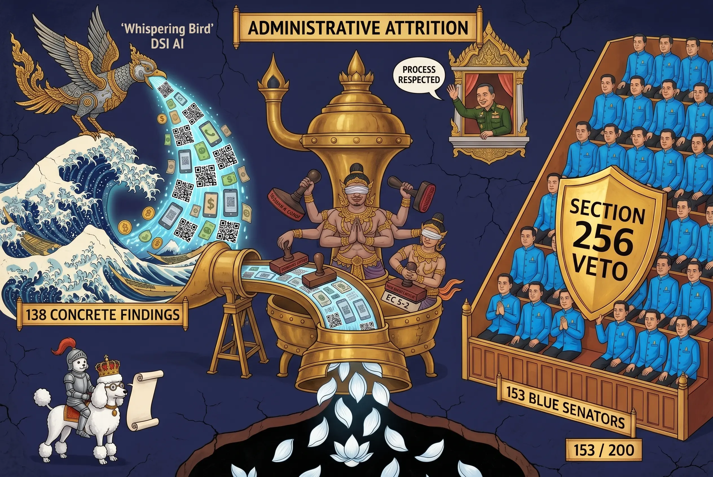

## 0061 – The DSI Senate Investigation 2024–2026: Forensic AI, the 153 Blue Senators, and Administrative Closure under Bhumjaithai
**How a money‑laundering probe with 1,200 suspects, forensic AI on 12,000 transactions and 20,000 phone records, and concrete findings against 138 sitting senators was processed into administrative quiet between September 2025 and May 2026**

*Last updated: 15 September 2026 (ICT)*

---

## 1. Programmatic note

On 26 May 2026, a bloc of 89 senators issued a three‑day ultimatum to opposition leader Natthaphong Ruengpanyawut, demanding apology for his characterisation of the chamber as a "blue Senate" rooted in the 2017 Constitution. The Bangkok Post coverage, [0060 §5](0060-thai-help-thai-plus-constitutional-architecture.md), and the broader Observatory framework all treat the episode as a discrete constitutional dispute. This note reconstructs the **factual substrate beneath it** — the Department of Special Investigation (DSI) probe of the 2024 Senate election, its forensic foundation, and its administrative neutralisation under the Bhumjaithai‑led government from September 2025 onwards.

The thesis is structural, not partisan: between March 2025 and May 2026, a state forensic apparatus, using artificial intelligence on transaction and communications data, produced concrete findings against 138 of the 200 sitting senators. Those findings were then dismantled, not by judicial refutation, but by **administrative attrition** — committee re‑votes, ministerial reassignment, working‑group interposition, and a final EC sub‑committee decision to clear all 229 named suspects. The chamber whose composition the forensic record placed under investigation now functions as the constitutional veto‑holder under Section 256, with **three times the threshold needed** to block constitutional amendment.

This is not an isolated case of institutional dysfunction. It is the empirical complement to the constitutional fracture lines audited in [0014](0014-constitutional-mechanics-I.md), [0017](0017-the-jurisprudence-of-prevention.md), [0024](0024-politically-functional-law-and-technocratic-framing.md), [0030](0030-isoc-the-architecture-of-the-infiltrated-society.md), [0034](0034-isoc-budgetary-exceptionalism-and-security-finance.md), and [0060](0060-thai-help-thai-plus-constitutional-architecture.md). It documents, in compressed form, the mechanism by which forensic evidence is converted into political non‑evidence by institutional sequence.

---

## 2. The Senate as a constitutional construct

**Content analysis**

The 2017 Constitution establishes two distinct Senate regimes, separated by the transitional provision of Section 269:

- **2019–2024 (Section 269):** 250 senators **directly appointed** by the National Council for Peace and Order (NCPO) — the military junta that had ruled Thailand since the 2014 coup. The transitional provision explicitly removed any democratic mandate from the chamber for its first five years.
- **From 2024 (Section 107):** 200 senators selected via an **intra‑professional cooptation mechanism**: candidates are grouped into 20 professional categories; categories vote internally and across categories through multiple rounds at *amphoe*, provincial, and national levels. Direct popular election is excluded by constitutional design.

**Legal/constitutional analysis**

The Section 107 mechanism was designed, in the 2017 drafters' framing, to "depoliticise" the upper chamber by removing it from party competition. The actual operational effect is the opposite: a multi‑round closed cooptation system creates the optimal architecture for **coordinated voting blocs** — small enough at each level to be controllable, large enough nationally to produce a stable majority, and opaque enough in its intermediate stages to defeat post‑hoc audit by conventional means.

**Tension**

The provision was already criticised before its first application. The 2024 election operationalised the criticism — not in theory, but in 200 individual results that, in aggregate, mapped 1:1 onto a single political affiliation.

---

## 3. The 2024 election outcome — quantitative composition

**Content analysis**

Of the 200 senators selected through the Section 107 mechanism in 2024:

| Group | Count | Share | Affiliation |
|---|---|---|---|
| **"Blue Senators"** | **153** | **76.5 %** | Bhumjaithai‑affiliated |
| "New Breed Senators" | 19 | 9.5 % | liberal / progressive camps |
| Unaffiliated | 28 | 14.0 % | declared independent |

These figures are documented in the [Wikipedia entry on the 2024 Thai Senate election scandal](https://en.wikipedia.org/wiki/2024_Thai_Senate_election_scandal), drawing on Thai parliamentary records.

**Legal/constitutional analysis**

Section 256 of the 2017 Constitution requires support from one‑third of the Senate for any constitutional amendment to pass — i.e. **67 senators**. The Bhumjaithai‑affiliated bloc holds 153, which is **2.28 times** the veto threshold. Any amendment opposed by the bloc is structurally impossible regardless of House majority. The chamber whose composition is at issue in the DSI probe is also the chamber whose consent is required to repair the very constitutional mechanism that produced it.

**Tension**

A 76.5 % single‑party affiliation in a body designed by Section 107 to be "non‑partisan" is, on its face, a falsification of the section's drafting premise. Either Section 107 functions as intended and the 76.5 % figure is improbable to the point of statistical implausibility; or the figure is accurate and Section 107 has not functioned as intended. The DSI investigation addresses the second hypothesis with forensic tools.

---

## 4. The DSI investigation — forensic AI on transaction and communications data

**Content analysis**

The Department of Special Investigation (DSI), under Thailand's Ministry of Justice, announced on **6 March 2025** that it would investigate "unlawful gatherings and related money laundering" tied to the 2024 Senate election. The probe was led, organisationally, by Deputy Prime Minister Phumtham Wechayachai (acting on Justice Ministry oversight) and Justice Minister Pol Col Tawee Sodsong.

On **14 May 2025**, the DSI publicly confirmed the operational scope of the probe:

| Forensic dimension | Value |
|---|---|
| Total suspects under investigation | **~1,200** |
| Financial transactions analysed | ~12,000 |
| Phone records analysed | ~20,000 |
| Geographic footprint of money trail | 45 provinces |
| Estimated value of suspected vote‑fixing flows | ~300 million baht |
| Sitting senators with "concrete findings" of coordinated party influence | **138** |
| Total suspects in formal charge group | **229** (138 senators + 91 Bhumjaithai officials, members, associates) |

The forensic methodology relied on AI analysis of CCTV, voting patterns, and the integrated transaction/communications dataset — a methodology that, according to the [East Asia Forum analysis (July 2025)](https://eastasiaforum.org/2025/07/31/thailand-shows-how-ai-might-expose-political-misconduct/), revealed "evidence of collusion that traditional methods may have missed". The investigation's substantive finding was that coordinated vote lists had been distributed and that the actual winners matched those lists with statistical precision incompatible with independent voting.

**Legal/constitutional analysis**

The DSI's mandate under the Special Case Investigation Act 2004 includes money laundering, organised crime, and offences against state security and economic stability. The 2024 Senate probe was lodged under the money‑laundering and "criminal association" sub‑mandates. The investigation was, on its forensic foundation, a textbook special‑case file — large enough in scope, technical enough in methodology, and political enough in target to require precisely the institutional independence the DSI is constitutionally and statutorily granted.

**Tension**

The forensic record produced by the probe is not, in the standard sense, "alleged". It is *documented* — by the DSI's own published methodology and by the institutional confirmations of the EC, DPM, and Justice Minister. The subsequent administrative trajectory does not contest the data; it processes the data into political quiet without contradiction.

---

## 5. The pre‑Anutin trajectory — May to September 2025

**Content analysis**

Four institutional decisions in the four months before Anutin's elevation as PM established the contours of the case:

- **6 March 2025:** DSI announces probe.
- **May 2025:** Special Cases Board (18 members, chaired by DPM Phumtham) votes **11–4 with 3 abstentions** to investigate "money laundering" but **decline** to formally pursue "criminal association" — the first administrative narrowing of the case. This was already a partial disengagement at the Special Cases Board level.
- **May 2025:** EC issues summonses to 6 of 53 senators (Bangkok representatives) for vote‑rigging questioning.
- **Mid‑2025:** Constitutional Court accepts senators' petition against Phumtham and Tawee, alleging DSI misuse for politically motivated criminal probes. The Court **suspends Tawee from DSI oversight** pending ruling. The DSI publicly states the suspension will not derail the probe, and continues the investigation under deputy oversight.

**Legal/constitutional analysis**

The May 2025 Special Cases Board narrowing is the first institutional event in which the **scope** of the probe was reduced. The board did not reject the forensic findings; it limited which provisions of law would be applied to them. This is the doctrinal type captured in [0024 – Politically Functional Law & Technocratic Framing](0024-politically-functional-law-and-technocratic-framing.md): a politically functional act expressed in technocratic procedure.

The Constitutional Court's suspension of Tawee, on senators' petition, is the second institutional event — and a doctrinally striking one: the **subjects of the investigation** (sitting senators) successfully obtained an order suspending the ministerial oversight of the investigation against themselves. Whatever its formal legal merits, the procedural result is that the investigated body achieved partial administrative neutralisation of its own investigator.

**Tension**

By August 2025, the investigation was already in a posture of institutional containment but had not yet been substantively closed. The DSI continued operations; reserve senators (those who would have won seats absent the alleged collusion) were preparing further petitions. The forensic foundation remained intact.

---

## 6. The Anutin effect — September 2025 onwards

**Content analysis**

On **5 September 2025**, Anutin Charnvirakul — leader of Bhumjaithai — was elevated by the National Assembly to the office of Prime Minister, with Confidence and Supply support from the People's Party under explicit conditions including constitutional reform. The same Bhumjaithai‑led government took control of the Ministry of Justice.

Within five weeks, the institutional posture toward the probe inverted:

- **5 October 2025:** the newly appointed Justice Minister forms a "working group" tasked with overseeing sensitive cases — explicitly including the 2024 Senate election probe and the long‑running Khao Kradong land dispute. Veteran Thai politics commentator Chuwit Kamolvisit publicly raises the alarm that the working group functions as an interposition mechanism between the Justice Minister and the DSI's operational autonomy ([Thai Examiner, 5 October 2025](https://www.thaiexaminer.com/thai-news-foreigners/2025/10/05/chuwit-raises-the-alarm-over-a-working-group-into-sensitive-cases-set-up-by-the-new-justice-minister/)).

- **Anutin's public posture:** PM Anutin states that he will "supervise DSI on Khao Kradong and Senate collusion cases to ensure fairness" ([Nation Thailand, 40055041](https://www.nationthailand.com/news/politics/40055041)). The framing converts the DSI's statutory operational independence into a relationship of prime‑ministerial supervision over a politically sensitive file.

- **Bhumjaithai officials' statements:** Anutin dismisses claims that the DSI's narrowing of scope (the May 2025 11–4 vote on criminal association) was linked to a meeting between Bhumjaithai founder Newin Chidchob and former PM Thaksin Shinawatra. The framing of the dismissal itself confirms that the linkage was being publicly raised.

**Legal/constitutional analysis**

The working group structure does not formally violate statutory DSI independence; it operates by re‑routing decisional flow through an intermediate body whose composition and mandate are determined by the Justice Minister. This is the precise pattern documented in [0034 – Budgetary Exceptionalism and Security Finance](0034-isoc-budgetary-exceptionalism-and-security-finance.md): institutional neutralisation expressed through procedural restructuring rather than legal abrogation.

The Bangkok Post's later summary captures the operational consequence in a single sentence: *"Since Bhumjaithai assumed control of the government in September last year, there has been little news of progress in the cases."*

**Tension**

Between September 2025 and May 2026, no formal decision was published that withdrew the DSI's forensic findings, refuted the AI methodology, or exonerated the 138 sitting senators on the merits of the evidence. The transition from active investigation to "little news of progress" occurred through the absence of institutional action, not through its presence.

---

## 7. The EC clearing — March 2026 (corrected; see §17.2)

**Content analysis**

On 12 March 2026 — this note previously dated it to May 2026, see §17.2 — and in the year in which the broader Thai Help Thai Plus emergency decree was issued (cf. [0060](0060-thai-help-thai-plus-constitutional-architecture.md)) — the Election Commission's sub‑committee held its decisive vote on the 229‑suspect file:

- **EC sub‑committee vote: 5–2** to reject the findings of the earlier inquiry that had named 138 sitting senators and 91 Bhumjaithai‑affiliated others as suspects of collusion in the 2024 Senate selection ([Bangkok Post, 3216229](https://www.bangkokpost.com/thailand/politics/3216229/ec-panel-clears-all-229-suspects-in-senate-collusion-case)).
- Effect: **all 229 suspects cleared** at the sub‑committee stage. The case file then proceeds to the full seven‑member EC board, which has 90 days to confirm closure or remand.
- **Court clears Phumtham and Tawee** in the parallel proceeding alleging their improper use of the DSI ([Bangkok Post, 3180274](https://www.bangkokpost.com/thailand/general/3180274/court-clears-phumtham-tawee-in-senate-election-case)). The clearance of the original investigators completes the symmetrical institutional inversion: the investigators are exonerated; the investigated are cleared.

**Legal/constitutional analysis**

The May 2026 EC vote does not address the forensic methodology, the 12,000 transactions, the 20,000 phone records, or the AI‑identified coordination pattern. It exists at a different doctrinal layer: not "is the forensic evidence credible?" but "is the *case* viable under EC procedural standards?". The two questions are formally distinct; the operational consequence is identical.

Reserve senators — candidates who would have received Senate seats absent the alleged collusion — publicly call for action on what the Bangkok Post explicitly labels **"stalled vote‑rigging probes"** ([Bangkok Post, 3185939](https://www.bangkokpost.com/thailand/politics/3185939/reserve-senators-call-for-action-on-stalled-voterigging-probes)). Their petitions are absorbed into the same administrative slowness that has characterised the file since September 2025.

**Tension**

The forensic record produced in May 2025 (1,200 suspects, AI on 12,000 transactions and 20,000 phone records, 138 sitting senators with concrete findings, ~300 million baht trail across 45 provinces) is, formally, **neither refuted nor retained**. It is left to age in the administrative gap between the institution that produced it (DSI) and the institutions that have declined to act on it (EC sub‑committee, Justice Ministry working group, Constitutional Court in the parallel investigator‑clearance proceeding).

---

## 8. The 26 May 2026 backlash — institutional self‑defence as confirmation

**Content analysis**

Against this backdrop, the 26 May 2026 ultimatum of 89 senators against opposition leader Natthaphong's "blue Senate" characterisation is not an isolated dispute. It is the **acoustic signature** of the chamber whose existence is documented by the DSI forensic record:

- The 89 senators are a subset of the 153 Bhumjaithai‑affiliated members.
- The 153 are a subset of the 200 total senators selected through the Section 107 mechanism.
- The 138 sitting senators with concrete DSI findings are a subset of the 200 — with a high probability of overlap with the 89 signatories of the ultimatum, given baseline distributional logic.
- The defamation threat targets a description ("blue Senate") whose factual content is established by Wikipedia, Thai parliamentary records, and the DSI forensic file — *not* a contested opinion.

**Legal/constitutional analysis**

The Thai law of criminal defamation (Penal Code Sections 326–328) requires that the statement at issue be (a) defamatory and (b) untrue. A statement whose truth is established by independent forensic documentation cannot, by ordinary doctrinal standards, satisfy criterion (b). The defamation threat therefore functions not as a credible legal claim but as a **disciplinary signal** — the pattern documented in [0019 – Discursive Filtering: The Architecture of Permissible Speech](0019-the-architecture-of-permissible-speech-2021-2026.md) and [0020 – The Chilling Effect on Parliamentary Procedure](0020-the-chilling-effect-on-parliamentary-procedure.md).

**Tension**

The 89‑senator ultimatum is the loudest possible institutional confirmation of Natthaphong's structural claim. A bloc that wished to dispute the characterisation could refute the underlying numbers, address the DSI findings, engage the EC sub‑committee record. The bloc instead demands an apology within three days for a statement of fact.

---

## 9. The compressed mechanism — institutional sequence as evidence dissolver

**Content analysis — what happened, in compressed form**

| Date | Institutional act | Effect on forensic record |
|---|---|---|
| 6 March 2025 | DSI opens probe | Record begins |
| 14 May 2025 | DSI confirms scope: 1,200 suspects, AI forensics, 138 senators | Record at maximum |
| May 2025 | Special Cases Board 11–4: money laundering yes, criminal association no | First narrowing |
| Mid‑2025 | Constitutional Court suspends Justice Minister Tawee on senators' petition | Investigator partially neutralised |
| 5 September 2025 | Anutin elevated as PM; Bhumjaithai takes the Ministry of Justice | Oversight structure inverts |
| 5 October 2025 | New Justice Minister installs "working group" for sensitive cases | DSI operational autonomy mediated |
| Sept 2025 – May 2026 | "Little news of progress" (Bangkok Post phrasing) | Record stops being acted on |
| May 2026 | Court clears Phumtham and Tawee | Investigators exonerated |
| May 2026 | EC sub‑committee 5–2: all 229 cleared | Suspects exonerated |
| 26 May 2026 | 89 senators threaten defamation against critic | Public reassertion of cleared status |

**Doctrinal type**

This is not corruption in the conventional sense — there is no documented bribe, no leaked memo, no smoking gun. It is **institutional sequence as evidence dissolver**: a series of formally lawful procedural acts, each defensible in isolation, whose aggregate effect is the conversion of forensic data into administrative silence. The doctrinal template is the same as the [0017 – Jurisprudence of Prevention](0017-the-jurisprudence-of-prevention.md): outcome by structure, not by argument.

---

## 10. Implications for the Observatory framework

The DSI Senate case sits at the convergence of five patterns already mapped by the Observatory:

- **Constitutional functionality** ([0014](0014-constitutional-mechanics-I.md), [0024](0024-politically-functional-law-and-technocratic-framing.md)): Section 107 functions as designed only if "designed" includes the production of a chamber that maps 1:1 onto a single party. The forensic record suggests this is the operative function, not a deviation from it.
- **Politically functional law** ([0024](0024-politically-functional-law-and-technocratic-framing.md)): the Special Cases Board 11–4 vote, the EC sub‑committee 5–2 vote, and the working‑group interposition are technocratic acts that perform political functions. Each is procedurally clean; the chain delivers the political outcome.
- **Budgetary and institutional exceptionalism** ([0034](0034-isoc-budgetary-exceptionalism-and-security-finance.md)): the working‑group structure under the new Justice Minister mirrors the budgetary‑exceptionalism pattern of the security sector — institutional autonomy is preserved on paper, neutralised in practice.
- **Infiltrated society** ([0030](0030-isoc-the-architecture-of-the-infiltrated-society.md)): the 76.5 %‑Bhumjaithai composition of the Senate is the upper‑chamber expression of the same coordinated‑institutional pattern that ISOC executes in the security and administrative domains.
- **Thai Help Thai Plus convergence** ([0060](0060-thai-help-thai-plus-constitutional-architecture.md)): the same Bhumjaithai government that benefits from the DSI investigation's neutralisation is, in the same month, issuing the 400‑bn‑baht emergency decree for an electorally promised co‑payment programme. The two operations share both political beneficiary and institutional pattern.

The DSI Senate case is therefore not a separate scandal that happens to coincide with Thai Help Thai Plus. It is the **institutional environment** in which Thai Help Thai Plus becomes administratively possible — a Senate cleared of charges holds the Section 256 veto over the constitutional reform that would otherwise constrain the executive's emergency‑decree practice.

---

## 11. What remains documented, regardless of administrative closure

The administrative trajectory after September 2025 has neutralised the institutional consequences of the DSI investigation. It has not erased the underlying record:

- The DSI forensic methodology and dataset (12,000 transactions, 20,000 phone records, 45 provinces) remains internally documented at the agency.
- The Wikipedia article on the 2024 Senate election scandal compiles the public‑record evidence with citations to Thai parliamentary, EC, and DSI sources.
- The Bangkok Post, Thai Examiner, Nation Thailand, Thairath, Thai PBS, and East Asia Forum coverage between March 2025 and May 2026 collectively constitutes a parallel public record that cannot be retroactively closed.
- The reserve senators' ongoing petitions establish a continuing institutional claimant.

For the Observatory framework, this means the forensic record functions as a **dormant evidentiary substrate**: not currently productive of administrative consequence, but available for future doctrinal reactivation should institutional conditions change. The closure under Bhumjaithai is, in this analytical reading, *not* a historical ending but an interruption in an ongoing record.

---

## 12. Who chaired the rounds — the selection regulation and the Interior Ministry (added 22 July 2026)

**Content analysis**

Section 2 of this node records that the 2024 selection ran at *amphoe*, provincial and national level. It did not record **who presided at each level**. The EC's own implementing regulation — *ระเบียบคณะกรรมการการเลือกตั้ง ว่าด้วยการเลือกสมาชิกวุฒิสภา พ.ศ. 2567*, Chapter 1, clauses 7–11 — answers that, and the answer is not the EC:

| Level | Chair of the selection committee | Ministry |
|---|---|---|
| **District** (*amphoe*), cl. 7 | **นายอำเภอ** — the district chief | Interior |
| **Province**, cl. 9 | **ผู้ว่าราชการจังหวัด** — the provincial governor | Interior |
| **National**, cl. 11 | Chairman of the Election Commission | EC |

Each committee has seven seats. At district level the chief also **appoints three of the members** (heads of district government agencies); two further members are local qualified persons; an EC officer or district civil servant serves as member and secretary. The Bangkok variants place the *khet* director (district) and the BMA permanent secretary (provincial) in the chair. Clause 24 requires that the auxiliary staff appointed at district and provincial level **include personnel of the district and provincial registration offices** (*สำนักทะเบียนอำเภอ / จังหวัด*) — the civil-registration arm of the same ministry.

iLaw's summary of the regulation, published **6 March 2024**, three months before the selection of 9–26 June 2024: at district and provincial level, Interior Ministry civil servants sit on the committee **automatically**; the national level is the exception ([iLaw 21137](https://www.ilaw.or.th/articles/21137)).

**Legal/constitutional analysis**

District chiefs and provincial governors are career officials of the Interior Ministry's Department of Provincial Administration; governors are appointed on the ministry's proposal. The regulation therefore distributes the conduct of the selection across two authorities: the EC sets the rules and presides over the final round, while the ministry's territorial administration presides over **the two rounds in which the alleged coordination is located** — the district and provincial screening stages that determine who reaches the national round at all.

**Anutin Charnvirakul held the Interior portfolio from 2023 until 19 June 2025**, i.e. for the entirety of the June 2024 selection, while leading Bhumjaithai. The 229-person suspect group subsequently comprised 138 sitting senators and 91 Bhumjaithai executives, members and associates (§4, §7).

**Tension — and the limit of this finding**

This is a **positional** record, not a causal one. Nothing in the regulation, and nothing in the DSI file as published, attributes an act to the minister, and no district chief or governor has been found to have acted improperly. What the regulation establishes is that the chain of custody over the district and provincial rounds ran through a ministry headed by the leader of the party whose affiliates emerged holding the chamber. The distinction matters for the comment channel: the overlap of offices is documentary; any step from overlap to instruction is not, and is not made here.

A secondary observation belongs on the record: the regulation was documented and made publicly legible by **iLaw** — the organisation whose director the same minister, now prime minister, announced he would sue (§13).

---

## 13. July 2026 — the lawsuit and the board's deadline (added 22 July 2026)

**Content analysis**

- **21 July 2026:** iLaw urged the opposition to pursue **nine senior Bhumjaithai figures**, including Anutin, over alleged involvement in manipulating the 2024 Senate selection. Opposition chief whip **Parit Wacharasindhu** (People's Party) said the opposition would review the petition and use parliamentary mechanisms.
- **22 July 2026:** Anutin announced a defamation suit against iLaw director **Yingcheep Atchanont**. His stated grounds: *"The matter remains under the judicial process, and no indictment has yet been filed"*; *"Who is he to pass judgement and mention people's names like that?"*; on motive, *"Perhaps he simply doesn't want us to succeed."*
- On the instrument itself: *"In the past, we have seen many cases like this. Once lawsuits were filed, the other side often sought reconciliation and pleaded for leniency from the courts. This time, however, that is unlikely, as it has happened too many times."*
- Bhumjaithai assigned **Supachai Jaisamut**, list MP and party legal expert, to pursue action; he raised iLaw's funding, including foreign sources. iLaw's own *About Us* page lists the **Open Society Foundations** and the **National Endowment for Democracy**.
- **The EC's full board is expected to decide by August 2026** whether to forward the 229 cases — i.e. whether to confirm the sub-committee's May 2026 clearance (§7). The DSI has interviewed hundreds on the associated money-laundering reports and is reviewing findings.

**Legal/constitutional analysis**

Two propositions are advanced simultaneously and point in opposite directions. The first is that the process is unfinished and must therefore be left undescribed. The second is the documented state of that process: at its first decisional stage the file was **cleared 5–2 without the forensic record being addressed** (§7). Pendency is thus invoked against description at precisely the moment the pendency is being resolved by closure rather than by adjudication.

The self-description of the instrument is the second element. The sentence about past cases makes no claim about whether the allegation is true; it states what the filing of suits has reliably produced — reconciliation and pleas for leniency. Read alongside the **26 May 2026 ultimatum of 89 senators** demanding an apology within three days for the phrase "blue Senate" (§8), the pattern is the same disciplinary signal, exercised by a different actor at a higher office.

**Tension**

Section 11 described the forensic record as a *dormant evidentiary substrate* — interrupted, not ended. The August board decision is the point at which "interrupted" is tested. If the board confirms closure without published reasoning, the substrate remains intact but loses its last institutional claimant; the reserve senators' petitions and the parliamentary route flagged by Parit become the only live channels. The narrow, defensible public demand is therefore **not exoneration or prosecution but published reasons**: whether the Commission examined the 12,000 transactions and 20,000 phone records, or did not.

---

## 14. The affordability funnel — why the pool was small enough to buy (added 4 August 2026)

**Content analysis**

Sections 2–4 establish that the 2024 Senate was selected by intra-professional cooptation and that the DSI's forensic file named 138 sitting senators, 229 suspects in all. What the moral framing of the episode omits is the *forensic* reason the chamber was capturable in the first place: **a paid, self-selecting pool small enough to be bought.** The Senate was not gamed *despite* its design; it was gameable *because* the design priced out the many and let a placed few decide.

The documented anchors:

- The selection carried a **registration fee of 2,500 baht** — which iLaw called, in as many words, a **"poll tax"** ("an election in which desired voters have to pay a poll tax"; Human Rights Watch put it at ~US$70, roughly seven times the daily minimum wage).
- Roughly **210,000 people registered an *intention* to apply, but only ~48,117 actually applied and were admitted** at district level — the 2,500-baht friction filtering the pool by more than three-quarters between intention and registration. (The Election Commission, on the record, feared the *opposite* problem: that too many would apply and overload verification.)
- The pool then narrowed by design: ~48,117 applicants → **23,645** after the district round (878 districts) → **~3,000** at provincial level → **2,995** nationally → 200 selected. (The larger figures sometimes quoted — 55,680, 3,080 — are the *theoretical maxima* of the funnel, not actual counts.)

**The asymmetry — the arithmetic is the argument.** The point is not that the pool fell short of some expected figure; it is that, at a 2,500-baht head-fee, the two strategies cost wildly different sums:

| Strategy | Arithmetic | Result |
|---|---|---|
| **Democracy** (flood the pool) | 100,000 × ~3,000 | **250–300 million baht** → impossible for civil society |
| **Manipulation** (place a bloc) | ~500 × ~3,000 | **~1.5 million baht** → "peanuts" for a war chest |

The *same* head-fee makes the chamber **~170–200× cheaper to capture than to democratise.** The fee prices out the mass and lets the money in. And ~500 placed candidates suffice because, under Section 107, candidates vote *among themselves*: in the small internal electorates at district and provincial level (§12), placed insiders decide who advances, not a public.

**Legal/constitutional analysis**

The Election Commission is here a lever-setter, not a guardian. It sets the fee and the rules that generate the gameable pool; its own complaint channels produced nothing — it was the **DSI, not the EC**, that cracked the file (§4–§7). Structurally the EC belongs to the same appointed architecture the Senate helps sustain ([0078](0078-the-court-as-instrument.md)): the guardian sits inside the guarded system. The exploitation is documented on the operational side — the DSI's **229/138** suspect group matches the order of magnitude of the ~500-candidate model, and four whistleblowers came forward (Direk Phornsima, Tharin Phanthumai, Sananchai Chuayudomthanikit, Montri Chiaplaem). The minister who led the ministry chairing the district and provincial rounds (§12) has since sued the organisation that made the mechanics legible (§13).

**Tension — and the dividing line**

The forensic finding needs no proof of intent, and that is its strength. **Documented:** the 2,500-baht fee (iLaw's "poll tax"), the ~210,000-intention → ~48,117-registration drop-off, the funnel to 200, the DSI 229/138, the vote-among-candidates design, the EC's passivity. **Attributed / model:** the ~500-strawmen / ~1.5-million-baht figure (an order of magnitude, consistent with the DSI file); the 100,000 as the counterfactual scale at which capture becomes unaffordable; any imputation of intent to the fee. The strong, litigation-safe claim is the functional one — **money over numbers** — which holds whether or not anyone intended the fee to do this work. The fee prices out the many and admits the few; the rest is arithmetic. *(Verified 4 Aug 2026: the fee and the 48,117 district figure are documented (iLaw / HRW / ISEAS); the earlier "100,000–200,000 expectation" framing and the 48,226 figure are dropped; 55,680 / 3,080 are theoretical maxima, not counts.)*

---

---

## 15. Update 1 September 2026 — the closure did not hold, and the judicial record was never empty

**Content analysis**

Three developments since 4 August 2026 require the §1 thesis to be stated more precisely rather than more strongly.

**(a) The August board deadline lapsed.** §13 recorded that the EC's full board was "expected to decide by August 2026" whether to confirm the sub‑committee's May clearance of all 229. It did not. The board met on 28 August 2026 and is now expected to vote on **14 September 2026** whether to forward the file to the Supreme Court. The administrative closure described in §7 therefore did not complete: between June and August 2026 the file was reopened in public by two actors outside the state apparatus — opposition whip Parit Wacharasindhu, who published further material in June, and iLaw director Yingcheep Atchanont, who in late July presented evidence naming nine Bhumjaithai figures including the Prime Minister, and set the Commission a public deadline of end‑August.

**(b) The judicial record from this election is not empty.** §1 states that the forensic findings were dismantled "not by judicial refutation, but by administrative attrition." That remains true of the 229‑file. It is **not** true of the election as a whole. Between August and November 2025 the Supreme Court's Election Cases Division decided at least four collusion cases arising from the 2024 selection, **in every one of them on the Election Commission's own petition**, and in every one it revoked the candidate's right to stand for ten years:

| Red no. | Black no. | Judgment | Province | Conduct | Consummated? |
|---|---|---|---|---|---|
| **47/2568** | 1/2568 | 5 Aug 2025 | Chon Buri | two applicants agreed by Line message to vote for each other | agreement reached |
| **49/2568** | 2/2568 | 22 Sep 2025 | Saraburi | telephone call to an applicant in a *different* group: withdraw, don't vote, "whatever you want, say so" | offer |
| **52/2568** | 9/2568 | 12 Nov 2025 | Ubon Ratchathani | 50,000 baht offered as "travel costs"; audio held genuine, "only joking" rejected | offer |
| **53/2568** | 7/2568 | 26 Nov 2025 | Nakhon Ratchasima | Line message: "I ask one vote from you, but I will give you two — is that acceptable?" | **refused and reported** |

All four rest on **section 62** of the Organic Act on the Acquisition of Senators and **section 226** of the Constitution — the same provisions the Commission must apply to the 229. The court numbering runs in two series: `คดีหมายเลขแดง` (red) is the judgment number, `คดีหมายเลขดำ` (black) the filing number; citations that mix them cite different figures for the same case.

**The gradient across the four is the operative finding.** 47/2568 held that the agreement alone completes the offence, irrespective of whether votes followed. 53/2568 goes below that: the person addressed **declined** ("that is risky"), reported the approach three days later, and no exchange took place. Ten years nonetheless. The threshold is therefore not consummation, not even agreement, but **the offer**.

**(c) A second, faster track exists in the same file.** On 28 August 2026 the Commission brought criminal charges against **1,767 Senate applicants** — not senators; there are 200 — under **section 74**, for standing while knowing themselves ineligible. Penalty: one to ten years, 20,000–200,000 baht, and twenty years' disqualification; elected senators must additionally repay salary and benefits. The underlying resolutions were taken in EC sessions 46/2569 (19 May 2026, 1,605 persons) and 51/2569 (4 June 2026, a further 162).

**Legal/constitutional analysis**

The four judgments alter the evidentiary posture of the 229‑file in a way the May sub‑committee vote did not address. The Commission cannot maintain that the "reasonable grounds to believe" standard is unmet on facts of this kind, because it has itself litigated that standard to judgment four times on materially thinner records — in one case four chat lines and a refusal. What is at issue on 14 September is therefore not whether the threshold exists but whether it is applied to the same evidentiary weight as before.

The section 74 track sharpens the same point structurally. Read as diversion, it would be an attempt to displace attention from the 229. Read as **self‑binding**, which is the stronger reading, it is the opposite: an institution that has publicly applied the strict standard to the formal defects of 1,767 individuals has made it materially harder to leave the 229 unresolved. The discrepancy would itself require explanation.

**Tension**

Both aggregate figures conceal legally distinct populations, and the node should not use either as though it were homogeneous.

- The **1,767** may comprise invented occupational membership, double applications (registering in more than one group or district is a separate ground of exclusion), and **relative constellations** — parents, spouses and children of applicants are barred from standing simultaneously. Three of the twenty‑five cases in the Isranews series concern precisely the last of these. Section 74 requires knowledge in every variant; a spouse unaware of the bar is not the same case as a fabricated occupation.
- The **229** may likewise contain coordination and mere attendance. Provincial applicants are transported to the national round collectively; group travel and shared accommodation are ordinary practice in the Thai civil service, and a person who travels with the others has no intent. What distinguishes the four convictions is exactly this: none rests on presence or on a payment record. Each rests on a documented individual act — a message, a recorded call, an agreed pairing.

This has a direct consequence for the money‑laundering track described in §4. If collective payment for buses and hotels is unremarkable in the sector, a transfer record alone establishes nothing; the link between payment and voting behaviour must be shown, and that link does not appear in a booking. It may explain why some 1,200 suspects have been under investigation since March 2025 without result, while four prosecutions built on chat logs and audio succeeded.

**Two further data points bearing on §14**

The affordability funnel described in §14 — a paid, self‑selecting pool small enough to be bought — is completed by a second filter that is not financial. Under the EC's 2567 selection regulation, occupational membership is evidenced by **form สว.4: one guarantor and at least one witness**, who need be neither employer, nor professional body, nor member of the group — any citizen who can attest to ten years' experience. Self‑description in form สว.3 is limited to five lines. **Identity groups** (women; elderly, disabled, ethnic minorities) require no สว.4 at all. The test is thus waived where membership is objectively ascertainable and imposed where it cannot be verified — and two catch‑all categories, "freelancers" and "other", admit anyone. If 1,767 were admitted without entitlement, a guarantor and a witness signed falsely in each instance.

Finally, the chamber's own first act is a public measurement of the bloc. On **23 July 2024** the Senate elected its presidency: **Mongkol Surasajja**, former governor of Buriram, president with **159 of 200** (rivals 19 and 13); **Gen Kriangkrai Srirak**, former Fourth Army commander, first deputy with **150**; **Boonsong Noisophon**, **a former member of the Election Commission**, second deputy with **167** (rivals 18, 8 and 4) — more than the president received. The figure of 153 in §3 is thus corroborated from the parliamentary record itself, and §14's characterisation of the Commission as "lever‑setter, not guardian — the guardian sits inside the guarded system" acquires its most concrete instance: a former commissioner presides over the chamber that the Commission's own procedure produced. *(The period of his membership has not been established here; nothing in this paragraph asserts that he administered the 2024 selection.)*

---

## 16. The three internal stages — 229, 136, 0 (added 5 September 2026)

The account in §7 treated the Commission's clearing of the 229 as a single administrative event. It was not. Thai-language reporting, and two internal documents that reached the press in early September 2026, show **three successive stages inside the Commission**, each narrower than the last, and only the first of them an investigation.

**A categorial distinction the English coverage does not make.** The two bodies are not comparable in kind. The Bangkok Post editorial of 5 September 2026 ("EC must come clean") rests on the assumption that they are, asking how "two internal investigations into essentially the same allegations" could reach opposite conclusions.

| Body | Thai designation | Function |
|---|---|---|
| **26th central investigation committee** | คณะกรรมการสืบสวนและไต่สวนส่วนกลาง ชุดที่ 26 | investigation, jointly with the DSI; chaired by **Pol Capt Chanin Noilek**, Deputy Secretary-General of the EC. Took witness evidence, financial records, physical exhibits |
| **36th adjudication sub-committee** | คณะอนุกรรมการวินิจฉัยชี้ขาดปัญหาหรือข้อโต้แย้ง คณะที่ 36 | adjudication of issues or disputes; its task was to screen the completed file (กลั่นกรองสำนวน). Appointed **25 September 2025** by the then chairman, **Itthiporn Boonprakong** |

The disagreement is therefore not between two investigations. It is between an investigation and a panel constituted after that investigation had closed, in order to rule on its file.

**The sequence.**

| Date | Stage | Outcome |
|---|---|---|
| 17 July 2025 | 26th committee | prosecution of **229** — 138 sitting senators, 50 candidate-network members, 21 Bhumjaithai MPs and executives, 20 staff |
| **15 September 2025** | Office of the Secretary-General | petition the Supreme Court against **at least 136** senators; dismiss against 18 named politicians |
| 25 September 2025 | 36th panel appointed | — |
| 4 November 2025 | first sitting | — |
| 18 November 2025 | sitting 3/2568 | framework of assessment set |
| 24 February 2026 | last sitting | — |
| **12 March 2026** | 36th panel | **5–2: no case against any of the 229** |
| 18 August 2026 | full Commission | consideration of the file completed |
| 28 August 2026 | full Commission | vote postponed; further evidence sought **from external agencies** |
| 14 September 2026 | full Commission | decision |

### 16.1 The Secretary-General's opinion, 15 September 2025 — the first cut

⚠️ **Status of the source, first.** What follows is **iLaw's account of the document**, not the document. The opinion is internal and has not been read here in the original. Everything in this sub-section is to be used as *iLaw reports from the opinion*, never as *the opinion states*.

Signed by Deputy Secretary-General **Kanchit Charoen-in** acting for Secretary-General **Sawaeng Boonmee**. The EC's investigation regulation allows the Secretary-General 60 days: 17 July plus 60 is 15 September. **The date is explained by the deadline, not by the change of government of that month** — a point to concede before anyone else makes it.

**The application.** A petition to the Supreme Court to revoke the right to stand of **respondents 1 to 140**, less four — two exempted by name, one already disqualified, one deceased. **136 senators remain.**

**Where the 140 come from.** The candidate numbers of 140 senators appear **in the vote-instruction lists** (โพย), entered as a table on the last or second-to-last page of the self-introduction form **สว.3** — so the sheet could be consulted while voting without drawing the attention of the presiding officials. Several witnesses who were present corroborated this.

**The charge is the light one.** Breach of **sections 36 and 70**: self-introduction otherwise than by the method and conditions the Commission prescribed. **No criminal complaint** against these 136. **Not vote-buying.** Any use of the figure that omits this invites the obvious question.

**The evidence accepted**

- The lists themselves, together with witnesses present when they were made.
- **Three mathematicians and statisticians as witnesses.** Their concurring finding: on an analysis of the ballots by group, the probability that candidates would produce such identical clusters of votes is very low to effectively nil. The pattern indicates preparation.
- The effect found: those entitled to vote lacked independence, and the ballot was not secret.
- Separately, bank transaction data disclosed **at least 17 instances** in which senators returned in this selection appear to have paid other candidates.

⚠️ The statistical finding attaches to **the national-round ballots measured against the lists**, where there is both a pattern and a comparator. It does **not** transfer to the presidency vote of 23 July 2024 (§15), where there is neither.

**What it dismissed, and on what reasoning**

The charge under **section 76** against **18 respondents named in the file**, among them **Anutin Charnvirakul** and **Newin Chidchob**: **dismissed.**

The reasoning is the substance. The principal witness was a former Bhumjaithai MP, expelled from the party by resolution of its executive and its MPs, who gave evidence **as a person who had taken part in the offence** and asked to be kept as a witness — an exemption the opinion grants: those kept as witnesses are not to be proceeded against. He described a party meeting at which a plan to procure Senate candidates was presented from an offline flash drive plugged into a computer and shown on screen, with a list of key provinces to be covered.

Against this the Secretary-General held: the witness **stood in conflict with the party executive**; he had the account **from a fellow MP**, making him a **hearsay and not an eyewitness**, to be weighed with particular care; he **did not name** that colleague; there were **no minutes and no photographs** to support it; he gave **no date** for the meeting; and he could have **worked the picture out for himself from the published result**. No other evidence of sufficient weight ⇒ dismissed.

Also dismissed: several complaints **supported by payment records** — because proof was lacking that the money was paid **to induce voting**.

⇒ This is the evidentiary discipline the Observatory applies to its own material, applied here by the institution under examination. It is citable as reasoning even by someone who thinks the outcome wrong.

**What it carried forward at the political level**

Not everyone at the political level was let go. On iLaw's account the opinion proposed petitioning the Supreme Court, **with criminal complaints attached**, against:

- **Napintorn Srisunpang**, Deputy Minister of Commerce, and a reserve senator from Trang (below);
- **Pichai Chompupol**, Bhumjaithai MP for Surat Thani, under **section 76 ¶1** — the paragraph addressed to the assisting politician;
- **Gen Kriangkrai Srirak** under **section 76 ¶2** — the paragraph addressed to the candidate who accepts the assistance. **He is the First Deputy President of the Senate** (§15), elected on 23 July 2024 with 150 votes;
- and three further individuals named in the file.

The first of these, on the account reported: On the account reported, on **25 June 2024** a group of people entitled to vote were summoned to his ministry office to be "looked over"; those whose numbers appeared in the lists were required to sign undated letters of resignation in advance; the group was then taken to a hotel in Pathum Thani where the lists were compiled. Telephone location data placed the reserve senator at that hotel for about three hours.

The respondent's answer was that the meeting at the ministry took place but concerned a surplus of turkeys on the market, not the Senate selection. The Secretary-General held against it that **the letter requesting budget support for the turkey matter was never entered in the ministry's document registry**, which is irregular for a government office; that the respondent's witnesses submitted **written statements in identical wording and form** instead of appearing to testify, suggesting arrangement beforehand; and that telephone data placed **two senators returned from Ratchaburi at the Ministry of Commerce at the same time** the witness described.

⚠️ These are proposals in an internal opinion, reported at second hand. The full Commission has ruled on none of them.

**⇒ What this changes: the funnel is legible, and the decisive stage is the middle one**

| Stage | Outcome | State of reasoning |
|---|---|---|
| 26th committee, 17 July 2025 | **229** | evidence taken, jointly with the DSI |
| **Office of the Secretary-General, 15 Sept 2025** | **136 senators on the light charge; the party leadership out** | **reasoned at length; the weighing of evidence can be followed** |
| 36th panel, 12 March 2026 | **0** | reasons unknown to this day |

**A correction to the record.** Thai PBS reported that the Office of the Secretary-General concurred with the 26th committee. On iLaw's account of the document that is not accurate: the opinion is described as **differing in part**. **The first cut was made there, not at the 36th panel** — and it is the only one of the three stages whose grounds are on the record at all.

### 16.2 The 36th panel — composition and practice

Seven members. Chair: **Chaowana Traimas**, former Secretary-General of the Office of the Constitutional Court, nominated by Commissioner **Thitichet Nuchanat**. According to internal minutes published from 1 September 2026 by former Election Commissioner **Somchai Srisutthiyakorn** — over 200 pages, watermarked for internal use, carrying no secrecy classification, and supplied, he states, from inside the EC office — the chair did not lead the sittings. That role was taken throughout by **Anucha Chansuriya**, nominated by chairman Itthiporn Boonprakong. Three members are recorded as speaking (Anucha; **Atsathai Rattanadilok na Phuket**; **Nantasak Poonsuk**); the remaining four — Chaowana, **Decha Pruekphatpanarak**, **Thatsakon Phromchamat**, **Pol Capt Piya Raksakul** — barely appear in the minutes, and voted.

On the same account, the sittings ran Tuesdays and Thursdays, 13:30 to 16:00. A secretariat of about nine read the case summaries aloud, case by case, together with the opinions of the 26th committee and of the Secretary-General. In the minutes of sitting 12/2569 (12 February 2026), 38 of 39 pages — **95.62 %** — are that reading, without questions; the resolution occupies one line, recording that the panel takes note of the facts as presented.

At sitting 3/2568 on **18 November 2025**, the framework of assessment for section 76 ¶2 was set out in four points. Two are reported in terms: that **not knowing is to be treated as not consenting**, and that a person who **did not intend to become a senator** is not covered. Read together with a construction under which only a *candidate* can offend, the effect described is that payments to applicants who registered in order to vote for others fall outside the provision — and, paragraph 2 having failed, paragraph 1 (the politician assisting the candidate) fails with it.

**One member on both sides of the file: Pol Capt Piya Raksakul.** He is a **former Deputy Director-General of the DSI** — the agency that produced, jointly with the 26th committee, the material the panel was reading. He was named to the panel by EC order **2633/2568**, and on **26 November 2025**, while it was sitting, he became **Director-General of the Department of Probation**.

Until Mr Somchai published the minutes on 1 September 2026, press reporting and the petitioners named **Piya** as the panel's chairman; the minutes name **Chaowana Traimas** and place Piya among the four who barely appear in them. ⚠️ **The chairmanship is therefore contested on the record**, and the question is not decorative: it determines whose neutrality was legally in issue.

On **4 March 2026**, eight days before the vote, the group of reserve senators led by **Akkarawat Pongthanachalitkul** petitioned the Election Commission to remove him. Their ground was clause 74 of the investigation regulation, which requires members of these panels to be **politically neutral and of proven integrity**. Their evidence was a photograph of Piya waiting on an aircraft apron — an area the public cannot enter — to receive Prime Minister Anutin Charnvirakul with a *wai*, on the occasion of the MotoGP event at Buriram on 1 March, to which the Prime Minister travelled by air force aircraft. They asked that he be removed at once and barred from touching the evidence in central file 87 สว.10/2568. **The petition did not succeed. On 12 March the panel voted 5–2 to clear all 229** (Siamrath, 4 March 2026).

In **September 2026** a list of senior Justice Ministry transfers appeared in the press proposing that Piya be moved into the **Director-Generalship of the DSI**, exchanging posts with **Pol Maj Yutthana Praedam**, who had signed the order opening the money-laundering investigation. The **Permanent Secretary for Justice denied any such intention** (Dailynews, 3–4 September 2026).

⇒ Stated as structure and nothing more: **a former deputy head of the DSI sat on the panel that recommended emptying the file on which the DSI's own criminal case depends (§16.6), and has since been named in reporting as a candidate to lead that agency.** Nothing here establishes a purpose; the transfer was reported and denied, the partiality claim belongs to the petitioners, and a photograph records a greeting.

⚠️ **A date to pin.** Thai PBS gives 25 September 2025 as the panel's appointment date; the petition cites EC order 2633/2568 of **16 September 2025**. Two sources, two dates, unreconciled here.

⚠️ These are the characterisations of a former commissioner publishing a document obtained from inside the institution. The four criteria have not been read in their own wording; the two given here are reported at second hand. Bhumjaithai has pursued the disclosure rather than the file: the House Police Committee summoned Parit Wacharasindhu over publication of case material.

### 16.3 How the political level came out — two layers, neither of them a refusal to look

The question that will be asked of this file years from now is not how the Senate was assembled. It is **how the people at the top of the party came out of it** while 136 senators and 1,767 applicants did not. The two documents that surfaced in September 2026 answer it, and the answer is not that anyone declined to investigate. It is that two separate filters were applied in sequence, each defensible in isolation.

**Layer one, at the Secretary-General's stage (15 September 2025): the evidence is disqualified.**

The case against the 18 named respondents rested on a single insider. Every ground on which he was set aside is a standard ground:

| Ground | What it required |
|---|---|
| in conflict with the party executive | that he had been expelled — which he had, and which is what made him willing to speak |
| hearsay, not an eyewitness | that he learned of the meeting from a colleague rather than attending it |
| the colleague unnamed | that he protect the source — the ordinary conduct of a person still exposed |
| no minutes, no photographs | **that the meeting left no record** |
| no date given | that he could not fix one |
| could have inferred it from the published result | that the result was public — which it necessarily was |

The fourth row is the load-bearing one, and it is where the **offline flash drive** belongs. On the account reported, the plan was presented from a drive plugged into a computer and shown on a screen. A presentation delivered that way generates no email, no server copy, no circulation list, no attachment in anyone's inbox. Whatever the reason for doing it that way — and none is established here — **the method described is one that produces no documentary trace**, and the absence of a documentary trace is precisely what the dismissal rests on.

The sixth row deserves naming as a general instrument. *The witness could have worked it out from the published result* can be said of any insider witness in any case whose outcome is public. It is not evidence of fabrication; it is a reason to discount, and it is available every time.

Alongside this, the complaints supported by payment records fell for want of proof that the money was paid **to induce voting** — the same gap identified at §4 and §15 for the money-laundering track. A transfer establishes a payment, never its purpose.

**Layer two, at the 36th panel (from 18 November 2025): the provision is construed so the conduct falls outside it.**

Where the first layer removed the evidence, the second removed the reach of the norm. On the framework reported from the minutes, section 76 ¶2 does not bite where the candidate did not know (not knowing being treated as not consenting), nor where the person had no intention of becoming a senator, and only a *candidate* can offend at all. Paragraph 2 having failed, paragraph 1 — the politician who assists the candidate — fails with it, because there is no assisted candidate for a politician to have assisted.

**⇒ The structure of the outcome.** The two layers are independent and they are cumulative. The first says: on these facts, the evidence does not reach the political level. The second says: on this construction, the provision would not reach it even if the evidence did. Nobody in the chain is recorded as declining to examine anything.

⚠️ **This is a description of what the two reported documents contain, not an allegation about why.** Each individual step is defensible; several would be applied the same way in an ordinary criminal matter, and the Observatory applies the hearsay caution itself at §14 and §15. The finding is not that any step is wrong. It is that the steps compose — and that the composition, arrived at through two bodies and eight months, leaves the **party leadership as a body** untouched.

⚠️ **This is not the same as saying nobody above the 136 was pursued, and the distinction matters.** At the Secretary-General's stage individual political-level actors *were* carried forward with criminal complaints attached — a deputy minister, the First Deputy President of the Senate, and others (§16.1). What was dismissed as a group was the charge under section 76 against the eighteen named party executives and MPs. The 36th panel then set both apart alike. The finding is about the **collective** exposure of a party executive, not about a blanket absence of names.

### 16.4 Who decides on 14 September

Four of the seven sitting Commissioners were confirmed by the Senate whose selection is under examination. The fourth, **Jiruth Wisalchit**, former Director-General of the Department of Land Transport, was approved on **26 February 2026** in a secret ballot; a second nominee was rejected the same day. The two vacancies had arisen on 4 December 2025 with the expiry of the terms of Lertwiroj Kowattana and Thitichet Nuchanat — the latter being the member who had nominated the chair of the 36th panel.

The conflict was identified inside the institution before it arose. In an interview of **29 September 2025**, chairman **Itthiporn Boonprakong** observed that if the adjudication panel used its full 90 days, the final ruling could fall to a Commission including four members newly confirmed by the 2567 senators. The panel took longer than 90 days; the fourth confirmation followed in February 2026; the ruling is set for 14 September 2026.

### 16.5 Two open items closed, one dispute left open

**§12 — the Interior portfolio (closed).** Anutin Charnvirakul holds the Interior portfolio concurrently with the premiership in **both** cabinets: the first, gazetted 19 September 2025 (his appointment as Prime Minister dated 7 September), and the second, gazetted 31 March 2026. The note appended on 22 July 2026, which excluded this from §12 as unverified, is superseded. The line is continuous but for one interval: Interior from 2023 to 19 June 2025, covering the June 2024 selection, and again from 19 September 2025 to date.

**§15 — the second deputy president (closed in part).** Boonsong Noisophon is a former member of the Election Commission who went on to chair the Commission's **legal advisory committee**, resigning that position upon his selection as a senator; the Commission then dissolved the advisory committee as a whole. Former senator **Somchai Sawaengkarn** publicly raised the conflict of interest at the time. ⚠️ The years of his membership are still not established here, and nothing in this paragraph asserts that he administered the 2024 selection.

**Open: whether any time limit binds the Commission.** Two secondary accounts conflict. iLaw, reporting chairman Itthiporn's own statement of 18 July 2025, sets out a three-stage frame of 60 + 90 + 90 = **240 days** from the handover to the Secretary-General, citing clauses 59 ¶4, 79 and 82 of the investigation regulation as amended in 2566. The public-law jurist **Nattawut Wongniom** holds that the former clause 82 set no limit at all, and that the limit introduced by the third amendment is in **clause 92** — one year from the announcement of the result, which fell on 10 July 2024. Chairman Itthiporn has stated publicly that the period may be extended beyond a year; Nattawut disputes this and argues that a decision taken out of time would give the respondents a limitation defence. **The regulation itself has not been retrieved:** `ect.go.th`, `ratchakitcha.soc.go.th` and the parliamentary repository were all unreachable from this workstation. Until the text is pinned, neither account should be relied on.

---

### 16.6 Two tracks, split on 6 March 2025 — and a correction

§4 records how the file began: on **6 March 2025** the DSI announced an investigation into unlawful gatherings **and related money laundering**, and by 14 May it had put forensic analysis across 12,000 transactions and 20,000 phone records behind a trail of some 300 million baht in 45 provinces. §5 records the first narrowing: in **May 2025** the DSI's own Special Cases Board voted 11–4 on which provisions would be applied, without rejecting the forensic findings.

What has not been set down here is where that framing ended up. **The seven charges the Election Commission finally put to its members are all offences under the Senate Organic Act** — s. 76 ¶1 and ¶2 (political actors assisting a candidate; a candidate consenting to it), ss. 36 with 70 (self-introduction otherwise than as prescribed), s. 77(1) (property or benefit offered to induce voting), s. 77(3) (entertaining to induce), s. 79 (accepting a benefit in order to stand), s. 81 (an elector accepting a benefit). **No money-laundering offence is among them.**

This is not an absence of any money element: **s. 77(1) is itself designated by statute a predicate offence** under the anti-money-laundering law, and clause 87 of the EC's investigation regulation provides expressly that where the Commission finds such an offence it **may refer the matter to the Anti-Money Laundering Office**. The route is open and written down.

**How the case was taken up, and by whom.** On **6 March 2025** the Special Cases Board (คณะกรรมการคดีพิเศษ), chaired by **Phumtham Wechayachai**, Deputy Prime Minister and Minister of Defence, accepted investigation file **151/2567** — the Senate case — as a special case by **11 votes**, on the ground of **conspiracy in the offence of money laundering** by persons or a group of persons acting under **s. 209 of the Criminal Code** (*angyi*, secret society) and related laws.

Four days later, on **10 March 2025**, the Director-General of the DSI, **Pol Maj Yutthana Praedam**, signed **DSI Order 320/2568** appointing **41 special investigators**, with himself as head of the panel. Alongside him sat four Deputy Directors-General and the directors of the divisions for tax, technology, national security, natural resources, intellectual property, human trafficking and cyber investigation — and, among them, the **Director of the DSI's Financial, Banking and Money Laundering Crime Division** (กองคดีการเงินการธนาคารการฟอกเงิน), **พันตำรวจโท จักรกฤษณ์ วิเศษเขตการณ์** (Isranews, 10 March 2025). ⚠️ The Thai spelling is from the source; no romanisation of this name has been taken from a source and none is offered here.

That is not a routine allocation. It is the senior tier of the agency, assigned to one file, at the point when the forensic record described in §4 was at its maximum.

**The division of labour was stated at the same time: the DSI would investigate the money laundering, the Election Commission the selection itself.**

⇒ **Where the money-laundering evidence went — as far as the public record goes.** §4 records what it consisted of: forensic analysis across 12,000 transactions and 20,000 phone records, a trail of some 300 million baht in 45 provinces, 1,200 suspects. It did not enter the Commission's file, because the 6 March split did not send it there.

On its own track it is **DSI special case 24/2568** (*angyi* and money laundering), and by **10 June 2026** its position was this: the DSI had brought a **first batch of eight** to indictment — **two sitting senators** and six members of the network of a well-known party — and the **special-cases prosecutor had returned the file**, directing further investigation and ordering the DSI to **incorporate the Election Commission's own material** on seven groups of persons into the criminal money-laundering file. The DSI, answering the public charge that it had put the case in neutral, stated that it saw no dead end and was proceeding on the prosecutor's instructions; reserve senators were pressing publicly for it to move in parallel with the Commission rather than wait (Khaosod, 10 June 2026).

⇒ **So the two tracks were ordered back together in June 2026** — the prosecutor requiring the Commission's material to be folded into the criminal case — **and nine months earlier the Commission's own secretariat had already narrowed its side of it, with the 36th panel emptying it entirely in March 2026.** What the DSI was told to import had by then been cleared by the body that produced it.

⚠️ **Two cautions.** Nothing here shows a connection between the two events; they are dated, they are not linked. And the June 2026 report is the most recent state established here — whether the DSI file has moved since, or reached a court, has **not** been checked and should not be assumed. Any use of the phrase "the money-laundering charge disappeared" is wrong on this record: it was split off on 6 March 2025, it produced eight indictments, and it was sent back for completion.

⚠️ **Correction, entered the same day this section was written.** An earlier draft of §16.6 presented the absence of a money-laundering charge from the Commission's list as something that happened to the case on its way — a framing that does not survive the record of **6 March 2025** itself.

At a press conference at the Ministry of Justice that day, **Phumtham Wechayachai**, Deputy Prime Minister and Minister of Defence, chairing the Special Cases Board, stated that the board **had not considered the Senate selection process at all**. It accepted the money-laundering complaint alone, under **s. 21(1)** of the Special Case Investigation Act B.E. 2547 (simple majority): **11 in favour, 4 against, 3 abstentions of 18 present**; the two-thirds threshold of s. 21(2) was not reached. He added that offences under **s. 77 ¶1 of the Senate Organic Act fall within the Election Commission's jurisdiction** and were referred to it. Justice Minister **Pol Col Tawee Sodsong** put it plainly: the DSI would handle the money-laundering offence only, and might later extend to other offences such as *angyi*.

⇒ **The two tracks were separated at the outset, in public.** Money laundering to the DSI; election offences to the Commission. That the Commission's seven charges are all Senate-act offences is therefore **not a narrowing that occurred later** — it is the division the board announced on day one. Any account that presents it as a disappearance is answerable in one sentence, and should not be used.

⇒ **What remains a question is the other track.** The money-laundering case never went to the Commission; it stayed with the DSI, whose administrative trajectory from September 2025 is the subject of §5 and §6. The open item is therefore not "where did the charge go" but **what became of the DSI's own case** — and clause 87 of the EC regulation remains a separate, unused bridge back.

⚠️ The predicate-offence status of s. 77(1) is taken from the text of the Senate Act held locally (`senatsgesetz_2561_normen.md`); clause 87 from iLaw's clause-by-clause account of the regulation, the regulation itself still not retrieved (§16.5).

### 16.7 The party leader's account, 5 September 2026

Asked in Ratchaburi whether anything linked the Senate case to Bhumjaithai, **Anutin Charnvirakul** said he was unaware of any such matter and that the government had no involvement. He supported it with dates: his second government took office on 1 April 2026 and his first on 1 October 2025, so that "both of his governments came to office about a year and three months after the Senate election". He added: "I can confirm that I know nothing about it." He also rejected the opposition's claim that his party was delaying parliamentary debate on the Election Commission's report ([Bangkok Post 3314574](https://www.bangkokpost.com/thailand/politics/3314574/anutin-shrugs-off-debate-threats), 6 September 2026).

The dates are broadly right — the first cabinet was gazetted 19 September 2025 and began work at the end of that month, the second was gazetted 31 March 2026 — and nothing here suggests otherwise. What the answer does is change the office in question. **Three capacities are in play and only one of them is addressed:**

| Capacity | Period | Bearing on the file |
|---|---|---|
| **Leader of Bhumjaithai** | throughout, including June 2024 | The dismissed charge is under **s. 76**, which addresses party executives, MPs and holders of political office — not governments |
| **Minister of the Interior** | 2023 until **19 June 2025** | Covers the whole of the June 2024 selection. Interior officials chair the district and provincial rounds by regulation (§12) |
| **Prime Minister** | from September/October 2025 | Not in issue — and the only one the answer concerns |

The tenure of the Interior portfolio can now be fixed at one end from the record: the Royal Gazette of **20 June 2025** carried the Prime Minister's Office announcement that eight Bhumjaithai ministers had resigned, the first named being "Anutin Charnvirakul, Deputy Prime Minister and Minister of the Interior", his ministerial office ending **19 June 2025** under s. 170(2) of the Constitution. The note appended to §12 on 22 July 2026, which rested the tenure on secondary biographical sources, is to that extent superseded; **the 2023 starting point remains secondary.**

⚠️ **Two things this does not say.** It does not say he was involved: the Secretary-General's opinion **dismissed** the s. 76 charge against him, at length (§16.1), and on the file as it stands that is the institution's own position. And holding the Interior portfolio is not responsibility for a selection the Election Commission conducts. The finding is only that the exculpation offered concerns an office that was never the subject of the charge.

---

## 17. 14 September 2026 — the decision: 77 of 427, and the political level untouched

*Added 15 September 2026.*

**Content analysis**

On **14 September 2026 at 15:50 ICT**, fifty minutes later than scheduled, EC chairman **Narong Klanwarin** and deputy secretary-general **Phasakorn Siriphakayaporn** announced the commission's resolution. All seven commissioners had sat since 10:00; 200 police secured the building.

- **77 referred** to the Supreme Court's Election Cases Division: **26 sitting senators, 36 Senate voters, 15 other individuals.**
- The investigation involved **67 complainants**, **427 respondents** — *not 229, as previously reported* — and a case file of **75,722 pages**, considered over **11 sittings**.
- **Charge 1** (s. 76 para. 1 — party executives, MPs and political office-holders assisting candidates), 21 respondents: **none referred.**
- **Charge 2** (s. 76 para. 2 — candidates consenting to such assistance), 140 respondents including 137 sitting senators: **none referred.**
- It was a **majority resolution**, not unanimous. Neither the split nor, at the press conference, the names were disclosed. The names were published four hours later, at 19:57, as EC press release **446/2569**.

**The reasoning for the political level.** Narong stated that the charge against the 21 rested on three coded witnesses — 16/26, 21/26, 22/26 — and that **all three had retracted**, by letter to the chairman. Witness 16/26 had been a Bhumjaithai MP, was expelled after conviction for embezzling close to 500 million baht from the Khon Kaen teachers' co-operative, moved to the Kla Tham party amid conflict, and came forward on **28 May 2025**, roughly a year after the events he described, requesting witness status for himself. No photographs, no physical exhibit of the alleged "offline programme", and — in his own words — *"การตรวจสอบเส้นเงินของกลุ่มที่ถูกกล่าวหาทุกคน ไม่พบความผิดปกติ"*, the examination of the money trails of every respondent in that group found nothing irregular.

On the recorded contacts between the two party figures he said: *"โทรศัพท์อาจจะมี มีโทรหากัน แต่มันไม่ได้เป็นเครื่องยืนยันว่าเขาคุยกันเรื่องอะไร … แต่มันไม่มีรายละเอียดว่าท่านไปทำอะไรกัน **ซึ่งเป็นไปได้ทุกทาง**"* — the calls may have happened, but nothing confirms what was discussed; **anything is possible.**

**Legal/constitutional analysis**

⭐ **Two thresholds in one press conference.** For the 77 referred, Narong named the standard of s. 226 correctly: the commission holds evidence that leads it *"เชื่อว่า หรือ น่าเชื่อว่า"* — to believe, or find it credible, that the law was breached, and the resolution is *"only a preliminary finding"*. For the 21 not referred, the test applied was whether the contacts could be **proved** to relate to the election, and whether any other explanation remained conceivable. **Section 226 requires evidence sufficient to reasonably believe; it does not require the exclusion of every alternative.** The standard of a criminal verdict was applied at the stage of a petition.

**What the referral does not yet do.** The commission has **60 days** to draft its ruling and a further **60 days** to file with the Supreme Court. Only once the Court accepts a petition must a sitting senator suspend their duties (s. 226 para. 4). At the time of writing **no petition has been filed.**

### 17.1 The distribution of the referrals — the finding the numbers carry

An index-by-index match of the 77 published names against the 229-name charge list (Isranews, 30 September 2025; group and province from iLaw, 14 August 2026) yields three results.

**First, the eight provinces are inverted.** Termsak Chalermpalanupap recorded that the **eight provinces in which Bhumjaithai won House seats in the 2023 general election took 52 Senate seats** — Buriram, Ayutthaya, Satun, Ang Thong, Loei, Amnart Charoen, Yasothorn, Surin (ISEAS Perspective 57/2024, fn. 7). Counting the charge list, **52 of the 138 accused senators come from those same eight** — the whole of their delegation. Among the 26 referred, **three**.

| | accused | referred |
|---|---|---|
| the eight provinces with BJT House seats | **52 of 138 = 38 %** | **3 of 25 = 12 %** |
| all other provinces | 86 = 62 % | 22 = 88 % |

**Second, Buriram is absent.** The province supplying the largest number of accused senators — 14, more than any other, and Bhumjaithai's home base, where all ten MPs belong to the party — has **not one** among the referred.

**Third, the chamber's leadership is out.** Numbers 1 (First Deputy Speaker of the Senate), 3 (Speaker of the Senate) and 9 all appear on the โพย, the cheat sheet in the inquiry file, per iLaw's index of 140 names. None is referred. The referrals run from index **6 to 135**.

⚠️ **This is a distribution, not a motive.** It states where the referrals fall, not why.

⚠️ **The referred are not backbenchers.** Six chair or vice-chair Senate committees; one was a Bhumjaithai candidate for a House seat before standing for the Senate. Senator Thewarit Maneechai wrote publicly: *"Whoever says the 26 are small fry — look at the names, they are not small."* The accurate statement is narrower: **leadership inside the chamber, yes; the chamber's presidency and the party level, no.**

### 17.2 A correction to the record, and one to this note

**The Bangkok Post's summary is wrong on one point.** Its 15 September print report states: *"No reserve senators, political party executives, MPs or political office-holders were referred."* The commission's own list of the 15 "other individuals" includes **a sitting Bhumjaithai MP** (Sukhothai constituency 4), the **father of the Deputy Interior Minister**, a former **Deputy Speaker of the House**, the **president of a provincial administrative organisation**, and a **Bhumjaithai party clerk** in Surat Thani. The statement holds for charges 1 and 2 only. **Under charges 3 to 7, office-holders were referred — as individuals, for their own acts, not for assistance under s. 76.**

⇒ The precise formulation: the **party leadership** was untouched, because s. 76 fell in both paragraphs. The **party's surroundings** were not.

⛔ **Correction to §7 of this note.** This note dated the sub-committee's 5–2 clearance to **May 2026**. It was **12 March 2026**: the Bangkok Post report (3216229) appeared on Friday **13 March 2026** and describes the vote as taken "on Thursday". The commission's own account on 14 September gives the fuller chain — the 36th adjudication sub-committee was **appointed 16 September 2025**, delivered its opinion with reasons on **26 February 2026**, and the matter reached the commission's agenda on **30 March 2026**. §7 is corrected accordingly; the substance of that section is unaffected.

⬜ **Open.** §5 dates the Special Cases Board's 11–4 vote to May 2025; Thairath's case summary of 13 September 2026 dates it to **5 March 2025**. Not resolved here.

### 17.3 Reactions

- **iLaw** called the resolution an implicit admission that the 2024 selection was rigged — 26 referrals presuppose it — while the prosecution *"ตัดจบไม่ถึงเบื้องหลัง"*, stops short of those behind it. Its staff added that assessing witness credibility belongs to the Supreme Court and that where evidence is insufficient the commission's duty is to **obtain more**. On the evening of 14 September iLaw began publishing witness 16/26's statement in full.
- **The People's Party** announced proceedings against the commission for dereliction of duty and named s. 157 of the Criminal Code.
- **Prinya Thaewanarumitkul** (Thammasat) had argued the day before that the commission's exposure under **s. 69** is greater than under s. 157, and that the **four commissioners confirmed by this Senate** carry the higher risk.
- **The reserve senators** announced they would petition the Supreme Court themselves, arguing that under charge 3 all 138 should have been referred.
- **Ruam Thai Sang Chart**, a governing party, demanded publication of the investigation findings and that the case be pursued to those who directed it.
- **The DSI** stated — before the announcement — that on the special prosecutor's instruction it would request the commission's resolution and reasons for the file in special case **24/2568** (secret society, money laundering), whatever the outcome.
- **Olarn Thinbangtieo** (Burapha), who had predicted the partial referral, judged that the decision will generate pressure but not topple the government, that mass mobilisation would require some five million demonstrators nationwide, and that the greater risk is a stalling of constitutional reform.

---

## 18. Sources

- Wikipedia — *2024 Thai Senate election scandal*: https://en.wikipedia.org/wiki/2024_Thai_Senate_election_scandal
- Wikipedia — *2024 Thai Senate election*: https://en.wikipedia.org/wiki/2024_Thai_Senate_election
- Bangkok Post — *Department of Special Investigation to limit Senate probe*: https://www.bangkokpost.com/thailand/general/2974616/department-of-special-investigation-to-limit-senate-probe
- Bangkok Post — *DSI skips deep probe*: https://www.bangkokpost.com/opinion/opinion/2974781/dsi-skips-deep-probe
- Bangkok Post — *BJT‑friendly Senate sits pretty, for now*: https://www.bangkokpost.com/opinion/opinion/2975536/bjt-friendly-senate-sits-pretty-for-now
- Bangkok Post — *Senate election: DSI postpones decision on poll probe*: https://www.bangkokpost.com/thailand/politics/2967873/dsi-postpones-decision-on-senate-poll-probe
- Bangkok Post — *Thailand's Senate split over DSI election probe*: https://www.bangkokpost.com/thailand/politics/2966441/thailands-senate-split-over-dsi-election-probe
- Bangkok Post — *Justice minister defends Senate election probe*: https://www.bangkokpost.com/thailand/politics/2968641/justice-minister-defends-senate-election-probe
- Bangkok Post — *Court orders justice minister to step back from DSI*: https://www.bangkokpost.com/thailand/politics/3025567/court-orders-justice-minister-to-step-back-from-dsi
- Bangkok Post — *DSI: Minister's absence won't derail Senate probe*: https://www.bangkokpost.com/thailand/general/3026416/dsi-ministers-absence-wont-derail-senate-probe
- Bangkok Post — *NACC to probe justice minister, DSI chief*: https://www.bangkokpost.com/thailand/general/3058892/nacc-to-probe-justice-minister-dsi-chief
- Bangkok Post — *229 targeted in Senate vote‑rigging case*: https://www.bangkokpost.com/thailand/politics/3070946/229-targeted-in-senate-vote-rigging-case
- Bangkok Post — *'60 senators' to face vote‑fixing charges*: https://www.bangkokpost.com/thailand/politics/3020041/60-senators-to-face-vote-fixing-charges
- Bangkok Post — *Senators urge PP to probe Anutin over collusion case*: https://www.bangkokpost.com/thailand/politics/3105749/senators-urge-pp-to-probe-anutin-over-collusion-case
- Bangkok Post — *Senate taken to task over 'ethics' vote*: https://www.bangkokpost.com/thailand/politics/3128885/senate-taken-to-task-over-ethics-vote
- Bangkok Post — *Court clears Phumtham, Tawee in Senate collusion case*: https://www.bangkokpost.com/thailand/general/3180274/court-clears-phumtham-tawee-in-senate-election-case
- Bangkok Post — *Reserve senators call for action on stalled vote‑rigging probes*: https://www.bangkokpost.com/thailand/politics/3185939/reserve-senators-call-for-action-on-stalled-voterigging-probes
- Bangkok Post — *EC panel clears all 229 suspects in Senate collusion case*: https://www.bangkokpost.com/thailand/politics/3216229/ec-panel-clears-all-229-suspects-in-senate-collusion-case
- Bangkok Post — *People's Party leader blasted over 'blue regime' remark* (26 May 2026): https://www.bangkokpost.com/thailand/politics/3260879/peoples-party-leader-blasted-over-blue-regime-remark
- Thai Examiner — *Senators are up in arms about DSI probe into the 2024 election* (21 Feb 2025): https://www.thaiexaminer.com/thai-news-foreigners/2025/02/21/senators-are-up-in-arms-about-department-of-special-investigation-dsi-probe-into-the-2024-election/
- Thai Examiner — *New DSI evidence sees EC open investigation into 2024 Senate election suspicions* (21 Mar 2025): https://www.thaiexaminer.com/thai-news-foreigners/2025/03/21/new-dsi-evidence-sees-election-commission-open-new-investigation-into-2024-senate-election-suspicions/
- Thai Examiner — *2024 Senate election enquiries into collusion are a problem for new Prime Minister Anutin Charnvirakul* (12 Sept 2025): https://www.thaiexaminer.com/thai-news-foreigners/2025/09/12/2024-senate-election-enquiries-into-collusion-are-a-problem-for-new-prime-minister-anutin-charnvirakul/
- Thai Examiner — *Chuwit raises the alarm over a 'working group' into sensitive cases set up by the new Justice Minister* (5 Oct 2025): https://www.thaiexaminer.com/thai-news-foreigners/2025/10/05/chuwit-raises-the-alarm-over-a-working-group-into-sensitive-cases-set-up-by-the-new-justice-minister/
- Thai Examiner — *Senate minority cohort call for the suspension of colleagues under investigation until they are cleared* (7 Aug 2025): https://www.thaiexaminer.com/thai-news-foreigners/2025/08/07/senate-minority-cohort-call-for-the-suspension-of-colleagues-under-investigation-until-they-are-cleared/
- Nation Thailand — *EC confirms charges against 53 senators for alleged voting collusion*: https://www.nationthailand.com/news/politics/40049966
- Nation Thailand — *DSI to summon 1,200 Senate election candidates and witnesses in collusion case*: https://www.nationthailand.com/news/politics/40054078
- Nation Thailand — *Senate vote collusion scandal sparks legal battle amid political rift*: https://www.nationthailand.com/news/politics/40050243
- Nation Thailand — *Constitutional Court orders Tawee to step aside amid allegations of DSI abuse*: https://www.nationthailand.com/blogs/news/politics/40049973
- Nation Thailand — *Anutin vows to supervise DSI on Khao Kradong and Senate collusion cases to ensure fairness*: https://www.nationthailand.com/news/politics/40055041
- Nation Thailand — *Revealed: "Senate election collusion" paid 5K–100K, Bonus for exceeding target*: https://www.nationthailand.com/news/politics/40046574
- Thai Enquirer — *DSI Uncovers Money Trail in 2024 Senate Vote‑Rigging Case Linked to Bhumjaithai Party*: https://www.thaienquirer.com/54526/dsi-senate-vote-rigging-money-trail-bhumjaithai/
- Thai.news — *Phumtham Wechayachai and DSI's High‑Stakes Probe: Unraveling the 2024 Thai Senate Election Scandal*: https://thai.news/news/thailand/phumtham-wechayachai-and-dsis-high-stakes-probe-unraveling-the-2024-thai-senate-election-scandal
- Thai.news — *Justice Minister Tawee Sodsong Suspended Amid 2024 Senate Election Probe*: https://thai.news/news/thailand/justice-minister-tawee-sodsong-suspended-amid-2024-senate-election-probe
- East Asia Forum — *Thailand shows how AI might expose political misconduct* (31 July 2025): https://eastasiaforum.org/2025/07/31/thailand-shows-how-ai-might-expose-political-misconduct/
- Pattaya Mail — *Constitutional Court orders Justice Minister Tawee suspended from overseeing DSI amid senate vote interference probe*: https://www.pattayamail.com/thailandnews/constitutional-court-orders-justice-minister-tawee-suspended-from-overseeing-dsi-amid-senate-vote-interference-probe-500806
- Department of Special Investigation (DSI), Ministry of Justice — institutional profile: https://www.dsi.go.th/en/Detail/2fdb9f4e475ed017a560d4de9c5da454
- Thai Constitution, B.E. 2560 (2017), unofficial translation by the Office of the Council of State — primary source for Sections 107, 256, 269. Mirror: https://www.constituteproject.org/constitution/Thailand_2017?lang=en
- *Political Prisoners in Thailand* (blog) — *All those senate twists* (21 May 2025): https://thaipoliticalprisoners.wordpress.com/2025/05/21/all-those-senate-twists/

### Added 22 July 2026 (§12 selection regulation and Interior Ministry, §13 lawsuit and board deadline)

- iLaw — *ดูการเลือก สว. ชุดใหม่! กระทรวงมหาดไทยดูแลเลือกระดับอำเภอ-จังหวัด* (6 March 2024) — clause-by-clause summary of *ระเบียบ กกต. ว่าด้วยการเลือกสมาชิกวุฒิสภา พ.ศ. 2567*, Chapter 1, cl. 7–11 and cl. 24: https://www.ilaw.or.th/articles/21137
- iLaw — *เลือก สว. 2567: รู้จักผู้ควบคุมการเลือก สว.* — composition of the selection committees at each level: https://www.ilaw.or.th/articles/6374
- Nation Thailand — *ECT subcommittee says 229 in Senate collusion case have no case to answer*: https://www.nationthailand.com/news/politics/40063693
- Bangkok Post — *PM to sue over Senate collusion claim* (22 July 2026; Anutin's statements, Supachai Jaisamut on iLaw funding, Parit Wacharasindhu on parliamentary review, August board deadline) — **(URL to confirm)**
- iLaw — *About Us* (declared funders, incl. Open Society Foundations and the National Endowment for Democracy): https://www.ilaw.or.th

**Note on §12.** The regulation is cited here through iLaw's clause-by-clause summary, which quotes cl. 7, 9, 11 and 24 directly. The Royal Gazette text of the regulation itself has **not** been retrieved; before any of §12 is used outside this node, the Gazette version should be pinned. The tenure dates for the Interior portfolio (2023 – 19 June 2025) rest on secondary biographical sources and warrant the same treatment. A further open item: whether Anutin holds the Interior portfolio concurrently with the premiership in the Anutin 2 cabinet (confirmed 14 March 2026) — indicated by two secondary sources, **not verified**, and deliberately excluded from §12 until it is.

### Added 4 August 2026 (§14 the affordability funnel — verified)

- **Fee (2,500 baht) verified** — iLaw calls it a "poll tax": https://www.ilaw.or.th/articles/20706 · HRW ("fundamentally flawed"; ~US$70, ~7× the daily minimum wage): https://www.hrw.org/news/2024/05/02/thailands-upcoming-senate-election-fundamentally-flawed
- **District pool 48,117; funnel 48,117 → 23,645 → ~3,000 → 2,995 → 200; ~210,000 "intention to apply"** — ISEAS (Termsak, "Bhumjaithai reaps windfall benefits…"): https://www.iseas.edu.sg/articles-commentaries/iseas-perspective/2024-57-bhumjaithai-party-reaps-windfall-benefits-from-astonishing-outcome-of-thai-senate-election-by-termsak-chalermpalanupap/ · Wikipedia, "2024 Thai Senate election": https://en.wikipedia.org/wiki/2024_Thai_Senate_election · IDEA explainer: https://www.idea.int/blog/explainer-how-thailands-senate-elections-work
- **Corrections (4 Aug 2026):** the earlier "EC/iLaw expected 100,000–200,000" framing is **dropped** — the EC on the record feared *overload* (too many applicants); **48,226 is unverifiable → replaced by 48,117**; 55,680 / 3,080 are theoretical maxima, not actual counts.
- DSI 229/138 and the four whistleblowers (Direk Phornsima, Tharin Phanthumai, Sananchai Chuayudomthanikit, Montri Chiaplaem): per §4 and §7. The ~500-strawmen / ~1.5-million-baht model and the 100,000 counterfactual are carried as **model / attributed**, not documented fact (§14).

### Added 1 September 2026 (§15)

- Bangkok Post — *How the 'Blue Senators' claim turned into a sprawling probe* (Wisawaporn Jukgoljun, 31 Aug 2026): https://www.bangkokpost.com/thailand/politics/3310988/how-the-blue-senators-claim-turned-into-a-sprawling-probe
- Bangkok Post — *Fraud claims mar Senate poll* (Mongkol Bangprapa and Chairith Yonpiam, 26 Jun 2024; EC monitoring since the district round; the 50,000‑baht‑per‑vote approach reported by Isaan Record editor Hathairat Phaholtap): https://www.bangkokpost.com/thailand/politics/2818284/fraud-claims-mar-senate-poll
- Isranews — full texts of the four judgments: Chon Buri 47/2568 https://www.isranews.org/article/isranews/141177-senate.html · Saraburi 49/2568 https://www.isranews.org/article/isranews-scoop/142432-isr-13.html · Ubon Ratchathani 52/2568 https://www.isranews.org/article/isranews-scoop/143562-isr-14.html · Nakhon Ratchasima 53/2568 https://www.isranews.org/article/isranews-scoop/143989-korat.html
- Matichon — EC resolution and charges against 1,767 applicants under s. 74, sessions 46/2569 and 51/2569, with Parit Wacharasindhu's response: https://www.matichon.co.th/politics/news_5865325
- iLaw — evidence required for occupational membership (forms สว.3 / สว.4, guarantor and witness, clause 50 and sub‑clause 11 ¶2 of the 2567 selection regulation): https://www.ilaw.or.th/articles/27999
- Thai PBS — election of the Senate presidency, 23 July 2024: https://www.thaipbs.or.th/news/content/342291 · profile of the second deputy president: https://www.thaipbs.or.th/news/content/342317
- The Standard — first deputy president described as a friend of Mr Anutin: https://thestandard.co/kriangkrai-anutin-friend-vice-president-senate/
- Siamrath — reserve senators' petition of 4 March 2026 to remove Pol Capt Piya Raksakul from the 36th panel, citing clause 74 and the Buriram photograph; EC order 2633/2568 of 16 September 2025: https://siamrath.co.th/politics/national-politics/132708
- Dailynews — the reported swap of the DSI and Probation directorships and the Permanent Secretary's denial; the disciplinary proceeding against the director of the environmental crime division: https://www.dailynews.co.th/news/6160258/

**Note on §15.** The four judgments are cited from Isranews' full‑text reproductions; the Supreme Court's own case pages (`supremecourt.or.th`) were unreachable from this workstation — DNS resolves, neither HTTPS nor HTTP connects. The text of the 2567 selection regulation is cited through iLaw's clause‑by‑clause summary, as in §12; the Royal Gazette version has not been pinned. Section 77 of the Organic Act, which appears in the charges against the 55 senators summoned in 2025, has not been read and may bear on the Commission's powers during an ongoing selection — an open item.

### Added 5 September 2026 (§16 the three internal stages)

- Posttoday — *"สมชัย" เปิดเอกสารคดีฮั้ว สว. ชี้พิรุธคณะ 36 ก่อน กกต. ชี้ขาด* (1 Sep 2026; chair and de facto chair of the 36th panel, the 5–2 vote, provenance of the documents): https://www.posttoday.com/politics/747945
- Dailynews — panel membership and who spoke in the minutes: https://www.dailynews.co.th/news/6154433/ · framework of assessment, part 4: https://www.dailynews.co.th/news/6162259/
- Thai Post — meeting practice, sitting 12/2569, the 95.62 % figure: https://www.thaipost.net/x-cite-news/1061878/ · the four criteria under s. 76 ¶2: https://www.thaipost.net/x-cite-news/1063284/
- MGR Online — same series: https://mgronline.com/politics/detail/9690000085819
- Thai PBS — the 36th panel's 5–2 resolution, 12 March 2026: https://www.thaipbs.or.th/news/content/503276 · the seven charges, the chain of custody of the file, appointment of the panel on 25 Sep 2025: https://www.thaipbs.or.th/news/content/509826 · the postponement of 28 August 2026 and the new date: https://www.thaipbs.or.th/news/content/510030
- iLaw — the Secretary-General's opinion of 15 Sep 2025 (136 senators, the poy, the statisticians, the dismissal under s. 76): https://www.ilaw.or.th/articles/59265 · the 240-day frame and clauses 59 ¶4, 79, 82: https://www.ilaw.or.th/articles/53491 · chairman Itthiporn on the four newly confirmed commissioners (29 Sep 2025): https://www.ilaw.or.th/articles/55431 · confirmation of Jiruth Wisalchit as the fourth, 26 Feb 2026: https://www.ilaw.or.th/articles/57254
- Thai Post — Nattawut Wongniom on clause 92 and the one-year limit (13 May 2025): https://www.thaipost.net/politics-news/788315/
- Thairath — cabinet gazetted 19 Sep 2025, Prime Minister concurrently Minister of the Interior: https://www.thairath.co.th/news/politic/2883215 · the same in the second cabinet, gazetted 31 Mar 2026: https://www.thairath.co.th/news/politic/2921202
- Bangkok Business — former senator Somchai Sawaengkarn on the conflict of interest of the EC legal adviser who stood as a candidate: https://www.bangkokbiznews.com/politics/1137813
- The Standard — election of the second deputy president, four nominees: https://thestandard.co/boonsong-elected-senate-leadership/
- Matichon — presidency vote of 23 July 2024, 159 / 19 / 13, four abstentions, five spoilt: https://www.matichon.co.th/politics/news_4695155
- Thairath — first deputy president elected with 150: https://www.thairath.co.th/news/politic/2802712

**Note on §16.** The Secretary-General's opinion and the minutes of the 36th panel are both internal documents; neither has been read in the original. The opinion is cited through iLaw's account of it, the minutes through the extracts and characterisations published by a former Election Commissioner. The four criteria of 18 November 2025 are reported at second hand and their own wording has not been seen. The EC investigation regulation of 2561 as amended has **not** been retrieved — three official sources were unreachable — and the conflicting accounts of the time limit are therefore both left standing and neither used. The years of Boonsong Noisophon's membership of the Commission remain unestablished.

### Added 6 September 2026 (§16.6 the money-laundering framing, §16.7 the party leader's account)

- Bangkok Post — *Anutin shrugs off debate threats* (Post Reporters, 6 Sep 2026; the dates of both cabinets, "I can confirm that I know nothing about it", the denial of delaying debate on the EC report): https://www.bangkokpost.com/thailand/politics/3314574/anutin-shrugs-off-debate-threats
- Prachatai — Royal Gazette announcement of 20 June 2025, eight Bhumjaithai ministers resigning; Anutin named first as Deputy Prime Minister and Minister of the Interior, office ending 19 June 2025 under s. 170(2): https://prachatai.com/journal/2025/06/113383
- Thai PBS — the seven charges put to the Commission, all under the Senate Organic Act: https://www.thaipbs.or.th/news/content/509826
- iLaw — clause 87 of the investigation regulation, referral to the Anti-Money Laundering Office: https://www.ilaw.or.th/articles/53491
- MGR Online — press conference of 6 March 2025 at the Ministry of Justice: Phumtham Wechayachai chairing the Special Cases Board, the 11–4–3 vote under s. 21(1), the board's statement that it did not consider the selection process, and the referral of s. 77 ¶1 offences to the Election Commission: https://mgronline.com/crime/detail/9680000021794
- Isranews — DSI Order 320/2568 of 10 March 2025 appointing 41 special investigators under the Director-General, on the money-laundering ground in connection with s. 209 of the Criminal Code: https://www.isranews.org/article/isranews/136348-politics-198.html
- Posttoday — the board's reasoning and the prior discussion at meeting 2/2568 of 25 February 2025: https://www.posttoday.com/politics/720547
- Khaosod — state of DSI special case 24/2568 on 10 June 2026: eight indicted including two sitting senators, the special-cases prosecutor returning the file and ordering the Commission's material folded in; also the two dissenting votes on the 36th panel, which held that 134 of the 138 sitting senators should be charged: https://www.khaosod.co.th/politics/news_10277913
- Next News — NACC asset declaration identifying **Pichai Chompupol** as MP for Surat Thani constituency 6, Bhumjaithai, on leaving office 12 December 2025: https://nextnewsth.com/th/investigative/asset-declaration/6a741db9ec3bd467cd74537e

**Note on §16.6 and §16.7.** The predicate-offence status of s. 77(1) is taken from the local text of the Senate Organic Act, not from a Gazette copy; clause 87 is cited through iLaw, the regulation itself still unretrieved. The 2023 start of the Interior portfolio remains on secondary sources; only the end date is now fixed from the Gazette announcement. Nothing in §16.7 asserts involvement: the s. 76 charge against Mr Anutin was dismissed by the Commission's own Secretary-General (§16.1).

---

*Filed under: constitutional mechanics; institutional sequence; forensic AI as state instrument; administrative closure of investigation; Senate composition 2024–2029; electoral-design economics.*
*Cross‑references: [0011](0011-bangkok-post-comment-ecology.md), [0013](0013-section-49.md), [0014](0014-constitutional-mechanics-I.md), [0016](0016-section-235.md), [0017](0017-the-jurisprudence-of-prevention.md), [0019](0019-the-architecture-of-permissible-speech-2021-2026.md), [0020](0020-the-chilling-effect-on-parliamentary-procedure.md), [0023](0023-system-map-constitutional-mechanics-thailand-2021-2026.md), [0024](0024-politically-functional-law-and-technocratic-framing.md), [0027](0027-bangkok-post-discursive-Filtering-comment-section-2026.md), [0030](0030-isoc-the-architecture-of-the-infiltrated-society.md), [0034](0034-isoc-budgetary-exceptionalism-and-security-finance.md), [0053](0053-bangkok-post-institutional-discourse-distortion.md), [0060](0060-thai-help-thai-plus-constitutional-architecture.md).*

### Added 15 September 2026 (§17 the decision of 14 September)

- Thairath 2959545, 14 Sep 2026, 16:40 ICT — first report of the resolution: https://www.thairath.co.th/news/politic/2959545
- Matichon 5888523, 14 Sep 2026, 16:16 ICT — the press conference at length, charge by charge: https://www.matichon.co.th/politics/news_5888523
- Isranews 148962, 14 Sep 2026, 19:13 ICT — the chairman's reasoning verbatim, the fullest account: https://www.isranews.org/article/isranews/148962-politics-553.html
- Matichon 5889005, 14 Sep 2026, 20:02 ICT — all 77 names with functions, from EC press release 446/2569: https://www.matichon.co.th/politics/news_5889005
- Matichon 5888965, 14 Sep 2026, 20:33 ICT — the 26 senators, six committee chairs among them: https://www.matichon.co.th/politics/news_5888965
- Isranews 148964, 14 Sep 2026, 20:19 ICT — the 77 names: https://www.isranews.org/article/isranews/148964-politics-555.html
- Khaosod 10398400, 14 Sep 2026, 17:23 ICT — why the party executives were not referred: https://www.khaosod.co.th/politics/news_10398400
- Khaosod 10398014, 14 Sep 2026, 14:18 ICT — the DSI will request the resolution for special case 24/2568: https://www.khaosod.co.th/politics/news_10398014
- Khaosod 10397903, 14 Sep 2026, 13:05 ICT — Prinya Thaewanarumitkul on s. 69 and s. 157: https://www.khaosod.co.th/politics/news_10397903
- Khaosod 10398527, 14 Sep 2026 — the reserve senators: under charge 3 all 138 should have been referred: https://www.khaosod.co.th/politics/news_10398527
- Bangkok Post 3319453, 14 Sep 2026, 17:48 ICT — EC resolves to prosecute 77 people: https://www.bangkokpost.com/thailand/politics/3319453
- Bangkok Post 3319474, 14 Sep 2026, 20:34 ICT — opposition vows legal action; the chairman on the recorded contacts: https://www.bangkokpost.com/thailand/politics/3319474
- Bangkok Post 3319528, 15 Sep 2026, 01:01 ICT — print report; contains the erroneous statement corrected in §17.2: https://www.bangkokpost.com/thailand/politics/3319528/ec-refers-77-suspects-to-court
- Thairath 2959245, 13 Sep 2026, 11:33 ICT — case summary from the start, with the 229 broken down: https://www.thairath.co.th/news/politic/2959245
- The Standard, 14 Sep 2026 — iLaw statement: https://thestandard.co/ilaw-gec-senator-election-corruption-evidence/
- ISEAS Perspective 57/2024, 24 July 2024, Termsak Chalermpalanupap, *Bhumjaithai Party Reaps Windfall Benefits from Astonishing Outcome of Thai Senate Election*, ISSN 2335-6677 — the eight provinces and 52 seats (fn. 7), Buriram 14 and Bangkok 9 (fn. 9): https://www.iseas.edu.sg/wp-content/uploads/2024/06/ISEAS_Perspective_2024_57.pdf
- Prachatai, 27 June 2024 — the 14 senators from Buriram; sourced to iLaw, Thai Post and senator.ect.go.th: https://prachatai.com/journal/2024/06/109730
- Bangkok Post 3216229, 13 March 2026 — EC panel clears all 229; the report that dates the 5–2 vote: https://www.bangkokpost.com/thailand/politics/3216229/ec-panel-clears-all-229-suspects-in-senate-collusion-case

