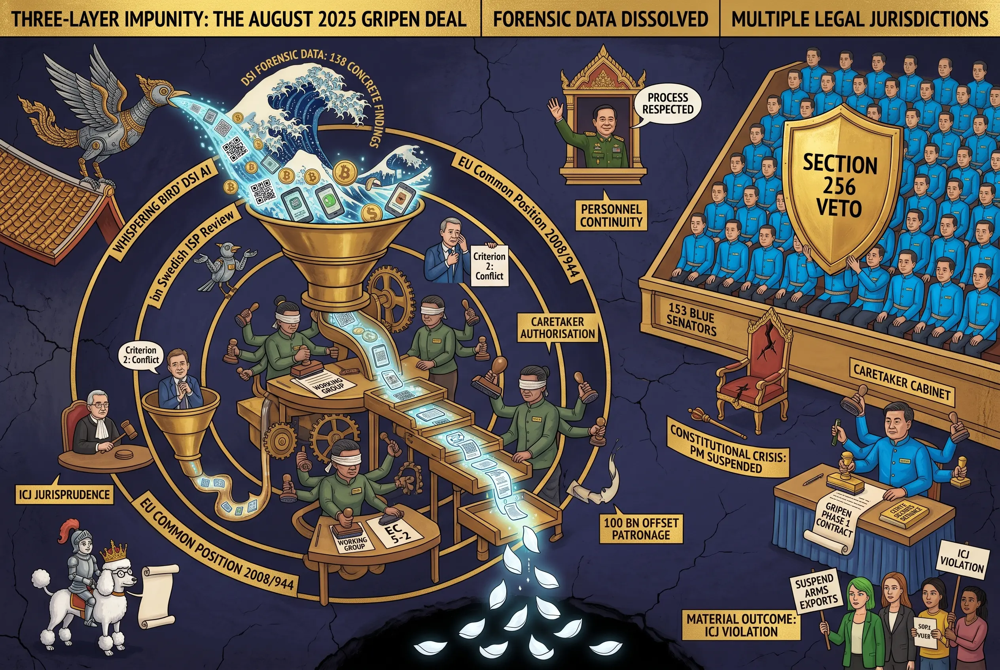

## 0062 – Three-Layer Impunity: The August 2025 Gripen Deal as Praetorian Procurement
**How a $550 million arms contract signed during Thailand's constitutional crisis enabled an ICJ violation under EU export criteria designed to prevent precisely that outcome — and how the praetorian framework documented by Paul Chambers explains why no accountability layer intervened**

-----

## 1. Scope and Context

On 25 August 2025, in Stockholm, the Royal Thai Air Force formally contracted the first phase of a 60-billion-baht, 12-aircraft Saab Gripen E/F procurement. The signing took place during Thailand's most acute constitutional crisis since 2014: Prime Minister Paetongtarn Shinawatra had been suspended by the Constitutional Court on 1 July; her caretaker successor, Phumtham Wechayachai, had authorised the procurement on 5 August; the formal removal of Paetongtarn followed on 29 August. The Air Force chief who signed the contract — ACM Panpakdee Pattanakul — was the same officer whose institution had been publicly documented seven months earlier as having taken bribes from a US contractor.

Three weeks before the signing, Thai Gripens of an earlier generation (C/D models) had conducted the first-ever combat use of the platform anywhere in the world, in deep strikes against Cambodia — a country with no functional combat air force and no operational air defence. Four months after the signing, Thai ground forces conducted Operation Sattawat (10–27 December 2025), seizing territory including the Phu Makhuea ridge — land the International Court of Justice had confirmed as Cambodian sovereign territory in its 2013 interpretation of the 1962 Preah Vihear judgment. In the same December 2025 window, Thai Gripens bombed at least six Cambodian casino complexes near the border, including a major strike on Poipet on 8 December.

This chapter maps the architecture that allowed this sequence of events to proceed across **three distinct legal jurisdictions** — Swedish national export controls, the European Union's Common Position 2008/944/CFSP on military technology exports, and the International Court of Justice — without effective institutional response from any of them.

The argument: the Gripen deal of August 2025 is not an isolated procurement scandal. It is a documented case study in how **multi-jurisdictional impunity is engineered through personnel continuity, procedural exploitation of constitutional crisis, secrecy defences against parliamentary scrutiny, and the dispersal of accountability across jurisdictions where no single actor takes responsibility**.

The architecture is best understood through the **praetorian framework** that Paul Chambers and others have established for Thailand's civil-military relations. The chapter argues that the Gripen procurement is praetorianism in operational form — and that the deal's procedural anomalies are not deviations from the praetorian pattern but its operating signature.

-----

## 2. The Praetorian Frame and the Chambers Documentation

### *2.1 Praetorianism as Analytical Anchor*

Praetorianism describes a polity in which the military operates as an institutionally autonomous political actor whose intervention in policy domains — including procurement, foreign policy, and the management of constitutional crises — does not require, and effectively cannot be reversed by, civilian electoral mandate. The framework, systematised by Samuel Huntington in *Political Order in Changing Societies* (1968) and applied to Thailand by scholars including Chai-Anan Samudavanija, Federico Ferrara, Surachart Bamrungsuk, Duncan McCargo (in adjacent form via the "network monarchy" concept), and most recently Paul Chambers, identifies several institutional features:

- military autonomy from civilian oversight in core domains (defence procurement, internal security, foreign policy in security-adjacent matters)
- privileged economic position via control of state-adjacent enterprises and revenue streams
- intervention capacity in domestic politics through coup, judicial allies, or "soft" institutional pressure
- self-protective architecture against accountability mechanisms (legal, parliamentary, journalistic)

Chambers's book *Praetorian Kingdom: A History of Military Ascendancy in Thailand* (the title is itself the diagnostic) systematises these features for the Thai case across decades.

### *2.2 The 2024 Chambers Article on the Gripen Decision*

In September 2024, Chambers published a public analysis of the Gripen decision titled *"Why Thailand chose Sweden's Gripen fighter jet"* (Fulcrum / ISEAS – Yusof Ishak Institute, republished in Think China). The article documents the procurement decision against the praetorian backdrop and identifies the specific royal-channel mechanism that operated in the original 2007–2008 Gripen C/D selection — a mechanism that the 2024–2025 E/F procurement extends.

Key Chambers findings:

- **2005 royal visit**: Sweden's King Carl XVI Gustaf visited Thailand with Swedish defence industry representatives. Chambers cites a source privy to the deal: *"Thailand's military junta apparently favoured the Gripen because the RTAF needed new aircraft, Sweden's and Thailand's royal families were close, and 'the Thai [military] is…close to its royal house.'"*

- **The Chalit Phukpasuk switch**: Then-RTAF Commander ACM Chalit Phukpasuk, like most senior RTAF officers, originally preferred the F-16 (the aircraft on which they had trained). Chambers documents: *"Indeed, Chalit suddenly changed his mind, becoming an eager supporter of Gripen jets for Thailand."*

- **The reward structure**: Chalit's role in advancing the Gripen procurement was *"likely helped by his appointment to the King's Privy Council in 2011."* The translation: officers who advance royal-channel arms-procurement decisions are rewarded with elevation to the Privy Council, the highest royal-affiliated honorary body.

- **The civilian-government constraint**: Chambers cites Supalak Ganjanakhundee, advisor to the Committee for Military Matters of Thailand's Lower House: *"Thai civilian governments rarely can veto military procurement decisions, though legislatures allocate the defence budget."*

The last point is structurally decisive. **Civilian Thai governments do not control major military procurement.** The Praetorian apparatus does. Caretaker Phumtham's August 2025 cabinet approval was not the civilian government commanding the military; it was the civilian apparatus ratifying what the praetorian apparatus had already decided.

### *2.3 Chambers as Documenter of His Own Persecution*

In April 2025, seven months after publishing the Gripen analysis, Paul Chambers was arrested in Thailand under Section 112 (lèse-majesté). He was the first US citizen prosecuted under this provision. The charges related to a translated academic article about Thai politics that had appeared on the website of the East-West Center think tank.

The architecture documented in Chambers's work — the praetorian apparatus that selects arms platforms through royal-channel mechanisms and rewards compliant officers with Privy Council appointments — is the same architecture that prosecutes the scholar who documents it. Section 13 below returns to this self-defence loop. For the present purpose, the point is that Chambers's analysis remains valid; his prosecution under §112 is structural confirmation rather than refutation.

-----

## 3. The Operational Pre-history (2024–early 2025)

Thailand's decision to replace its aging F-16A/B Block 15 fighter fleet was formalised in early 2024 under Prime Minister Srettha Thavisin, who outlined defence procurement plans including a fighter renewal programme valued initially at approximately 19 billion baht.

The Royal Thai Air Force pitched a multi-phase procurement plan. A selection panel evaluated competing offers from Sweden's Saab (Gripen E/F) and the United States (Lockheed Martin F-16 Block 70). Despite the established US partnership and the F-16 fleet already in service, the Air Force in August 2024 announced its preference for the Swedish Gripen platform, citing **technology transfer and offset commitments** that the Swedish bid emphasised.

Chambers identifies a parallel reason: the US had refused to sell the F-35 (which Thailand had requested in 2023) for fear of technology leakage to China given Thai-Chinese military alignment under the 2014–2019 junta. The US Lockheed-Martin offer for the F-16 Block 70 was therefore the second-best US option — but it required diplomatic conditions that the Thai military leadership chose not to meet. The Gripen offered fewer political conditions and a richer offset package.

By early 2025, the procurement had crystallised into a **three-phase, ten-year framework**:

- **Total scope**: 12 aircraft (Gripen E/F)
- **Total value**: approximately 60 billion baht
- **Offset compensation**: approximately **100 billion baht** — equivalent to **167% of the deal value**
- **Phase 1**: 4 aircraft (3 E + 1 F), 19.5 billion baht, delivery by 2029
- **Subsequent phases**: remaining 8 aircraft in two further batches

The 100-billion-baht offset figure is structurally striking. Standard arms-export offset packages range from 30% to 100% of contract value. An offset that exceeds the deal value by 67% indicates that the **primary economic transaction is the offset itself**, with the aircraft serving as the procurement vehicle. The offset includes industrial cooperation, technology transfer, training, scholarships, and infrastructure investments — multiple channels through which value can flow to Thai industrial recipients independent of the headline arms transaction.

The 2008 Gripen C/D deal had included scholarships for 37 Thai officers, which Swedish NGO Östgruppen-affiliated critics had characterised as "tantamount to bribery." The 100-billion-baht offset structure of the 2025 deal extends this pattern at substantially larger scale.

-----

## 4. The Documented Bribery Antecedent

In late 2024 or early 2025, Thai Defence Minister Phumtham Wechayachai responded publicly to allegations that US-based agricultural and construction equipment firm Deere had paid bribes to secure contracts with the Royal Thai Air Force, the Department of Highways, and the Department of Rural Roads. The allegations were not Thai-generated; they had emerged from a **US Securities and Exchange Commission settlement** in which Deere agreed to pay **9.93 million USD (approximately 336 million baht)** after its Thai subsidiary, Wirtgen Thailand, was found to have bribed Thai state agencies between November 2019 and March 2020.

The RTAF Chief, ACM Panpakdee Pattanakul, confirmed that the air force was aware of the reports and that the bribes had been paid between 2019 and 2020 — a period during which Panpakdee himself had been a senior RTAF officer.

Phumtham's public statement is worth quoting in full:

> *"Transnational bribery involving the military has been a chronic problem, but the latest claim remains unverified pending an investigation… It's been around for a long time… I'll have a look later. I don't have information yet… my priority rests with directing the military relief operations for flood victims in the North and Northeast."*

Phumtham further stated:

> *"There are processes for that… The Defence Ministry will tackle the problem without interfering in the investigation."*

The National Anti-Corruption Commission "promised to study reports" and stated it was "in the middle of collecting information and coordinating with the [US] SEC on the matter."

Phumtham concluded:

> *"He was unsure if he would carry on the military procurement projects launched by his predecessor, Sutin Klungsang. Procurement projects, like those for Gripen fighter jets and submarines, will be addressed after the flooding emergency."*

Four structural moves in one statement:

| Move | Function |
|---|---|
| *"It's been around for a long time"* | normalisation — bribery as background condition |
| *"I'll have a look later"* | deferral — temporal displacement |
| *"Tackle the problem without interfering"* | non-investigation framed as institutional propriety |
| *"After the flooding emergency"* | priority displacement — open-ended temporal exile |

No prosecutions followed. No officials were suspended. No procurement was halted. The Gripen deal proceeded.

-----

## 5. The Personnel Continuity and the Distributed Responsibility Network

The architectural feature that emerges from the timeline is **personnel continuity across scandal cycles**. The same actors occupy the same functions during the bribery period, the non-investigation period, and the new procurement signing period.

### *5.1 ACM Panpakdee Pattanakul*

- 2019–2020: Senior RTAF officer during the documented Deere/Wirtgen bribery period
- Late 2024 / early 2025: As RTAF Chief, publicly acknowledges the bribery
- 25 August 2025: Signs the new 60-billion-baht Gripen contract in Stockholm as Royal Thai Air Force Commander-in-Chief

### *5.2 Phumtham Wechayachai*

- Late 2024 / early 2025: As Defence Minister, defers investigation of RTAF bribery
- 1 July 2025: Becomes Acting Prime Minister upon Paetongtarn's suspension
- 5 August 2025: As Acting PM and former Defence Minister, authorises the Gripen procurement in caretaker cabinet
- 5 August 2025: Refuses parliamentary disclosure citing "state secrets" and "armed forces in combat operations"

### *5.3 The Eight-Actor Responsibility Network*

The full operational responsibility network for the August 2025 deal includes eight identifiable actors across government and corporate layers:

**Government layer (Swedish):**

- **Maria Malmer Stenergard** — Swedish Foreign Minister; **not present** at the Stockholm signing
- **Pål Jonson** — Swedish Defence Minister; present as witness
- **Mikael Granholm** — Director-General, Swedish Defence Materiel Administration (FMV); signatory
- **Anna Hammargren** — Swedish Ambassador to Thailand; active diplomatic facilitator (detailed in Section 7)

**Corporate layer (Saab and Wallenberg structure):**

- **Micael Johansson** — Saab CEO; signatory in Stockholm
- **Marcus Wallenberg** — Saab Chairman of the Board (since 2006); represents the Wallenberg family ownership via Investor AB, which holds the dominant share position in Saab
- **Carl Unosson** — Saab executive responsible for Asia/Thailand business operations; documented as having met PM Srettha at the World Economic Forum to advance Thai investment discussions
- **Jan Björklund** — former Liberal Party leader and Defence Minister; now publicly speaks for Saab on RTAF delivery matters — exemplifying the Swedish revolving-door pattern between politics and the defence industry

This eight-actor structure was identified in a Bangkok Post comment of December 2025, which characterised them as "responsible for this illegal arms deal." The structural distribution — four government, four corporate, with Wallenberg as ownership anchor — corresponds to standard arms-trade responsibility mapping as developed in the corruption-research literature (Andrew Feinstein, *Shadow World Investigations*).

### *5.4 The Wallenberg Ownership Anchor*

The Wallenberg dynasty, through Investor AB, holds the controlling ownership position in Saab. Marcus Wallenberg has chaired Saab's board since 2006, spanning:

- The 2008 Gripen C/D deal (with Östgruppen-flagged scholarship-bribery concerns)
- The 2012 Gripen extension
- The 2024 Gripen E/F decision under Srettha government
- The 2025 caretaker-authorised Phase 1 signing

The Wallenberg family is one of Sweden's most powerful business dynasties, with historical influence over Swedish foreign policy (cf. Raoul Wallenberg's diplomatic role, Peter Wallenberg's business diplomacy). The family typically operates through corporate layers and is rarely named in journalistic accounts of specific transactions. Direct naming in public discourse is structurally significant.

### *5.5 The Chalit Phukpasuk Precedent — Personnel Continuity as Reward Architecture*

Chambers's documentation of ACM Chalit Phukpasuk's switch from F-16 to Gripen advocacy, followed by his 2011 appointment to the King's Privy Council, establishes the **reward structure** that underlies personnel continuity. Officers who advance royal-channel arms-procurement decisions are not merely retained — they are elevated to royal-affiliated honorary positions.

This is the institutional incentive structure that produces personnel continuity across scandal cycles. The cost of complying with praetorian-royal-channel decision-making is institutional career risk; the reward is elevation. The cost of opposing it is career obstruction or worse. Over decades, this incentive structure produces precisely the personnel continuity that the bribery / non-investigation / new-procurement sequence demonstrates.

ACM Panpakdee Pattanakul's signing in Stockholm in August 2025 should be read in this light. He is operating within an institutional incentive structure in which his signature is the price of continued advancement.

-----

## 6. The Constitutional Crisis Authorisation (1 July – 29 August 2025)

The August 2025 procurement window coincides precisely with Thailand's most acute period of constitutional uncertainty since 2014.

### *6.1 The Crisis Timeline*

- **1 July 2025**: Constitutional Court suspends Prime Minister Paetongtarn Shinawatra over the leaked Cambodia phone call. Phumtham Wechayachai assumes role of Acting Prime Minister.
- **24–28 July 2025**: Thai-Cambodian border war. Royal Thai Air Force deploys Gripen C/D fighters for the first combat use of the platform in its history. Deep strikes target Cambodian positions in Preah Vihear and Oddar Meanchey provinces.
- **5 August 2025**: Caretaker Cabinet under Phumtham approves two major procurements in a single session: Phase 1 of the Gripen E/F contract (19.5 billion baht) and an amendment to the submarine contract switching to a Chinese CHD 620 engine.
- **5 August 2025**: Phumtham publicly refuses parliamentary disclosure citing "classified information" and "armed forces in combat operations."
- **25 August 2025**: RTAF Commander signs the Phase 1 contract in Stockholm.
- **29 August 2025**: Constitutional Court formally removes Paetongtarn from office, 6–3. Caretaker cabinet continues pending new government formation.
- **5 September 2025** (approximately): Anutin Charnvirakul becomes Prime Minister.

### *6.2 The Procedural Anomalies*

The signing occurs during a period in which:

- The Prime Minister has been suspended for nearly two months
- The Court is about to render a formal removal decision
- The Cabinet has no electoral mandate to commit to multi-year procurement
- An active armed conflict is being cited as justification for secrecy
- Two further constitutional changes (formal removal, new government formation) are imminent

Under standard democratic procedure, **caretaker governments do not initiate or commit to major procurement programmes** during periods of imminent transition. The convention exists precisely to prevent outgoing or transitional administrations from binding future governments to large multi-year obligations.

The Gripen Phase 1 contract — and the broader 12-aircraft, 60-billion-baht framework it activates — binds Thailand to procurement obligations stretching to at least 2035, encompassing two or three subsequent election cycles. A caretaker cabinet under a suspended Prime Minister, during a constitutional crisis, authorised this commitment without parliamentary debate, with explicit refusal of disclosure on grounds of "state secrets."

The praetorian framework explains why this was possible: the procurement decision was not, in operational terms, the caretaker cabinet's to make or refuse. As Chambers's source Supalak Ganjanakhundee notes, "Thai civilian governments rarely can veto military procurement decisions." The August 5 cabinet approval was procedural ratification of a praetorian-apparatus decision that had been made years earlier and was now ready for signing. The constitutional crisis simply offered the **optimal procedural moment**: a caretaker cabinet has even less ability to refuse than a normal civilian one, and its authorisation is harder for any future civilian government to reverse.

### *6.3 The "State Secrets" Defence*

Phumtham's invocation of state secrecy is procedurally significant. Defence procurement details in democratic systems are routinely disclosed to parliamentary committees, oversight bodies, and (after contract signing) to the public. The Swedish side of the same transaction published transparent press releases including the deal value, scope, and signatories. Sweden's Government and Defence Ministry, Saab as the contractor, and the Swedish parliamentary opposition (see Section 12) all treated the transaction as openly discussable.

The Thai invocation of secrecy was unilateral and absolute. Combined with the caretaker context, it eliminated **all available domestic accountability mechanisms** during the procurement authorisation window. This is praetorian secrecy: not protection of operational details, but protection of the praetorian decision-making process from civilian-political review.

-----

## 7. The Stockholm Signing (25 August 2025)

The contract was signed in Stockholm on 25 August 2025. The composition of the signing party — and one specific absence — illuminate the praetorian architecture's diplomatic-facilitation layer.

### *7.1 Signatories and Attendees*

| Side | Signatory / Attendee | Role |
|---|---|---|
| Thailand | **ACM Panpakdee Pattanakul** | Royal Thai Air Force Commander-in-Chief (signatory) |
| Thailand | **Maris Sangiampongsa** | Foreign Minister (attendee, witness) |
| Sweden | **Mikael Granholm** | Director-General, Swedish Defence Materiel Administration (FMV) (signatory) |
| Sweden | **Pål Jonson** | Defence Minister (attendee, witness) |
| Industry | **Micael Johansson** | Saab CEO (signatory) |

### *7.2 The Notable Absence: The Swedish Foreign Minister*

At the time of the signing, Sweden's Foreign Minister was Maria Malmer Stenergard (Moderate Party, appointed September 2024). She was **not present** at the signing ceremony. For an arms-export transaction of this magnitude — particularly one that was internationally controversial because of the recent combat use against Cambodia — the absence of Foreign Ministry representation on the Swedish side is procedurally unusual.

In standard Swedish defence-export practice, major arms transactions involve coordination between the Defence Ministry (which manages the export-control process via the ISP), the Foreign Ministry (which manages diplomatic implications), and the Government Offices' Trade Promotion staff. The signing of a controversial deal in the presence of the Defence Minister but absence of the Foreign Minister is consistent with a **politically managed compartmentalisation**: the Defence-Industrial channel proceeds, the Foreign-Diplomatic channel maintains plausible distance.

### *7.3 Ambassador Anna Hammargren — The Diplomatic Facilitation Layer*

The procurement window also coincides with the Bangkok ambassadorship of **Anna Hammargren**, who took up the post in August 2023 — at the moment the Gripen procurement entered its active evaluation phase under the Srettha government. Hammargren's professional profile is significant:

- 30 years in the Swedish Foreign Service
- Previous role as Director-General for Administration and Crisis Management at the Foreign Ministry in Stockholm
- Special Envoy for the Israeli/Palestinian Peace Process (notable in the context of the parallel Israeli-Thai surveillance pipeline documented in 0059)
- Ambassador to Morocco
- Deputy Director-General for International Development Cooperation
- Bangkok accreditation also covers Cambodia, Laos, and Myanmar

Her professional profile is not that of a standard bilateral ambassador. It is that of a **senior crisis-management diplomat with experience in defence-adjacent transactions in politically sensitive contexts**. Swedish foreign ministries deploy such profiles where transactions of strategic importance require diplomatic facilitation under conditions of instability.

Her public role at the Gripen deal announcement included a framing statement positioning the transaction as part of a "long-standing partnership" dating to the 2008 Gripen C/D agreement — a framing that pre-emptively disarms the "recent decision under conflict conditions" critique that the Swedish Greens articulated on the same day.

Hammargren's accreditation covering Cambodia is structurally relevant. She is Sweden's diplomatic representative in the country against which the Swedish-supplied platform was used in combat. Her continued tenure during this period implies that the Foreign Ministry assessed her bilateral position in Cambodia as compatible with facilitating the Thailand deal — a judgment that the Cambodian Human Rights Committee's subsequent intervention (28 August 2025, three days after signing) called into question.

The ambassadorial role functions as the **professional-diplomatic complement** to the royal-channel ceremonial layer (Section 10). The royal channel validates the bilateral relationship; the ambassadorial channel coordinates the operational transaction within it.

### *7.4 Same-Day Swedish Parliamentary Opposition*

On the same day as the signing, **Swedish Green Party Foreign Policy Spokesperson Jacob Risberg and Member of Parliament Emma Nohrén** publicly demanded the government suspend arms exports to Thailand. Their statement:

> *"The democracy criteria for arms exports must be strengthened, especially in light of Thailand's use of the Gripen against targets in Cambodia."*

The Swedish government signed the contract **in the face of explicit, public, same-day parliamentary opposition from within Sweden itself**. This is not a procurement that proceeded under quiet bureaucratic processing. It proceeded under live, named political objection — and was finalised anyway.

Three days later (28 August 2025), the **Cambodian Human Rights Committee** called on the Swedish Human Rights Institute to demand a review. International civic protest was activated immediately.

-----

## 8. The Three-Layer Legal Architecture

The deal proceeded across three distinct jurisdictional layers, each with its own normative framework. Examining the deal against each layer reveals the architecture of multi-jurisdictional norm evasion.

### *8.1 Layer One: Swedish National Export Controls*

Swedish arms exports are administered by the **Inspektionen för strategiska produkter (ISP)** — the Inspectorate of Strategic Products. ISP operates under Swedish law, which incorporates EU criteria as guidance but executes assessment nationally.

The Swedish Greens' critique (Risberg, Nohrén) operated within this framework: they did not allege illegality; they argued that Sweden's **own democracy criteria** for arms exports should have led to suspension given Thailand's use of the platform against Cambodia. The Swedish Nonproliferation and Export Control Agency conducted a review without suspending the licence.

The deal was therefore approved at the national level **despite documented parliamentary opposition and active review by the export-control body**. National-level scrutiny did not produce intervention.

### *8.2 Layer Two: EU Common Position 2008/944/CFSP*

The European Union's Common Position 2008/944/CFSP (8 December 2008) defines eight criteria that member states must consider when evaluating arms export applications. The relevant criteria for the Gripen deal:

- **Criterion 2**: Respect for human rights and international humanitarian law by the recipient
- **Criterion 3**: Internal situation in the country of final destination, as a function of the existence of tensions or armed conflicts
- **Criterion 4**: Preservation of regional peace, security and stability
- **Criterion 7**: Risk of diversion of the equipment

Thailand on 25 August 2025 was:
- in an active border conflict with Cambodia (Criterion 3, 4)
- the documented user of the platform being sold in offensive strikes during that conflict (Criterion 2)
- in a domestic constitutional crisis affecting the authorisation chain (Criterion 3)
- a country whose military operates as a praetorian-autonomous actor outside civilian electoral control (Criterion 2, 7 — given the documented arms trade with sanctioned Russia-aligned entities through certain corporate channels)

The Common Position is not enforceable through EU central mechanisms — it operates as a coordination instrument that member states should apply through their national export-control systems. Sweden therefore complied with the procedural form (it considered the criteria through ISP) while the substantive criteria themselves would clearly have warranted denial. The deal was **approved despite EU Common Position 2008/944 export criteria covering active conflict**.

### *8.3 Layer Three: ICJ Jurisprudence*

The International Court of Justice has rendered two binding judgments on territorial sovereignty in the contested Thai-Cambodian border area:

- **15 June 1962**: ICJ awarded the Preah Vihear temple to Cambodia
- **11 November 2013**: ICJ interpretation extending Cambodian sovereignty to the **promontory** on which the temple sits — a zone that includes the Phu Makhuea ridge (Khmer: Phnom Trap)

The 2013 judgment is the binding interpretation of the 1962 ruling. Both states accepted the ICJ's jurisdiction. The judgments are not advisory; they are determinations of sovereignty under international law.

In December 2025, Operation Sattawat seized Phu Makhuea among other positions (see 0058 for full territorial detail). Phu Makhuea has remained under Thai control since, with no international mechanism activated to enforce the 2013 ruling.

The Swedish-supplied Gripens — through their role in establishing Thai air dominance during the July 2025 conflict and conducting the December 2025 casino-bombing campaign — contributed materially to the operational environment that enabled the December 2025 ground offensive. The causal chain is:

```
Swedish arms export
  → Thai combat use (July 2025)
    → Thai air dominance
      → Operation Sattawat (December 2025)
        → Seizure of territory including Phu Makhuea
          → Violation of ICJ 2013 ruling
```

Each step is documented. The chain is causal at the strategic level (air dominance enabled ground operations) even if the December 2025 ground forces did not depend on Gripen sorties specifically.

### *8.4 The Three-Layer Architecture*

The architecture's structural feature is that **each layer expects another to act**:

- ISP defers to the political assessment that EU criteria are satisfied
- EU criteria are advisory and depend on national implementation
- ICJ jurisprudence requires state-level enforcement, which neither party is willing to invoke
- The actors responsible at each level can claim procedural compliance while substantive violation occurs

This is **dispersal of accountability across jurisdictions** as institutional design feature. No single jurisdiction is unambiguously charged with intervention; each can point to another as the proper venue.

-----

## 9. The Material Outcome: From July Strikes to the Casino Bombing Campaign

The deal's material outcome unfolded across two distinct combat phases — the July 2025 border conflict and the December 2025 casino bombing campaign — and culminated in the Operation Sattawat territorial seizure.

### *9.1 July 2025: First Combat Use*

Thai Gripen C/D fighters conducted strikes against Cambodian positions in Preah Vihear and Oddar Meanchey provinces during the 24–28 July 2025 border war. This was the **first combat use of the Gripen platform anywhere in the world**.

Cambodia possessed no functional combat air force capable of engagement. Royal Cambodian Air Force inventory consists primarily of light aircraft, helicopters, and trainers; no supersonic fighters. Air defence capability is limited to MANPADS and short-range systems — operationally incapable of contesting modern fast-jet operations.

The strikes therefore occurred under conditions of total Thai air dominance against an undefended state. This is operationally **asymmetric warfare**, not peer combat. The Gripen's value in the operation was not as a combat aircraft contesting airspace; it was as a strike platform delivering munitions against fixed positions of a defenceless adversary.

### *9.2 The December 2025 Casino Bombing Campaign*

On 8 December 2025, a Royal Thai Air Force JAS-39E Gripen fighter conducted a precise airstrike against a large casino-resort complex near Poipet, Cambodia, 300 metres from the Thai border in Sa Kaeo province. The Royal Thai Army cited Article 51 self-defence provisions, claiming military equipment was located within the complex.

This was not an isolated incident. **At least six casinos and suspected online-scamming complexes in Oddar Meanchey, Preah Vihear, and Pursat provinces** were struck by Thai aircraft, artillery, and drones in subsequent weeks. The casinos targeted were predominantly Chinese-owned and reportedly housed trafficked workers — including Thai, Cambodian, Vietnamese, and Chinese nationals. The Cambodian-based investigative outlet CamboJA News reported that "trafficked workers feared inside" the struck facilities.

Two analytical points:

- **The casinos are mixed civilian-infrastructure targets.** They host gambling operations (civilian commercial activity), scam compounds (criminal activity involving trafficked victims), and — per Thai military claims — military equipment. Strikes against such complexes raise direct CFSP 2008/944 Criterion 2 questions (respect for international humanitarian law, particularly distinction between military and civilian targets).

- **The strikes used Swedish-supplied Gripens.** This is the documented operational use of the platform whose export Sweden defended on 26 August 2025 (one day after signing) as compliant with international rules. The December strikes occurred four months after Sweden's compliance defence, against targets whose military character is contested.

The campaign was sustained, not exceptional. It represented an established pattern of using the Swedish-supplied platform against complex civilian-adjacent infrastructure on the Cambodian side of the border.

### *9.3 December 2025: Operation Sattawat*

Between 10 and 27 December 2025, the Royal Thai Army conducted Operation Sattawat — a ground offensive that seized territory along the contested border. The captured positions include:

- Ta Muen Thom and Ta Khwai/Ta Krabey temples
- Hills 350 and 500
- **Phu Makhuea ridge**
- O'Smach and Chong An Ma border complexes
- Thma Da sector (partial)

The 27 December ceasefire froze this new line of control. The line includes Phu Makhuea — territory the ICJ confirmed Cambodian in 2013.

### *9.4 The Material Chain*

The Swedish arms export of August 2025 — which itself followed the July 2025 combat use — and the subsequent December 2025 casino-bombing campaign and territorial seizure are connected by the operational logic of air dominance enabling combat and ground operations. The Swedish-supplied platform was central to the operational capability that produced both the casino-bombing pattern and the territorial outcome.

Sweden's defence of the export (compliance with international rules) was rendered substantively untenable by the December campaign. Yet no Swedish export-control intervention followed.

-----

## 10. The Royal Channel Confirmation

The royal-channel dimension provides the ceremonial closure of the procurement architecture.

### *10.1 Rama X as Pilot King*

King Maha Vajiralongkorn (Rama X) is the first monarch in the Chakri Dynasty to hold certification as a fighter pilot, flight instructor, and commercial airline pilot. He is qualified on:

- The Northrop F-5E/F (training in the United States; flight instructor since 1994)
- The General Dynamics F-16 — **the platform being replaced** by Gripens in this procurement
- The Boeing 737-400 (commercial type rating; flight instructor; air examiner)

By 2009, he had logged over 3,000 flying hours. In April 2025 — four months before the Gripen signing — he personally piloted a Boeing 737-800 to Bhutan's Paro International Airport, one of the world's most challenging airfields.

Aviation is not a peripheral interest. It is a **central element of the royal self-presentation** and an institutional axis of relationship between the monarchy and the Royal Thai Air Force.

### *10.2 The Carl XVI Gustaf 80th Birthday Visit*

From 29 April to 2 May 2026 — eight months after the Stockholm signing — King Rama X and Queen Suthida conducted a state visit to Sweden for the 80th birthday celebrations of King Carl XVI Gustaf. The visit included a state banquet, thanksgiving service, and informal dinner hosted by Carl XVI Gustaf.

The Thai monarchs were the only Asian heads-of-state present at the gathering. The visit was framed as a continuation of the 1868 Treaty of Friendship — the foundational bilateral instrument. The same Carl XVI Gustaf had visited Thailand in February 2005 with Swedish defence industry representatives, in the visit Chambers identifies as having helped catalyse the original 2007–2008 Gripen C/D procurement.

### *10.3 The Channel as Ceremonial Sealing*

The royal visit does not establish the Gripen procurement; the procurement was already signed eight months earlier. What the visit provides is **ceremonial sealing**: a public, royal-grade affirmation of the bilateral relationship within which the procurement sits.

The visit's function is not to drive the deal. It is to validate the diplomatic frame within which the deal can be presented as part of a long-standing partnership, rather than as a specific transaction with documented procedural anomalies. The royal channel is the **legitimation surface** of an underlying defence-industrial transaction.

Together with Ambassador Hammargren's diplomatic facilitation (Section 7) and Saab's industrial-corporate operations (Section 5), the royal channel completes the three-tier diplomatic architecture: ceremonial (royal), professional (ambassadorial), and operational (corporate-industrial). All three layers operated in coordinated sequence around the August 2025 transaction.

-----

## 11. The Selective Silence

On 30 May 2026, Sweden's Minister for International Development Cooperation and Foreign Trade, **Benjamin Dousa**, published an opinion piece in the *Bangkok Post* titled *"Thai-Swedish prosperity alliance."* The piece celebrated the 1868 Treaty of Friendship, the 2025 Strategic Partnership, the *"Made with Sweden"* initiative, and Sweden's commitment to free trade, innovation, and rules-based international order.

The piece **does not mention** the Gripen procurement. Not the Saab contract. Not the 60-billion-baht headline value. Not the 100-billion-baht offset package. Not the Peace Burapha 1 programme name. Not the F-16 replacement context. Not the July 2025 combat use against Cambodia. Not the December 2025 casino bombing campaign. Not the ICJ implications of the December 2025 territorial seizure.

In a piece by a Swedish trade minister promoting the Sweden-Thailand economic relationship, the **largest single Swedish-Thai economic transaction of the relevant period is absent from the text**.

This is the diplomatic dog that did not bark. The selective silence is not random; it is the structural complement of the royal-channel sealing. The procurement sits outside the publicly celebrated trade-promotion narrative because it operates through different channels — defence-industrial, royal-ceremonial, caretaker-authorised — that the trade promotion machinery explicitly does not touch.

A trade minister celebrating "Made with Sweden" without mentioning "Made by Swedish arms in Thai casino strikes" performs precisely the **compartmentalisation** that allows the architecture to function. Two parallel narratives, the same bilateral relationship, no acknowledgement of overlap.

-----

## 12. Transnational Civic Response

The institutional response from across jurisdictions was active and substantial, but uniformly insufficient to alter the procurement trajectory.

### *12.1 Swedish Parliamentary Opposition*

- **Jacob Risberg** (Green Party Foreign Policy Spokesperson) and **Emma Nohrén** (MP): same-day public demand for suspension of arms exports (25 August 2025)
- Their argument: Sweden's own democracy criteria for arms exports should have led to suspension

### *12.2 Swedish Civil Society*

- **Östgruppen** (East European Solidarity, led by Martin Uggla): long-established Swedish NGO focused on human rights and arms-trade scrutiny; has historical track record on Thai Gripen scrutiny (the 2008/2010 deal had included scholarships for 37 Thai officers, which Östgruppen-affiliated critics characterised as "tantamount to bribery")
- **Swedish Nonproliferation and Export Control Agency**: reviewed the deal but did not suspend
- Civic correspondence to Swedish actors during the constitutional vacuum window (early September 2025) included submissions documenting the procedural anomalies

### *12.3 Cambodian Civic Response*

- **Cambodian Human Rights Committee (CHRC)**: 28 August 2025 — called on the Swedish Human Rights Institute to demand a review
- **Cambodianess**: editorial criticism — *"Sweden Arming Thailand with Gripen: Why Now Is the Wrong Time"*; *"Sweden Defends Gripen Sale, Citing Compliance With International Rules"*
- **CamboJA News**: reported the trafficked-workers concern following the December casino strikes

### *12.4 Regional and International Observers*

- **ANFREL** (Asian Network for Free Elections): separately raised concerns about Thai institutional integrity in the broader context (February 2026 election observation)
- **Breaking Defense, The Aviationist, Defence Security Asia**: defence-industry trade press tracked the controversy

### *12.5 The Insufficiency Problem*

The transnational civic response demonstrates that the architecture's procedural anomalies were **publicly identified at every stage**. Swedish parliamentarians spoke on signing day. Cambodian civil society activated within three days. Swedish civic infrastructure tracked the deal throughout. Defence-industry trade press reported the controversy. Direct primary-source correspondence to Swedish NGO leadership occurred during the constitutional vacuum window.

What the response did not do is **alter the trajectory**. The Phase 1 contract was signed; the production has begun (first aircraft entered Saab's production line on 13 May 2026); the subsequent phases remain on track; Thailand's territorial gains from Operation Sattawat are frozen by the December 2025 ceasefire; the casino-bombing campaign proceeded without Swedish export-control intervention.

This is the institutional reality the architecture exploits: **public criticism does not equate to institutional intervention**. Documentation and outrage are abundant; binding action is absent.

The NGO response in particular exposes a structural feature: documentation-oriented NGOs (Östgruppen typology) are **consumers of information**, not amplifiers. They register, archive, and may use material in their own campaigns — but they do not autonomously generate the institutional pressure required to alter procurement trajectories backed by defence-industrial-government coalitions.

-----

## 13. The Self-Defence Loop: The Architecture Prosecutes Its Documenters

In April 2025, **Paul Chambers — the author of *Praetorian Kingdom* and the September 2024 Fulcrum article documenting the royal-channel mechanism of the Gripen procurement — was arrested in Thailand under Section 112**. He was the first US citizen prosecuted under Thailand's lèse-majesté provision. The charges related to a translated academic article on Thai politics that had appeared on the East-West Center website.

The sequence is structurally significant:

- **September 2024**: Chambers publishes the analysis documenting Chalit Phukpasuk's switch and Privy Council reward — establishing the royal-channel mechanism in public academic record
- **April 2025**: Chambers arrested under Section 112 for unrelated translated academic content
- **July 2025**: Thai Gripens conduct combat use of the platform whose royal-channel procurement Chambers had documented
- **August 2025**: Caretaker cabinet authorises new Gripen procurement; Stockholm signing
- **December 2025**: Gripen casino-bombing campaign

The Chambers prosecution **is not coincidental to the procurement architecture**. It is the architecture's standard response to documentation. A praetorian system maintains its operational autonomy in part by raising the cost of analytical scrutiny. Section 112 enforcement against academic critics is the legal-architectural complement to the procurement architecture itself.

This produces a documented loop:

1. The praetorian apparatus operates the royal-channel procurement mechanism
2. Academic scholars document the mechanism in published research
3. The praetorian apparatus prosecutes the scholars under §112
4. The prosecution raises the cost of further documentation
5. The procurement architecture continues with reduced analytical pressure

Chambers's prosecution did not retract his analysis. The 2024 Fulcrum article remains in the public record; *Praetorian Kingdom* remains in libraries; the academic findings stand. But the **personal cost** to documenting praetorian operations is now publicly demonstrated. Future scholars considering similar work calculate accordingly.

This is the operational meaning of Section 41–112's enforcement architecture (documented in 0012, 0041, 0050): not only protection of the monarchy from criticism in narrow terms, but **protection of the praetorian-royal-channel architecture from analytical exposure** in broader terms. The Gripen procurement and the Section 112 prosecution of its academic documenter are not separate stories. They are two operations of the same system.

The pseudonymity under which the present analysis is written reflects the documented risk of operating without that protection. The Chambers case demonstrates that the risk is not theoretical but operational, applied across nationality (US citizen) and institutional protection (full academic position at Naresuan University). For Thai-language analysts and Thai-nationality scholars, the risk is amplified by an order of magnitude.

-----

## 14. Analytical Synthesis

The August 2025 Gripen procurement is not a single procurement scandal. It is a **case study in the architecture of multi-jurisdictional norm evasion** — a documented example of how contested transactions are engineered to proceed across multiple legal frameworks without effective intervention from any of them.

The architecture has **seven interlocking structural features**:

### *14.1 Praetorian Decision-Making Outside Civilian Control*

The procurement decision was made by the praetorian military apparatus, not by civilian electoral government. Chambers's source Supalak Ganjanakhundee is explicit: *"Thai civilian governments rarely can veto military procurement decisions."* The Phumtham caretaker cabinet's August 5 approval was ratification, not decision. This is praetorianism in its operational definition: military autonomy in core policy domains, ratified by civilian institutions that lack the institutional capacity to refuse.

### *14.2 Personnel Continuity Defeats Institutional Accountability*

The same officers who occupied positions of authority during the documented bribery period (Panpakdee at RTAF; Phumtham at Defence Ministry) are the officers who authorise and sign the new procurement during constitutional crisis. The Chalit Phukpasuk precedent establishes the reward structure: officers who advance royal-channel procurement are promoted to royal-affiliated bodies (Privy Council). Institutional memory is preserved as personnel continuity; institutional accountability is dissolved through the same continuity.

### *14.3 Constitutional Crisis Enables Caretaker Authorisation*

The procurement was authorised on 5 August 2025 by a caretaker cabinet without electoral mandate, between Paetongtarn's 1 July suspension and her 29 August removal. This timing is not coincidental. Multi-year procurement commitments of this magnitude bind future governments; authorising them through a transitional government places them beyond the reach of incoming political authorities. The constitutional crisis offered the optimal procedural window.

### *14.4 "State Secrets" Defence Closes Parliamentary Scrutiny*

Phumtham's invocation of classified information and combat operations as grounds for refusing parliamentary disclosure foreclosed the standard domestic accountability mechanism. The Swedish side treated the deal as openly discussable; the Thai side did not. Asymmetric secrecy enabled asymmetric scrutiny.

### *14.5 Cross-Jurisdictional Violations Disperse Responsibility*

Each legal layer (Swedish national, EU Common Position, ICJ) expects another to act. ISP defers to political assessment. EU criteria depend on national implementation. ICJ jurisprudence requires state-level enforcement. The actors at each level can claim procedural compliance while substantive violation occurs at the level of the system as a whole.

### *14.6 The Three-Tier Diplomatic Architecture*

The royal channel (Carl XVI Gustaf — Rama X), the ambassadorial channel (Hammargren as professional diplomatic facilitator), and the corporate-industrial channel (Saab — Wallenberg ownership — FMV — RTAF) operate in coordinated sequence. No single channel completes the transaction alone; the combination is what makes it operationally and diplomatically possible. The April–May 2026 royal visit and the May 2026 Dousa "Made with Sweden" trade-promotion piece together perform the diplomatic sealing of the transaction.

### *14.7 The Self-Defence Loop*

The architecture defends itself by prosecuting the scholars who document it. Chambers's April 2025 §112 arrest, seven months after his Fulcrum analysis of the royal-channel mechanism, is the operational signature of this loop. The procurement architecture and the §112 enforcement architecture are not separate phenomena; they are two operations of the same praetorian system.

### *14.8 The Synthesis*

> *The August 2025 Gripen E/F contract was signed by an Air Force chief whose institution had been documented as taking bribes during his tenure, under the authorisation of a caretaker Defence Minister and Acting Prime Minister who had publicly chosen not to investigate those bribes seven months earlier, ratifying a decision made by the praetorian military apparatus operating outside meaningful civilian electoral control. The same Defence Minister cited "state secrets" to refuse parliamentary scrutiny of his caretaker authorisation. The deal proceeded despite same-day Swedish parliamentary opposition, EU Common Position 2008/944 export criteria covering the active conflict, and the foreseeable contribution to a territorial outcome that violates a 2013 ICJ ruling and a December 2025 casino-bombing campaign whose civilian-distinction status is contested. No accountability process intervened at any point. The royal visit of April 2026 and the trade-promotion silence of May 2026 sealed the transaction diplomatically. The academic scholar who had documented the royal-channel mechanism was prosecuted under Section 112 seven months after publication. The architecture functioned as designed.*

### *14.9 Implications*

For Thai civil society:
- The architecture demonstrates that even spectacular procurement irregularities — bribery antecedent, caretaker authorisation, constitutional crisis timing, state-secrets defence, multi-actor responsibility distribution — do not produce institutional intervention
- Reform agendas focused on domestic-political channels (Parliament, the courts) leave the cross-jurisdictional dispersal of accountability untouched, and operate under §112 enforcement risk
- The civic response infrastructure that does exist (Swedish Greens, Cambodian Human Rights Committee, Östgruppen, Cambodianess) operates with documentation capacity but without binding intervention capacity
- Pseudonymity is not an optional caution but an operational necessity, as the Chambers case demonstrates

For Swedish civil society and parliamentary opposition:
- The Gripen case is a documented test of whether Sweden's "rules-based order" rhetoric translates into operational practice
- The same-day signing despite Risberg and Nohrén's intervention demonstrates that parliamentary opposition is procedurally insufficient when defence-industrial channels are politically backed
- The pattern is unlikely to be Thailand-unique; it is consistent with broader patterns in Swedish defence-export practice
- The Wallenberg-Saab-FMV-Embassy structure constitutes the operational coalition that must be addressed for substantive reform

For international institutions:
- The case illustrates the practical limits of EU Common Position 2008/944 when member-state national assessments override the spirit of the criteria
- It illustrates the practical limits of ICJ jurisprudence when neither party state activates enforcement
- It suggests that accountability mechanisms designed for single-jurisdiction violations are not adequate to multi-jurisdictional engineered impunity
- The praetorian framework, established academically since the 1960s, should inform how international institutions assess arms-export decisions to states whose military operates as a praetorian actor

The Gripen-Sattawat case is not the architecture's only instance. It is its most fully documented one to date — fully documented in part because of the prior academic groundwork by Paul Chambers and the parallel scholarly tradition (Ferrara, McCargo, Pawakapan, Haberkorn) on which his analysis builds.

The architecture is sustained by the willingness of multiple jurisdictional actors not to act. The opportunity for civic, academic, and political intervention exists at the level of each individual layer — Swedish parliamentary work on export controls, EU-level work on Common Position enforcement, ICJ enforcement work — but no such intervention has materially altered the architecture's operation.

This chapter documents the architecture so that the choice not to act is made in full knowledge of what is being chosen.

-----

## Sources

**Praetorian framework and Thai civil-military relations**

- Paul Chambers, *Praetorian Kingdom: A History of Military Ascendancy in Thailand* (book-length academic work systematising praetorian framework for Thailand)
- Paul Chambers, *"Why Thailand chose Sweden's Gripen fighter jet"* (Fulcrum / ISEAS, 26 September 2024): <a href="https://fulcrum.sg/why-thailand-chose-swedens-gripen-fighter-jet/" target="_blank" rel="noopener noreferrer">link</a>
- Republished in Think China: <a href="https://www.thinkchina.sg/politics/why-thailand-chose-swedens-gripen-fighter-jet" target="_blank" rel="noopener noreferrer">link</a>
- Samuel Huntington, *Political Order in Changing Societies* (Yale, 1968) — foundational praetorian framework
- Federico Ferrara, *The Political Development of Modern Thailand* (Cambridge, 2015)
- Duncan McCargo, *"Network Monarchy and Legitimacy Crises in Thailand"*, The Pacific Review 18:4 (2005)
- Puangthong Pawakapan, *Infiltrating Society: The Thai Military's Internal Security Affairs* (ISEAS, 2021)

**Chambers prosecution (April 2025)**

- Multiple international academic outcry statements following the April 2025 arrest
- East-West Center statement
- Council on Foreign Relations and US State Department public comments
- Naresuan University institutional response

**Procurement framework**

- Bangkok Post, *"Thai air force to buy 12 Gripen fighter jets for B60bn"*: <a href="https://www.bangkokpost.com/thailand/general/3042966/thai-air-force-to-buy-12-gripen-fighter-jets-for-b60bn" target="_blank" rel="noopener noreferrer">link</a>
- Bangkok Post, *"Thai Air Force plans to acquire 12 Gripen jets over 10 years"*: <a href="https://www.bangkokpost.com/thailand/general/3041717/thai-air-force-plans-to-acquire-12-gripen-jets-over-10-years" target="_blank" rel="noopener noreferrer">link</a>
- Nation Thailand, *"Cabinet approves 100 billion baht economic compensation for Gripen jet purchase"*: <a href="https://www.nationthailand.com/news/politics/40054239" target="_blank" rel="noopener noreferrer">link</a>
- Saab press release, *"Saab receives Gripen E/F order for Thailand"* (25 August 2025): <a href="https://www.saab.com/newsroom/press-releases/2025/saab-receives-gripen-ef-order-for-thailand" target="_blank" rel="noopener noreferrer">link</a>
- Sweden Government press release, *"Swedish success together with Thailand – new deal on Gripen E/F"*: <a href="https://www.government.se/press-releases/2025/08/swedish-success-together-with-thailand--new-deal-on-gripen-ef/" target="_blank" rel="noopener noreferrer">link</a>

**Caretaker authorisation and procedural anomalies**

- Bangkok Post, *"Cabinet approves procurement of 4 Gripen jets from Sweden"*: <a href="https://www.bangkokpost.com/thailand/general/3081650/cabinet-approves-procurement-of-4-gripen-jets-from-sweden" target="_blank" rel="noopener noreferrer">link</a>
- Bangkok Post, *"Acting PM tight-lipped on fighter jet, submarine decisions"*: <a href="https://www.bangkokpost.com/thailand/general/3082230/acting-pm-tightlipped-on-fighter-jet-submarine-decisions" target="_blank" rel="noopener noreferrer">link</a>
- Bangkok Post, *"Cabinet permits changes to sub deal"*: <a href="https://www.bangkokpost.com/thailand/general/3082522/cabinet-permits-changes-to-sub-deal" target="_blank" rel="noopener noreferrer">link</a>
- Thai Examiner, *"Cabinet green lights navy submarine and new Gripen jets. Acting PM says the details are 'state secrets'"* (6 August 2025): <a href="https://www.thaiexaminer.com/thai-news-foreigners/2025/08/06/cabinet-green-lights-navy-submarine-and-new-gripen-jets-acting-pm-says-the-details-are-state-secrets/" target="_blank" rel="noopener noreferrer">link</a>
- Khaosod English, *"Thailand Approves Major Military Purchases Amid Regional Tensions"* (5 August 2025): <a href="https://www.khaosodenglish.com/politics/2025/08/05/thailand-approves-major-military-purchases-amid-regional-tensions/" target="_blank" rel="noopener noreferrer">link</a>

**Bribery antecedent**

- Bangkok Post, *"Air force 'bribe' on ministry radar now"*: <a href="https://www.bangkokpost.com/thailand/general/2867438/air-force-bribe-on-ministry-radar-now" target="_blank" rel="noopener noreferrer">link</a>
- Bangkok Post, *"Swedish NGO urges probe of Gripen jet sale to Thailand"* (historical, 2008/2010 deal): <a href="https://www.bangkokpost.com/thailand/general/732584/swedish-ngo-urges-probe-of-gripen-jet-sale-to-thailand" target="_blank" rel="noopener noreferrer">link</a>
- OECD review of Thailand's legal and policy framework for fighting foreign bribery (November 2024)

**Constitutional crisis context**

- Al Jazeera, *"Thai court removes Prime Minister Paetongtarn Shinawatra from office"* (29 August 2025): <a href="https://www.aljazeera.com/news/2025/8/29/thai-court-removes-prime-minister-paetongtarn-shinawatra-from-office" target="_blank" rel="noopener noreferrer">link</a>

**Stockholm signing and Ambassador Hammargren**

- Bangkok Post, *"Thailand and Sweden to sign Gripen jet deal"*: <a href="https://www.bangkokpost.com/thailand/general/3090196/thailand-and-sweden-to-sign-gripen-jet-deal" target="_blank" rel="noopener noreferrer">link</a>
- Bangkok Post, *"Sweden agrees to sell 4 Saab Gripen fighter jets to Thailand"*: <a href="https://www.bangkokpost.com/thailand/general/3092824/sweden-agrees-to-sell-4-saab-gripen-fighter-jets-to-thailand" target="_blank" rel="noopener noreferrer">link</a>
- Breaking Defense, *"Saab secures $550M Gripen E/F order for Thailand"*: <a href="https://breakingdefense.com/2025/08/saab-secures-550m-gripen-e-f-order-for-thailand/" target="_blank" rel="noopener noreferrer">link</a>
- The Aviationist, *"Thailand Signs Gripen E Contract"*: <a href="https://theaviationist.com/2025/08/26/thailand-gripen-e-contract/" target="_blank" rel="noopener noreferrer">link</a>
- Sweden Abroad, *"Anna Hammargren new Ambassador"*: <a href="https://www.swedenabroad.se/en/embassies/thailand-bangkok/current/news/anna-hammargren-new-ambassador/" target="_blank" rel="noopener noreferrer">link</a>
- Scandasia, *"Meet the New Swedish Ambassador to Thailand"*: <a href="https://scandasia.com/meet-the-new-swedish-ambassador-to-thailand/" target="_blank" rel="noopener noreferrer">link</a>

**Combat use and casino bombing**

- Bangkok Post, *"Thailand's Gripen fighters first ever to be used in actual"*: <a href="https://www.bangkokpost.com/thailand/general/3077669/thailands-gripen-fighters-first-ever-to-be-used-in-actual" target="_blank" rel="noopener noreferrer">link</a>
- Bangkok Post, *"Sweden defends Thai use of Gripen jets in combat"*: <a href="https://www.bangkokpost.com/thailand/general/3094228/sweden-defends-thai-use-of-gripen-jets-in-combat" target="_blank" rel="noopener noreferrer">link</a>
- Al Jazeera, *"Cambodia says Thailand bombed casino hub on border, with no truce in sight"* (18 December 2025): <a href="https://www.aljazeera.com/news/2025/12/18/cambodia-says-thailand-bombs-casino-hub-on-border-with-no-truce-in-sight" target="_blank" rel="noopener noreferrer">link</a>
- CamboJA News, *"After Thai Strikes Hit Cambodian Elites' Casinos, Trafficked Workers Feared Inside"*: <a href="https://cambojanews.com/after-thai-strikes-hit-cambodian-elites-casinos-trafficked-workers-feared-inside/" target="_blank" rel="noopener noreferrer">link</a>
- Asia Times, *"Thais bomb three Cambodian border casinos deemed military threats"*: <a href="https://asiatimes.com/2025/12/thais-bomb-three-cambodian-border-casinos-deemed-military-threats/" target="_blank" rel="noopener noreferrer">link</a>

**Swedish parliamentary opposition**

- Cambodianess, *"Sweden Arming Thailand with Gripen: Why Now Is the Wrong Time"*: <a href="https://cambodianess.com/article/sweden-arming-thailand-with-gripen-why-now-is-the-wrong-time" target="_blank" rel="noopener noreferrer">link</a>
- Cambodianess, *"Sweden Defends Gripen Sale, Citing Compliance With International Rules"*: <a href="https://cambodianess.com/article/sweden-defends-gripen-sale-citing-compliance-with-international-rules" target="_blank" rel="noopener noreferrer">link</a>
- Thai Examiner, *"Swedish Nonproliferation and Export Control Agency reviewing Thailand's Gripen jets deal. No suspension"*: <a href="https://www.thaiexaminer.com/thai-news-foreigners/2025/08/02/swedish-nonproliferation-and-export-control-agency-reviewing-thailands-gripen-jets-deal-no-suspension/" target="_blank" rel="noopener noreferrer">link</a>

**Royal visit and trade narrative**

- Khaosod English, *"Thai king, queen to visit Sweden for King Carl XVI Gustaf's 80th birthday"*: <a href="https://www.khaosodenglish.com/news/2026/04/26/thai-king-queen-to-visit-sweden-for-king-carl-xvi-gustafs-80th-birthday/" target="_blank" rel="noopener noreferrer">link</a>
- Nation Thailand, *"Thai Monarchs Conclude Swedish Visit Following King Carl XVI Gustaf's 80th Birthday Celebrations"*: <a href="https://www.nationthailand.com/news/general/40065740" target="_blank" rel="noopener noreferrer">link</a>
- Bangkok Post (Dousa op-ed), *"Thai-Swedish prosperity alliance"* (30 May 2026): <a href="https://www.bangkokpost.com/opinion/opinion/3263100/thaiswedish-prosperity-alliance" target="_blank" rel="noopener noreferrer">link</a>

**Corporate ownership and revolving door**

- Saab Board of Directors — Marcus Wallenberg profile: <a href="https://www.saab.com/about/corporate-governance/board-of-directors/marcus-wallenberg" target="_blank" rel="noopener noreferrer">link</a>
- Investor AB — Marcus Wallenberg: <a href="https://www.investorab.com/about-investor/board-management/board-of-directors/marcus-wallenberg" target="_blank" rel="noopener noreferrer">link</a>

**EU and international framework**

- EU Council Common Position 2008/944/CFSP (8 December 2008) — defining common rules governing control of exports of military technology and equipment
- International Court of Justice, *Request for Interpretation of the Judgment of 15 June 1962 in the Case concerning the Temple of Preah Vihear (Cambodia v. Thailand)*, Judgment of 11 November 2013

**Production status**

- Khaosod English, *"Thailand's first Gripen E/F enters production"* (13 May 2026): <a href="https://www.khaosodenglish.com/news/2026/05/13/thailands-first-gripen-e-f-enters-production/" target="_blank" rel="noopener noreferrer">link</a>

**Related Observatory analyses**

- [0028 – ISOC Dual Governance in Thailand](0028-isoc-dual-governance-in-thailand.md) (and the full 0028–0037 ISOC series)
- [0035 – The Security–Monarchy Nexus](0035-isoc-the-security-monarchy-nexus.md)
- [0041 – Section 112 in the Consolidation Phase (2024–2026)](0041-section-112-in-the-consolidation-phase-2024-2026.md)
- [0049 – Thai–Cambodian Border Dispute (2026)](0049-thai-cambodian-border-dispute-2026.md)
- [0055 – The MoU 44 Crisis (2024–2026)](0055-the-mou44-crisis.md)
- [0057 – The Paris Bubble](0057-the-paris-bubble.md)
- [0058 – Conditioning UNESCO: How Thailand's "Equal Inspection" Demand Shields the Post-Sattawat Status Quo](0058-conditioning-unesco-paris-equal-inspection-demand.md)
- [0059 – The Israeli–Thai Surveillance and Arms Pipeline](0059-israeli-thai-surveillance-arms-pipeline.md)

-----


