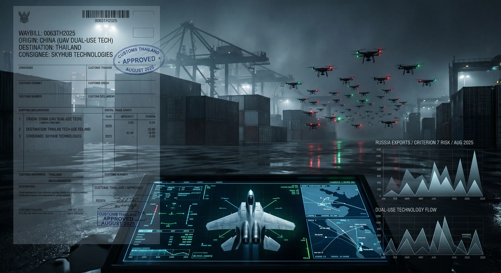

## 0063 – Thailand as a Diversion Jurisdiction: The Criterion 7 Evidence
**How a multi-jurisdictionally sanctioned transshipment economy for Russia-bound dual-use technology converts the European arms-export "risk of diversion" criterion from an abstraction into a documented finding — and what that means for the Gripen transfer**

-----

## 1. Scope and Purpose

This chapter supplies the empirical basis for a single, narrowly framed claim made in [0062 – Three-Layer Impunity](0062-three-layer-impunity-gripen-deal-2025.md): that **Criterion 7 of EU Common Position 2008/944/CFSP — the risk of diversion of exported military technology — was independently engaged** at the moment Sweden authorised the Gripen E/F transfer to Thailand in August 2025.

The argument must be stated precisely, because precision is what makes it survive scrutiny. This is **not** an allegation that the Royal Thai Air Force diverts equipment, that the Thai armed forces are complicit in the trade documented below, or that the Gripen itself will be re-exported to Russia. It is a narrower and better-supported claim: **Thailand has become, by the documented findings of three separate sanctions authorities, a transshipment jurisdiction for dual-use and military-relevant technology bound for Russia — operating under a regulatory regime that its own customs authority admits lacks the legal basis to stop it.** A jurisdiction with that record presents a structurally elevated diversion risk for any transfer of sensitive military technology, which is exactly what Criterion 7 instructs exporting states to assess.

-----

## 2. What Criterion 7 Requires

Criterion 7 of the Common Position obliges member states, before authorising an export, to weigh **the risk that the equipment will be diverted within the buyer country or re-exported under undesirable conditions**. The assessment is forward-looking and probabilistic; it does not require proof that a particular shipment has been diverted, only a credible assessment of the risk that it could be. The relevant evidence is therefore the recipient jurisdiction's **demonstrated control environment** — its track record of preventing, or failing to prevent, the onward flow of controlled goods.

On that test, Thailand's record by August 2025 was already documented and adverse.

-----

## 3. The Drone Pipeline

In February 2026, *Bloomberg News*, drawing on official Thai trade data and shipment-level records, documented Thailand's emergence as a transit route for Chinese-made drones bound for Russia:

- Russia imported approximately **USD 125 million** of drones from Thailand in the eleven months to the end of November 2025 — **88 % of Thailand's total UAV exports** and roughly **eight times** the figure of the previous year.
- In the same period, China shipped approximately **USD 186 million** of drones to Thailand, accounting for nearly all of Thailand's drone imports.
- In 2022, before the surge, Thailand exported **less than USD 1 million** of drones, with **none** going to Russia.

The mechanism is classic transshipment: Chinese-origin goods enter Thailand and are re-exported to Russia, with the change of origin obscuring the trail. Among the importers, **Skyhub Technologies** — Thailand's second-largest UAV importer — brought in some USD 25 million of drones in 2025 from the Chinese manufacturer Autel Robotics, including hundreds bearing the model code of the **Autel EVO Max 4T**, a nominally civilian platform that has been documented in combat use in Ukraine.

-----

## 4. The Corporate Mimicry Pattern

The largest single actor in the drone trade illustrates the identity-shifting that defines the network. **China Thai Corp** imported some **USD 144 million** of Chinese drones into Thailand in the first eleven months of 2025. Its reported revenue had risen from a token sum — around 14,000 baht annually from 2020 through 2022 — to 17.8 million baht in 2023 and 25.3 million baht in 2024, a trajectory consistent with a shell entity activated for a specific logistical purpose.

China Thai's involvement in Russia-bound supply predates the drone surge: in 2023 it acted as freight forwarder for a USD 2 million iPhone shipment to **OOO Atlas**, a Russian electronics firm later sanctioned by the EU, in a transaction linked to the Hong Kong company **DEXP International**, itself EU-sanctioned.

After being sanctioned by the United Kingdom in October 2025, China Thai Corp was observed **rebranding as Lanto Global Logistics** — the rapid identity change that allows a designated entity to continue operating behind a fresh name while the underlying logistics function is preserved. Staff at the site confirmed awareness of the sanction.

-----

## 5. The Multi-Jurisdictional Sanctions Record

The significance of the Thai diversion environment is that it has been independently confirmed by **three separate sanctions authorities**, not a single accuser:

| Authority | Designated Thai-based entity | Date | Basis |
|---|---|---|---|
| **United States (OFAC)** | NAL Solutions | January 2024 | Part of a network controlled by Russian national Nikolai A. Levin channeling electronics and other goods to Russia |
| **United States (OFAC)** | Intracorp Company Limited (and four further Thai firms) | 30 October 2024 (JY2700) | Established Thailand-based companies for Russian clients; created and administered Tsezar Group and RBW Lab, which sent high-priority goods to Russia |
| **United Kingdom** | China Thai Corp | October 2025 | Supplying technology to Russia's military |
| **European Union** | Two Thailand-based firms | October 2025 | Support for Russia's military |

The US Treasury's findings on the Intracorp cluster are concrete: **Tsezar Group** sent more than **USD 57 million** of goods to Russian end-users in 2023–24, including data-transmission machinery and optical-fibre cables; **RBW Lab** sent more than 200 shipments of comparable goods. These are not abstract designations but quantified flows of controlled and high-priority items.

The broader dual-use picture confirms the trend. Thailand's shipments of high-priority dual-use goods rose from **USD 8.3 million (2022) to USD 98.7 million (2023)** — an increase exceeding **1,000 %** — with an unusually large share in the most sensitive categories, including Tier-1 microchips as designated by US Customs.

-----

## 6. The Regulatory Admission

What elevates this from a record of private wrongdoing to a **jurisdiction-level** finding is the position of the Thai state itself. Thailand's Customs Director-General, Phantong Loykulnanta, stated in interview that the re-export of Chinese drones falls **within the legal framework**, that declaration of intended usage on import is **not mandatory**, and — decisively — that "**We are ready to act, but a law has to be in place first.**"

This is an admission, from the authority responsible for the border, that the control environment lacks the legal instruments to interdict the trade. For a Criterion 7 assessment, a recipient jurisdiction whose own customs authority states it cannot lawfully stop the onward flow of controlled goods is the textbook definition of an elevated diversion risk.

-----

## 7. Why This Engages Criterion 7 for the Gripen

The Gripen E/F is not a commercial drone. It carries advanced avionics, an electronic-warfare suite, and protected mission and source-code systems whose integrity depends on the recipient's ability to prevent unauthorised access or onward transfer. The diversion risk relevant to such a platform is not principally that an airframe is smuggled out, but that **sensitive technology, components, or technical data leak** through a permissive control environment.

Two documented facts converge on this point:

1. Thailand's demonstrated, multi-jurisdictionally sanctioned record as a transshipment hub for controlled technology to Russia (Sections 3–6).
2. The **United States' refusal to sell the F-35** to Thailand over fears of technology leakage given Thai-Chinese military alignment, documented in [0062 §3](0062-three-layer-impunity-gripen-deal-2025.md).

Where the United States treated Thailand's leakage risk as disqualifying for its most sensitive platform, Sweden authorised the transfer of its most advanced fighter without — on the public record — any corresponding diversion assessment surfacing in the procurement narrative. That asymmetry is the Criterion 7 gap.

-----

## 8. What This Chapter Does *Not* Claim

Forensic credibility requires stating the limits of the finding as clearly as the finding itself:

- It does **not** claim the Royal Thai Air Force participates in, or is aware of, the transshipment trade.
- It does **not** claim the Gripen or its components have been, or will be, diverted to Russia.
- It does **not** claim the documented drone and dual-use trade is, under current Thai law, illegal — the Customs authority states the opposite.

The claim is solely that Thailand's **documented control environment** presents a diversion risk that Criterion 7 obliges an exporting state to assess, and that the public procurement record contains no evidence such an assessment altered the decision. The weakness identified here is **Sweden's, in its assessment** — not an accusation of Thai military complicity.

-----

## 9. Synthesis

Criterion 7 is the quietest of the Common Position's tests, and the one most easily treated as an abstraction. The Thai case removes the abstraction. By August 2025, Thailand was not a hypothetical diversion risk but a **demonstrated** one — quantified in Treasury filings, confirmed by UK and EU designations, mapped by trade-data journalism, and conceded by its own customs authority. An exporting state applying Criterion 7 in good faith would have had to weigh that record before transferring a fighter platform built around protected technology. The procurement record gives no indication that it did.

This is the fourth jurisdiction in the accountability architecture mapped in 0062 where a substantive standard existed, was documented, and was not operationalised.

-----

## Sources

**Drone pipeline and corporate mimicry**

- Bloomberg / Bangkok Post, *"China's drone exports to Russia use a new route through Thailand"* (February 2026): <a href="https://www.bangkokpost.com/business/general/3201334/chinas-drone-exports-to-russia-use-a-new-route-through-thailand" target="_blank" rel="noopener noreferrer">link</a>
- The Moscow Times, *"China Exporting Drones to Russia Via Thailand – Bloomberg"* (20 February 2026): <a href="https://www.themoscowtimes.com/2026/02/20/china-exporting-drones-to-russia-via-thailand-bloomberg-a92016" target="_blank" rel="noopener noreferrer">link</a>

**Sanctions record**

- U.S. Department of the Treasury, *"Treasury Takes Aim at Third-Country Sanctions Evaders and Russian Producers Supporting Russia's Military Industrial Base"* (press release JY2700, 30 October 2024): <a href="https://home.treasury.gov/news/press-releases/jy2700" target="_blank" rel="noopener noreferrer">link</a>
- VOA, *"More Thai firms turning up on US sanctions list for trade with Russia"* (February 2025): <a href="https://www.voanews.com/a/more-thai-firms-turning-up-on-us-sanctions-list-for-trade-with-russia-/7987637.html" target="_blank" rel="noopener noreferrer">link</a>
- OFAC Recent Actions, 30 October 2024: <a href="https://ofac.treasury.gov/recent-actions/20241030" target="_blank" rel="noopener noreferrer">link</a>

**EU / international framework**

- EU Council Common Position 2008/944/CFSP (8 December 2008) — Criterion 7, risk of diversion

-----

**Related Observatory analyses**

- [0062 – Three-Layer Impunity: The August 2025 Gripen Deal as Praetorian Procurement](0062-three-layer-impunity-gripen-deal-2025.md)
- [0059 – The Israeli–Thai Surveillance and Arms Pipeline](0059-israeli-thai-surveillance-arms-pipeline.md)
- [0049 – Thai–Cambodian Border Dispute (2026)](0049-thai-cambodian-border-dispute-2026.md)

-----

