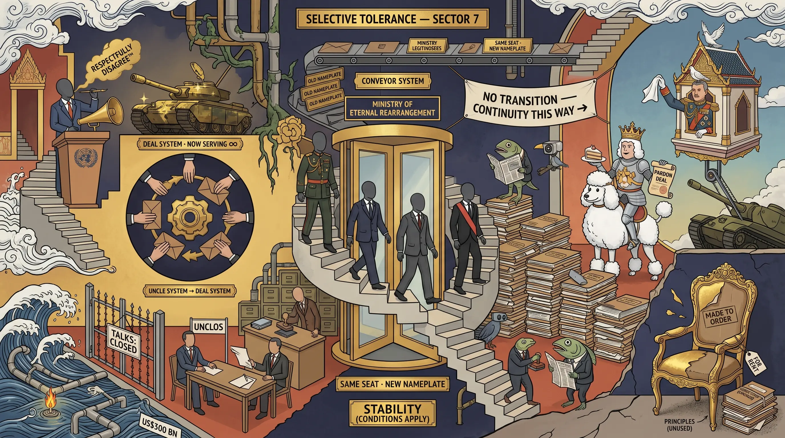

## 0065 – No Transition, Only Continuity
**Sihasak, Anutin, Prayut, and the Establishment That Does Not Change**

When General Prayut Chan-o-cha vacated the premiership and Anutin Charnvirakul eventually assumed it, the event was reported as a transition — one government giving way to another. This mistakes the surface for the structure. There was no transition in any meaningful sense; there was continuity — of personnel, of the order they serve, and of the rewards that order distributes. The argument here is deliberately falsifiable: trace the careers rather than the cabinet names, and the same establishment occupies every chair. Anutin rose from Prayut's deputy to the premiership; Prayut ascended from coup-maker to the King's Privy Council; Sihasak Phuangketkeow moved from international legitimiser of the 2014 coup, through the junta's flagship economic vehicle, to the foreign ministry. The names changed; the order, its people and its rewards did not. This is what Stithorn Thananithichot describes as "the uncle system… evolved into a deal system."

-----

### I. The puzzle

How does a figure of the Prayut order become foreign minister under a nominally new government? The question answers itself once its premise — that a transition occurred — is withdrawn.

-----

### II. Anutin: the man who was on every side

Anutin's biography is the deal system in miniature. He entered national politics as a deputy minister — commerce, then public health — in the Thai Rak Thai government of Thaksin Shinawatra. When the 2006 coup dissolved that party, he was among the **111 banned executives**, barred from office until 2012. He resurfaced at the head of **Bhumjaithai** — the party built on Newin Chidchob's 2008 defection from Thaksin, the telephone call remembered as *"It's over, boss."* Bhumjaithai (51 seats in 2019) joined the Prayut coalition; Anutin served as **deputy prime minister and minister of public health, 2019–2023**, then interior minister, and in 2025 became **prime minister**.

He did not displace the Prayut order; he rose within it and inherited its seat. His arc is the more telling for its symmetry: Thaksin's deputy, then banned by the post-coup court, then the coup-order's deputy premier, and finally premier — presiding, in 2025, over the reconciliation that returned Thaksin to the political fold. Two decades of professed enmity resolve, in one career, into what they always were: not a contest of principle, but a question of where power lay.

-----

### III. Prayut: from coup-maker to Privy Councillor

The 2014 coup gave way to roughly nine years as prime minister and then, by Royal Gazette of 29–30 November 2023, to appointment to the **Privy Council**, coverage framing it as a mark of "continuity and stability." Read structurally — and as a documented pattern, not a claim about royal intent — the elevation repeats the reward sequence set out in [0062](0062-the-august-2025-gripen-deal.md): senior figures of the praetorian order are subsequently raised to royal-affiliated bodies, as ACM Chalit Phukphasuk was in 2011. Prayut is the apex instance: the coup-maker is not retired but seated in the realm's highest advisory body.

-----

### IV. Sihasak: the diplomat as legitimiser

In December 2025 Bhumjaithai named Sihasak its second prime-ministerial candidate, presenting him as "a highly experienced diplomat who will uphold the dignity of Thailand in international forums." The description is accurate — which is precisely why it should be read the other way round. The skill the party offers as a credential is, on the documented record, skill in rendering the exercise of unelected power acceptable to an international audience.

His standing is genuine: a career diplomat since 1979, permanent secretary of the foreign ministry (2011–2015), and, in 2010–2011, the first Asian chair of the United Nations Human Rights Council. It was in that authority that he became the international voice of the military government after the coup of 22 May 2014. The National Council for Peace and Order sent him abroad to explain the takeover; meeting the European Union's delegation he "respectfully disagreed" with Europe's condemnation, urged it not to rush to judge the junta's restoration plan, and dismissed its measures as "symbolic." In June 2014 he appeared before the Human Rights Council he had once chaired to defend the junta's detentions. The inversion is evidentiary, not rhetorical: the diplomatic competence presented as his qualification is, in the record, competence in the service of legitimising unelected force. **The credential is the indictment.**

After ambassadorships in Tokyo (2015–16) and Paris (2016–18, with concurrent UNESCO and OECD accreditation), Sihasak served as **Special Advisor for Foreign Affairs at the Office of the Eastern Economic Corridor** — the NCPO's flagship special economic zone, itself a documented nexus of megaproject infrastructure, dominant conglomerates and state patronage, its centrepiece rail scheme a public–private consortium with the Charoen Pokphand Group on a 50-year land lease.

As foreign minister in 2025–26 the pattern recurs in a new theatre. After Thailand unilaterally terminated the 2001 memorandum (the "MoU 44") on the overlapping maritime claims — some 26,000 sq km of the Gulf of Thailand holding an estimated 12 trillion cubic feet of gas and oil, valued near US$300 billion — Cambodia turned to **compulsory conciliation under UNCLOS**. Sihasak's response was to ask for bilateral talks "a chance — six months," to express dismay that Phnom Penh also wished to discuss resource-sharing, and to warn that conciliation could take years, citing **Timor-Leste v Australia** as his cautionary example. Two contradictions undo the position. First, his own government simultaneously suspended *all* bilateral talks and sealed every border gate: to demand bilateral negotiation while terminating the bilateral framework and closing the frontier is not a stance but a reflex — to cast the establishment's unilateral choice as the reasonable one. Second, the precedent refutes the warning: Timor-Leste v Australia is the case widely recorded as a **success**, in which the weaker party used precisely this non-binding mechanism to secure a boundary treaty that decades of bilateral talks — preferred by the stronger party — had failed to produce. The example Sihasak offers as a deterrent is the precedent for exactly what Cambodia has done, and why. Days after presenting "policy stability" as a Thai virtue to the OECD in Paris, his government voided a treaty and closed a border. The competence is unchanged; only the theatre is new.

-----

### V. The mechanism

The connective tissue is structural, not conspiratorial. The same establishment recurs because the order that selects it persists: Prayut seated on the Privy Council; the Anutin cabinet sworn, as all cabinets are, before the throne; and below, the patronage economy that the EEC and its conglomerate partners exemplify. The recurrence is not confined to the three principals. The long-serving secretary-general of the Council of State, **Pakorn Nilprapunt** — the state's chief legal draftsman across the late-Prayut years — moved into the Anutin cabinet as deputy prime minister for legal affairs, the establishment's lawyer continuing seamlessly across the "transition." Governments rotate; the order, its rewards, and its legal and patronage apparatus do not. Stithorn's formulation holds: the uncle system has become the deal system.

-----

### VI. Synthesis

No transition, only continuity. The seat is inherited (Anutin), the reward is the Privy Council (Prayut), and the credential is the indictment (Sihasak); the apparatus persists beneath all three (Pakorn). The same establishment, across several offices, bound above by the throne and below by the patronage economy. The claim is testable: were this a genuine transition, the personnel, the rewards and the patronage relationships would have changed. They have not.

-----

## Sources

**Anutin — career and continuity of office**
- [Anutin Charnvirakul — Wikipedia](https://en.wikipedia.org/wiki/Anutin_Charnvirakul) — deputy minister (commerce, public health) under Thaksin; among the 111 banned Thai Rak Thai executives (ban to 30 May 2012); Bhumjaithai leader since 2012; deputy PM 2019–25; PM from September 2025.
- [Anutin Charnvirakul's 29-year political journey — Bangkok Post](https://www.bangkokpost.com/thailand/politics/3099333/anutin-charnvirakuls-29year-political-journey)
- [Anutin sworn in as Thai PM, unveils first cabinet picks — The Diplomat](https://thediplomat.com/2025/09/anutin-sworn-in-as-thai-prime-minister-unveils-first-cabinet-picks/)
- Newin Chidchob's 2008 defection from Thaksin ("It's over, boss") and the installation of the Abhisit Vejjajiva government — AFP / The Straits Times profile, 2017 *(pin exact URL)*.

**Prayut — Privy Council**
- [Prayut Chan-o-cha appointed as a privy councillor — Nation Thailand](https://www.nationthailand.com/thailand/general/40033357)
- [Prayut named privy councillor — Bangkok Post](https://www.bangkokpost.com/thailand/politics/2696023/prayut-named-privy-councillor)
- [Appointment welcomed as a sign of continuity and stability — Thai Examiner](https://www.thaiexaminer.com/thai-news-foreigners/2023/12/03/ex-pm-prayut-appointed-to-privy-council/)
- ACM Chalit Phukphasuk → Privy Council, 2011 (reward-structure precedent; cf. 0062) *(pin exact source)*.

**Sihasak — coup defence, EEC, diplomacy**
- [Sihasak Phuangketkeow — Wikipedia](https://en.wikipedia.org/wiki/Sihasak_Phuangketkeow)
- [Profile: Sihasak Phuangketkeow tipped as foreign minister — Nation Thailand](https://www.nationthailand.com/blogs/news/politics/40055077)
- [Sihasak explains junta's stance at UN meeting in Geneva — Nation Thailand](https://www.nationthailand.com/in-focus/30236215)
- [EU coup response 'not sanctions' (delegation head clarifies) — Bangkok Post](https://www.bangkokpost.com/thailand/politics/417085/eu-delegation-head-clarifies-response)
- [Sihasak downplays EU's 'symbolic' coup penalties — Bangkok Post](https://www.bangkokpost.com/thailand/politics/417198/sihasak-downplays-eu-s-symbolic-coup-penalties)
- [Royal Thai Embassy, Copenhagen — Sihasak as Special Advisor for Foreign Affairs, Office of the EEC](https://copenhagen.thaiembassy.org/en/content/the-royal-thai-embassy-made-arrangement-for-the-me)
- [Eastern Economic Corridor — Wikipedia](https://en.wikipedia.org/wiki/Eastern_Economic_Corridor)
- [Extended state infrastructure power… Thailand and Taiwan — Stokols & Kollar, 2025 (Sage)](https://journals.sagepub.com/doi/10.1177/0308518X241280751)

**The maritime theatre (2025–26)**
- [Sihasak maps out vision at OECD meet — Bangkok Post](https://www.bangkokpost.com/thailand/general/3265948/sihasak-maps-out-vision-at-oecd-meet)
- "Border move 'saps trust' / Thailand to join UN maritime arbitration with Cambodia" — Bangkok Post, June 2026 *(pin exact URL)* — the $300bn / 26,000 sq km / 12 tcf figures; "give bilateral talks six months"; all border gates closed.
- [Maritime talks with Cambodia fail — Bangkok Post](https://www.bangkokpost.com/thailand/general/3261978/maritime-talks-with-cambodia-fail)
- [Australia and Timor-Leste's landmark maritime boundary conciliation — The Diplomat](https://thediplomat.com/2018/05/australia-and-timor-lestes-landmark-maritime-boundary-conciliation-process/)
- [The Timor-Leste/Australia Conciliation: A Victory for UNCLOS — NUS Centre for International Law](https://cil.nus.edu.sg/publication/the-timor-leste-australia-conciliation-a-victory-for-unclos-and-peaceful-settlement-of-disputes/)

**The mechanism — recurring personnel**
- [Anutin assigns portfolios to deputy premiers (Pakorn Nilprapunt, legal affairs) — Nation Thailand](https://www.nationthailand.com/news/politics/40064806)
- [Pakorn tipped amid Borwornsak uncertainty — Bangkok Post](https://www.bangkokpost.com/thailand/politics/3222584/pakorn-tipped-amid-borwornsak-uncertainty)

