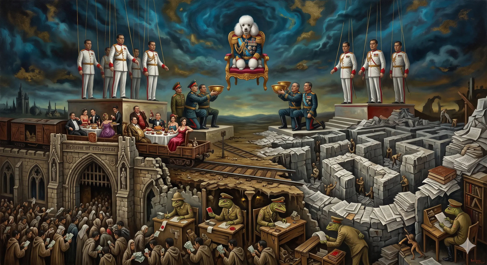

## 0066 – The Dual System

### *Nationalism for the Masses, Openness for Capital — One Establishment, Two Faces*

The deal system ([0065](0065-no-transition-only-continuity.md), after Stithorn Thananithichot) describes *who* holds power and how it rewards itself. This node describes *how that power legitimises and finances itself at the same time* — by running two contradictory programmes at once, addressed to two separate audiences, in service of one beneficiary. Call it the **dual system**: nationalism for the masses, openness for capital. The two faces look incompatible. They are not. They are complementary functions of the same order, and the apparent quarrel between them is the mechanism that keeps the order stable.

-----

### I. The two layers

The system operates on two registers that almost never share a room.

**Layer A — nationalism and mobilisation.** Domestic, Thai-language, emotional. It wins elections, channels grievance outward — toward Cambodia, the border, the "lost territories" — and crowds the deal system out of public view. Its audience is the mass electorate, and its currency is feeling: pride, threat, belonging.

**Layer B — openness and accumulation.** International, English-language, technocratic. It courts foreign direct investment, pursues OECD accession ([0042](0042-thailand-oecd-structural-incompatibilities.md), [0057](0057-the-paris-bubble.md)), and reassures capital that Thailand remains a predictable place to park money. Its audience is investors, foreign chancelleries and the OECD secretariat, and its currency is confidence.

The two layers appear to pull in opposite directions — one inward, one outward; one hot, one cool. But they deliver to the **same beneficiary**. Layer A secures *power*: votes, legitimacy and a standing enemy to mobilise against. Layer B secures *money*: capital inflows, megaproject patronage, the EEC nexus traced in [0065](0065-no-transition-only-continuity.md). Power and money are segregated by audience and consolidated at the top. The contradiction is not a malfunction; it is the division of labour.

-----

### II. Segregation by audience — why the contradiction never surfaces

The dual system survives because its two messages are **kept apart by language and channel**. The nationalist mobilisation runs in Thai for the domestic base; the openness pitch runs in English for Paris and the investor class. Very few readers consume both registers, so the two faces rarely meet in public, and the citizen who hears only the nationalism never sees the bill the openness face is quietly underwriting.

The juxtaposition is nonetheless visible to anyone who reads across the divide. The same establishment that voids a maritime framework and seals the border ([0055](0055-the-mou44-crisis.md)) sends its foreign minister to present "policy stability" as a Thai virtue at the OECD ([0065](0065-no-transition-only-continuity.md)). Same actors, opposite faces, different rooms. The wall between the rooms is not secrecy — both performances are entirely public — but **audience segmentation**: each face is invisible to the other's audience.

-----

### III. The fault line — and the self-policing

The arrangement carries an **internal contradiction**. Unchecked nationalism — border closures, treaty termination, an investment-chilling regional confrontation — threatens the openness layer's core asset, which is capital confidence. Left to run, Layer A corrodes Layer B.

So the system **self-polices**. The clearest tell is the opinion-page op-ed **"Nationalism is a Bad Fit for Thailand"** — published as the government moved to nationalise the school curriculum (more Thai language, civics and Thai history) and arguing, in plain economic terms, that a country whose strength "was not built behind walls, but through trade, tourism, foreign investment and participation in regional and global supply chains" cannot afford to turn inward. That is the openness face disciplining the nationalism face the moment the latter begins to cost capital. The reprimand is not dissent from the order; it is the order's **thermostat**.

This yields the node's load-bearing, **falsifiable** test: watch *who* reins in the nationalism, and *when*. If these were two genuinely opposed camps, the nationalism would be checked when it harms democracy, due process, or the neighbour. Instead it is checked only when it threatens FDI and the OECD timetable. The brake is wired to capital confidence, not to constitutional or humanitarian cost — and that wiring is the whole argument.

-----

### IV. "Permitted but invisible" — the dual logic everywhere

The same deniable-by-design structure recurs across the Observatory's nodes. A thing is **permitted in form** and **neutralised in effect** — granted in principle, voided in practice, with no single moment one can point to as the denial:

| Domain | Permitted in principle | Neutralised in effect | Node |
|---|---|---|---|
| The ballot | secret | traceable | [0064](0064-the-traceable-ballot.md) |
| The election | free | disproportionate / contested | [0064](0064-the-traceable-ballot.md) |
| Welfare | help for the poor | surveillance + regressive tilt | [0060](0060-thai-help-thai-plus-constitutional-architecture.md) |
| Comments | open | batch-released late, read by almost no one | [0011](0011-bangkok-post-comment-ecology.md) / [0027](0027-bangkok-post-discursive-Filtering-comment-section-2026.md) / [0053](0053-bangkok-post-institutional-discourse-distortion.md) |
| Maritime dispute | negotiable | bilateral framework terminated, border sealed | [0055](0055-the-mou44-crisis.md) / [0065](0065-no-transition-only-continuity.md) |

"Free in form, void in effect" is the through-line. The dual system is this same logic scaled up from the individual mechanism to the level of the whole regime: the openness it advertises is real on paper and the nationalism it runs is real in the street, and both are arranged so that neither audience ever has to reconcile them.

-----

### V. The physical illustration — Ta Kwai

One site compresses the dual system into a single image: **Prasat Ta Kwai**, a contested Khmer temple on the Surin border. Cambodian forces occupied the ruin during the July 2025 clashes; the Thai army recaptured it by December 2025; and by the 2026 Songkran holiday the state had reopened it — not as a restored heritage monument but as an **army-organised pickup-truck tour**. Visitors register at a border school and are shuttled to the former front line in military trucks. Cambodia's culture ministry formally protested the tourism as a violation of its sovereignty, which is precisely the point: the protest refreshes the enemy.

The same state that stages this irredentist spectacle for the domestic base markets itself, in parallel and in English, to the OECD as a practitioner of "peaceful, rules-based" dispute settlement ([0042](0042-thailand-oecd-structural-incompatibilities.md), [0057](0057-the-paris-bubble.md)). Ta Kwai is the dual system rendered in concrete and shuttle buses: front-line tourism for the base, peaceful-settlement diplomacy for Paris, both true, both deliberate, addressed to audiences that will never compare notes.

-----

### VI. Provocation as maintenance — the useful enemy

The nationalism layer requires a **standing enemy**, and the Cambodia confrontation supplies one. Read as foreign policy it looks like repeated failure; read as domestic legitimation it is an **asset**, periodically reactivated — a border incident, a treaty termination, a temple seizure — to refresh the mobilisation when it flags.

The grievance is durable infrastructure rather than a passing mood. It runs back through the **"lost territories"** trauma: the colonial-era cessions to France and Britain (Laos 1893 and 1904; Battambang–Siem Reap 1907; the Dangrek temples), which fed Phibun-era irredentism (the renaming of Siam to Thailand in 1939; the 1941 seizure of border provinces) and which today's revanchism still draws on. A standing enemy this old does not need to be invented; it needs only to be maintained.

The discipline here is strict: the **incentive structure** is defensible, but **intent is not provable**. The claim is functional — the enemy is useful, the provocation maintains it — not a documented plan to provoke. The dual system is an emergent equilibrium, not a minuted conspiracy.

-----

### VII. The fiscal face — the dual deficit

The dual system has an economic expression: the **twin deficit**, the simultaneous slide of the current account and the fiscal balance into the red — the "double dip" that economists began warning of in 2026. A patronage-extractive order cannot deliver the "industrial transformation" that figures like the FTI's Pimjai hope for, because it spends on vanity and mobilisation rather than on productivity or schooling.

The structural signature is chronic under-investment. By the "double dip" analysis, private investment has stalled near **20% of GDP**, against **more than 30% in Vietnam** — a persistent shortfall that maps onto the skills crisis of [0051](0051-thailands-foundational-skills-crisis.md) and onto Thirachai's warning that the headline stimulus is a "vote-seeking giveaway," consumption rather than investment. The monuments tell the same story: a **US$17.3 million submarine headquarters** opened at Sattahip in 2014 has stood ever since without a single submarine to command, the navy's last boat having been decommissioned in 1950. Money flows to the symbol, not the capacity.

The media tenor completes the face. The reassuring refrain — "the deficit will self-correct" — conceals *who* corrects it: a weaker baht means costlier imports means thinner purchasing power, so **"it sorts itself out" means the public sorts it out, quietly, at the till.** Narrative management is simply the openness face's perception department.

-----

### VIII. Synthesis

The deal system says *who benefits*; the dual system says *how the benefit is legitimised and financed at once* — nationalism to secure the power, openness to secure the money, each addressed to an audience that cannot see the other. One establishment, two faces, two audiences, one beneficiary. The faces appear to fight, and the fight is the thermostat: it runs hot for the base and cool for the capital, and it is regulated not by principle but by the temperature of investor confidence.

The contradiction, in other words, is not a flaw in the system. It is the design. And it is testable: if the two faces belonged to genuinely opposed camps, the nationalism would be reined in when it harms democracy or the neighbour. It is reined in only when it threatens capital. The beneficiary is singular.

-----

## Sources

**Framework**
- Stithorn Thananithichot — "the uncle system no longer worked… so it evolved into a deal system." Bangkok Post, *"Blue regime debate ignites"*: https://www.bangkokpost.com/thailand/special-reports/3263553/blue-regime-debate-ignites (cf. [0065](0065-no-transition-only-continuity.md)).
- The two-layer reading is this node's own synthesis — an interpretive framework, not a single-source claim.

**The self-policing fault line**
- *"Nationalism is a Bad Fit for Thailand"* — Bangkok Post opinion (June 2026), the openness face's economic reprimand of the nationalist turn, occasioned by the nationalist revision of the school curriculum: https://www.bangkokpost.com/opinion/opinion/3266820/nationalism-is-a-bad-fit-for-thailand

**The physical illustration / the useful enemy**
- Prasat Ta Kwai (Surin): Cambodian occupation in the July 2025 clashes, Thai recapture by December 2025, then army-organised pickup-truck tourism from Songkran 2026 onward —
  - *"Over a thousand visitors flock to reopened Prasat Ta Kwai and Hill 350 in Surin"*: https://www.thailandnews.co/2026/06/over-a-thousand-visitors-flock-to-reopened-prasat-ta-kwai-and-hill-350-in-surin/
  - Thai PBS, *"Thai army regains control of Ta Kwai Temple"*: https://world.thaipbs.or.th/detail/thai-army-regains-control-of-ta-kwai-temple-situation-remains-volatile/59882
- "Lost territories" / Franco-Siamese cessions 1893 and 1904, Anglo-Siamese 1907; Phibun irredentism 1939–41 — standard historiography.
- cf. [0049](0049-thai-cambodian-border-dispute-2026.md), [0055](0055-the-mou44-crisis.md).

**The fiscal face**
- *"A double dip on the cards?"* — Bangkok Post (2026): private investment ~20% of GDP vs. Vietnam 30%+; FTI/Pimjai "industrial transformation"; Thirachai "vote-seeking giveaway": https://www.bangkokpost.com/business/general/3267593/a-double-dip-on-the-cards
- Sattahip submarine headquarters ≈ US$17.3m, opened July 2014, idle (navy without submarines since 1950) — Bangkok Post, *"Yes, we have no submarines"*: https://www.bangkokpost.com/thailand/special-reports/394026/yes-we-have-no-submarines
- cf. [0060](0060-thai-help-thai-plus-constitutional-architecture.md), [0051](0051-thailands-foundational-skills-crisis.md).

**The openness face**
- [0042](0042-thailand-oecd-structural-incompatibilities.md), [0057](0057-the-paris-bubble.md), [0058](0058-conditioning-unesco-paris-equal-inspection-demand.md), [0065](0065-no-transition-only-continuity.md).

**The "permitted but invisible" logic**
- [0064](0064-the-traceable-ballot.md) (ballot), [0011](0011-bangkok-post-comment-ecology.md) / [0027](0027-bangkok-post-discursive-Filtering-comment-section-2026.md) / [0053](0053-bangkok-post-institutional-discourse-distortion.md) (comments).

-----

## Discipline checklist (verification record)

- [x] **Function, not intent.** §VI states the incentive structure and effect; no documented plan to provoke or coordinate is asserted. The dual system is framed as an emergent equilibrium throughout.
- [x] **"manufactured landslide", NOT "supermajority"** — not invoked in the body; flag retained for any derivative (BJT 194/500 ≈ 39%).
- [x] **Self-policing claim kept as the load-bearing falsifiable test** (§III, §VIII) — and the op-ed checked: it reins in nationalism *because it threatens the open economy*, fitting the thermostat reading.
- [x] **§112** — royalist/sakdina core confined to the internal note; absent from the public body and Sources.
- [x] **Late-comment batching** — phrased as the Observatory's own observation (§IV), not as documented policy.
- [x] **Figures verified before leaving scaffold** — US$17.3m Sattahip HQ (2014, idle); 20% vs 30%+ investment (attributed to the "double dip" article, *not* claimed as a BoT-original figure); Ta Kwai chronology corrected to July 2025 → Dec 2025 → Songkran/June 2026; "same week" OECD juxtaposition softened to a non-dated contrast.

-----

*Filed under: synthesis, the deal system, nationalism, political economy, media architecture.*

*Cross-references: [0065](0065-no-transition-only-continuity.md), [0060](0060-thai-help-thai-plus-constitutional-architecture.md), [0042](0042-thailand-oecd-structural-incompatibilities.md), [0064](0064-the-traceable-ballot.md), [0055](0055-the-mou44-crisis.md), [0049](0049-thai-cambodian-border-dispute-2026.md), [0051](0051-thailands-foundational-skills-crisis.md), [0057](0057-the-paris-bubble.md).*

