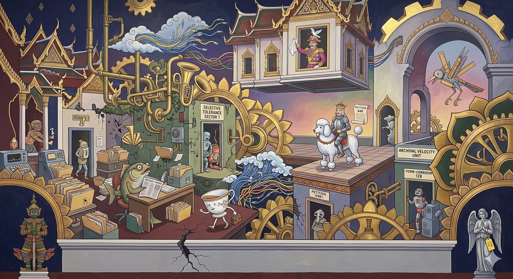

## 0067 – Loyalty over Competence

### *Thailand's Dysfunctional Elite Culture — from the Rigged Civil-Service Exam to the Palace-Picked General*

The June 2026 civil-service exam scandal was reported as a crime: a gang caught altering answer sheets for bribes. Read it instead as a **self-portrait**. A state that reproduces its officials by selling entry rather than testing merit is not malfunctioning; it is running to specification. Where the deal system ([0065](0065-no-transition-only-continuity.md)) describes *who* rules and the dual system ([0066](0066-the-dual-system.md)) describes *how* power legitimises and finances itself, this node names the **logic that selects the personnel who staff both**: loyalty and patronage over competence. The exam scandal is that logic at the **entry gate**; military promotion by palace endorsement is the same logic at the **apex**; and a pet holding a marshal's rank is its **emblem**.

-----

### I. The entry gate is auctioned — the exam scandal (June 2026)

The Department of Local Administration (DLA), under the Ministry of Interior, ran a nationwide recruitment examination — roughly **480,000 candidates for about 7,000 posts**. According to the Central Investigation Bureau and the anti-corruption agencies, a network charged from **350,000 baht** for ordinary positions up to **700,000–800,000 baht** (about US$10,500 to US$24,000) for the competitive ones, with total bribes estimated at **up to 4.5 billion baht**. When police raided a company premises in Nonthaburi they found roughly ten officials still at work — and recovered around **3,000 answer-sheet copies from the 15 February 2025 examination, some 2,000 of them already altered**.

The decisive detail is *how* the fraud worked. The officials were editing digital copies of the answer sheets **to match scores the DLA had already announced** on its website. The marking was reverse-engineered to fit a predetermined result, kept internally consistent between paper and database so as to survive a routine check. The merit test was therefore **theatre**: the outcome was written first and the examination back-filled to justify it.

Why is entry worth a year's wages? Because the state it admits you to is **two-tiered** ([0060](0060-thai-help-thai-plus-constitutional-architecture.md)). The civil-servant medical scheme covers about **7% of the population but consumes roughly 19% of national health spending**, while the universal scheme covers some **76% on about 22%**; per head, the civil-service scheme spends on the order of **four times as much** (around 13,800 baht per member against 3,200 under universal coverage, 2012–2015). Add a guaranteed pension in a country whose informal-sector majority has none, and the up-front bribe is simply the **capitalised market price** of crossing into the protected tier.

The state's response carried the right verbs. DLA Director-General **Teeruth Supawiboonpol was transferred to an inactive post**; Prime Minister **Anutin Charnvirakul ordered the tainted recruitment revoked** ("because the process… was illegal, the announced results must be revoked"); the anti-corruption commission impounded the materials and announced a recheck of all 480,000 papers. These are real steps — but the test is **follow-through**. Whether they harden into prosecutions and permanent procedural change, or dissolve into a review committee that never reports, is the only thing that distinguishes accountability from its performance (cf. the Khao Kradong pattern, [0061](0061-dsi-senate-investigation-silenced-under-bhumjaithai.md)).

-----

### II. The apex selects for loyalty — military promotion

The same principle governs the commanding heights. As Paul Chambers' work on the 2025 reshuffles documents, senior Thai military and institutional appointments are dominated by **pre-cadet academy "class" networks, factional alignment, and palace endorsement** rather than by operational or combat proficiency. Officers are tracked by graduating class; advancement runs through patronage rather than performance.

The clearest credential is the **Royal Guard 904** ("Tahan Kaw Daeng," the "Red Rim" soldiers): completing the elite King's Guard programme lets an officer claim a formal connection to the palace and sharply improves his standing for top commands and strategic postings. Proximity, certified as a qualification, becomes the single most significant promotion factor.

Entry gate and apex are thus staffed by one logic. The clerk's exam is auctioned; the general's star is allocated by alignment. In both, **structural loyalty and network proximity outrank verifiable capability** — which is the node's whole claim, observed at the bottom of the bureaucracy and at its top.

-----

### III. The academic backbone

The pattern is not a novelty of 2026; it is the long-described structure of the Thai state.

**Fred Riggs' "bureaucratic polity"** names a state in which power is concentrated within the official class itself, with weak extra-bureaucratic or civic checks. His companion concept, the **"prismatic society,"** explains the divergence on display in the exam hall: modern institutional *forms* — standardised merit examinations — coexist with patrimonial *substance*, so that the form of a merit bureaucracy is routinely repurposed for clientelist distribution. The historical antecedent is **กินเมือง (kin muang)**, the pre-modern practice of un-salaried officials entitled to "eat" the province they administered — an extraction logic that survived the Rama V salary reforms in changed form, and of which the digitised exam auction is the contemporary expression.

To this, **Duncan McCargo's "network monarchy"** *(node-internal; see §112 note)* adds the mechanism of elite reproduction: power exercised, and personnel reproduced, through personalistic patronage networks that cut across the formal constitutional structures rather than through impersonal, merit-based institutions.

-----

### IV. The emblem — the pet rank *(node-internal only; never in public comment)*

The reductio of the whole culture is a documented anecdote: a **royal pet recorded at the rank of Air Chief Marshal** (US Embassy Bangkok cable, 2009). Status flows from proximity to power rather than from capability — to the point where an animal can formally outrank essentially every serving soldier. It is the **emblem, not the proof**: the proof is the structural pattern of §§ I–II. The emblem only makes visible, in a single absurd image, what the rigged exam and the palace-picked general establish by repetition.

*§112 discipline:* this anecdote, McCargo's network monarchy, and the Royal Guard 904 material are **royal-touching** and belong **only in this pseudonymous node**, in a scholarly, cited register. They must **never** appear in a public-facing comment under the commenting identity. In public the identical argument travels **de-royalised and abstracted** — "a system that rewards loyalty over competence," or at most a single-veil "a four-legged mammal outranking 99.99% of soldiers," with no royal naming and no second cue.

-----

### V. The four inversions (anchored, not aphoristic)

| Inversion | Concrete anchor |
|---|---|
| **Loyalty over competence** | the rigged DLA exam (§I); palace-endorsed senior commands (§II) |
| **Patronage over professionalism** | regulatory/judicial directives neutralised to shield network assets — Khao Kradong, the agency serving the network not the court ([0061](0061-dsi-senate-investigation-silenced-under-bhumjaithai.md)); the deal system ([0065](0065-no-transition-only-continuity.md)) |
| **Symbolism over institutions** | nationalist curriculum prioritised over foundational literacy and PISA performance ([0051](0051-thailands-foundational-skills-crisis.md)); the pet rank |
| **Staging over reality** | the "no big deal" reassurance chorus; EEC and data-centre pledges set against Vietnam's faster real growth |

The emblem illustrates; the table proves. The diagnosis rests on the pattern, never on the single anecdote.

-----

### VI. The consequence — state-capacity decay and the Vietnam lag

When access to the public administration is **commodified**, the selection apparatus filters for ability-to-pay and connection rather than for the analytical, linguistic and governance skills the exam claims to measure. The predictable result is degraded state capacity — and, downstream, a competitiveness gap with neighbours who select differently.

The comparison Thitinan Pongsudhirak drew in June 2026 is the headline symptom: Thailand's trend growth has settled near **2–3%**, while Vietnam sustains **roughly double that pace** (about 6–7%) and is closing on Thailand's economy outright, carried by a younger workforce with broader English and a visible "hunger for growth." Thitinan stops at instability; this node names the deeper cause. The point survives without inflating Vietnam's rate: **a state that auctions merit cannot out-build one that accumulates it.** The exam scandal is not a side-story to the lag — it is one of its mechanisms (cf. [0042](0042-thailand-oecd-structural-incompatibilities.md), the OECD good-governance bid advanced over billion-baht bribery at the recruitment gate; [0051](0051-thailands-foundational-skills-crisis.md), the foundational-skills crisis).

-----

### VII. Synthesis

The June 2026 manipulation cannot be resolved by rechecking 480,000 papers, because the rechecking treats the symptom. The disease is a selection culture that **prizes loyalty over competence at every tier**, from the exam hall to the general staff — a patrimonial bureaucracy that misallocates human capital precisely in order to preserve network cohesion. Deal system ([0065](0065-no-transition-only-continuity.md)) → dual system ([0066](0066-the-dual-system.md)) → the **personnel logic that staffs both**. The recheck is accountability theatre unless it reaches that culture; and cultures are not rechecked, they are replaced.

-----

## Sources

**The exam scandal (June 2026)**
- [Exam scandal leads to checks on all 480,000 papers — Bangkok Post](https://www.bangkokpost.com/thailand/general/3276475/exam-scandal-leads-to-checks-on-all-480000-papers)
- [Multi-billion-baht exam-rigging gang busted — Bangkok Post](https://www.bangkokpost.com/thailand/general/3275237/multibillionbaht-examrigging-gang-busted)
- [PM nullifies recruitment of thousands of officials — Bangkok Post](https://www.bangkokpost.com/thailand/general/3275922/pm-nullifies-recruitment-of-thousands-of-officials-after-exam-cheating-scandal)
- [Ministry sidelines DLA chief (Teeruth Supawiboonpol) — Bangkok Post](https://www.bangkokpost.com/thailand/general/3275549/ministry-sidelines-dla-chief-on-nationwide-examrigging-case)
- [Thai officials caught altering exam scores for bribes up to US$24,000 — SCMP](https://www.scmp.com/week-asia/politics/article/3358178/thai-officials-caught-altering-exam-scores-bribes-us24000)

**The privilege tier / why entry is worth it**
- "Strategic purchasing and health system efficiency: a comparison of two financing schemes in Thailand," *PLOS One* (2018) — CSMBS ~7% of population / ~19% of health spending vs UCS ~76% / ~22%; per-member ~4× (≈13,800 vs ≈3,200 baht, 2012–15): https://journals.plos.org/plosone/article?id=10.1371/journal.pone.0195179
- cf. [0060](0060-thai-help-thai-plus-constitutional-architecture.md) — the two-tier state.

**The academic backbone**
- Fred W. Riggs, *Thailand: The Modernization of a Bureaucratic Polity* (1966) — bureaucratic polity / prismatic society.
- *Kin muang* (กินเมือง) — pre-modern provincial extraction; the Rama V *thesaphiban* salary reforms — standard historiography.
- Duncan McCargo, "Network monarchy and legitimacy crises in Thailand," *The Pacific Review* 18(4) (2005) *(node-internal)*.
- [Paul Chambers — "Masked Military Control: Investigating Thailand's 2025 Military Reshuffles," ISEAS Perspective 2025/102](https://www.iseas.edu.sg/articles-commentaries/iseas-perspective/2025-102-masked-military-control-investigating-thailands-2025-military-reshuffles-by-paul-chambers/)
- [Royal Guard 904 / "Red Rim Soldiers" — New Mandala](https://www.newmandala.org/the-changing-leadership-of-thailands-military-in-2020/)

**The consequence**
- [Thitinan Pongsudhirak, "Mainland SE Asia's shifting dynamics," Bangkok Post (26 June 2026)](https://www.bangkokpost.com/opinion/opinion/3276677/mainland-se-asias-shifting-dynamics)
- [0051](0051-thailands-foundational-skills-crisis.md), [0042](0042-thailand-oecd-structural-incompatibilities.md).

**The emblem** *(node-internal)*
- Royal pet at the rank of Air Chief Marshal — US Embassy Bangkok cable (2009), via WikiLeaks.

-----

## Discipline checklist (verification record)

- [x] **Emblem, not proof.** §IV illustrates; the diagnosis rests on the §§ I–II pattern and the §V table. The anecdote never carries the argument.
- [x] **§112 — royal material node-internal only.** Network monarchy, Royal Guard 904 and the pet rank are confined to §§ III–IV and the internal note; public derivatives carry the de-royalised version. Section II names the palace-endorsement *credential* (Chambers, cited) without royal naming — acceptable in the node; abstract it further before any public use.
- [x] **Function, not conspiracy.** Claims the documented incentive structure, not a single orchestrated plan. The *political* dimension of the scandal (politicians/BJT) remains **alleged and denied** — the arrests are of a criminal network and local officials; not asserted here as proven orchestration.
- [x] **Don't overclaim scale.** ~3,000 sheet-copies recovered / ~2,000 altered of 480,000 sat. Framed as "the entry gate is auctioned," not "every hire was bought."
- [x] **Figures corrected before finalising.** Health two-tier restated to verified PLOS figures (7%/19% vs 76%/22%; ~4×, not "5–7×"; UCS ~3,200 not "1,600–2,400"). Vietnam lag de-inflated to ~6–7% / "roughly double" (was "7–10%"). Answer-sheet count made precise (~3,000 recovered / ~2,000 altered; exam dated 15 Feb 2025). Dead columnist-search links replaced with article URLs; SCMP source verified.
- [x] **Accountability-theatre watch.** Transfer + revocation + recheck flagged as real steps whose *test is follow-through* (cf. Khao Kradong).

-----

*Filed under: elite culture, patronage, state capacity, the deal system, bureaucracy, the military.*

*Cross-references: [0065](0065-no-transition-only-continuity.md), [0066](0066-the-dual-system.md), [0060](0060-thai-help-thai-plus-constitutional-architecture.md), [0061](0061-dsi-senate-investigation-silenced-under-bhumjaithai.md), [0051](0051-thailands-foundational-skills-crisis.md), [0042](0042-thailand-oecd-structural-incompatibilities.md), [0010](0010-buri‑ramization-of-defense.md).*

