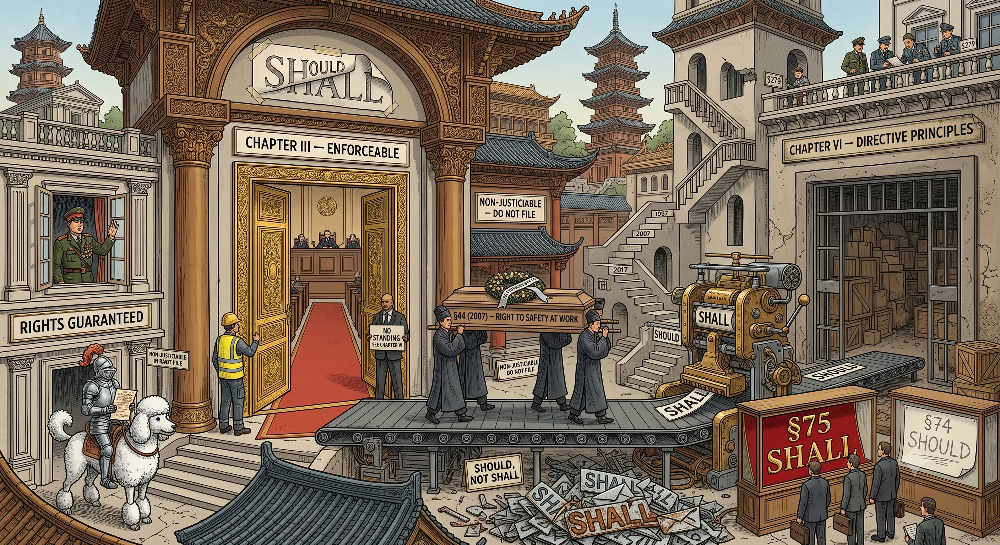

<!-- 0068 — DRAFTED 2026-07-09 (prose fully written; constitutional proof-texts quoted inline).
     Primary-text verification:
       - 2017 charter (§40, §64, §74, §75, §279): quoted from the official English text extracted directly
         from the 2017 Constitution PDF (PyMuPDF); wording confirmed against constituteproject.org.
       - 2007 charter (§44, §51, §53, §54) and 1997 charter (§52, §54, §55, §86): verified (2026-07-09), WITH A
         WORDING CORRECTION. The authoritative source is the Constitute Project / official translation, NOT Wikisource:
         the Wikisource rendering of §44 DROPPED its qualifier. Authoritative §44 (2007): "…the guarantee of due living
         during and post employment, **as provided by law**." So §44 was a *statute-mediated* right, not an
         unconditional self-executing one (1997 §52 etc. carry the same "as provided by law" qualifier). It nonetheless
         sat in Chapter III (Rights & Liberties): §27 made those rights "directly binding on … Courts," and §28 gave
         "recourse to the Court for directly enforcing the State to comply with provisions in this Chapter" (forum for
         suits against the state = the Administrative Court, not the Constitutional Court). §86 (1997, labour) = a
         Chapter V directive. NB: in practice Thai courts enforced negative economic liberties (property, occupation)
         more readily than positive social entitlements like §44 — so the defensible claim is a demotion of *category*
         (justiciable right → non-justiciable directive), not the loss of a fully realised entitlement. No published
         §44 case-law located in English sources (citation gap, not proof of non-enforcement).
     §112: §VI (sufficiency-economy philosophy as royal-associated ideology, §75) is ROYAL-TOUCHING and stays
       node-internal. Public derivatives carry only the de-royalised argument: "should vs shall", "Chapter VI is
       non-justiciable", "self-amnesty in §279". Never name the royal apex in a public comment.
     OPEN (User): index.md entry (newest on top) + images/0068.webp. -->

## 0068 – Should, Not Shall

### *The 2017 Constitution, the Deletion of Enforceable Social Rights, and Thailand's Missing Anchor for the Automation Shock*

In July 2026 a deputy prime minister defended an expanded early-retirement scheme for civil servants by invoking, almost in passing, "the AI era": careers are hard to change, technology is displacing workers, and the state must adjust. Read as an administrative notice it is unremarkable. Read as a **constitutional signal** it is the opening of a much larger question. When automation begins to shed labour at scale, what in Thailand's supreme law protects the displaced? This node answers with a finding that is textual, not rhetorical: the coming automation shock will arrive in a country whose constitution was **deliberately rewritten to remove the enforceable social protections it once contained** — and which, on the same pages, **declared its own drafters permanently immune**. Where the two-tier state ([0060](0060-thai-help-thai-plus-constitutional-architecture.md)) describes who the polity protects and the loyalty logic ([0067](0067-loyalty-over-competence.md)) describes who it selects, this node describes what it has **disarmed**: the citizen's legal footing against structural economic loss.

-----

### I. The trigger — the state invokes "the AI era" to shed workers

The Deputy Prime Minister and civil-service reform lead argued that voluntary early retirement, focused on officials aged 40–45, "cannot wait," citing "long-standing structural problems." His justification leaned explicitly on automation: "Changing careers is not easy, especially in the AI era… Many people are already losing jobs because of technological disruption." Preliminary estimates put more than **10,000 civil servants** in scope.

The academic response, from Chulalongkorn's Satithorn Thananithichot, reframed the problem precisely. The issue "is not their numbers as such" but the **inefficient use** of officials tied up in "routine, regulation-heavy tasks that do not generate economic productivity"; civil-service salaries are low, so the fiscal saving is smaller than claimed; and the decisive question is downstream — "if people leave the system, will there be jobs or businesses to absorb them?" In an economy growing near **1.3%** (the slowest in ASEAN, [0042](0042-thailand-oecd-structural-incompatibilities.md)), discharging mid-career workers into "the AI era" does not obviously reduce cost; it risks manufacturing mid-career unemployment.

The tell is the asymmetry the article leaves unstated. The state claims **AI as a reason to discard**, while carrying **no corresponding obligation to the discarded** — no funded transition, no anchored income floor. That gap is the subject of this node, and it is both a policy gap and a constitutional one.

-----

### II. The political economy — a double blow, not a single one

The structural problem is larger than one ministry's headcount. It is the **asymmetry of value creation**: the efficiency gains of automation accrue overwhelmingly to the owners of the technology, while the costs — displacement, retraining, income support — are socialised. Daron Acemoglu and Pascual Restrepo's work names the mechanism and its worst case: automation "always reduces the labour share in value added," and **"so-so automation"** — displacement with only minor productivity gains — "benefits capital but not labour." Crucially, they insist the trajectory is a **choice, not destiny**: technology can be steered to *augment* labour (reinstating labour-intensive tasks) rather than merely replace it.

To this standard account the Thai case adds a second, sharper edge. Social protection in most systems, Thailand included, is financed by **taxes on work** — payroll and contribution bases. When automation replaces labour, it therefore strikes **twice**: it removes the wage *and* erodes the fiscal base of the very safety net that would cushion its loss. More claimants; fewer contributors. Automation does not merely produce unemployment; it **defunds the cushion** for it.

The remedies that answer this are known, and they are the point of contrast with what follows. They are, in ascending order of ambition: **broaden the tax base from labour to value-added, capital and economic rents** (so social funding survives labour's decline); **stop subsidising automation** through capital-allowance codes that reward replacing workers even absent productivity gains; a **transition obligation** or automation levy (the "robot tax" debated since 2017) funding retraining and a social dividend; and, where the labour market structurally shrinks, an **income floor** (basic income / negative income tax) paired with a **public job guarantee** in care, climate and infrastructure — the two addressing different needs, survival and purpose. Every one of these is **ordinary legislation**. Whether the citizen has any **constitutional footing** to demand them — or to resist their absence — is the question §III answers.

-----

### III. The constitutional question — "should," not "shall"

The 2017 Constitution's treatment of the worker is a study in the difference between a **liberty**, a **directive**, and a **right**.

The one hard entitlement is negative. **Section 40:** "A person shall enjoy the liberty to engage in an occupation" — and even this may be restricted by law "for the purpose of maintaining the security or **economy of the country**, protecting fair competition, preventing or eliminating barriers or monopoly." It protects the freedom *to* work; it confers no right to a job, an income, or protection from displacement, and it bends to "the economy."

Everything the displaced worker would actually need is written not as a right but as an exhortation. **Section 74:** "The State **should** promote abilities of the people to engage in work… and ensure that they have work to engage in. The State **should** protect labour… and receive income, welfare, **social security** and other benefits… and **should** provide for or promote savings for living after their working age." Every operative verb is *should*.

The reason *should* is not *shall* is stated by the constitution itself. **Section 64:** "The provisions in this Chapter are **directive principles** for State legislation or determination of policy." Section 74 sits in Chapter VI — Directive Principles — which Section 64 defines as **guidance to the state, not enforceable entitlements**. The enforceability hinge confirms the exclusion: **Section 51**, in Chapter V (Duties of the State), grants citizens the right "to take legal proceedings against a relevant State agency" — but only "as regards any act provided… to be the duty of the State **under this Chapter**." Labour, welfare and social security are in Chapter VI, not V. They are outside the standing-to-sue mechanism, outside the citizen-initiative bill scope (§133, confined to Chapters III and V), and outside the Ombudsman's compliance remit (confined to Chapter V).

The most revealing line is the one that switches registers. **Section 75** binds and exhorts in the same breath: the state "**should** organise an economic system which provides opportunities for the people to all together benefit from… economic growth… **should eliminate unfair economic monopoly**" — but "The State **shall** refrain from engagement in an enterprise in competition with the private sector." **Binding protection for the private sector; non-binding aspiration for labour and against monopoly.** Hard law for capital, soft wishes for workers — inside a single article.

-----

### IV. It was not always so — the arc of 1997 → 2007 → 2017

The 2017 settlement is not a Thai constant. It is a **reversal** of two decades of expanding social rights, and the primary texts make the trajectory exact.

| Protection | 1997 ("People's Constitution", democratically drafted) | 2007 (post-2006-coup charter) | 2017 (post-2014-coup charter) |
|---|---|---|---|
| **Public health** | **RIGHT** — §52: "A person shall enjoy an equal right to receive standard public health service…" | **RIGHT** — §51: "Every person shall enjoy equal rights… the indigent shall have the right to free… medical treatment" | **"should"** — Ch. VI directive (§55/§74 cluster) |
| **Elderly / disability** | **RIGHT** — §54, §55: "shall have the right to receive aids" | **RIGHT** — §53, §54: "shall have the right" | **"should"** — Ch. V/VI |
| **Labour / work security** | **directive** — §86: "The State shall promote… employment, protect labour" | **RIGHT (statute-mediated)** — §44: "A person shall have rights to the guarantee of… safety and security at work, including… due living **during and post employment, as provided by law**" | **"should"** — §74 |

Two things follow. First, the 1997 People's Constitution — the one document in this sequence produced by a **participatory drafting assembly and passed by an elected parliament**, not a junta — established health, old-age and disability protection as **enforceable rights**. Second, the labour-security *right* the automation problem most needs — security "upon leaving the state of employment" — was not even a 1997 innovation but a **2007** one: the post-coup charter of 2006 *kept* the 1997 rights and *raised labour to a right* (§44). The trajectory to 2017 was therefore **progress, then reversal**: rights established (1997), rights extended (2007), rights demoted to "should" (2017). The sharpest way to state it: **even the 2006 coup preserved these rights; the 2017 drafters deleted them.** 2017 is more regressive on social rights than its own military predecessor.

The demotion is not only lexical ("has the right" → "should"); it is **categorical and jurisdictional**. §44 (2007) was a *statute-mediated* right — its authoritative text closes "…during and post employment, **as provided by law**," so its detailed content was left to legislation rather than self-executing. But it sat in Chapter III (Rights and Liberties), where **Section 27** made the chapter's rights "directly binding on the National Assembly, the Council of Ministers, Courts, constitutional organs and State agencies," and **Section 28** gave a person "**recourse to the Court for directly enforcing the State to comply with provisions in this Chapter**" — the forum for such suits against the state being the Administrative Court, and the §27 duty binding *every* court. A qualified right in that chapter is still categorically above a directive principle: the 2017 charter relocates the identical guarantee to Chapter VI, where §64 defines the provisions as directive principles — *not enforceable entitlements* — and §51 confines the right to sue a state agency to the duties in Chapter V. The worker keeps the vocabulary of protection and loses the category that carried a forum. So "claimable in court" is not an inference about the word "right" — it is the 2007 charter's own enforcement clause (§28), and it is exactly what Chapter VI withdraws. An honest caveat: Thai courts have enforced negative economic liberties (property, the liberty to an occupation) more readily than positive social entitlements, so §44's practical bite was always limited by "as provided by law." The precise claim is therefore a demotion of *category* — justiciable right to non-justiciable directive — not the erasure of a fully realised entitlement.

That the 2017 labour provisions sit among *directive principles* rather than enforceable rights is not itself a new observation: the labour-law scholarship has registered the weakening (Suttawet 2018; Bundit Thanachaisethavut; the ITUC/AMRC reports on ILO 87/98 non-compliance). What this node adds is the **textual "should vs shall" proof** (2007 §44 → 2017 §74/§64), the **§279 juxtaposition** (rights deleted, drafters self-amnestied in one document), and the **forward link** to the automation and twin-deficit moment — a synthesis not yet made in the mainstream Thai press.

-----

### V. The self-amnesty on the same pages — Section 279

The document that reduced the worker's protections to "should" did not treat *itself* with the same restraint. **Section 279:** "All announcements, orders and acts of the National Council for Peace and Order or of the Head of the National Council for Peace and Order… **irrespective of their constitutional, legislative, executive or judicial force**… shall be considered **constitutional, lawful and effective** under this Constitution." The clause grants the coup regime's every act — the coup itself, its orders, its personnel decisions — **blanket, retroactive and prospective legality**, unchallengeable in any court.

The juxtaposition is the node's core. In one charter, drafted under and for the military authority that seized power in 2014:

- the citizen's social protections were moved from **rights** to non-justiciable "**should**" (§74, §64); and
- the drafters' own acts were declared **"constitutional, lawful and effective"** in perpetuity (§279).

**The workers' rights: erased. The authors' impunity: written in. One document, two verdicts.** The deepest amnesty in Thai law is not the 2026 Peaceful Society Promotion Bill now dominating debate ([0041](0041-section-112-in-the-consolidation-phase-2024-2026.md)); it is **constitutional**, and it is older. The amnesty statute merely operates downstream of a charter that already immunised the power that wrote it.

-----

### VI. What replaced the rights *(node-internal only; never in public comment)*

The 2017 charter did not leave the space where social rights had stood entirely empty. Section 75 anchors the economic order "in accordance with the **philosophy of sufficiency economy**" — the royal-associated ideology of moderation, self-reliance and contentment, elevated to constitutional principle. Structurally, this is a **substitution**: where 1997 and 2007 offered *enforceable entitlements*, 2017 offers a *moral philosophy*. Moderation replaces redistribution; self-reliance replaces social security as a right. Against an asymmetry in which capital captures automation's gains and labour bears its costs, a constitutionally enshrined ethic of "sufficiency" functions as a **sermon addressed to the loser**, not a shield.

*§112 discipline:* the sufficiency-economy philosophy is royal-associated; its critique as an *inadequate substitute for enforceable rights* is **royal-touching** and belongs **only in this pseudonymous node**, in a cited, analytical register. It must **never** appear in a public-facing comment. In public the identical argument travels fully de-royalised: the charter replaced enforceable social rights with **non-binding directive principles** (§64, §74) — no naming of the philosophy's royal provenance, no second cue.

-----

### VII. Synthesis

The automation shock is a *when*, not an *if*, and Thailand meets it from a position of engineered exposure. The tools that would cushion it — a broadened tax base, an automation levy, a transition obligation, an income floor, a job guarantee — are all **ordinary legislation**, and they would have to be enacted **against**, not upon, a constitution that only "should"s labour (§74), reserves its binding "shall" for the protection of private capital (§75), and forecloses the citizen's standing to compel (§51, §64). There is **no constitutional anchor** for the social response the technology will demand.

And the exposure compounds where the net is thinnest. Thailand has **not ratified ILO Conventions 87 and 98** (freedom of association, collective bargaining); union density sits **below 0.5%** ([0042](0042-thailand-oecd-structural-incompatibilities.md)); the informal-sector majority holds no employment-based social security at all ([0060](0060-thai-help-thai-plus-constitutional-architecture.md)). The worker who most needs the anchor is the one furthest from it.

The decisive point is not that the constitution *fails* to protect against automation-driven loss. It is that Thailand **once held that protection in a higher legal register** — §44 of 2007 secured work-security as a *right* (Chapter III, binding on the courts, though "as provided by law"), in words that even reached "during and post employment" — and **demoted it to a non-justiciable directive**. The vulnerability is not an omission; it is a **deletion of the enforceable category**. And the same drafters who performed the deletion wrote themselves permanent immunity (§279) on the same pages. The dual system ([0066](0066-the-dual-system.md)) opens the market to capital while mobilising the nation in its name; the loyalty logic ([0067](0067-loyalty-over-competence.md)) staffs the state that manages both; this node names the **legal precondition** that lets the whole arrangement pass the coming shock onto the workers alone: a constitution that says *should* where it once said *shall*, and *shall* only where capital is concerned.

-----

<!-- §112-INTERNAL NOTE: §VI (the sufficiency-economy philosophy as a royal-associated ideology substituting for
     enforceable rights, §75) is royal-touching and stays in this pseudonymous node, cited and analytical. NEVER in a
     public comment. Public derivatives carry the de-royalised argument only: "rights downgraded to non-justiciable
     directive principles (§64/§74)", "should vs shall (§75)", "constitutional self-amnesty (§279)". -->

## Sources

**The trigger (July 2026)**
- [Early retire bid 'cannot wait' — Bangkok Post (9 Jul 2026)](https://www.bangkokpost.com/business/general/3282492/) *(Pakorn Nilprapunt on voluntary early retirement in "the AI era"; ~10,000 civil servants in scope; Satithorn Thananithichot's efficiency/absorption critique)*

**The constitutional texts (primary)**
- Constitution of the Kingdom of Thailand, B.E. 2560 (2017) — §40, §51, §64, §74, §75, §133, §279 (official English text; also [Constitute Project: Thailand 2017](https://www.constituteproject.org/constitution/Thailand_2017)).
- Constitution of the Kingdom of Thailand, B.E. 2550 (2007) — §44 (labour-security right), §51 (health), §53 (elderly), §54 (disabled): [Constitute Project: Thailand 2007](https://www.constituteproject.org/constitution/Thailand_2007) · [Wikisource, 2007 Ch. 3](https://en.wikisource.org/wiki/Constitution_of_Thailand_(2007)/Chapter_3).
- Constitution of the Kingdom of Thailand, B.E. 2540 (1997) — §52 (health), §54/§55 (elderly/disabled) as rights; §86 (labour) as directive: [Wikisource, 1997 Constitution](https://en.wikisource.org/wiki/Constitution_of_Thailand_(1997)).

**The downgrade — critical reading**
- ["A year after referendum, only bad news about Thailand's constitution," New Mandala](https://www.newmandala.org/year-referendum-bad-news-thailands-constitution/) *(rights "almost neglected" in 2017 relative to 1997/2007)*.
- iLaw (Internet Law Reform Dialogue) — analyses of rights recast as "the State's duty" under the 2017 charter.

**Labour-rights scholarship (the backbone — read these to ground the claim)**
- **Chokchai Suttawet & Greg J. Bamber, "International labour standards and decent work: a critical analysis of Thailand's experiences,"** *Asia Pacific Journal of Human Resources* 56(4) (2018): [Wiley (paywall)](https://onlinelibrary.wiley.com/doi/10.1111/1744-7941.12190) · **[free full text, CC-BY, Monash Repository](https://researchmgt.monash.edu/ws/files/254310634/253576523_oa.pdf)**. Peer-reviewed. Verified verbatim (2026-07-09): *"Under parliamentary democracy, IR was included in the democratic 1997 Constitution, together with social security and workers' remuneration schemes. In the 2007 Constitution, state employees could be represented by unions… The **military's 2017 Constitution** also says that human rights are guaranteed. However, the 2017 Constitution has only a conditional provision for state employees… such rights are **heavily qualified and are permitted only if state employees do not disturb national security, public welfare or social order**."* Also confirms Thailand has **not ratified ILO Conventions 87 and 98**. *Scope note (calibration): Suttawet & Bamber document the military 2017 charter's* weakening *of the previously stronger (1997/2007) labour and industrial-relations protections, and the ILO gap. They do* not *use the "directive principle" framing, and their axis is freedom-of-association / state-employee union rights rather than §44 work-security specifically. Cite them for the* military-2017-weakening *and the ILO-87/98 gap — the "right → directive principle (§44 → §74/§64)" reading is this node's own textual contribution.*
- **Bundit Thanachaisethavut, "Informal Workers and Legal Protection in Thailand,"** WIEGO, **May 2011**: [PDF](https://www.wiego.org/wp-content/uploads/2019/09/T01.pdf) — an authoritative Thai informal-labour treatment. *Note: it predates the 2017 charter and discusses the 2007 Constitution (B.E. 2550), so it grounds the "unenforced in practice" and formal/informal-gap point, not the 2017 downgrade.* Verified quotes (2026-07-09): informal workers *"have not been adequately and effectively provided with equal social security benefits enjoyed by their counterparts in the formal economy sector"*; and on enforcement, *"there is no legislation that regulates this work and existing laws are not actually enforced."*
- **ITUC, "Internationally Recognised Core Labour Standards in Thailand"** (WTO Trade Policy Review report): [PDF](https://www.ituc-csi.org/IMG/pdf/tpr_thailand_final.pdf) — the ILO Conventions 87/98 non-ratification and the constitutional/statutory restrictions on freedom of association and collective bargaining.
- **Asian Monitor Resource Centre (AMRC), "Thailand: Labour and the Law"**: [amrcentre.org](https://amrcentre.org/thailand-labour-and-the-law/) — overview of the Thai labour-rights regime and its gaps.
- Context on the rights-vs-duties recasting and the reform demand: [Protection International — Thailand's political transition and the demand for a new constitution](https://www.protectioninternational.org/news/thailands-political-transition-the-right-to-defend-human-rights-and-the-peoples-demand-for-a-new-constitution/).

**The political economy of automation**
- Daron Acemoglu & Pascual Restrepo, "Automation and New Tasks: How Technology Displaces and Reinstates Labor," *Journal of Economic Perspectives* 33(2) (2019): [PDF](https://shapingwork.mit.edu/wp-content/uploads/2023/10/acemoglu-restrepo-2019-automation-and-new-tasks-how-technology-displaces-and-reinstates-labor.pdf) *(automation reduces the labour share; "so-so automation")*.
- Acemoglu & Restrepo, ["The Revolution Need Not Be Automated," Project Syndicate (2019)](https://www.project-syndicate.org/commentary/ai-automation-labor-productivity-by-daron-acemoglu-and-pascual-restrepo-2019-03) *(the direction of automation is a policy choice; the "so-so" trap)*.
- The "robot tax" / automation-levy debate (Gates, 2017) and Mariana Mazzucato on value creation vs. extraction — background to the tax-base and transition-obligation tools.

**Thai labour-rights baseline**
- ILO Conventions 87 and 98 unratified; union density < 0.5% — cf. [0042](0042-thailand-oecd-structural-incompatibilities.md).

-----

## Discipline checklist (verification record)

- [x] **Textual, not rhetorical.** Every constitutional claim is anchored to a quoted section (2017 §40/§64/§74/§75/§279; 2007 §44/§51/§53/§54; 1997 §52/§54/§55/§86). The argument rests on the "should/shall" and "Chapter VI/Chapter V" distinctions, both drawn from the text itself.
- [x] **Accuracy correction carried in.** The labour-security *right* is attributed to **2007 (§44)**, not to 1997 — in 1997 labour was a *directive* (§86). Health/elderly/disability were rights in **both** 1997 and 2007. Not overclaimed as "all rights since 1997." **Wording correction (2026-07-09):** the authoritative text of 2007 §44 closes "…as provided by law" (the Wikisource translation dropped it), so §44 was a *statute-mediated* right, not an unconditional one — and the 1997 social rights carry the same qualifier. The claim is therefore framed as a demotion of *category* (justiciable Chapter III right → non-justiciable Chapter VI directive), not the loss of a fully self-executing entitlement; and it is noted that Thai courts enforced negative economic liberties more readily than positive social ones.
- [x] **Coup symmetry stated, not hidden.** 2007 is identified as itself a post-coup charter; the argument's force is that it nonetheless *kept and extended* the rights that 2017 deleted — so the claim is "2017 out-regressed even its coup predecessor," not "junta vs. democracy" simpliciter. 1997 is the democratically drafted baseline.
- [x] **§112 — royal material node-internal only.** The sufficiency-economy substitution (§VI) is confined to the node in a cited register; public derivatives carry only the de-royalised "directive principles / should vs shall / §279 self-amnesty" argument.
- [x] **Function, not conspiracy.** The claim is a documented constitutional structure (relocation of provisions across chapters; §279's immunity clause), not an alleged orchestrated plan.
- [x] **Novelty calibrated (no false-first claim).** The *weakening* of Thailand's labour protection under the military 2017 charter, and the ILO-87/98 gap, are established in the peer-reviewed scholarship (Suttawet & Bamber 2018) and the rights-monitoring literature (ITUC; and, for the pre-2017 informal-sector gap, Bundit 2011). What that scholarship does **not** supply — and what this node contributes — is the *textual constitutional-mechanics reading itself*: the "should vs shall" proof and the right-to-directive-principle relocation (2007 §44, judicially enforceable via §27/§28 → 2017 §74/§64, non-justiciable), the *§279 juxtaposition*, and the *automation/fiscal synthesis*. So the node builds on the scholarship without overclaiming that the scholarship already made the constitutional-mechanics argument. (Correction carried in: Suttawet & Bamber do not use "directive principle"; the earlier draft's paraphrase attributed to Bundit — "many Constitutional guarantees have no implementing statutes" — was not found in the source and has been replaced with verified quotes.)
- [x] **Primary-text verification DONE (2026-07-09), with a correction.** 2017 texts from the official PDF. For 2007/1997 the **authoritative source is the Constitute Project / official translation, not Wikisource** — the Wikisource rendering of §44 dropped its "as provided by law" qualifier (caught and corrected here; verified against Constitute + the official faolex PDF). Confirmed: 2007 §44 = statute-mediated Chapter III right (enforceability clauses §27/§28; forum for state suits = Administrative Court, not the Constitutional Court, which does not hear such individual social-rights claims); 1997 §52/§54/§55 = Chapter III rights (same qualifier); §86 = Chapter V directive. **No published §44 case-law located** (Constitutional / Administrative / Labour courts) in English sources — a citation gap, not proof of non-enforcement; the Constitutional Court's own account foregrounds negative economic liberties (property, occupation), not positive social entitlements. Framed accordingly (category-demotion). Ready for external citation.

-----

*Filed under: constitutional mechanics, social & economic rights, labour, automation & AI political economy, the 2017 charter, self-amnesty.*

*Cross-references: [0067](0067-loyalty-over-competence.md), [0066](0066-the-dual-system.md), [0060](0060-thai-help-thai-plus-constitutional-architecture.md), [0042](0042-thailand-oecd-structural-incompatibilities.md), [0041](0041-section-112-in-the-consolidation-phase-2024-2026.md), [0014](0014-constitutional-mechanics-I.md).*

