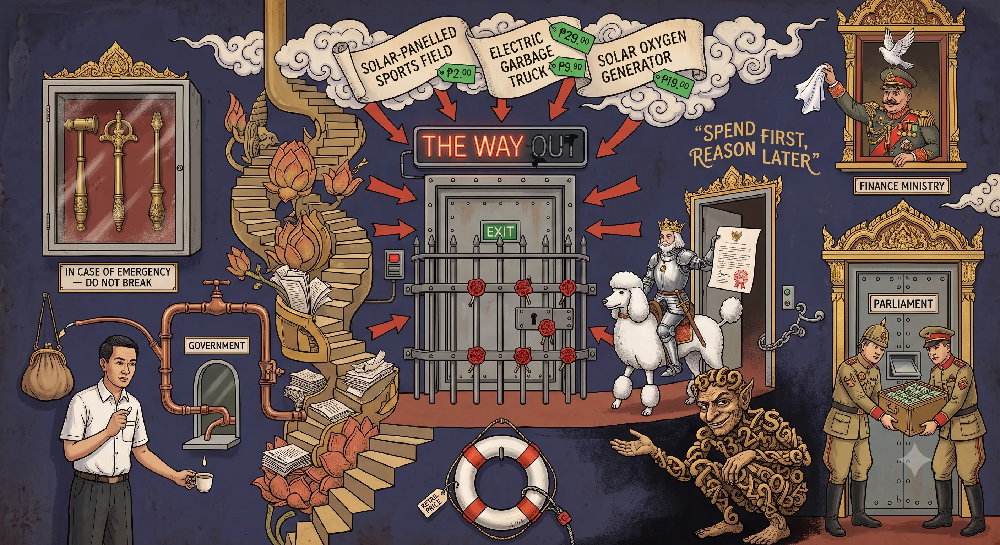

<!-- 0069 — DRAFTED 2026-07-09 (synthesis / prescriptive capstone; pulls the week's diagnostic nodes into one thesis).
     Character: this node is ARGUMENTATIVE, not primarily evidentiary — it names the exit, the blockage and the paths.
     Its factual claims are carried by the nodes it cites (0060, 0066, 0067, 0068) and by 0069's own sourced figures.
     Verify before external publication:
       - Thailand tax-to-GDP "~15-16%" — VERIFIED (2026-07-09): World Bank tax revenue 15.42% of GDP (2023), 15.14% (2022);
         world average ~17.3%, so "low for an upper-middle-income country" holds. (OECD's wider total-tax measure incl. social contributions is ~17%.)
       - "0.59 baht of GDP per baht borrowed", budget 73.6% current / 20.8% capital, 788bn new borrowing — from Chartchai
         Parasuk's op-ed (attributed as his estimate, not consensus).
       - Household debt ~86.7% of GDP; government debt ~66.4% → 70% ceiling — reported figures, cited.
     §112: §V (the security–monarchy dimension of the armor) is ROYAL-TOUCHING and stays node-internal (cf. 0035).
       Public derivatives carry only: "the 2017 charter, the security apparatus, the loyalty-selection, the §112 exclusion" —
       de-royalised, no naming of the apex.
     OPEN (User): index.md entry (newest on top) + images/0069.webp. -->

## 0069 – The Way Out Runs Through the Politics

### *Thailand's Economic Spiral Has a Known Exit — the Barrier Is a Power Arrangement Built to Prevent It*

Over one week the observatory logged what read as separate emergencies: a fiscal machine running out of fuel (twin deficits, a collapsing debt multiplier), a constitution that downgraded enforceable social rights to "should" ([0068](0068-should-not-shall-deleted-social-rights.md)), a state that selects personnel by loyalty rather than competence ([0067](0067-loyalty-over-competence.md)), an economy that opens to capital while mobilising the nation in its name ([0066](0066-the-dual-system.md)), and a welfare architecture that protects a thin tier at the majority's expense ([0060](0060-thai-help-thai-plus-constitutional-architecture.md)). This node makes the closing claim: they are **one problem**, and it has a **known exit**. The economics of the way out is not exotic. The spiral persists because every real fix **redistributes power** — and the political-institutional architecture this observatory documents exists precisely to prevent that redistribution. The way out of the economic crisis therefore runs **through the political one**.

-----

### I. The spiral as a single system

The pieces interlock. The private sector has stalled since 2023; fiscal deficits have become the economy's **life-support system**, but each baht of new borrowing now returns only about **0.59 baht of GDP** (Chartchai Parasuk) — the state is borrowing to fund *consumption subsidies*, not productive assets. The two funding sources are exhausting together: domestic "excess liquidity" is absorbed, and the current-account surplus that historically financed the deficit is turning negative on higher energy imports. Government debt (~66.4% of GDP) approaches the **70% statutory ceiling**; the budget is **73.6% current expenditure, 20.8% capital** — a budget for the present, not the future. Beneath it sits a household-debt overhang the official statistics **understate**: the Bank of Thailand's ~90%-of-GDP figure counts only regulated credit, while a Chulalongkorn/JSCCIB study that adds informal loan-shark debt puts the true burden at **104% of GDP** (Q4 2024) — a further ~14 points, some **98,500 baht** of informal debt per affected household, with **40% of households** exposed. That informal tier is predatory and coercive: rates running to roughly **240% a year and beyond**, borrowed mostly for daily survival, enforced extra-legally through intimidation and seizure, and typically owed to the same local-influence networks that hold provincial power. The result is a **two-tier credit system** mirroring the two-tier health system ([0060](0060-thai-help-thai-plus-constitutional-architecture.md)): formal bank credit for the protected, the loan shark for the informal-sector poor. The trap reaches even into the *protected* tier: some **900,000 teachers owe 1.4 trillion baht**, their repayments garnished at source from salary (leaving roughly 30% to live on) — so the state, as employer-collector, drives even tenured civil servants toward the loan shark, while **67,000 contract teachers earn below the migrant-worker minimum wage**. The debt then eats the human capital the exit would require: demoralised, indebted teachers degrade the education that a productive economy depends on ([0051](0051-thailands-foundational-skills-crisis.md)). Into this arrives the automation shock, with the labour-security right that once cushioned it deleted from the constitution ([0068](0068-should-not-shall-deleted-social-rights.md)). Each loop feeds the next: stalled growth → more debt → less fiscal space → thinner cushion → more household distress → weaker demand → stalled growth.

-----

### II. The known exit — six levers, none exotic

The corrective package is standard development economics plus the specific Thai fixes:

1. **Redirect borrowing from consumption to productivity.** Debt is sustainable only when it grows the economy faster than its interest cost; at a 0.59 multiplier it does not. Fund only assets with a return above the yield — skills, genuinely productive infrastructure — not consumption transfers or vanity megaprojects (cf. the Land Bridge, [0010](0010-buri‑ramization-of-defense.md)).
2. **Fix the revenue side.** Thailand's tax take is roughly **15–16% of GDP** — low for an upper-middle-income country — on a narrow, regressive base. The deficit is as much an *under-taxation* problem as an over-spending one. Broaden the base toward **land, property, capital gains, wealth and economic rents**; capture revenue where it is generated (Phuket earns ~497bn baht in tourism, retains ~6bn in budget). This is the fiscal twin of [0068](0068-should-not-shall-deleted-social-rights.md)'s point: shift the base from labour to capital and rents.
3. **Move up the value chain.** The current-account bleed is partly low-value assembly of imported (often Chinese) inputs. Upgrading requires **state capacity** — which the loyalty-over-competence selection ([0067](0067-loyalty-over-competence.md)) has degraded. The economy cannot be fixed without fixing how the bureaucracy is staffed.
4. **Treat household debt at the source.** Serial debt-relief moral-hazards the symptom. The cause is stagnant real incomes and a missing floor: households borrow for daily needs because wages stall and no safety net exists. The fix is **income, not credit** — and a social floor so survival is not debt-financed.
5. **Rebuild a universal social floor as a right.** Not the debt-funded subsidy patchwork, not the two-tier privilege system ([0060](0060-thai-help-thai-plus-constitutional-architecture.md)), but an **enforceable, efficiently delivered floor** funded from (2) — the restoration [0068](0068-should-not-shall-deleted-social-rights.md) describes.
6. **Steer technology to augment, not replace** (Acemoglu & Restrepo) and invest in the workforce — turning the automation threat into a productivity lever.

None of this is a secret. The obstacle is not the diagnosis.

-----

### III. Why it does not happen — the redistribution problem

Read the incidence of each lever:

| Lever | Who bears the cost |
|---|---|
| Tax land / capital / rents (2) | the elite, the provincial clans, capital owners |
| End the protected-tier privileges — CSMBS, guaranteed pensions, the security budget ([0060](0060-thai-help-thai-plus-constitutional-architecture.md)) | the bureaucratic–military core |
| Merit over loyalty (3) | the **patronage machine that constitutes the power structure** ([0067](0067-loyalty-over-competence.md)) |
| Social rights as enforceable entitlements (5) | re-empowers the citizen the 2017 charter deliberately disarmed ([0068](0068-should-not-shall-deleted-social-rights.md)) |
| Curb vanity megaprojects (1) | the construction rent extracted by the connected ([0010](0010-buri‑ramization-of-defense.md)) |

Every fix moves resources and standing **from the powerful to the many**. The spiral is therefore not an accident of bad forecasting or weak will; it is the **predictable byproduct of an arrangement that prefers to manage decline rather than share power.** The reforms are blocked not because they are unknown but because they are *understood too well* by those they would cost.

-----

### IV. The armour — what protects the arrangement from its own cure

This is where the observatory's ostensibly "political" subject matter turns out to be the economic story. The structures logged across the archive are, functionally, the **immune system against redistribution**:

- **The 2017 charter** downgraded social rights to non-justiciable "should" (§74/§64), reserved binding "shall" for the protection of private capital (§75), recentralised local self-government into "administration" by ordinary law, and — on the same pages — granted the coup regime blanket self-amnesty (§279). It is the legal instrument that pre-emptively disarmed the citizen for exactly this fiscal moment ([0068](0068-should-not-shall-deleted-social-rights.md)).
- **The internal-security apparatus** ([0028](0028-isoc-dual-governance-in-thailand.md)–[0037](0037-isoc-synthesis-front‑end-back-end.md)) monitors, conditions and, where necessary, suppresses the mobilisation that would demand redistribution.
- **The loyalty-selection logic** ([0067](0067-loyalty-over-competence.md)) staffs the state that manages the arrangement, degrading the very capacity a reform would require.
- **The Section 112 exclusion** removes the reform constituency — the young — from the amnesty, keeping the most reform-minded cohort under legal jeopardy ([0041](0041-section-112-in-the-consolidation-phase-2024-2026.md)).

Together these ensure that the constituency for redistribution is disarmed legally, disorganised administratively, and, at the apex, insulated from prosecution. The economic reforms cannot pass because the political system is *built* to stop them.

-----

### V. The security–monarchy dimension of the armour *(node-internal only)*

The apex of the arrangement is the security–monarchy nexus ([0035](0035-isoc-the-security-monarchy-nexus.md)): the constitutionally enshrined "sufficiency economy" philosophy substitutes a royal-associated ethic of moderation and self-reliance for enforceable redistributive rights ([0068](0068-should-not-shall-deleted-social-rights.md), §VI), and the security apparatus that guards the order draws its ultimate legitimacy from that apex. In this register the "way out" is not merely a fiscal reform; it is a **redistribution of standing away from the core the whole structure protects** — which is why it is resisted with the full architecture, not merely with budget arithmetic.

*§112 discipline:* this section is royal-touching and stays in this pseudonymous node. Public derivatives carry only the de-royalised argument — "the 2017 charter, the security apparatus, the loyalty-selection, the §112 exclusion" — with no naming of the apex.

-----

### VI. The three narrow paths (without illusion)

1. **Crisis as catalyst.** A genuine fiscal or currency shock — the scenario Chartchai Parasuk warns of — can discredit the incumbent order and force reform that ordinary politics blocks; the post-1997 restructuring, and the reform wave that carried the People's Constitution, are the precedent. **The danger this time:** the 1997 reform channel — enforceable rights, an organised youth movement, freer institutions — has been dismantled ([0068](0068-should-not-shall-deleted-social-rights.md), [0041](0041-section-112-in-the-consolidation-phase-2024-2026.md), the ISOC cluster). A shock into a disarmed polity is as likely to produce **repression and managed decline** as renewal.
2. **Technocratic wedges.** Feasible even without a change of power: a land or property tax, closing exemptions, better-targeted subsidies (the negative-income-tax debate, cf. [0060](0060-thai-help-thai-plus-constitutional-architecture.md)), an *efficiency-not-headcount* civil-service reform (redistributing workloads rather than shedding mid-career workers), and marginal redirection of borrowing from consumption to investment. Second-best, but real — advanced on the argument that **the elite also loses in a collapse.**
3. **The demographic clock.** The long arc bends toward the reform constituency — a younger, more connected cohort and its electoral vehicle. But the state actively suppresses that cohort (§112, ISOC). The outcome is a **race between demographic-political pressure and the repression apparatus**, and the charter has been rewritten to slow the former.

None of the three is guaranteed; the honest reading is that the odds have been deliberately worsened.

-----

### VII. Thesis

The intelligent way out of the economic spiral is not, at bottom, an economic question. The fixes — productive rather than consumptive debt, progressive revenue, a universal floor as a right, value-chain capacity, augmenting technology — are downstream of a **political precondition**: accountability over patronage, competence over loyalty, *shall* over *should*, redistribution over extraction. That precondition is, roughly, the **1997 promise** — the enforceable-rights, decentralised, participatory settlement that 2017 dismantled. The state cannot spend or borrow its way out while keeping the patronage-loyalty-impunity operating system, because that system *is* the cause of the misallocation: the vanity projects, the protected tier, the under-taxed apex, the degraded capacity.

This reframes the observatory's entire subject. The constitution, the internal-security apparatus, Section 112, the selection logic — these are not "politics beside the economy." They are the **economic policy**: the mechanism by which the costs of the coming decade are assigned to the informal majority and the young, and the gains reserved for the core. The way out is legible. The barrier is not knowledge. It is power — and the arrangement built to keep it.

-----

### Postscript (11 July 2026) — the emergency decree, or: spend first, reason later

The thesis above was written on 9 July 2026. That same day it acquired a live illustration, and the manner of it is the spiral's newest instrument. The Constitutional Court upheld the government's **400-billion-baht emergency borrowing decree** — the second such off-budget borrowing of the cycle.

An emergency decree (**Section 172**) has the force of an Act the moment it is issued: the executive borrows and may spend first, and Parliament and the courts review afterward. It is, by design, **spend first, scrutinise later** — the ordinary parliamentary budget, with its line-by-line control, is bypassed. For a genuine emergency that is defensible. As a general spending vehicle it is the fiscal form of the armour in §IV: a mechanism to move public money *around* the democratic scrutiny that redistribution would require.

The Court itself drew the line the government's boosters erased. It was **unanimous (9-0)** that borrowing roughly **200 billion baht for immediate energy-price relief** — households, farmers and businesses hit by an energy-cost shock — met the "urgent necessity" test. But it split **7-2** on the other **~200 billion, earmarked for a multi-year energy transition** (EVs, rooftop solar, smart grids, "skills and innovation"). A petition by **133 opposition MPs**, and two of the nine judges, held that a structural, multi-year investment programme is precisely what "urgent necessity" is *not*, and belonged in the ordinary budget rather than an emergency decree.

The government's own words convict the transition half. The responsible minister called them **"long-term" projects** — still being *designed*, with a screening committee yet to convene, agencies yet to submit proposals, and a House debate only "later this month." A genuine emergency does not need a month to invent the projects it will spend on. And the projects are §I in miniature: **interest subsidies and down-payment assistance for households buying EVs or installing solar** — consumption transfers in a green wrapper, not the productive investment §II's first lever demands. At 1.2% interest the borrowing is cheap and the transition is a real need; the objection is not the goal but the **device** (scrutiny bypassed) and the **mix** (consumption dressed as capital).

Two features complete the picture. First, this is **another 400 billion baht onto the pile** of §I — debt as life-support, added off the normal budget, as government debt nears the 70% ceiling. Second, and most telling for a node about accountability: two days after the ruling, **the Court's written reasoning was still unpublished** — the split turned on whether a "long-term" programme is an "emergency," yet no citizen could read the majority's grounds, or the dissent's. The decree frees the money before Parliament scrutinises it; the ruling freed the money before its own reasoning was public. **Spend first, reason later — twice over.** The thesis holds: the barrier is not knowledge, and here it is not even the letter of the law. It is the arrangement of power that lets the money move before the questions do.

-----

<!-- §112-INTERNAL NOTE: §V (security–monarchy nexus, sufficiency-economy substitution) is royal-touching and stays in
     this pseudonymous node (cf. 0035, 0068 §VI). NEVER in a public comment. Public derivatives carry only the
     de-royalised argument: "the 2017 charter / the security apparatus / loyalty-selection / the §112 exclusion". -->

## Sources

**The fiscal spiral**
- [Chartchai Parasuk, "Twin deficits spell trouble for economy," Bangkok Post (9 Jul 2026)](https://www.bangkokpost.com/opinion/opinion/) *(0.59 baht/baht multiplier; budget 73.6% current / 20.8% capital; 788bn new borrowing; current-account reversal; the 1997-vindicated contrarian)*.
- [Report urges reforms as public debt rises — Bangkok Post](https://www.bangkokpost.com/business/general/3279725/report-urges-reforms-as-public-debt-rises).
- Government debt ~66.4% of GDP heading to the 70% ceiling — [OECD Economic Outlook 2026/1: Thailand](https://www.oecd.org/en/publications/oecd-economic-outlook-volume-2026-issue-1_2d1956f0-en/full-report/thailand_14cc31c9.html).

**The emergency-decree postscript (July 2026)**
- [Court upholds B400-billion borrowing decree — Bangkok Post (9 Jul 2026)](https://www.bangkokpost.com/business/general/3283454/court-upholds-b400billion-borrowing-decree) *(9-0 on the relief clause; separate 7-2 on the energy-transition provision)*.
- [Constitutional Court Rules 7-2 in Favour of THB400bn Emergency Loan Decree — Kaohoon International](https://www.kaohooninternational.com/economics/586398); [Thai Court Clears Government's $12 Billion Crisis Loan — Bloomberg (9 Jul 2026)](https://www.bloomberg.com/news/articles/2026-07-09/thai-court-clears-government-s-12-billion-crisis-loan-in-victory-for-anutin).
- [Constitutional Court to rule on THB400bn decree — Nation Thailand](https://www.nationthailand.com/news/politics/40068402) *(petition by 133 opposition MPs; Section 172 "urgent necessity" challenge; the transition tranche said to fall below the threshold)*.
- "B400bn loan projects to be screened this month," Bangkok Post (11 Jul 2026) *(PM's Office Minister Paradorn Prissananantakul: "long-term energy transition projects"; interest/down-payment subsidies for EV buyers and rooftop solar; screening committee of the finance permanent secretary, NESDC and the Comptroller General's Department; NESDC's Danucha Pichayanan wants the focus on efficiency and flags the EV proposal for further discussion; House debate "later this month")*.
- Emergency-decree device: Section 172, Constitution of the Kingdom of Thailand B.E. 2560 (2017) — an Emergency Decree has force as an Act on issuance, subject to subsequent parliamentary approval and Constitutional Court review (verify wording against [Constitute Project: Thailand 2017](https://www.constituteproject.org/constitution/Thailand_2017) before external citation).

**Household debt**
- [Thai household debt hits 86.7% of GDP as borrowing shifts to daily spending — The Nation](https://www.nationthailand.com/business/economy/40065070).
- [Thailand Household Debt to GDP — Trading Economics](https://tradingeconomics.com/thailand/households-debt-to-gdp) *(second-highest in Asia-Pacific)*.
- [WKO Aussenwirtschaft — Thailand Wirtschaftslage](https://www.wko.at/aussenwirtschaft/thailand-wirtschaftslage) *(household debt ~90% of GDP; 2025 growth 2.4%, 2026 ~1.5–2.0%)*.
- [Thai household debt climbs to 104% of GDP (incl. informal loans) — Bangkok Post](https://www.bangkokpost.com/business/general/2935951/thai-household-debt-climbs-to-104-of-gdp) *(Chulalongkorn/JSCCIB study, Q4 2024; ~98,538 baht informal debt per affected household; 40% of households exposed; ~30% of formal-income households rely on informal debt for liquidity; official BoT figure ~90% — all verified 2026-07-09; URL slug corrected)*.
- [Sanha Hemvanich, Kanokwan Chancharoenchai & Nattanicha Chairassamee, "Credit Segmentation and Household Vulnerability in Thailand: Formal Versus Informal Debt Risks," *Journal of Risk and Financial Management* 18(11):632 (MDPI, Nov 2025)](https://www.mdpi.com/1911-8074/18/11/632) *(the two-tier / segmented-credit thesis; verified 2026-07-09 — survey of 6,949 respondents across 77 provinces: farmers/civil servants access formal credit via cooperatives/BAAC, while freelancers, business owners, the unemployed and retirees rely on informal channels at high rates. NB: authors are Hemvanich et al., corrected from the earlier draft's "Weerachai".)*.
- Informal-lending rates and enforcement: [PIER Discussion Paper 173](https://www.pier.or.th/en/dp/173/) *(loan-shark rates ~18%/month; 47.5% of informal loans for daily consumption)*; [Loan shark charging 3,400% annual interest — Bangkok Post](https://www.bangkokpost.com/thailand/general/3088290/loan-shark-arrested-for-charging-3-400-annual-interest); [730% and intimidation — Thai Examiner](https://www.thaiexaminer.com/thai-news-foreigners/2023/08/12/730-per-cent-per-annum-loan-shark-arrested-in-nonthaburi-informal-debt-problem/).
- The debt trap in the protected tier: ["Teachers are undervalued" (editorial) — Bangkok Post](https://www.bangkokpost.com/opinion/opinion/2689149/teachers-are-undervalued) *(~900,000 teachers owe ~1.4tn baht — cooperatives ~890bn, GSB 390bn, KTB 63bn, GH Bank 61bn; repayments deducted at source, leaving ~30% of salary; the 2021 refinancing scheme cut interest 0.3% and drew only ~20%; 67,000 contract teachers paid below the migrant-worker minimum wage)*.

**The political economy of the exit**
- Daron Acemoglu & Pascual Restrepo, ["The Revolution Need Not Be Automated," Project Syndicate (2019)](https://www.project-syndicate.org/commentary/ai-automation-labor-productivity-by-daron-acemoglu-and-pascual-restrepo-2019-03); and "Automation and New Tasks," *JEP* 33(2) (2019).
- Thailand tax-to-GDP ratio — [World Bank: tax revenue 15.42% of GDP (2023)](https://data.worldbank.org/indicator/GC.TAX.TOTL.GD.ZS?locations=TH); below the ~17.3% world average. (OECD's broader total-tax-to-GDP measure, incl. social contributions, is ~17%.)

**The armour (internal cross-references)**
- [0068](0068-should-not-shall-deleted-social-rights.md) — the deleted social rights and §279 self-amnesty.
- [0067](0067-loyalty-over-competence.md) — loyalty-over-competence selection.
- [0066](0066-the-dual-system.md) — the dual system.
- [0060](0060-thai-help-thai-plus-constitutional-architecture.md) — the two-tier state (CSMBS/UCS).
- [0028](0028-isoc-dual-governance-in-thailand.md)–[0037](0037-isoc-synthesis-front‑end-back-end.md) — the internal-security apparatus.
- [0041](0041-section-112-in-the-consolidation-phase-2024-2026.md) — Section 112 in the consolidation phase.
- [0035](0035-isoc-the-security-monarchy-nexus.md) — the security–monarchy nexus *(node-internal)*.

-----

## Discipline checklist (verification record)

- [x] **Argumentative node, evidentiary backing cited.** Factual claims are carried by the linked nodes and by 0069's own sourced figures; the node's own contribution is the synthesis (exit / blockage / paths), not new primary evidence.
- [x] **No fatalism, no naïveté.** The exit is named as *technically feasible*; the blockage as *political, not mysterious*; the three paths carry honest odds and explicit caveats (the 1997 reform channel is dismantled). The thesis is "known exit, power barrier," not "collapse is certain" or "reform is easy."
- [x] **Contrarian source flagged.** Chartchai Parasuk's negative-growth forecast is against BoT/consensus (1.5–2%); presented as a credible, 1997-vindicated warning, not as established fact. The social-consequence chain holds in the consensus (slow-growth) scenario too, hardening to crisis in his.
- [x] **§112 — royal material node-internal only.** §V (security–monarchy nexus, sufficiency-economy substitution) confined to the node; public derivatives de-royalised.
- [x] **Function, not conspiracy.** The claim is that documented structures *function* as an immune system against redistribution — an incentive/institutional reading, not an alleged single coordinated plan.
- [x] **Figures — verification status (2026-07-09).** **VERIFIED:** tax-to-GDP (World Bank 15.42%, 2023; below ~17.3% world avg); household debt **104% incl. informal** (Chulalongkorn/JSCCIB, Q4 2024) with ~98,538 baht/household, 40% of households exposed and ~30% of formal-income households reliant on informal debt for liquidity, vs BoT ~90%; the MDPI credit-segmentation paper (Hemvanich, Chancharoenchai & Chairassamee 2025 — **author name corrected from "Weerachai"**). **STILL ATTRIBUTED / NOT INDEPENDENTLY VERIFIED (as flagged):** the Chartchai budget/multiplier figures (0.59 multiplier, 73.6%/20.8% split, 788bn — his op-ed *estimate*, presented as such); government debt ~66.4% → 70% ceiling (reported); teacher debt ~1.4tn / ~900,000 and 67,000 contract teachers (editorial's numbers, ~2023 Srettha era — structurally current, dates to refresh if reused); ~240%/yr informal rate and PIER DP-173 figures are survey estimates, not exact stock measures. **Housekeeping:** the Chartchai op-ed source (§Sources) is currently a generic Bangkok Post opinion URL — replace with the article permalink before external publication.
- [x] **Postscript precision (2026-07-11).** The 400bn ruling is reported exactly: **9-0** on the relief clause, **7-2** on the transition clause (Bangkok Post / Kaohoon / Bloomberg). The "urgent necessity fails" argument is attributed to the **133-MP petition**; the two dissents are recorded only as falling on the transition provision, not quoted — their written reasoning was still unpublished as of 11 Jul, which is itself the point, not a licence to invent it. **No claim of bad faith or corruption against the Court**: the critique is the *device* (emergency decree bypassing prior budget scrutiny), the *mix* (EV/solar consumption subsidies vs productive investment), and the *transparency gap*. "Long-term" is the minister's own word. Section 172's mechanics to be verified against Constitute before external citation (the §44 lesson).

-----

*Filed under: political economy, fiscal policy, redistribution, the reform question, synthesis.*

*Cross-references: [0068](0068-should-not-shall-deleted-social-rights.md), [0067](0067-loyalty-over-competence.md), [0066](0066-the-dual-system.md), [0060](0060-thai-help-thai-plus-constitutional-architecture.md), [0042](0042-thailand-oecd-structural-incompatibilities.md), [0041](0041-section-112-in-the-consolidation-phase-2024-2026.md), [0028](0028-isoc-dual-governance-in-thailand.md), [0010](0010-buri‑ramization-of-defense.md).*

