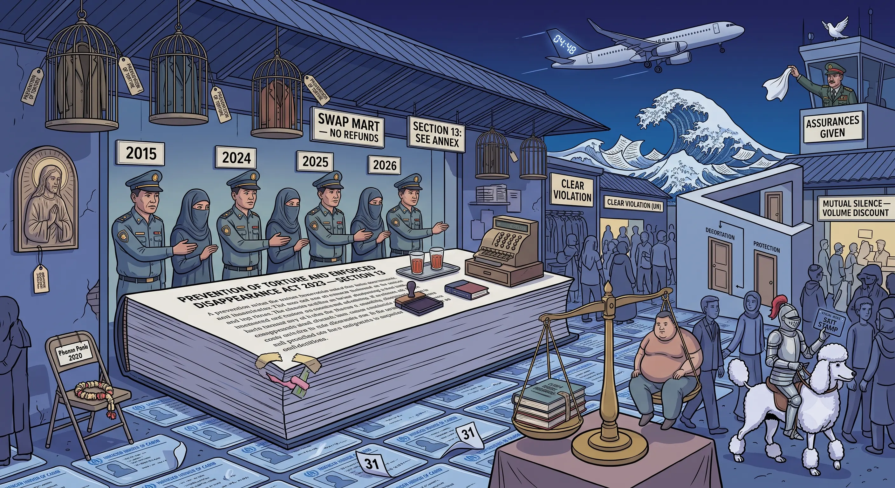

<!-- 0070 - DRAFTED 2026-07-11 (prose fully written; transnational-repression / refoulement capstone).
     Character: EVIDENTIARY. The spine is a dated chronicle of forced returns across four governments, all
     verified against HRW / Amnesty / OHCHR / ICJ / Freedom House / Carnegie / the European Parliament resolution.
     Verification (2026-07-11):
       - Anti-Torture & Enforced Disappearance Act B.E. 2565 effective 22 Feb 2023; Section 13 non-refoulement ban
         quoted from the ICJ text / Wikisource translation.
       - 2015 Uyghurs (109, 8 Jul 2015) under Prayut; Jiang Yefei & Dong Guangping (Nov 2015); Gui Minhai abduction
         (Oct 2015, distinguish - abduction, not deportation); 4 Cambodians (Nov 2021).
       - 40 Uyghurs 27 Feb 2025 (NSC decision 17 Jan 2025, PM Paetongtarn chairing; defence + justice ministers;
         Don Mueang -> Kashgar). Six Cambodians + child 25 Nov 2024 (Paetongtarn).
       - Y Quynh Bdap: arrested 11 Jun 2024 (Srettha); Bangkok Criminal Court approved 30 Sep 2024 (Paetongtarn);
         Court of Appeal upheld 26 Nov 2025; extradited 28 Nov 2025 (Anutin).
       - Zhang Xinyan: UNHCR refugee 2016; one of 19 with HK warrants (Jul 2025), bounties HK$200k-1m; detained,
         held through a Canada resettlement flight booked 8 Jul 2026 (reported 10 Jul 2026).
       - US: Rubio visa sanctions 15 Mar 2025; 36% tariff 2 Apr 2025; trade framework Oct 2025 (19%).
       - EU Parliament resolution 13 Mar 2025 (FTA leverage). EU-Thailand FTA: Round 9 done Jun 2026, 15/24 chapters,
         end-2026 target.
       - Paul Chambers: arrested 8 Apr 2025 (Naresuan), Section 112 + Computer Crimes Act, military complaint,
         webinar blurb; visa revoked by Immigration Bureau; charges dropped ~1 May 2025.
     ATTRIBUTION DISCIPLINE:
       - "swap mart" = HRW's term (attribute).
       - "reneged under CCP pressure" (Zhang) = Sheng Xue's ALLEGATION - attribute, never assert.
       - The US 36% tariff was part of the global "reciprocal" regime; do NOT claim it was punishment for the
         Uyghur deportation - only note the COEXISTENCE/sequence of HR sanctions and trade pressure.
       - No named Thai official is accused of a crime (the US itself named none). Government-level responsibility only.
       - Interior portfolio does NOT control immigration/deportation (Royal Thai Police / PM's Office); NSC chaired by
         the PM. So the Uyghur deportation is Paetongtarn-era (NSC), NOT attributable to Anutin, who was then Interior
         Minister; Anutin's direct responsibility begins with his premiership (5 Sep 2025 -> Bdap, Zhang).
     Section 112: Section V (Chambers) and the European Parliament's naming of the lese-majesty law are handled
       ANALYTICALLY and node-internal. Public derivatives carry only the de-royalised argument (refoulement, the
       2023 law, the FTA lever); never name or characterise the royal apex; never repeat forum "head of state / Pooh"
       innuendo. Reporting a documented Section 112 case and the EP's own wording is not the same as editorialising
       the monarchy - keep strictly to the record.
     OPEN (User): index.md entry (newest on top) + images/0070.webp. -->

## 0070 - The Swap Mart

### *Transnational Repression as a Constant of the Thai State - the Anti-Torture Law It Broke to Feed It, and the Trade Deals That Test It*

In the small hours of 27 February 2025, a convoy of trucks with black-sheeted windows left Bangkok's Immigration Detention Center for Don Mueang airport, where an unscheduled China Southern flight carried forty Uyghurs - held arbitrarily for more than a decade - to Kashgar. Five days earlier, Thailand's Prevention and Suppression of Torture and Enforced Disappearance Act had turned two years old. That law contains a plain statutory ban on exactly what the trucks were doing. The juxtaposition is this node's subject: Thailand has built Southeast Asia's most reliable machine for handing exiles back to the states that hunt them - and it runs regardless of which government is in office, and regardless of the country's own law forbidding it. Where the deleted social rights ([0068](0068-should-not-shall-deleted-social-rights.md)) show a constitution that says *should* where it once said *shall*, this node shows a statute that says *shall not* and is simply ignored. The question it ends on is not domestic. It is whether any external lever - a US sanction, an EU trade chapter - can move a machine the Thai state has decided to keep running.

-----

### I. The trigger - one refugee, in real time

On 10 July 2026 the Bangkok Post reported that Zhang Xinyan, 55, a Hong Kong democracy campaigner and Falun Gong practitioner recognised as a refugee by the UNHCR since 2016, was being held at the Suan Phlu immigration detention centre - detained rather than released for a resettlement flight to Canada that supporters had arranged, medical and biometric checks completed, a Bangkok-to-Vancouver seat booked for 8 July. She is one of nineteen overseas activists named in arrest warrants issued by Hong Kong police in July 2025 under the Beijing-imposed National Security Law, with bounties of HK$200,000 to HK$1 million on their heads. Her Chinese passport had already been confiscated and revoked by the Chinese embassy in Bangkok. Sunai Phasuk of Human Rights Watch warned that a forced return would breach international law and Thailand's own anti-torture statute. A Canada-based supporter, Sheng Xue, alleged that Thai authorities "reneged under pressure from the CCP" at the final step - an allegation, not an established fact, but one that fits a decade-long pattern this node documents. If returned, Zhang could become the first person charged under the Hong Kong security law to be deported into it.

The case is not an aberration. It is the machine, caught mid-cycle.

-----

### II. The law for the applause - Section 13

In February 2023 Thailand did something it had never done: it criminalised torture and enforced disappearance. The Prevention and Suppression of Torture and Enforced Disappearance Act B.E. 2565 took effect on **22 February 2023**, to warm international notices - a first statute, a signature on paper, a country apparently joining the modern norm. Its **Section 13** is unambiguous:

> "No government organisation or public official shall expel, deport, or extradite a person to another State where there are substantial grounds for believing that the person would be in danger of being subjected to torture, cruel, inhuman or degrading treatment or punishment, or enforced disappearance."

That is a statutory codification of *non-refoulement* - the one principle that gives a refugee's status meaning. On the day it took effect, Thailand had, in law, forbidden itself from doing what it had done to the Uyghurs in 2015 and would do to them again in 2025. The law was the promise. The rest of this node is the performance.

-----

### III. The law in action - a chronicle across four governments

The machine predates the law, and it outlasted it. The dated record makes the continuity exact.

**Before the law (the machine already running):**

| Date | Forced return / abduction | Government |
|---|---|---|
| 8 Jul 2015 | **109 Uyghurs** flown to China, hooded and shackled (from ~300 detained in 2014; ~170 women and children sent to Turkiye the same month) | Prayut |
| Nov 2015 | **Jiang Yefei and Dong Guangping**, Chinese pro-democracy activists and **UNHCR refugees**, deported to China days after arrest | Prayut |
| Oct 2015 | **Gui Minhai**, Hong Kong bookseller, abducted from Pattaya (coordinated by China's Ministry of Public Security) *- an abduction, not a formal deportation* | Prayut |
| Nov 2021 | **Four Cambodian dissidents** (Mich Heang, Lahn Thavry, Veourn Veasna, Voeung Samnang), **UNHCR refugees**, returned to Cambodia | Prayut |

**After the law (Section 13 in force, and ignored):**

| Date | Forced return | Government |
|---|---|---|
| 25 Nov 2024 | **Six Cambodian opposition activists and a child** returned to Cambodia | Paetongtarn |
| 27 Feb 2025 | **40 Uyghurs** to China - a National Security Council decision (taken 17 Jan 2025, the NSC chaired by the PM; defence and justice ministers present), executed by immigration police **five days after the anti-torture law's second anniversary** | Paetongtarn |
| 28 Nov 2025 | **Y Quynh Bdap**, Montagnard activist and **UNHCR refugee**, extradited to Vietnam | Anutin |
| Jul 2026 | **Zhang Xinyan** held, refoulement to China feared (live) | Anutin |

Two features convict the system rather than a single minister. First, **one case spans three premierships**: Y Quynh Bdap was arrested under **Srettha** (11 June 2024), his extradition was approved by the Bangkok Criminal Court under **Paetongtarn** (30 September 2024) and upheld on appeal, and he was handed to Vietnam under **Anutin** (28 November 2025). No change of government interrupted him. Second, the courts have **hollowed the safeguard from within**: in Bdap's case the court held that it had no duty to assess the risk of torture on return, deferring that question to the executive - so Section 13's protection was passed from the judiciary to the very officials carrying out the removal. A ban that no branch will enforce is not a ban; it is a line in a statute book.

Note precisely who did what. Immigration and deportation in Thailand fall under the Immigration Bureau of the **Royal Thai Police**, reporting to the **Prime Minister's Office**, not the Interior Ministry; national-security removals run through the **National Security Council**, chaired by the **Prime Minister**. The 40-Uyghur deportation was therefore a decision of **Paetongtarn's** government, not of the then-Interior Minister. The point of this node is not that one politician authored the machine - it is that **no one dismantles it**, and each new government inherits and operates it.

-----

### IV. The swap mart - the structure behind the cases

Human Rights Watch has a name for the arrangement: a **"swap mart."** Thailand helps partner governments silence their exiles, and in return those governments let Thailand reach its own. In the Mekong sub-region, a tacit pact among **Thailand, Cambodia, Laos and Vietnam** to support one another's crackdowns has turned four borders into one hunting ground; **China** is the largest and most insistent principal. Freedom House treats Thailand as a host-country case study for transnational repression; the Council on Foreign Relations calls it "Southeast Asia's hub"; a 2026 Carnegie study, *Inside the Swap Mart*, traces how Thailand's domestic surveillance apparatus is repurposed to serve foreign security services. Across the documented cases, **at least thirty-one** of those targeted held UNHCR refugee status or were active asylum-seekers - the very people the law is meant to shield.

The reciprocity is not rhetorical; it has a body count on Thailand's side of the ledger. Thai dissidents who fled after the 2014 coup were pursued into the countries Thailand obliges: **Wuthipong "Ko Tee" Kachathamakul** vanished in Laos in 2017; **Surachai Danwattananusorn** and two aides disappeared, their mutilated remains later recovered from the Mekong (2018-2019); **Wanchalearm Satsaksit** was abducted in broad daylight in Phnom Penh on **4 June 2020** and never seen again. Perpetrators have not been formally identified in these cases, and this node does not assign individual guilt - but the pattern of reciprocal disappearance is documented, and it is the price Thailand pays, and collects, in the same market.

-----

### V. The apparatus turns inward - Section 112 and a foreign scholar

The machine that refoules refugees is one expression of a broader instinct: that legal status - refugee card, foreign passport, academic post - does not shield a person from the Thai security state. The clearest recent illustration reached an American.

**Paul Chambers**, a lecturer at Naresuan University and one of the best-known foreign scholars of the Thai military, was arrested on **8 April 2025** after a complaint by the regional army command. He was charged under **Section 112** - the lese-majesty law - and the Computer Crimes Act, over the blurb for an October 2024 webinar, hosted by Singapore's ISEAS-Yusof Ishak Institute, on the military's role in Thai politics. The blurb named neither the king nor the monarchy, and Chambers denied writing or publishing it. He was jailed, refused bail, then granted it; the **Immigration Bureau revoked his visa**; and in early May 2025 the Office of the Attorney-General decided not to pursue the charges. That the army, not the palace, filed the complaint - against a scholar of the army - is the tell: Section 112 functions here as an all-purpose instrument for silencing analysis of power, reaching even a foreign academic on a university payroll. The charges fell away; the visa revocation, and the message, did not.

Chambers is not a refoulement case, and this node does not pretend otherwise. He belongs here because the **European Parliament put him and the Uyghurs in the same sentence** - and because the same contempt for protected status runs through both. *(This section treats a Section 112 case analytically and stays node-internal; public derivatives carry only the de-royalised record - a documented prosecution, a revoked visa, an army complaint - and never characterise the monarchy.)*

-----

### VI. The consequences, and the levers

For a decade the machine ran without external cost. That has begun to change - unevenly, and instructively.

**The United States showed that human-rights consequences need not wait for trade to be settled.** On **15 March 2025**, Secretary of State Marco Rubio imposed visa restrictions on current and former Thai officials responsible for the Uyghur deportation - by one regional expert's account, the first such sanction on Thai officials in memory. It landed in the same weeks that Washington moved to a **36% tariff** on Thai goods (2 April 2025) and, later, a trade framework that settled at **19%** (October 2025). The tariff was part of a global "reciprocal" regime, not a punishment for the Uyghurs, and this node claims no direct causal link - but the sequence matters: the US did not firewall human rights out of the trade relationship, and it sanctioned an ally mid-negotiation. The precedent is the point.

**The European Union is the open test.** Its free-trade negotiation with Thailand is in the final stretch - Round 9 concluded in Brussels in June 2026, fifteen of twenty-four chapters closed, the parties aiming to finish by the end of 2026 - and it is built around a **Trade and Sustainable Development chapter** the Commission calls "robust and enforceable." On **13 March 2025** the European Parliament adopted a resolution, *Democracy and human rights in Thailand, notably the lese-majesty law and the deportation of Uyghur refugees*, that instructed the Commission to **leverage the FTA negotiations** to press Thailand to reform Section 112, release political prisoners, **halt the deportation of Uyghur refugees**, and ratify the core ILO conventions. The resolution also recorded that, before the February 2025 removal, **at least five Uyghurs, including minors, had reportedly died** in Thai immigration detention. Every thread of this node - refoulement, Section 112, the ILO gap ([0042](0042-thailand-oecd-structural-incompatibilities.md)) - is already named in the EU's own conditionality.

There is even a security ledger. The 2015 Erawan Shrine bombing in Bangkok, which killed twenty, was linked by investigators to a **previous** Uyghur deportation - a reminder that the swap mart's costs are not only moral.

-----

### VII. Synthesis

The intelligent reading of these cases is not that a particular government is uniquely cruel. It is that **the refoulement machine is a constant of the Thai state** - it survived the transition from junta to elected rule, it survived four prime ministers, and it survived the one law expressly written to stop it. This is the [0068](0068-should-not-shall-deleted-social-rights.md) pattern in a sharper key. There, a right was *demoted* from an enforceable category to a directive principle; here, a prohibition is left standing in full statutory force and simply not obeyed. Section 13 was the applause; the trucks to Don Mueang were the practice. And the continuity is the evidence: a single refugee, Y Quynh Bdap, was passed hand to hand across three governments to the border - no election, no cabinet, no reform law slowed the handover.

What is genuinely open is external. The United States has shown that a trading partner can be sanctioned for a refoulement even as tariffs are being bargained. The European Union has written "enforceable" human-rights conditionality into a deal it wants to close this year, and its own Parliament has already itemised the reforms - starting with the Uyghur deportations and Section 112. Zhang Xinyan, held in Suan Phlu as this is written, is the live test of both: of whether Thailand's security state will break its own law one more time, and of whether "conditionality" is a lever the EU will pull or a liturgy it will recite. The way out of the machine, like the way out of the fiscal spiral ([0069](0069-the-way-out-runs-through-the-politics.md)), runs through power - here, the leverage of the states that hold the trade Thailand wants. The machine will keep running until someone it needs makes it stop.

-----

<!-- Section 112-INTERNAL NOTE: Section V (Chambers) and the EP's naming of the lese-majesty law are analytical and
     node-internal. NEVER in a public comment: no characterisation of the monarchy, no "head of state / Pooh" innuendo
     (however it circulates on the forum). Public derivatives carry only: refoulement, the 2023 anti-torture law and
     its breach, the swap mart, the US sanctions precedent, the EU FTA lever. Report the record; never editorialise the
     royal apex. -->

## Sources

**The trigger (Zhang Xinyan, July 2026)**
- [Thai authorities detain Canada-bound Hong Kong activist - Bangkok Post (10 Jul 2026)](https://www.bangkokpost.com/thailand/general/3284062/thai-authorities-detain-canadabound-hong-kong-activist) *(Zhang Xinyan, 55; UNHCR refugee 2016; Suan Phlu; Canada flight booked 8 Jul; one of 19 with HK warrants, bounties HK$200k-1m; Sunai Phasuk/HRW warning; Sheng Xue's "reneged under CCP pressure" allegation)*.

**The law (Section 13)**
- Prevention and Suppression of Torture and Enforced Disappearance Act, B.E. 2565 (2023), Section 13: [ICJ text (PDF)](https://www.icj.org/wp-content/uploads/2024/08/Prevention-and-Suppression-of-Torture-and-Enforced-Disappearance-Act-B.E.-2565.pdf) - non-refoulement ban; effective 22 Feb 2023.
- [ICJ - Two years on, justice remains unattainable (2025)](https://www.icj.org/thailand-two-years-into-the-adoption-of-the-anti-torture-and-enforced-disappearance-act-justice-for-victims-and-survivors-remains-unattainable/); [Manushya Foundation - Why does Thailand keep violating its Anti-Torture Act? 3 cases](https://www.manushyafoundation.org/post/why-does-thailand-keep-violating-its-anti-torture-act-3-cases-exposing-thailand-s-violation-of-non).

**The chronicle**
- 2015 Uyghurs (109) and the 2025 deportation: [Detention and deportation of Uyghurs by Thailand - Wikipedia](https://en.wikipedia.org/wiki/Detention_and_deportation_of_Uyghurs_by_Thailand); [HRW - Thailand Forcibly Sends Uyghurs to China (13 Mar 2025)](https://www.hrw.org/news/2025/03/13/thailand-forcibly-sends-uyghurs-china-after-decade-long-arbitrary-detention); [Washington Post - Thai officials secretly planned to deport Uyghurs (24 Mar 2025)](https://www.washingtonpost.com/world/2025/03/24/thailand-uyghur-deportation-china-xinjiang/).
- Jiang Yefei & Dong Guangping (2015), the 2021 Cambodians, and the pattern: [HRW - "We Thought We Were Safe" (16 May 2024)](https://www.hrw.org/feature/2024/05/16/we-thought-we-were-safe/repression-and-forced-return-of-refugees-in-thailand); [HRW - "Swap Mart" Targets Foreign Dissidents, Refugees (15 May 2024)](https://www.hrw.org/news/2024/05/15/thailand-swap-mart-targets-foreign-dissidents-refugees).
- Six Cambodians + child (25 Nov 2024): [HRW - Cambodian Refugees Forcibly Returned (29 Nov 2024)](https://www.hrw.org/news/2024/11/29/thailand-cambodian-refugees-forcibly-returned).
- Y Quynh Bdap: [HRW - Montagnard Activist Extradited to Vietnam (2 Dec 2025)](https://www.hrw.org/news/2025/12/02/thailand-montagnard-activist-extradited-to-vietnam); [OHCHR - UN experts alarmed (Dec 2025)](https://www.ohchr.org/en/press-releases/2025/12/un-experts-alarmed-y-quynh-bdaps-extradition-thailand-viet-nam).
- Wanchalearm, Surachai, "Ko Tee" (the reciprocal side): [Freedom House - Thailand transnational repression case study](https://freedomhouse.org/report/transnational-repression/thailand).

**The structure**
- [Freedom House - Thailand: Transnational Repression Host Country Case Study](https://freedomhouse.org/report/transnational-repression/thailand); [CFR - Thailand Has Become Southeast Asia's Hub of Transnational Repression](https://www.cfr.org/articles/thailand-has-become-southeast-asias-hub-transnational-repression); [Carnegie - Inside the Swap Mart (2026)](https://carnegieendowment.org/research/2026/06/inside-the-swap-mart-how-thailands-domestic-digital-repression-enables-transnational-repression).

**Section 112 / Paul Chambers**
- [CNN - Prosecutors drop royal defamation case against US scholar (1 May 2025)](https://www.cnn.com/2025/05/01/asia/thailand-lese-majeste-paul-chambers-intl-hnk); [The Diplomat - Thai Prosecutors Dismiss Charge (May 2025)](https://thediplomat.com/2025/05/thai-prosecutors-dismiss-royal-defamation-charge-against-american-academic/); [FIDH - US academic arbitrarily detained on lese-majeste charges](https://www.fidh.org/en/region/asia/thailand/thailand-us-academic-arbitrarily-detained-on-lese-majeste-charges).

**The levers**
- US sanctions: [Al Jazeera - US sanctions Thai officials over Uyghur deportation (15 Mar 2025)](https://www.aljazeera.com/news/2025/3/15/us-sanctions-thailand-officials-china-uighurs); [US State Department - Visa Restriction Policy announcement](https://www.state.gov/announcement-of-a-visa-restriction-policy-to-address-the-forced-return-of-uyghurs-and-members-of-other-ethnic-or-religious-groups-with-protection-concerns-to-china). US tariff/framework: [USTR - US-Thailand Reciprocal Trade Framework (Oct 2025)](https://ustr.gov/about/policy-offices/press-office/fact-sheets/2025/october/fact-sheet-united-states-and-thailand-reach-framework-agreement-reciprocal-trade).
- EU Parliament resolution (13 Mar 2025): [Texts adopted TA-10-2025-0036](https://www.europarl.europa.eu/doceo/document/TA-10-2025-0036_EN.html). EU-Thailand FTA status: [EU Trade - EU-Thailand agreement](https://policy.trade.ec.europa.eu/eu-trade-relationships-country-and-region/countries-and-regions/thailand/eu-thailand-agreement_en); [HRW - Letter to the EU on FTA and human rights (27 Sep 2025)](https://www.hrw.org/news/2025/09/27/thailand-letter-to-the-european-union-on-free-trade-agreement-negotiations-and).

-----

## Discipline checklist (verification record)

- [x] **Dated, sourced chronicle.** Every forced return carries a date, a named individual or count, and a government, verified against HRW / Amnesty / OHCHR / ICJ / Freedom House / Carnegie / the EP resolution. The 2015 Uyghurs (109) predate the 2023 law and are framed as precedent, not as a breach of a law that did not yet exist.
- [x] **Continuity, not conspiracy.** The claim is that documented structures *persist* across governments (one case, Bdap, spans three PMs), not that a single actor orchestrated them. Cf. [0065](0065-no-transition-only-continuity.md).
- [x] **Portfolio precision.** Immigration/deportation = Royal Thai Police / PM's Office; national-security removals = NSC, chaired by the PM. The 40-Uyghur deportation is attributed to Paetongtarn's government (NSC), NOT to Anutin, who was then Interior Minister; Anutin's direct responsibility begins with his premiership (Bdap, Zhang). No individual Thai official is accused of a crime.
- [x] **Allegation vs fact.** "Swap mart" = HRW's term. "Reneged under CCP pressure" (Zhang) = Sheng Xue's allegation, marked as such. The five reported detention deaths = "reportedly" (EP). Perpetrators of the Thai-side disappearances are not named or assigned.
- [x] **No false trade causation.** The 36% US tariff was part of a global reciprocal regime; the node claims only the COEXISTENCE of HR sanctions and trade pressure, not that the tariff punished the deportation.
- [x] **Section 112 - node-internal, analytical.** The Chambers case and the EP's naming of the lese-majesty law are reported factually; no characterisation of the monarchy; public derivatives de-royalised. "Passed moderation" is never treated as "Section 112-safe."
- [x] **Novelty calibrated.** The individual facts are established in the cited human-rights literature and the EP resolution. The node's contribution is the *synthesis*: the continuity-across-governments frame, the Section 13 "law for the applause" reading (the 0068 rhyme), and the positioning of Zhang's live case as the test of US and EU conditionality.

-----

*Filed under: transnational repression, refoulement, non-refoulement, the 2023 anti-torture law, the swap mart, Section 112, EU-Thailand FTA, US sanctions, refugees.*

*Cross-references: [0069](0069-the-way-out-runs-through-the-politics.md), [0068](0068-should-not-shall-deleted-social-rights.md), [0067](0067-loyalty-over-competence.md), [0065](0065-no-transition-only-continuity.md), [0042](0042-thailand-oecd-structural-incompatibilities.md), [0041](0041-section-112-in-the-consolidation-phase-2024-2026.md).*

