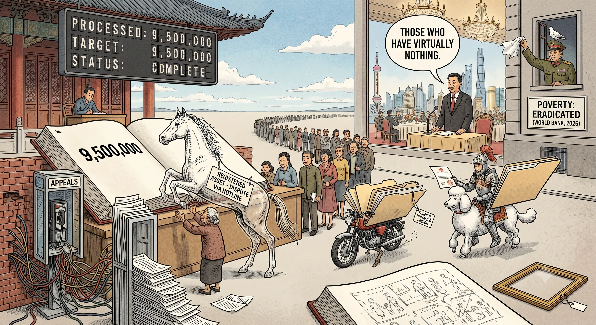

## 0071 – The Ledger and the Sun: The 2017–2018 Crown Property Transfer, the Fixed-Budget Welfare Purge, and the Legitimation Gap
### *How a state that personalised the largest fortune in the country rations poverty to a treasury line — and why the critique is sayable only sideways*

> **NODE-INTERNAL / §112 DISCIPLINE.** This node states, as documented fact, the 2017–2018 transfer of Crown Property Bureau assets into the personal ownership of the monarch. That record is on the public record worldwide (Bloomberg, CNN, Reuters, FT, Straits Times) but is **not sayable in a Thai public forum** under the Criminal Code §112. **For public comment, de-royalise completely:** attack the *fixed-budget rationing of poverty* (Ministry of Finance, Ekniti) and the *inverted burden of proof*; never juxtapose royal legitimation-rhetoric with the welfare image, never name or allude to the Crown fortune, never use the "Golden Sun / all misery erase" construction publicly. The juxtaposition is analytically true and legally lethal — its home is this file, not the comment box. See the project memory discipline notes (Session 2026-07-11 Forts. 7; 2026-07-17 parable rule) and the checklist at the foot of this node.

-----

## 1. Scope

This node connects two facts that are never printed in the same article:

1. **The concentration.** In 2017–2018 Thailand rewrote the Crown Property law so that assets previously held by an *institution* (the Crown Property Bureau, CPB) reverted to the **personal ownership of the monarch** — the single largest transfer of holdings to a private individual in the country's modern history.
2. **The rationing.** In 2026 the Ministry of Finance re-screened the state welfare card against cross-linked databases and cut the rolls from 13.2 million to 9.5 million recipients — the number set, on the opposition's account, by the **budget line**, not by the measured extent of poverty.

The link is not causal in a budgetary sense (the Crown fortune is private, the welfare budget is fiscal). The link is one of **legitimation**: a state whose founding rhetoric is that the sovereign's grace "erases all misery" administers actual misery as a spreadsheet quota — and simultaneously personalised, tax-advantaged, and placed beyond public accounting the largest fortune within its borders. The gap between the sacral claim and the bureaucratic execution is the object of analysis.

-----

## 2. The concentration — documented record (2017–2018)

**Legal mechanism.** The **Crown Property Act B.E. 2560 (2017)**, amended again in **2018**, replaced three laws dating to 1936. It merged three previously distinct categories — the King's private property, Crown property, and public property — into a single category of "Crown property" administrable **"at the King's pleasure."** The 2017 Act provided that Crown Property Assets "are to be transferred and revert to the ownership" of the King, and that the Bureau's investments "will now be held in the name of His Majesty."

**Governance.** The 2017 law gave the monarch **full control of the CPB**, including the power to appoint its board (previously chaired ex officio by the Minister of Finance). The institutional buffer between the state and the personal was removed.

**Scale (public estimates — the state does not publish the total):**
- CPB stakes in **Siam Commercial Bank** and **Siam Cement** alone: **>US$7 billion** combined (Bloomberg; ~$7.3 bn as of Dec 2020).
- **October 2017:** a 3.3% SCB stake (>$500 m at the time) transferred into the King's name.
- **March 2018:** a Siam Cement holding worth >$100 m emerged in the monarch's name.
- Bangkok landholdings alone estimated at **~1 trillion baht (~$33 bn)** at market (King Bhumibol Adulyadej: A Life's Work, 2011).
- Aggregate estimates run **>US$30 billion**, some considerably higher; the true figure is not disclosed.

**Tax.** CNN (18 June 2018) reported the assets, now personally held, became in principle taxable — a change presented at the time as accountability, though the practical tax treatment of Crown property remains contested (Prachatai, "Is crown property taxable?").

**Strongest institutional source (added 18 July 2026): the European Parliament's own briefing.** EPRS, *Thailand ahead of the February 2026 general election*, PE 782.627, January 2026, p. 3, states plainly: in July 2017 the King "obtained direct control of the royal assets, **estimated at around US$40 billion (making the Thai monarchy the world's richest)**, previously run by the Crown Property Bureau (CPB), and which **became the King's personal property**." The same page records the October 2019 transfer of **two elite army regiments** from the regular army chain of command to the Royal Security Command's direct control, and the January 2017 constitutional amendment allowing the monarch to travel abroad without appointing a regent. **Use EPRS as the lead citation** — an EU institutional document carries further than financial press and cannot be dismissed as activist.

**Attribution discipline for this node:** every figure above is from Western financial press, a published book, or the EPRS briefing; none is inference. The characterisation "largest transfer to a private individual in modern Thai history" is an analytical claim supported by the numbers, not a quotation.

-----

## 3. The rationing — documented record (2026)

**The purge.** Of **18.8 million** who registered for the 2026 State Welfare Programme, **9.5 million** qualified and **9.3 million** were rejected (Finance Minister Ekniti Nitithanprapas). Recipients fell from **13.2 million** to **9.5 million** — a cut of nearly **30%**.

**Budget-first sequencing (the core evidence).** Per PP deputy leader **Sirikanya Tansakun**: the programme budget was cut to **42 bn baht** (from >50 bn); the initial fiscal-2026 allocation was **30 bn**, implying a roughly **halved** roll; the number then landed at **9–10 million**, which she argues the ministry "clearly intended" from the outset. **The budget preceded the criteria; the criteria were tuned to the budget.** (Intent is Sirikanya's attributed claim — flag as such; the *figures* are on the record.)

**Inverted burden of proof.** State databases recorded vehicles applicants never owned (identity fraud), land they did not hold, motorcycles registered to them but used by relatives. The disqualified must **disprove the state's own record**, via a Department of Land Transport hotline that does not answer. The citizen cannot audit the ledger; the ledger is presumed correct. (Structural rhyme with the Rong Beer Na Ladprao node: the person carries the burden the state should carry — see [0068](0068-should-not-shall-deleted-social-rights.md) "right on paper, hollow in practice.")

**Ekniti's definition of the deserving poor**, stated **from Shanghai** while travelling with PM Anutin: the card "should go to those who have virtually nothing, such as **bedridden elderly people with no income**." Poverty redefined downward to near-destitution.

**Politics.** The image — a 65-year-old weeping at the BAAC branch in **Lam Plai Mat, Buri Ram** (Chidchob heartland) — lands on the governing party's own base. Ties to the NIDA finding (11 July) that BJT is bleeding its own 46+, low-income, rural base, with the revised welfare screen named as a trigger. The "September test" arrived in July.

-----

## 4. The legitimation gap (the analytical core — node-internal)

Thai royal legitimation rhetoric casts the sovereign as the source of grace whose virtue relieves the suffering of the people — the "father" whose merit "erases misery." Set beside §3, the rhetoric and the administration diverge totally:

- The sacral claim: misery is erased **from above, by grace**.
- The bureaucratic reality: misery is **counted from below, to a quota**, and the counting instrument (the database) is itself unreliable and unappealable.

The same polity that in 2017–2018 removed the largest fortune in the country from institutional accounting and vested it personally, in 2026 tells a weeping farmer that a motorcycle registered to her name disqualifies her from a welfare card — and that she must prove the registration wrong on a phone line that rings out. **Concentration at the apex is administered by pleasure; subsistence at the base is administered by spreadsheet.** That asymmetry is the content of the critique.

This is the Brecht couplet applied literally: *"Wär ich nicht arm, wärst du nicht reich"* — the poverty and the fortune are not two unrelated facts but two ends of one distribution. And the Dreigroschenoper coda names the mechanism precisely: *"you see the ones in daylight; those in darkness drop from sight."* The welfare ledger is a machine for deciding who is visible.

-----

## 5. Why it is sayable only sideways (§112 mechanics)

The construction that makes §4 vivid — royal legitimation verse placed over the welfare image — is **maximally legible and therefore maximally exposed**. §112 adjudicates the *message reconstructed from context*, not the literal text; irony and "I only quoted / I only prayed" are the standard patterns it treats as **intent**, not defence; truth is **no defence** and can aggravate. Legibility (the artistic strength) and legal safety move in opposite directions. On a Thai platform, under an identifiable account, with the operator contractually bound to disclose user data to state agencies without notice, the juxtaposition is the one move whose price is not measured in votes.

**Therefore:** the concentration analysis lives here. Public comment on the welfare article uses only the de-royalised layer — the fixed-budget quota, the inverted burden of proof, Ekniti's Shanghai definition, the Brecht coda without the royal strophe. The parable form ("the ledger already held the number… the ledger is never wrong") carries the whole point with zero royal cue.

-----

## 6. Cross-references and open items

- **Rhymes with:** [0068](0068-should-not-shall-deleted-social-rights.md) (should-not-shall: enforceable rights hollowed in practice), [0066](0066-the-dual-system.md) (the dual system: concentration at the top), [0069](0069-the-way-out-runs-through-the-politics.md) (K-shaped concentration named by BoT's Vitai — "resources concentrated in the hands of large businesses"), [0060](0060-thai-help-thai-plus-constitutional-architecture.md) (welfare as campaign instrument), [0070](0070-the-swap-mart.md) (law on paper, hollow in execution), [0072](0072-the-baht-as-gold-proxy.md) (the same sorting expressed in the exchange rate).
- **Open / to verify before any external use:** (1) current tax treatment of Crown property post-2018 (contested — Prachatai vs. official line); do not assert "pays no tax" or "pays tax" without a dated source. (2) The 9–10 million "intended target" is **Sirikanya's** claim — never state as ministry-admitted fact. (3) Whether the welfare budget figure is 42 bn for FY2026 or FY2027 — the article gives both; reconcile before citing a single year.
- **Image:** images/0071.webp missing.

-----

## Sources

**Bloomberg – Thai King Now Holds Crown Property Bureau's Billions in Assets (16 June 2018)**
https://www.bloomberg.com/news/articles/2018-06-16/thai-king-now-holds-crown-property-bureau-s-billions-in-assets

**CNN – Thai King now controls Crown's fortunes, must pay taxes on them (18 June 2018)**
https://www.cnn.com/2018/06/18/asia/thailand-king-assets-intl

**Asia Times – Thai king given full control of Crown Property Bureau (2017)**
https://asiatimes.com/2017/07/thai-king-given-full-control-crown-property-bureau/

**The National – At least $7bn of Thai state assets transferred to King Vajiralongkorn**
https://www.thenationalnews.com/business/economy/at-least-7bn-of-thai-state-assets-transferred-to-king-vajiralongkorn-1.740957

**Straits Times – Thai King Maha Vajiralongkorn granted full ownership of crown billions**
https://www.straitstimes.com/asia/se-asia/thai-king-maha-vajiralongkorn-granted-full-ownership-of-crown-billions

**Financial Times – (Crown property, prime real estate, lèse-majesté law)**
https://www.ft.com/content/251d8aea-6939-4166-afe6-2df0176e0f8f

**Prachatai English – Is crown property taxable?**
https://prachataienglish.com/node/9068

**EPRS (European Parliamentary Research Service) – Thailand ahead of the February 2026 general election (and constitutional referendum), PE 782.627, January 2026** — p. 3: US$40bn royal assets became the King's personal property (July 2017); two elite regiments to Royal Security Command (Oct 2019). p. 9: UN experts (Jan 2025) urged repeal or significant revision of §112; Freedom House 2025 downgraded Thailand to "not free". p. 10: Parliament's March 2025 resolution asked the Commission to leverage FTA negotiations for §112 reform, release of political prisoners, an end to Uyghur deportations and ratification of all core ILO conventions. Endnote 1: §112 text; "anyone can file a lèse-majesté complaint"; "the law does not deliver a clear definition of an insult to the monarchy."
https://www.europarl.europa.eu/thinktank/en/document/EPRS_BRI(2026)782627

**Bangkok Post – Welfare card changes 'left genuinely poor people behind' (17 July 2026)**
https://www.bangkokpost.com/ (Sirikanya Tansakun / Ekniti Nitithanprapas; welfare rolls 13.2m → 9.5m)

-----

## Discipline checklist (verification record)

- [x] **§112 — node-internal, and the one hard line.** The 2017–2018 transfer is stated as documented fact from institutional sources (EPRS PE 782.627; Bloomberg; CNN; Asia Times). It is **not** sayable in a Thai public forum: §112 admits no truth defence, and legibility increases exposure rather than reducing it. Public derivatives carry the de-royalised layer only — fixed-budget rationing, inverted burden of proof, Ekniti's Shanghai definition, the Brecht coda **without** the royal strophe. The "Golden Sun / all misery erase" juxtaposition is analytically true and legally lethal; it stays in this file.
- [x] **Sourced, not inferred.** Every figure is from an EU institutional document, financial press or a published book. The characterisation "largest transfer to a private individual in modern Thai history" is flagged as an analytical claim resting on those numbers, not as a quotation.
- [x] **Allegation vs fact (welfare).** The "9–10 million intended target" is **Sirikanya Tansakun's** attributed claim, never presented as a ministry admission. The budget figures (50bn+ → 42bn; initial 30bn allocation) and the outcome (18.8m registered, 9.5m qualified, 9.3m refused) are on the record.
- [x] **No false budget causation.** The Crown fortune is private; the welfare budget is fiscal. The node claims a **legitimation** relation — sacral claim versus bureaucratic execution — explicitly *not* that one funds or displaces the other. Any public use must preserve that distinction.
- [x] **Open questions flagged, not resolved.** (a) Post-2018 tax treatment of crown property is contested (Prachatai vs official line): assert neither "pays tax" nor "pays none" without a dated source. (b) The article gives 42bn for both FY2026 and FY2027 — reconcile before citing a single year.
- [x] **Function, not conspiracy.** The claim is a documented sequence of legal instruments and administrative decisions, not an orchestrated plan by named individuals. No Thai official is accused of a crime.
- [x] **Novelty calibrated.** The asset transfer is reported worldwide; the welfare purge is reported domestically. The node's contribution is the **juxtaposition as legitimation analysis**: concentration administered at pleasure, subsistence administered to a quota, with the counting instrument itself unreliable and unappealable — the [0068](0068-should-not-shall-deleted-social-rights.md) pattern ("right on paper, hollow in practice") applied to distribution.

-----

*Filed under: legitimation gap, wealth concentration, welfare rationing, the Crown Property transfer, Section 112 (node-internal), state welfare card.*

*Cross-references: [0072](0072-the-baht-as-gold-proxy.md), [0070](0070-the-swap-mart.md), [0069](0069-the-way-out-runs-through-the-politics.md), [0068](0068-should-not-shall-deleted-social-rights.md), [0066](0066-the-dual-system.md), [0060](0060-thai-help-thai-plus-constitutional-architecture.md).*

