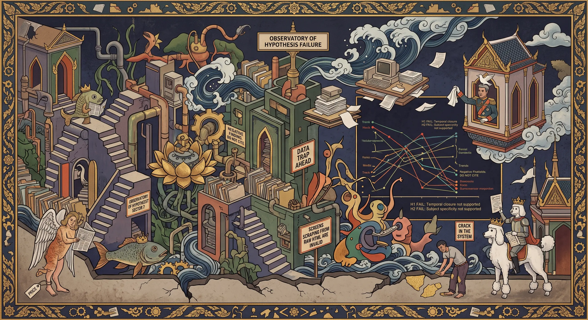

## 0073 – Where the Comments Went: A Measurement That Failed to Confirm Its Hypothesis
### *Counting one columnist's comment threads across the February 2026 election — why the obvious explanation does not survive its own data*

> **NEGATIVE FINDING.** This node tests the hypothesis that the comment space beneath Bangkok Post opinion columns closed after the general election of 8 February 2026, and that the closure was specific to Thai domestic subjects. **The measurement does not support either claim.** The node is kept because the hypothesis was plausible, is widely assumed, and now has a documented refutation with a repeatable method. Do not cite the hypothesis as established anywhere.

-----

## 1. The hypothesis under test

Observation prompting it: under Thitinan Pongsudhirak's column of 26 December 2025 ("Another wasted year in Thai politics") there were **24 comments**, several of them explicitly calling for reform of Section 112 (30 approvals), referring to palaces, and naming the 2014 coup. Under his columns of 10 and 18 July 2026 there were **0** and **1**.

Two candidate explanations were formulated:
- **H1 (temporal):** the space narrowed after the 8 February 2026 election.
- **H2 (subject-specific):** columns on Thai domestic politics draw few comments while global and regional columns are unaffected.

Both were testable against a controlled case: same author, same column, same section, same paper.

-----

## 2. The data

| Date | Column | Subject | Comments |
|---|---|---|---|
| 26 Dec 2025 | Another wasted year in Thai politics | Thai domestic | **24** |
| 23 Jan 2026 | Trump's 'America First' in overdrive | global | 7 |
| 6 Feb 2026 | Will poll be breakout or more of same? | Thai domestic | **2** |
| 13 Feb 2026 | Implications of conservative triumph | Thai domestic | **7** |
| 20 Feb 2026 | The gist of Thai politics over 20 years | Thai domestic | **10** |
| 27 Mar 2026 | Trump goes off-script, US gone rogue | global | 11 |
| 3 Apr 2026 | Government stability tests performance | Thai domestic | 2 |
| 24 Apr 2026 | Myanmar's robbery of a democracy | Myanmar | 6 |
| 12 Jun 2026 | Asean must rely on itself and Japan | ASEAN | 3 |
| 3 Jul 2026 | 'Middle powers' to fill the global gap? | global | 10 |
| 10 Jul 2026 | Govt stability hinges on performance | Thai domestic | 0 |
| 18 Jul 2026 | Asean's risks by re-engaging Myanmar | ASEAN / Thai state visit | 1 |

Thai-domestic series, chronological: **24, 2, 7, 10, 2, 0**
Global series: **7, 11, 10**

-----

## 3. Why both hypotheses fail

**H1 (post-election closure) fails on its own timeline.** The lowest Thai-domestic count in the whole series (2) falls on **6 February — two days *before* the election**, on an election-preview column, i.e. the moment of maximum expected interest. Twelve days *after* the election the count was **10**. A closure that begins before the event and reverses immediately after it is not a closure.

**H2 (subject specificity) fails on the comparison.** Global columns run 7, 11, 10 across the entire period. Thai-domestic columns run 2, 7, 10 in the same months. The two ranges overlap almost completely. Only the December 2025 outlier (24) sits above the global band, and a single point is not a category.

**What actually characterises the series is variance.** Thai-domestic counts move between 0 and 24 with no monotonic trend. Any two points can be selected to produce a narrative in either direction — which is precisely the trap this measurement was built to avoid.

-----

## 4. What survives

Only a weak and explicitly under-powered observation: the **two most recent** Thai-domestic columns (3 April: 2; 10 July: 0) are at the low end, and the most recent column of any kind stands at 1. That is a possible recent decline resting on **two data points**, against a series whose normal variance is 2 to 10. It is not evidence. It is a reason to keep counting.

**Additional caveat found late:** the 18 July column was one day old when measured, so it had minimal time to accumulate comments. Age-since-publication was not controlled for anywhere in this sample and should be in any repeat.

**One structural observation stands independently of the count:** in the five months from March to July 2026, Thitinan published only **two** columns on Thai domestic politics; the rest were Iran, Trump, ASEAN and middle powers. In December his year-end piece was still "Another wasted year in Thai politics". This is a shift in *subject supply*, not in comment volume, and it is not explained by anything measured here.

**And one qualitative change is not captured by counting at all:** the December 2025 thread carried comments calling for Section 112 reform (30:0), referring to palaces (32:0 and 6:0), and describing the 2014 coup as an act against the people (7:0). Whether comparable statements appear in the 2026 threads has not been examined. **Volume and sayability are different measures, and only volume was tested here.** That remains the more promising line of inquiry.

-----

## 5. Method (repeatable; note the trap)

1. Article list from the columnist index (`/opinion/columnist/202/thitinan-pongsudhirak`); the "MORE" control loads older entries via AJAX. Careful: an `a.btn.btn-border` selector on that page hits the sign-in button and navigates away.
2. **Comment counts are rendered client-side.** The served HTML contains only the string `COMMENT`; the figure is injected by the site's `g_comment` script. **Counts scraped from raw HTML are invalid** — an early attempt produced spurious figures (10, 9, 3, 1) from unrelated regex matches and was discarded before use.
3. Valid procedure: load each article in a rendering browser (an offscreen same-origin iframe works and is faster than navigation), wait ~2.5 s after load, read the text of `.article-btn-comment`, which resolves to `COMMENT (n)`, or to `COMMENT` with no parenthesis when the count is zero.
4. Counts collected 19 July 2026. December 2025 thread supplied from the user's own archive.
5. **Not controlled:** age since publication; reader traffic per article; comments submitted but not released (invisible from outside); subject coding is ours, not the paper's.

-----

## 6. Relation to the field observation

The user (comment handle "NangTani") reports that a sourced comment placed under the 18 July Myanmar column — ending by calling Bangkok a shelter for a man wanted for genocide — did not appear, while the single released comment there attacked China, Russia and India in blunter language and stands at 19:0. In the same week his comments under **news** articles were published within hours (29:2 Lat Phrao fire; 15:1 amnesty bill; 10:4 EU FTA).

**This concerns the release of one comment, not the volume of a thread.** The measurement above neither supports nor refutes it: a moderation decision on a single submission is invisible in aggregate counts. The two questions must be kept apart.

-----

## 7. The published frame (unchanged by this result)

- **RSF World Press Freedom Index 2026: Thailand fell from 85th to 92nd of 180.**
- New visa rules for foreign journalists, opposed by the FCCT.
- June 2026: the programme *Inside Thailand* was terminated after criticising an allegedly cronyism-driven AI project (per a People's Party MP); the government disputes interference and stated on 20 June that it does not monitor or pressure outlets.
- Freedom House downgraded Thailand to **"not free"** in 2025; EPRS (Jan 2026) records online expression "increasingly under attack".
- RSF on the mechanism: self-censorship is so internalised that "there is no need to prosecute or imprison them at all."

**None of this is disproved by our null result.** A space can close by self-censorship without comment counts moving, and comment counts can move for reasons having nothing to do with freedom. The published frame describes a climate; our measurement tested one narrow proxy for it and found the proxy unreliable.

-----

## 8. Lesson for the observatory

The hypothesis was plausible, matched the field experience, and fitted the wider evidence — and it still failed. Two selected endpoints (24 → 0) told a clean story; the full series (24, 2, 7, 10, 2, 0) does not. **Where a claim rests on a trend, collect the intermediate points before publishing.** This is the same discipline applied to sources in [[0068]] (verify that a citation carries the precise point, not merely the topic) — extended to self-collected data.

If the question is pursued further, measure **sayability** rather than volume: count, in threads before and after, how many published comments name Section 112, the constitution, the courts, or the government by name. That is the variable the December thread actually distinguishes — and it was never tested here.

-----

## Sources

**Primary measurement:** Bangkok Post columnist index and article pages; counts read from rendered `.article-btn-comment`, 19 July 2026.
https://www.bangkokpost.com/opinion/columnist/202/thitinan-pongsudhirak

**RSF – Thailand country profile (2026 Index: 92nd of 180, down from 85th)**
https://rsf.org/en/country/thailand

**Khaosod English – Thailand's RSF Press Freedom Ranking Is Falling (8 May 2026)**
https://www.khaosodenglish.com/featured/2026/05/08/thailands-rsf-press-freedom-ranking-is-falling-and-should-be-even-lower-next-year/

**Thai Newsroom – Government denies monitoring or pressuring news outlets (20 June 2026)**
https://thainewsroom.com/2026/06/20/government-denies-monitoring-or-pressuring-news-outlets/

**Freedom House – Thailand country profile ("not free", 2025)**
https://freedomhouse.org/country/thailand

**EPRS – Thailand ahead of the February 2026 general election, PE 782.627 (January 2026)**
https://www.europarl.europa.eu/thinktank/en/document/EPRS_BRI(2026)782627

**FCCT – Foreign Correspondents' Club of Thailand**
https://www.fccthai.com/

*Filed under: method, negative findings, press freedom, public sphere, own-sample measurement*
*Cross-references: [[0068]], [[0070]], [[0065]]*

