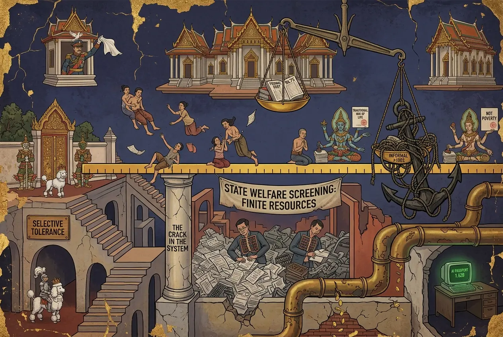
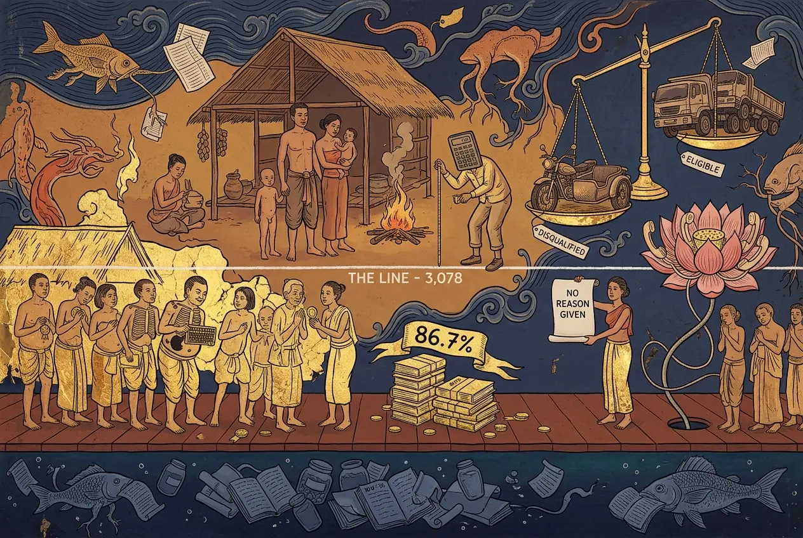

## 0074 – The Uncounted: Household Debt, the Poverty Line, and the Architecture of a Smaller Crisis
### *How a low threshold and a formal-only debt figure recode structural precarity as a "traditional way of life" — and how the welfare filter manufactures the exclusion it then borrows to soothe*

-----

## 1. Scope and the claim

This node treats a single mechanism seen from two sides: **measurement as containment.** Thailand's official statistics report a small poverty population and a household-debt ratio "under control." Both readings survive only because of where the lines are drawn. Move the poverty line to observed living costs, and most of the visibly deprived are already above it. Add the borrowing the central bank does not supervise, and household debt passes 100% of GDP. The claim is not that anyone falsified a number. It is that **two thresholds, each defensible in isolation, together produce an official picture materially smaller than the lived one** — and that the 2026 welfare re-screening shows the same state manufacturing exclusions through its own faulty records, then absorbing the resulting anger with borrowed money.

This connects the fiscal-spiral analysis of [0069](0069-the-way-out-runs-through-the-politics.md), the welfare-rationing and burden-of-proof pattern of [0071](0071-the-ledger-and-the-sun.md), the informal-debt figure already flagged in [0072](0072-the-baht-as-gold-proxy.md), and the deleted-social-rights baseline of [0068](0068-should-not-shall-deleted-social-rights.md).

## 2. The poverty line as instrument

The NESDC national poverty line for 2024 is **3,078 baht per month** — roughly 80 euro (raised from 3,043). By that line, **3.43 million people (4.89%) are "poor"**; of these, **879,000 are "very poor," averaging 615 baht a month** (about 16 euro). The line is derived from a food-poverty basket plus average non-food expenditure of reference households, adjusted regionally.

The analytical point is not that the method is arbitrary but that the **level** sits at the floor of subsistence. A household above 3,078 baht — with children poorly clothed, in an open hut, fighting day to day for food — is not counted poor. Material deprivation that would be unambiguous elsewhere is, statistically, "not poverty."

### *2.1 The recoding of deprivation as tradition*
Rural deprivation is frequently reframed in Thai public and media discourse as **"simple rural life" / modesty / a "traditional way of life."** This recoding converts a distributional failure into a cultural virtue and lowers the felt pressure for redistribution. The stronger frame for external use is **not** Thailand-versus-Europe (dismissible as "you don't understand life here") but **Thailand's own line against Thailand's own visible reality**: the state calls 3,078 baht the edge of poverty while, above it, children go without clothing.

<!-- §112-INTERNAL NOTE: The specific state vehicle for this recoding is the Sufficiency Economy Philosophy (SEP), King Bhumibol's doctrine, constitutionally entrenched and taught in schools (see the sufficiency-economy tag in 0068). Analysing SEP as a poverty-masking ideology is legitimate HERE, in this pseudonymous node, in a scholarly/cited register (Walden Bello; critiques of SEP as anti-redistributive). It is royal-touching and must NEVER appear under the commenting identity in a Bangkok Post comment — the Post's own policy removes anything "related to the Thai Royal family," and expansive s112 enforcement makes it a live risk. Public derivatives carry the point de-royalised: attack "traditional way of life" as a euphemism, never name the doctrine. -->

### *2.2 Against the right line: the World Bank comparison*
The lowness of the national line is not opinion but tier. The World Bank sets poverty lines by country income group (2025 revision, 2021 PPP): **extreme poverty $3.00/day** (low-income countries), **lower-middle-income $4.20**, **upper-middle-income $8.30** (replacing $2.15 / $3.65 / $6.85 in 2017 PPP). Thailand has been an **upper-middle-income economy since 2011**, so the tier-appropriate line is $8.30. At that line, Thailand's poverty rate was about **10.1% in 2023**, against a national-line rate of roughly **5–6%** (NESDC 4.89% in 2024; World Bank 6.3% in 2021) — and **12.2% at the prior $6.85 line in 2021** (World Bank, POVEQ_THA). So measured on its own income tier's scale, poverty is close to double the national figure. Because purchasing-power parity already adjusts for Thailand's higher price level relative to low-income countries, the comparison is like-for-like: the state counts poverty at a threshold built for far poorer economies, and halves its own number by doing so. **Method note:** the comparison must run through the World Bank's own PPP-based rate, not a market-exchange-rate dollar conversion of the baht line (3,078 baht ≈ US$3/day at the market rate looks like the extreme-poverty line, but that is PPP-vs-market apples-to-oranges and is refuted on sight).

## 3. The welfare filter and the self-inflicted wound (2026)

For the 2026 State Welfare Card (base card ~300 baht/month, topped up to 1,000 for four months per [0060](0060-thai-help-thai-plus-constitutional-architecture.md)), applicants must pass all of nine criteria, including: income no more than 100,000 baht/year; financial assets no more than 100,000 baht; and **total credit lines across all accounts no more than 100,000 baht** (National Credit Bureau data). Vehicle ownership disqualifies **except** motorcycles up to 300cc, three-wheelers, small four-wheeled taxis, and **agricultural vehicles** (one per type).

The re-screening produced mass exclusion: about **1.45 million** disqualified for vehicles above the threshold, **668,000** for debts over 100,000 baht, and roughly **six million** left ineligible overall — who are then offered enrolment in the "Thais Help Thais Plus" 60/40 co-payment instead.

### *3.1 The wound is administrative, not natural*
The Finance Ministry conceded that the vehicle rule carried **"shortcomings"**: vehicles still registered to previous owners after informal transfers, and scrapped or stolen vehicles never removed from records. Of **2.9 million** requests for reconsideration, about **40%** concern vehicle ownership. The exclusion, in a large share of cases, was produced by **stale state data** — and the remedy demands that the citizen supply **"evidence of informal vehicle transfers"** to disprove the state's own record. This is the burden-of-proof inversion of [0071](0071-the-ledger-and-the-sun.md): the state errs, the poor prove.

### *3.2 The exemptions are admissions*
The government then eased multiple rules — extending the appeal deadline to **20 September** (benefits from 1 October), revising student criteria, and, critically, **exempting agricultural credit from the 100,000-baht debt ceiling** (rationale: farm loans are seasonal, tied to the planting cycle, sometimes disaster relief). Each carve-out is an admission that the criterion was catching the wrong people. Housing loans (up to 1.5m) and auto loans (up to 1m) are already assessed under separate thresholds, not the 100k.

**Calibration (mandatory):** a farm tractor therefore does **not** disqualify — exempt as an agricultural vehicle, and its loan now exempt from the debt ceiling. Any external argument that "the tractor excludes him" is refuted in one reply. The defensible line is the general one: **a 100,000-baht debt ceiling excludes the indebted poor**, which is why the government had to carve farm debt out of it.

### *3.3 The backlash and the self-inflicted gridlock (added 22 July 2026)*
On announcement (17 July 2026) the scale was clear: of **18.8 million applicants, 9.5 million qualified and 9.3 million did not** — and of the **13.2 million existing beneficiaries, 5.99 million no longer met the revised criteria** and lost the card they held. (That is the honest "lost the card" figure; the *net* fall to 9.5 million is smaller — about 3.7 million — because new entrants offset the losses. Do not conflate the two.) Of the 9.3 million disqualified, **5.76 million failed even the previous income test; 3.56 million were cut only by the tightened rules.** The welfare-card budget was reduced from **over 50 billion to 42 billion baht** (an initial plan allotted only 30 billion) — the consolidation the exercise delivers, borne by the bottom.

**The criterion misfires in both directions — now with faces.** Bangkok Post reporting (22 July, "Why is it so difficult to prove we really are poor?") named those it caught. **Somnuek**, 57, rejected four times and accepted on the fifth, disqualified over a **200 m² plot inherited from an ancestor** — while a neighbour with **two 10-wheel trucks** kept the benefit. **Sa-ard**, 64, wife of a 73-year-old scrap-buyer, struck off over a **20-year-old motorcycle with sidecar**; to appeal she must travel to the Land Transport office to prove its age, and says she has "neither the money nor the energy." **Supranee**, 39, caring for a mother with cancer, disqualified by SMS with **no reason given**. The test does not measure need; it reads the registry — over-inclusive at the top (the trucks), over-strict at the bottom (the plot, the motorbike).

**A rules-exemption anomaly.** Per the published criteria (§3), **motorcycles up to 300cc and three-wheelers are exempt** — so a single old motorcycle-with-sidecar should not disqualify at all. Sa-ard's case therefore points to either **misapplication** or the very **stale-record errors the ministry admitted** — and the reason is undisclosed, consistent with Supranee's "no reason given." The opacity is itself a barrier: one cannot target an appeal against a reason one is not told.

**The gridlock is self-inflicted.** Because the exclusions turn on the state's own outdated **vehicle and property records**, the remedy routes the excluded back to the agencies that hold those records, to disprove them. The result: **government agencies overwhelmed with queries; the Department of Land Transport overwhelmed, its telephone hotlines impossible to reach.** The burden-of-proof inversion of §3.1 thus has a systemic consequence — the state manufactures the error, lays the proof on the poorest, and floods the one agency that could correct it. This is §5's endogenous absorption in administrative form: **the machine breaks under the load it made itself.** (Calibration: the verified claim is "overwhelmed / hotlines unreachable," not "the bureaucracy is completely paralysed nationwide.")

**The backlash forced a rethink.** By 18 July, **2.76 million had appealed** (~30% of the disqualified), with **6.55 million more eligible until 31 July**; corrections due 16 August, results **21 September**. Under the pressure — **Bloomberg, 20 July 2026: "Thailand to Revisit Welfare Eligibility After Backlash Over Cuts"** — the government eased rules, extended the appeal window, and opened one-stop centres and home visits (§5). A **censure bid is being readied by the opposition** (Bangkok Post, 21 July), though on other grounds (scam networks, official collusion), not the welfare exercise. Whether this failure belongs on that list is a political question the facts pose but the node does not answer.

### *3.4 The priorities frame: "finite resources" and the AI passport (added 22 July 2026)*
The Finance Ministry defends the cut as steering **"finite state resources"** to the most vulnerable. The same government's **Ministry of Digital Economy and Society**, under minister **Chaichanok Chidchob** — of the Chidchob–Bhumjaithai network analysed in [0010](0010-buri‑ramization-of-defense.md) and [0061](0061-dsi-senate-investigation-silenced-under-bhumjaithai.md) — defends spending **1.62 billion baht** on the **TH-AI Passport**, a single subscription giving citizens access to ~12 AI platforms and 24–25 models, as **"cost-effective,"** and presses ahead despite criticism (Bangkok Post opinion, "Govt presses ahead with fraught AI plan"). The broader **National AI framework runs to 25 billion baht (FY2026–27)**, within a stated **500-billion-baht** digital ambition.

**Discipline (mandatory): a juxtaposition of priorities, NOT a causal claim.** The ~8-billion-baht welfare saving does **not** fund the 1.62-billion AI passport — separate budgets (Finance Ministry transfers vs the DES fund). The defensible point is only that **"finite resources" is invoked against a 300-baht card for the poorest but not against the AI project**: the scarcity runs out only at the bottom. Any public derivative keeps to the office ("the Digital Ministry"); the Chidchob-patronage dimension stays here, in the scholarly register, never a personal barb in a comment.

## 4. The debt undercount

Official Bank of Thailand household debt was **86.7% of GDP at end-2025** (16.4 trillion baht), 85.9% in Q1 2026 — a fall the SCB EIC reads as **"harder to borrow, not better off."** The BoT figure captures only formally recorded credit.

Economist **Chartchai Parasuk** (Bangkok Post, "2026 will be a year of debt struggles") sets out the depth the headline hides:
- **Informal debt** is placed at **12.3% of GDP (2.3tn baht) by the BoT** and up to **30.7% of GDP (5.8tn baht) by a UTCC survey**; including it, household debt **"likely exceeds 100% of GDP."** (Consistent with the Chula/JSCCIB 104% figure for Q4 2024 cited in [0072](0072-the-baht-as-gold-proxy.md).)
- **Debt service ratio exceeds 60%** of income — leaving under 40% for living, against an international norm that servicing should not exceed 40%.
- Average household **income ~20,000 baht/month against expenses ~21,000** — a structural monthly shortfall; roughly **one-third** report income insufficient for expenses (SCB EIC).
- Of NPL accounts, only **14% (non-bank) / 29% (bank)** had been restructured by Q2 2025; an estimated **8.3 million accounts** may be effectively non-restructurable.
- Household debt totals about **22.3 trillion baht**; relieving even 10% would need over 2 trillion baht — **"Where such resources would come from remains unclear."**

As formal credit is exhausted, households turn to **"car-for-cash" and "house-to-cash"** asset-based lending — pawnbroking by another name.

## 5. Endogenous absorption

The state now appears as its own rescuer: one-stop centres at district offices, village heads sent on home visits, and the co-payment offered to the excluded. Read against the wound of section 3, this is **absorption of a shock the administration itself generated** — the state does not heal poverty; it dresses a wound of its own making, and the promotional register sells the dressing as benefaction (the co-payment is marketed as "turning local spending into national strength"). This is the concrete, endogenous form of the general pattern: **the Thai state absorbs pressure without resolving it — postponement, now literally with interest.**

## 6. The fiscal ceiling

The absorption is debt-financed. "Thais Help Thais Plus" (a ~176-billion-baht package housing the 60/40 co-payment) is funded not from the regular budget but under an **emergency decree authorising the Finance Ministry to borrow up to 400 billion baht**, justified by the **energy crisis** — the same crisis the scheme names as its own purpose. In its first three weeks the state's share of spending was **22.4bn of 38.9bn baht**; 26 million received entitlements. Thai PBS Verify notes academics' objection that the 2026 budget already exists, i.e. this is a costed election promise carried on emergency borrowing, not an unforeseeable emergency (the legal thesis of [0060](0060-thai-help-thai-plus-constitutional-architecture.md)).

This supplies the missing terminal condition to the absorption thesis of the border/welfare nodes: the rupture the establishment fears need not arrive through disillusion. It can arrive through the **fiscal ceiling** — absorption financed by borrowing meets a limit when the borrowing that funds the postponement can no longer be raised (see the twin-deficit and reform-blockage argument of [0069](0069-the-way-out-runs-through-the-politics.md)).

## 7. Analytical synthesis

Three moves compound:
1. **The poverty line is set at subsistence**, so the visibly deprived count as non-poor.
2. **The debt figure counts only formal credit**, so a country already past 100% of GDP including informal debt, with a debt-service ratio over 60%, reads as "under control."
3. **The welfare filter manufactures exclusions through faulty data**, then the state absorbs the resulting anger with borrowed money and sells the patch as generosity.

The result is an official picture **built smaller than the reality by construction**, not by fraud. Deprivation is renamed tradition; borrowing is renamed resilience; error is renamed benefaction. The uncounted are not a rounding error — on the debt-service and informal-debt evidence, precarity is the majority condition, held below the threshold of the statistics that would have to name it.

-----

## 8. The current-account channel: a second squeeze on the same wallet (added 23 July 2026)

**Content analysis**

In a second column — *"Why we face economic contraction"* (Bangkok Post, 23 July 2026), distinct from the debt column of 8 January cited in §4 — **Chartchai Parasuk** makes the contrarian call that Thailand's GDP will **contract by 0.4% in 2026**, against consensus forecasts of **IMF 1.9% (July update), ADB 1.8%, BoT 2.3%, Kasikorn 2.0%**. His argument routes through the external account and lands on the same household wallet this node is about: people spend more on energy and therefore less on everything else.

The verifiable anchors hold:
- **2022 grew 2.6% despite $100 oil** because the Prayut government capped diesel at 35 baht/litre and private credit expanded by nearly 800bn baht (private consumption +6.3%) — conditions absent in 2026. *(2022 growth confirmed at 2.64%, NESDC; the 35-baht diesel cap confirmed, Oil Fuel Fund.)*
- **2025 current-account surplus $15.9bn = ~530bn baht = 2.8% of GDP.** *(Confirmed; 2024 was $11.1bn / 2.1%.)* Domestic consumption grew only 2.7% that year, so growth leaned on external demand; on Chartchai's counterfactual, a break-even current account would have cut 2025 growth to 0.4%.
- **First five months of 2026:** fuel import bill up from $18bn to $25bn; current account swung from a $10.4bn surplus to a **$12.4bn deficit**.

**Analysis — where the column is strong, and where it overreaches**

Its strongest point is an internal contradiction in the consensus, and it is sound: the **IMF projects a $4.1bn current-account surplus for 2026 while the first five months already show a $12.4bn deficit.** For the IMF's 1.9% to hold, the second half would have to generate an implausibly large surplus. That criticism stands on the consensus's own numbers.

Three cautions attach to his own figure, and they are recorded here so the number is not imported uncritically:

1. **Level versus change.** The contribution of net exports to GDP *growth* is their year-on-year *change*, not their *level*. Chartchai argues throughout from the level ("had the current account broken even, growth would fall to 0.4%"). For 2026 the distinction partly collapses because there is a large change — but that cuts against him: the swing from a $15.9bn surplus to his projected **$21.9bn deficit is $37.8bn, ~1,259bn baht, ~6.6% of GDP**, nearly double the "729bn baht / 3.8%" he cites (that 729bn figure is the *level* of the projected deficit, not the swing). His headline −0.4% is therefore a modelled judgement with an implicit offset, not a mechanical result.
2. **Energy is over-weighted.** The five-month fuel bill rose $7bn, but the current account swung $22.8bn. Energy explains under a third; the rest is weaker exports and other imports. The energy-centric framing carries more causal load than his own figures support.
3. **Conditionality, stated honestly.** The −0.4% assumes WTI averages $80 for the rest of the year, which he flags as optimistic; above $90 he says the result is worse. This is a conditional forecast, and he is transparent about it.

**Convergence with this node**

The mechanism is the one §1–§4 describe from the domestic side, reached from the external side. A household at ~20,000 baht income against ~21,000 baht expenses (§4) has no buffer for a rising energy share; the current-account deterioration and the debt-service ratio over 60% are the same squeeze measured at two scales. The IMF's own 0.4-percentage-point upgrade is attributed not to exports but to the **172bn-baht "Thai Help Thai" stimulus (0.9% of GDP)** — the borrowed patch of §6, now doing double duty as a growth forecast's support.

*(Reconciliation note: Chartchai names a 172bn-baht "Thai Help Thai" programme. This node and [0060](0060-thai-help-thai-plus-constitutional-architecture.md) carry "Thai Help Thai **Plus**" at 176bn baht (The Nation) alongside the 400bn emergency-decree borrowing authority. The 172/176 gap and the "Plus" distinction should be resolved before either figure is used in a comment.)*

**Tension**

Every major institution forecasts growth; the lone dissenter forecasts contraction, and says so. His directional claim — that the external deterioration is real and under-priced — is well-supported. His specific −0.4% rests on an oil assumption he admits is optimistic and on a level-for-change treatment of the current account that professional forecasters would contest. Both cautions and the strength belong on the record together.

-----

## 9. The tax floor: "21 million off the books" and the average that hides the worker (added 4 August 2026)

**Content analysis**

The containment mechanism of §1 has a revenue-side face. A feature in *The Nation* — *"Why Nordics Queue Up to Pay Tax While 21m Thais Stay Off the Books"* — reports, from Revenue Department filing data (PND 90/91), that of roughly **12 million** who filed a personal income-tax return, only about **5 million (≈40%)** owed any tax at all; set against a workforce near **40 million**, the piece places **21–22 million** workers "entirely outside the formal tax system." Its own thesis is sympathetic — an informal economy "built on survival, not evasion," with the Nordic model held up as high income floor plus felt return — and its remedy (raise incomes before widening the net) converges with this node. The instrument it half-describes, though, is the same one §2 runs on the poverty line, run instead on the tax threshold.

**Two moves.**

*The threshold, read as absence.* No personal income tax is due until **net** taxable income exceeds roughly **150,000 baht a year**. After the standard deductions — a 60,000-baht personal allowance and a 50% expense deduction capped at 100,000 baht — that corresponds to gross earnings of about **[VERIFY: 26,000–30,000 baht a month]** before the first baht is owed. The typical worker earns well below it: median monthly employee earnings of about **[VERIFY: 14,000–15,000 baht]** are roughly **half** the entry point. "Most workers fall below the threshold," then, is not a finding about evasion; it is a finding about wages — exactly as §2's line records subsistence, not sufficiency.

*The average that lies.* The figures usually reached for to suggest a taxable populace — GNI per capita of about **[VERIFY: 245,000–255,000 baht a year (~US$7,000)]**, or NSO average household income of about **[VERIFY: 27,000–28,000 baht a month]** — sit above the threshold. Both mislead, in the mirror image of §2.2. The **mean** is pulled up by a thin top tail (a Gini around **[VERIFY: 0.43–0.45]**); the **median** worker sits far beneath it. And the units do not match a worker's taxable wage: per-capita GNI divides all output, capital income included, across the whole population; household income spreads across a household of about **[VERIFY: three]** with, often, more than one earner. Where §2.2 caught the state's line *understating* poverty, §9 catches the headline average *overstating* capacity — the same distortion, opposite sign. Whoever argues "the average Thai could bear more tax" is repeating it.

**The recoding, and the tax the informal majority does pay.** "Off the books," "staying off the books," "avoiding tax" — the frame casts the informal majority as non-contributors. They are not. Thailand's **7% VAT** and its excise duties on fuel, alcohol and tobacco fall on everyone who buys, and as a share of income they fall **hardest on the poorest**. The 21 million owe no *income* tax; they pay the most *regressive* taxes, and receive — the source's own point — the least visible return. "They pay no tax" is false. This is §2.1's recoding once more: contribution renamed absence.

**Number-mix caution (mandatory).** The feature's own arithmetic does not close, and the node must not inherit the slippage. **40 million** workers minus **12 million** filers is about **28 million** non-filers — not the 21–22 million the piece calls "outside." The 21–22 million is a separately sourced estimate of **informal employment**; the "40–50% of GDP" it also cites is a third, distinct measure (informal activity as a share of *output*). Three different populations — informal share of GDP, informal *workers* (~21m), and income-tax *non-filers* (~28m) — are elided into one in the prose. The node carries them as three attributed figures and blends none, the discipline of §4's debt figures.

**Convergence.** Read with §2 and §6, the revenue and spending sides describe one wallet. If the base is narrow **because** incomes sit below a subsistence threshold, then the state is not oversized against need but under-resourced against it, and the "finite resources" frame of §3.4 inverts: scarcity is asserted at the bottom while the base that would relieve it is kept thin by low wages, not by generosity to the top (the ~15–16% tax-to-GDP ratio carried in [0069](0069-the-way-out-runs-through-the-politics.md)). The tax threshold thus joins the poverty line (§2) and the formal-only debt figure (§4) as a third face of one instrument: **a line drawn where the lived reality is largest, so the official reality can read small.**

-----

## Sources

**The Nation – Thailand's poor reach 3.4m, 870,000 earn just 600 baht per month (NESDC 2024; poverty line 3,078 baht; 879,000 "very poor" at ~615 baht)**
https://www.nationthailand.com/news/policy/40055537

**Bangkok Post – Chartchai Parasuk, "2026 will be a year of debt struggles" (Opinion, 8 January 2026): household debt 87.7% of GDP; informal debt BoT 12.3% / UTCC 30.7%; DSR over 60%; income ~20,000 vs expenses ~21,000; 8.3m non-restructurable accounts; total ~22.3tn baht**
https://www.bangkokpost.com/opinion/opinion/3171085/2026-will-be-a-year-of-debt-struggles

**Bangkok Post – Thai household debt climbs to 104% of GDP in Q4 (Chulalongkorn/JSCCIB, incl. informal loans; informal ~98,538 baht/household; 40% of households)**
https://www.bangkokpost.com/business/general/2935951/household-debt-ratio-climbs-to-104-in-q4

**The Nation – Thai household debt hits 86.7% of GDP as borrowing shifts to daily spending (Bank of Thailand, end-2025)**
https://www.nationthailand.com/business/economy/40065070

**Thairath (EN) – State Welfare Card 2026: eligibility (income/assets/credit ≤100,000 baht; agricultural vehicles exempt; disqualification counts)**
https://en.thairath.co.th/news/society/2937043

**Thai Post – Government excludes agricultural credit from the 100,000-baht debt ceiling ("ไม่นับสินเชื่อเกษตรในเพดานหนี้ 1 แสนบาท")**
https://www.thaipost.net/general-news/1034099/

**Bangkok Post – "6 million to get new aid offer" (Finance Ministry; 6m to 60/40 co-payment under "Thais Help Thais Plus"; 2.9m reconsideration, 40% vehicle; appeal deadline extended to 20 Sep; benefits 1 Oct)**
https://www.bangkokpost.com/thailand/general/3288940/6-million-to-get-new-aid-offer

**The Nation – Finance Ministry to seek 400bn-baht loan decree; Cabinet approves THB176bn Thai Help Thai Plus (emergency-decree borrowing, energy-crisis justification; 60/40, state 60%)**
https://www.nationthailand.com/news/policy/40065695

**Thai PBS Verify – Fact check: Anutin's "2,400-baht debt" remarks; 2026 budget already exists**
https://www.thaipbs.or.th/verify/en/content/8171

### Added 22 July 2026 (§3.3–§3.4)

**Bangkok Post – "Why is it so difficult to prove we really are poor?" (22 Jul 2026; human cases: Somnuek/200 m² plot vs neighbour's two 10-wheel trucks; Sa-ard/20-year-old motorcycle; Supranee/no reason given)**
https://www.bangkokpost.com/thailand/general/3289350/why-is-it-so-difficult-to-prove-we-really-are-poor

**Bangkok Post – "2.76m seek welfare eligibility review" (2.76m appealed by 18 Jul, 6.55m eligible until 31 Jul; Department of Land Transport overwhelmed, hotlines impossible to reach)**
https://www.bangkokpost.com/thailand/general/3288434/276m-seek-welfare-eligibility-review

**Bangkok Post – State welfare recipients fall after stricter eligibility checks (5.99m of 13.2m existing beneficiaries no longer meet criteria; 18.8m applied / 9.5m qualified; 5.76m failed prior income test, 3.56m cut by revised rules)**
https://www.bangkokpost.com/thailand/general/3287004/state-welfare-recipients-fall-after-stricter-eligibility-checks

**Bangkok Post – Spotlight on ballooning welfare spending (budget cut from over 50bn to 42bn baht; initial plan 30bn)**
https://www.bangkokpost.com/business/general/3273764/spotlight-on-ballooning-welfare-spending

**Bloomberg – Thailand to Revisit Welfare Eligibility After Backlash Over Cuts (20 Jul 2026)**
https://www.bloomberg.com/news/articles/2026-07-20/thailand-to-revisit-welfare-eligibility-after-backlash-over-cuts

**Bangkok Post – Opposition readies for censure bid (21 Jul 2026; grounds: scam networks, official collusion)**
https://www.bangkokpost.com/thailand/politics/3288994/opposition-readies-for-censure-bid

**The Nation – Thai Digital Minister Refuses to Halt $45M "TH-AI Passport" Project (Chaichanok Chidchob defends 1.62bn-baht TH-AI Passport as cost-effective; ~12 platforms / 24–25 models)**
https://www.nationthailand.com/news/policy/40066822

**Bangkok Post – B25 billion approved for AI development (National AI framework, FY2026–27; workforce/centres/data bank)**
https://www.bangkokpost.com/business/general/3078438/b25-billion-approved-for-ai-development

### Added 23 July 2026 (§8 — current-account channel)

**Bangkok Post – Chartchai Parasuk, "Why we face economic contraction" (Opinion/Oped, 23 July 2026): 2026 forecasts IMF 1.9% / ADB 1.8% / BoT 2.3% / Kasikorn 2.0%; Chartchai −0.4%; 2025 current-account surplus $15.9bn (~530bn baht, 2.8% GDP); Jan–May 2026 current account −$12.4bn vs +$10.4bn; fuel bill $18bn→$25bn; IMF-implied $4.1bn surplus; projected full-year deficit $21.9bn on WTI $80**
https://www.bangkokpost.com/opinion/opinion/3290357/why-we-face-economic-contraction

*Verification of §8 (23 July 2026, via built-in browser + web):* 2022 growth **2.64%** (NESDC) confirmed; 35-baht diesel cap (Oil Fuel Fund) confirmed; 2025 current-account surplus **$15.9bn / 2.8% GDP** confirmed (2024: $11.1bn / 2.1%); IMF **1.9%** July update and BoT **2.3%** confirmed; **ADB 1.8%** is the April-2026 vintage (Dec-2025 ADO showed 1.6%); Kasikorn 2.0% not independently confirmed. Internal arithmetic checks: $15.9bn≈530bn baht → 33.3 baht/USD; 2.8% of GDP → ~18.9tn baht; $21.9bn≈729bn baht≈3.8% GDP — all consistent. Flagged in §8: the "swing" is mislabelled (true swing $37.8bn ≈ 6.6% GDP), energy explains under a third of the five-month current-account swing, and the −0.4% is conditional on WTI $80.

### Added 4 August 2026 (§9 — the tax floor)

**The Nation – "Why Nordics Queue Up to Pay Tax While 21m Thais Stay Off the Books" (Revenue Department PND 90/91: ~12m filed, ~5m ≈40% owed tax; workforce ~40m; 21–22m "outside the formal tax system"; informal economy 40–50% of GDP; ~150,000-baht net threshold; Nordic PIT 30–50%; cited sources: TDRI, KKP Research (Kiatnakin Phatra), World Bank, OECD)** [VERIFY URL]

*Verification status (§9):* The filing figures (12m / 5m / ≈40%), the workforce (~40m), the 21–22m "outside" estimate, the 40–50%-of-GDP informality band and the 150,000-baht net threshold are **The Nation's / Revenue Department's** as cited. Marked **[VERIFY]** pending confirmation on a single reference date (NSO / World Bank, one Stichtag): the ~26,000–30,000-baht gross entry point (deduction stack / current allowances), median monthly employee wage (~14,000–15,000), NSO average household income (~27,000–28,000), GNI per capita (~245,000–255,000 baht / ~US$7,000), household size (~3) and Gini (~0.43–0.45). **KKP Research** is the research arm of Kiatnakin Phatra (a bank) — a private-sector source, labelled as such. No "evasion/illegality" characterisation is adopted: the node's line, like the source's, is **subsistence, not evasion.**

-----

## Discipline checklist (verification record)

- [x] **Two thresholds, not one fraud.** The claim is that the poverty line (3,078 baht) and the formal-only debt figure each exclude by construction; it is never asserted that a number was falsified. "Built smaller by construction, not by fraud" is stated explicitly.
- [x] **PPP, not market rate, for the World Bank comparison.** The claim that Thailand's line sits near the extreme-poverty threshold is made via the World Bank's own PPP-based measurement (about 10% at the $8.30 upper-middle line in 2023 vs ~6% national; 12.2% at the prior $6.85 line in 2021), NOT by converting 3,078 baht at the market exchange rate — which would compare market dollars to PPP dollars and is refuted on sight. The higher-price-level point is subsumed: PPP already accounts for it.
- [x] **The tractor was verified out — twice.** Draft comments hung on a farm tractor as (a) a disqualifying asset and (b) a disqualifying debt. Both are false: agricultural vehicles are exempt from the vehicle rule, and agricultural credit is now exempt from the 100,000-baht debt ceiling. The node carries only the general, verified claim (a debt ceiling excludes the indebted poor; the carve-out is the admission).
- [x] **Diverging debt figures named with sources.** Formal 86.7% (BoT) vs >100% incl. informal (Chartchai via BoT 12.3% / UTCC 30.7%; Chula/JSCCIB 104%) — a definitional difference, stated as such, never blended into one "real" number without attribution.
- [x] **DSR carried as the lived metric.** The >60% debt-service ratio is attributed to Chartchai and framed as burden, not as an official BoT headline. Income/expense (20k/21k) attributed to SCB EIC via the same column.
- [x] **Sufficiency Economy quarantined.** The royal doctrine is analysed only inside a node-internal §112 note; the public-facing text and any derived comment attack the "traditional way of life" euphemism without naming it. No royal cue crosses into comment material.
- [x] **"Overwhelming majority" disciplined.** The strong claim that most of the country is precarious is not asserted as a bare headcount; it is grounded in the DSR (>60%) and informal-debt (>100% of GDP) evidence and phrased as the majority *condition*, not a counted majority.
- [x] **Absorption as function, not conspiracy.** "Manufactures the exclusion it then borrows to soothe" describes a structural outcome that requires no planner — rigid rule plus stale register suffices. No intent to harm is alleged.
- [x] **All source URLs pinned, Chartchai column read in full against the original (22 July).** Both "(URL to confirm)" placeholders are resolved. The column is dated **8 Jan 2026 at 01:01, OpEd section** — not July; the earlier date was wrong and is corrected. Every figure in §4 was checked word-for-word against the published text: 12.3%/2.3tn (BoT), 30.7%/5.8tn (UTCC), "likely exceeds 100% of GDP", DSR >60% against a 40% norm, 20,000 vs 21,000 (SCB EIC), 14%/29% restructured at Q2 2025, 8.3m accounts, 22.3tn total. One paraphrase inside quotation marks was corrected to the exact sentence. Note the figures are **January** figures, not mid-year ones.
- [x] **"Lost the card" (5.99m) ≠ "net reduction" (3.7m).** The gross figure — existing beneficiaries struck off — is 5.99m of 13.2m; the net fall in cardholders is ~3.7m because new entrants offset losses. The node uses 5.99m for "lost" and states the net separately, and does not blend them.
- [x] **"Overwhelmed," not "paralysed."** The verified claim is that agencies (specifically the Department of Land Transport) were overwhelmed and hotlines unreachable — not that local bureaucracy is "completely paralysed nationwide." The stronger framing was calibrated down.
- [x] **AI contrast is priorities, not causation.** The ~8bn welfare saving and the 1.62bn AI passport sit in separate budgets; the node claims only that "finite resources" is invoked selectively, never that one funds the other. The Chidchob-patronage link is node-internal (scholarly, cited to 0010/0061), never a named barb in a public comment.
- [x] **Sa-ard's motorcycle anomaly stated as anomaly.** Motorcycles ≤300cc and three-wheelers are exempt, so her disqualification points to misapplication or the admitted stale-record errors — not asserted as deliberate; the actual reason is undisclosed (part of the opacity finding).
- [ ] **§9 income/threshold figures pinned to one reference date.** The gross tax-entry point (~26–30k), median wage (~14–15k), household income (~27–28k), GNI per capita (~245–255k), household size (~3) and Gini (~0.43–0.45) are marked **[VERIFY]** until confirmed from NSO / World Bank on a single Stichtag; the mean-vs-median claim rests on them and is not asserted as settled until then. The Nation URL is likewise [VERIFY].
- [x] **Three informal measures kept separate (§9).** Informal share of GDP (40–50%), informal *workers* (~21m) and income-tax *non-filers* (~28m = 40m − 12m) are carried as three attributed figures; the source's conflation of them is flagged, not inherited.
- [x] **VAT/regressivity correction (§9).** The informal majority is not framed as paying "no tax": it owes no income tax but bears VAT (7%) and excise regressively. "Off the books = non-contributor" is corrected, not repeated.
- [x] **No evasion verdict (§9).** "Subsistence, not evasion" mirrors the source; no claim of illegality or deliberate avoidance is made. KKP labelled as a bank research arm.

