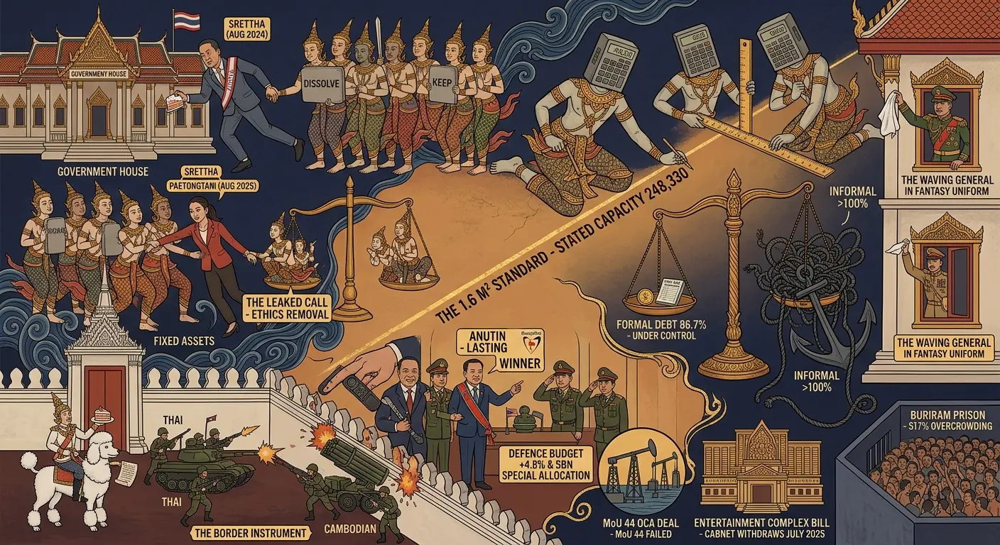
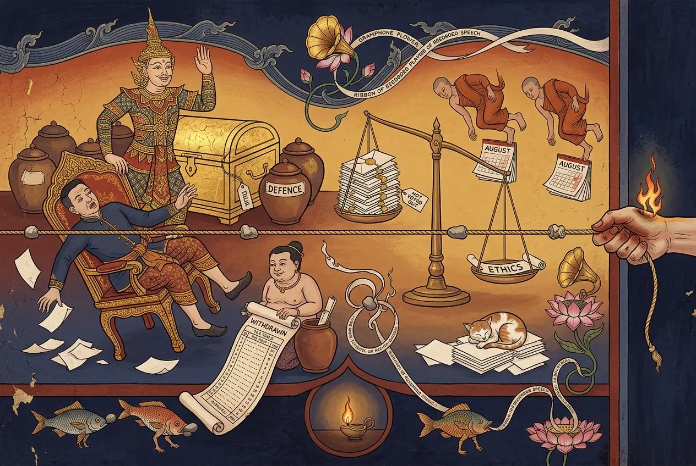

## 0076 – The Border as Instrument
### *How an externally-triggered conflict removed an elected government and rearmed its opponents*

-----

Pheu Thai was not voted out. An externally-triggered border conflict handed the Constitutional Court its case, and the camp that had fought the elected government's Cambodia policy emerged holding the ground, an enlarged defence budget and Government House. The lasting winner is not the prime minister — whose mandate is time-limited — but the military behind him. This node keeps to secular actors (Pheu Thai, the military, Anutin, Hun Sen) and separates what is documented from what is merely inferred.

<!-- §112-INTERNAL NOTE: Prayut and the Privy Council are NOT to be named in any public derivative. The circulating claim that Hun Sen expected Prayut as successor is unproven, constitutionally implausible (Prayut left politics in late 2023), and a s112 tripwire via the Privy Council route. The argument below carries without it. -->

## 1. The pattern — removal without the ballot box

Removal of Thaksin-aligned governments has a two-decade cadence — 2006, 2008, 2014, 2024, 2025 — and in its recent form it runs through the bench, not the barracks:

- **May 2023:** Move Forward wins the election and is blocked from forming a government.
- **7 August 2024:** the Constitutional Court **dissolves Move Forward.**
- **14 August 2024:** the Court **removes PM Srettha Thavisin** (5:4) over the cabinet appointment of Pichit Chuenban. *(This belongs to the pattern of judicial removal; it is not Cambodia-related.)*
- **29 August 2025:** the Court **removes PM Paetongtarn Shinawatra** (6:3) over the leaked Hun Sen call.

Two Pheu Thai premiers removed by the Court within a year, both in late August, both on "ethics." **Only the last removal is directly tied to Cambodia** — and that is the one this node examines. (The judicial machinery itself is the subject of [0078](0078-the-court-as-instrument.md).)

## 2. The double economic motive

**Axis A — the OCA offshore oil and gas (cooperation).** Srettha's **first bilateral foreign visit was to Phnom Penh, on 28 September 2023** — ahead of Brunei, Malaysia and Singapore — signalling a Cambodia priority from the outset. By February 2024 the Overlapping Claims Area was on the agenda (Hun Manet's visit); by March 2024 there were credible reports of joint development, and Thaksin's stated "vision" promised to reopen the OCA. The nationalist-military camp fought the deal as a sale of sovereignty (the Koh Kut framing).

**Axis B — domestic gambling regulation (the stronger line).** The **Entertainment Complex bill** was primarily a *domestic* reform: to legalise and tax Thailand's illegal gambling economy. Four figures must be kept apart, because they are routinely conflated:

- Size of the illegal sector: **~1.1 trillion baht/year** (≈500bn online casinos + ≈600bn underground casinos; ~34.5 million participants; an estimated 61% of the money flowing out of the country).
- Projected additional revenue plus investment impulse: **120–240bn baht/year** (≈US$3.5–6.3bn — this was never the sector's size).
- Direct new tax revenue to the budget: **~39bn baht/year.**
- Untaxed kickbacks skimmed from the underground sector: **~45–80bn baht/year.**

Paetongtarn's own case for the bill was fiscal: increase revenue, address illegal gambling, collect revenue that "can be… used for national development." **The cabinet withdrew the bill as soon as she was suspended** (July 2025) — the elected government's second revenue reform buried. That fits the thesis without any need to impute intent.

The domestic counter-motive is documented as reportage, not attributed to named persons: the underground sector is reported to feed a **~45–80bn-baht/year kickback system** ("80bil baht underground gambling kickback system," Nation Thailand / The Star) flowing to "influential networks, local politicians and protected circles." Legalisation-plus-taxation would **dry that untaxed stream up** — giving a domestic constituency a money motive against the bill and for the fall of its author, cui bono beyond the Bhumjaithai-military axis. **Discipline:** the network is carried as reportage; no individual is named (defamation), "protected networks / local politicians" only in the generic.

*Side-effect and a speculative sub-reading, flagged as such:* legal Thai casinos would break Poipet's model (>80% of its revenue from Thai visitors; a Thai closure was followed by ~42% lower occupancy and ~62% staff cuts), and the regional scam industry runs at roughly US$12bn/year. Thai Examiner (25 June 2025) builds from this a *possible* Hun Sen motive — carried here as an attributed hypothesis, **not** as the bill's purpose (which was domestic). Any Hun Sen–casino proximity (Kok An; "nominee shareholding") is attributed only. **The contradiction is not smoothed over:** on the OCA the two sides cooperated; the gambling reform was domestic and hit Poipet only as a side-effect.

## 3. The trigger came from outside — and backfired

On **15/18 June 2025 Hun Sen himself published** the recording of the Paetongtarn call (in which she is deferential and criticises the Thai border commander, Boonsin Padklang). The trigger lay in Phnom Penh.

The documented core of his calculation is that the leak was a deliberate intervention in Thai politics whose result went against him: the People's Party unexpectedly helped **Anutin** into office, and Anutin then ran a **hard line on Cambodia** ("Anutin dismisses Hun Sen, says land is Thai"). Hun Sen later showed himself **disappointed with Anutin** — which is itself the evidence that he had expected a different outcome.

The conclusion is therefore narrow and defensible: **no bribe and no broken deal — a failed political calculation.** The conservative-military camp outplayed *both* Pheu Thai and Hun Sen.

## 4. The chronology of the outbreak

- **28 May 2025:** a border clash kills **one Cambodian soldier** — the first death, two months before the escalation. (This refutes the "erupted after" framing of some Bangkok Post texts that make Cambodian shelling the trigger.)
- **7 June 2025:** Thailand closes the border **first**, without prior coordination.
- **1 July 2025:** Paetongtarn suspended; Phumtham as caretaker.
- **24 July 2025:** fighting at Ta Muen Thom (who fired first is disputed); BM-21 shelling of Kantharalak, ~11 civilians killed; Thai F-16 strikes on military targets — **under the caretaker government, NOT under Anutin** (who takes office only on 5 September).
- **25 July 2025:** martial law over 8 border districts (7 in Chanthaburi, 1 in Trat).
- **28 July 2025:** ceasefire. **December 2025:** renewed escalation (the later air strikes fall under Anutin).

## 5. Cui bono — documented benefit

| Gain                                                         | Evidence                                                     |
| ------------------------------------------------------------ | ------------------------------------------------------------ |
| Military control over contested border ground, ongoing       | ~20,000 Cambodians still displaced at the anniversary        |
| Troops on the border "for at least one year" (Defence Minister Natthaphon, ~Jan 2026, under Anutin) | Bangkok Post, "Troops to man border for 'at least one year'" (art. 3172898) |
| Budget: recession → rearmament                               | +4.8% (US$5.8→6.1bn) plus a 5bn-baht special allocation      |
| Government House to Bhumjaithai/Anutin                       | 5 September 2025 vote                                        |

ISEAS/Fulcrum attributes the budget rise expressly to "anti-Cambodian nationalism and the increasingly close ties between the conservative Bhumjaithai Party and the military." East Asia Forum (Dec 2025): "the Thai military leverages the border crisis to reassert its political influence." **Anutin's mandate is time-limited** (a People's Party condition: dissolve parliament within four months) — so the lasting winner is the institution, not the premier.

## 6. The dividing line — this node's discipline

- **Documented:** the OCA policy; the nationalist-military camp's opposition; that the conflict destroyed both the policy and the government; the benefit; the four/five-government removal pattern; Hun Sen's miscalculation (leak → adverse outcome → documented disappointment with Anutin, without naming any expected successor).
- **Attributed only:** the Hun Sen–casino connection.
- **Inferred, NOT proven:** that the conflict was "staged" or "sabotaged" in the sense of a steering hand. What is provable is resistance plus benefit; the hand on the trigger is not. Real deaths, ~135,000 displaced, and an external trigger all argue against "staged." **Cui bono is not proof.**

-----

## Sources *(URLs to be pinned on finalisation; entries without a link are [VERIFY URL])*

**ISEAS/Fulcrum – the economic fallout & defence budget (attributes budget rise to anti-Cambodian nationalism + Bhumjaithai–military ties)**
https://fulcrum.sg/the-economic-fallout-from-the-thailand-cambodia-border-conflict/

**East Asia Forum – "Thai military leverages the border crisis to reassert its political influence" (Dec 2025)**
https://eastasiaforum.org/2025/12/21/thai-military-leverages-the-border-crisis-to-reassert-its-political-influence/

**Khaosod English – "What did Anutin, Hun Sen and the Thai army gain from this needless war?"**
https://www.khaosodenglish.com/opinion/2025/12/22/what-did-anutin-hun-sen-and-the-thai-army-gain-from-this-needless-war/

**Nation Thailand – billion-baht casino empire / underground gambling kickback system**
https://www.nationthailand.com/news/asean/40051074

**The Diplomat – "How Thailand's Messy Politics Fueled Its Border War With Cambodia" (Feb 2026)**
https://thediplomat.com/2026/02/how-thailands-messy-politics-fueled-its-border-war-with-cambodia/

**The Diplomat – "Politics, Energy, and Nationalism: Thailand and Cambodia's Overlapping Maritime Claims" (Mar 2024)**
https://thediplomat.com/2024/03/politics-energy-and-nationalism-thailand-and-cambodias-overlapping-maritime-claims/

**Thai Examiner – "PM Paetongtarn's casino plan may be the motive for Hun Sen's betrayal of the Shinawatra family" (25 June 2025)**
https://www.thaiexaminer.com/thai-news-foreigners/2025/06/25/prime-minister-paetongtarns-casino-plan-may-be-the-motive-for-hun-sens-betrayal-of-the-shinawatra-family/

**Bangkok Post – "Troops to man border for 'at least one year'" (Def. Min. Natthaphon Narkphanit, 11 Jan 2026, art. 3172898)**
https://www.bangkokpost.com/thailand/general/3172898/troops-to-man-border-for-at-least-one-year

**Removal / outbreak chronology (pinned):** Srettha removed 14 Aug 2024, 5:4 ([Time](https://time.com/7010847/thailand-srettha-thavisin-prime-minister-removed-constitutional-court-ethics-violation/)); Paetongtarn suspended 1 Jul 2025, 7:2, removed 29 Aug 2025, 6:3 ([Nation 40054701](https://www.nationthailand.com/news/politics/40054701) / [PBS](https://www.pbs.org/newshour/world/thai-court-ends-prime-ministers-term-over-compromising-phone-call-with-cambodian-leader)); first clash / one Cambodian soldier killed 28 May 2025 ([2025 Cambodia–Thailand conflict, Wikipedia](https://en.wikipedia.org/wiki/2025_Cambodia%E2%80%93Thailand_conflict)); Thailand closes crossings first, 7 Jun 2025 ([The Diplomat](https://thediplomat.com/2025/06/thailand-closes-most-border-crossings-with-cambodia-as-dispute-escalates/)); 24 Jul 2025 outbreak ([Al Jazeera](https://www.aljazeera.com/news/2025/7/24/what-we-know-about-clashes-on-the-thai-cambodian-border) — the ~11 civilians are the Day-1 figure, not to be mixed with later totals); martial law, 8 districts, 25 Jul 2025 ([Nation 40053076](https://www.nationthailand.com/news/general/40053076)); ceasefire 28 Jul 2025 ([NPR](https://www.npr.org/2025/07/28/nx-s1-5481790/cambodia-and-thailand-agree-to-immediate-ceasefire-during-talks-in-malaysia)).

-----

## Discipline checklist (verification record)

- [x] **§112-clean public text.** Prayut and the Privy Council are not named; the "Hun Sen expected Prayut" claim is excluded and quarantined in a node-internal comment. The argument carries on secular actors only.
- [x] **"Staged" not asserted.** The node states cui bono and documented benefit; it explicitly does NOT claim a steering hand on the trigger. Real deaths and an external leak are noted against the "staged" reading.
- [x] **Four gambling figures kept separate.** Sector size (~1.1tn), revenue/investment impulse (120–240bn), direct new tax (~39bn) and untaxed kickbacks (~45–80bn) are not conflated.
- [x] **Kickback network as reportage, no names.** "Protected networks / local politicians" only in the generic; no individual is accused (defamation).
- [x] **Caretaker vs Anutin attribution.** The July 2025 strikes are placed under the caretaker government; Anutin's responsibility begins 5 September 2025 (later December escalation).
- [x] **"First death 28 May" corrects the "erupted after" framing** without asserting Thai fault for the outbreak (first shot on 24 July disputed).
- [x] **Source URLs pinned (4 Aug 2026).** The Diplomat (×2), Thai Examiner (25 Jun 2025) and the removal/outbreak/martial-law chronology are now linked and dated; ISEAS, EAF, Khaosod and Nation live. Paetongtarn verified: suspended 1 Jul 2025 (7:2), removed 29 Aug 2025 (6:3).

-----

*Filed under: elected-government removal, civil-military relations, Thai–Cambodia border, resource politics*
*Cross-references: [0049 – Thai-Cambodian Border Dispute 2026](0049-thai-cambodian-border-dispute-2026.md), [0055 – The MoU44 Crisis](0055-the-mou44-crisis.md), [0065 – No Transition, Only Continuity](0065-no-transition-only-continuity.md), [0062 – The August 2025 Gripen Deal](0062-the-august-2025-gripen-deal.md)*

