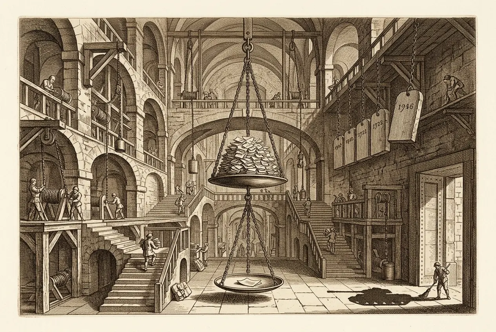
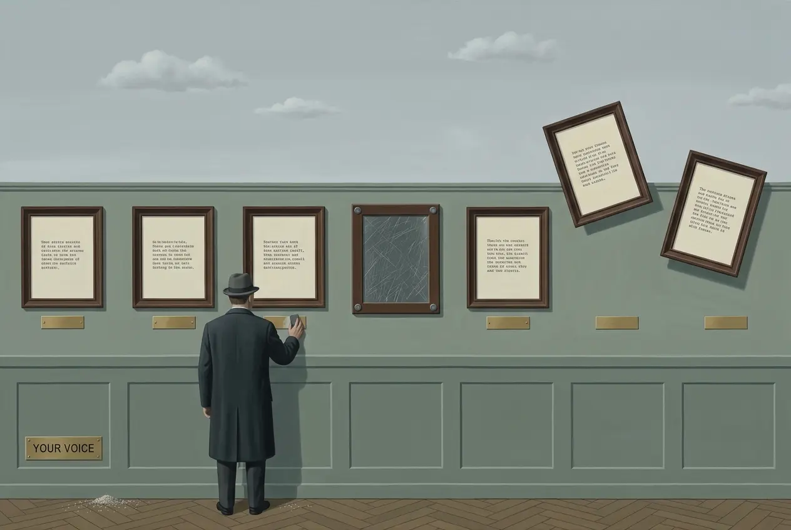

## 0078 – The Court as Instrument
### *Thailand's crisis of judicial legitimacy — the judiciary as a political enforcement organ*

-----

This is an umbrella node. It gathers the mechanism-nodes already written — [0012](0012-section-112-blocked-democratic-reform.md), [0013](0013-section-49.md), [0016](0016-section-235.md), [0017](0017-the-jurisprudence-of-prevention.md), [0018](0018-the-supreme-court-as-terminal-node.md), [0019](0019-the-architecture-of-permissible-speech-2021-2026.md)/[0020](0020-the-chilling-effect-on-parliamentary-procedure.md), [0041](0041-section-112-in-the-consolidation-phase-2024-2026.md), [0061](0061-dsi-senate-investigation-silenced-under-bhumjaithai.md) — and consolidates what they leave unstated. It does not duplicate them; it is the clasp above them.

**Occasion (2026, live):** the Bangkok Post's "Thailand hosts important Asean judicial meetings" (21–23 July 2026, InterContinental Bangkok): Adisak Tantiwong takes the chair of the Council of ASEAN Chief Justices and signs the "Bangkok Declaration" on judicial cooperation, with an agenda that includes "the application of generative AI in justice systems." The self-presentation is of a regional beacon of justice; this node reads the record against it.

## 1. The thesis

Thailand's modern judiciary — created in the 1891 reform (unification of the courts, a Ministry of Justice) — has never been as compromised as an impartial arbiter as it is now. This is not an episodic rupture (coup, then a return to norm) but a **systematised, normalised** shift: the courts now do routinely what tanks once did. The academic frame is available — "judicialization of politics" (Dressel), "juristocracy" (Hirschl), "judicial coup" (McCargo), "from state of exception to hyper-legalism" (AIIA 2024), "judicial overreach" (Fulcrum/ISEAS 2024). The defensible public formulation: **"the gravest crisis of legitimacy and structure since the 1891 judicial reform."**

## 2. Five pillars

### Pillar 1 — party dissolutions as a series (documented)
The Constitutional Court/Tribunal dissolves elected parties and bans their leadership from politics:

- **Thai Rak Thai** — 30 May 2007, 111 executives banned 5 years (after the 2006 coup).
- **People's Power Party** (with the Thai Nation and Matchima Thipataya parties) — 2 December 2008; the "judicial coup" debate.
- **Future Forward Party** — 21 February 2020, Thanathorn and others banned 10 years (the 191.2m-baht loan case).
- **Move Forward Party** — 7 August 2024, 11 executives banned 10 years.

### Pillar 2 — removal of elected premiers by the bench, not the ballot (documented)
- **Samak Sundaravej** — 9 September 2008, over paid appearances on a **cooking show** ("Tasting and Complaining") (conflict of interest) = hyper-legalism in its purest form.
- **Yingluck Shinawatra** — 7 May 2014, over the transfer of NSC chief Thawil Pliensri; days before the coup.
- **Srettha Thavisin** — 14 August 2024 (5:4), over the Pichit Chuenban cabinet appointment.
- **Paetongtarn Shinawatra** — suspended 1 July 2025 (7:2), removed 29 August 2025 (6:3), over the leaked Hun Sen call.

The pattern: **the voters do not decide who governs.**

<!-- §112-INTERNAL — PILLAR 3 STAYS HERE, NEVER IN A BP COMMENT.
### Pillar 3 — Section 49: reform itself recast as "overthrow"
- 31 Jan 2024: the Court finds that Pita/MFP, with the s112 reform campaign, violated Section 49(1) ("overthrow the democratic regime with the King as Head of State"). Sources: Nation, Library of Congress, TLHR, HRW.
- The trap in the ruling: it forbids s112 reform "except through the legitimate legislative process" — then punishes exactly the parliamentary bill. The exit is illusory. An ordinary Criminal Code section is thereby made effectively unamendable, not even debatable by parliament → the Court asserts a veto over parliament's competence for its own criminal law. This is the documented "hegemon" proof. Developed in 0013 (mechanics) and 0018 (Sections 195/235, ethics-based extinction).
-->

### Pillar 4 — the juristocratic architecture (documented / attributed)
The constitutions of **1997 → 2007 → 2017** build, step by step, a veto system of unelected bodies (the Constitutional Court + Election Commission + NACC + the 2017 appointed 250-member Senate) over elected politics. This is **capture *by design*, not by bribery**: no judge need be corrupt; it is enough that the (military-drafted) charter is built so that its *faithful* application neutralises elected majorities. In 2021 the Court also placed a full charter rewrite under a referendum condition → deadlock (secular, BP-usable). **Hold the dividing line:** the strong thesis (capture by design, provable) versus the weak one (bans "to order / on command," unprovable and defamation-prone). Nodes and signed texts use the strong thesis; "on demand" is tenable only as a comment-opinion.

### Pillar 5 — asymmetric impunity: Tak Bai (documented, §112-free, cross-partisan)
Reformers are extinguished quickly in politics; those responsible for a massacre run out the clock:

- **25 Oct 2004:** Tak Bai, Narathiwat — **85 dead** (7 shot, 78 suffocated in stacked army trucks), >1,300 detained.
- **23 Aug 2024:** Narathiwat Provincial Court finds sufficient evidence against 7 ex-officials.
- **18 Sept 2024:** the Attorney-General orders charges against 8; arrest warrants follow.
- **1 Oct 2024:** an arrest warrant for **Pisarn Wattanawongkiri**.
- **14 Oct 2024:** Pisarn resigns from **Pheu Thai**, losing his MP status; he had earlier left the country "for medical reasons."
- **25 Oct 2024:** the 20-year **statute of limitations** expires.
- **28 Oct 2024:** the court terminates the case — no one was arrested before the deadline; **not a single verdict.** 14 accused abroad or in hiding. Sources: ICJ, HRW (28 Oct 2024), OHCHR/UN experts, VOA.

**Why this pillar carries:** Tak Bai happened under Thaksin, and the fugitive sat for Pheu Thai. The impunity is therefore **cross-partisan** — the strongest defence against the "you're just an MFP fan" retort. Coup leaders are likewise unpunished (the 2014 interim charter's Section 48 = an NCPO self-amnesty).

**Pillar-5 reinforcement (documented):** the command record for Tak Bai comes from **Thaksin's own mouth** (Bangkok Post, "18 years after," 2022): "the operation was under then-army chief Gen Prawit Wongsuwon"; Prawit deflects ("Ask Mr Thaksin"). A **blame-trade** between premier and army chief, no one accepting — that is the impunity mechanism itself. Angkhana Neelapaijit (Magsaysay laureate): "a crime of atrocity." The symmetry to the Min Aung Hlaing visit is exact: the same command-responsibility standard (Rome Statute Art. 28: prevent *or punish*) is applied to the received foreign general and never to one's own army chief. (Links: [0079](0079-the-captured-regulator.md), and the Min Aung Hlaing visit record.)

## 3. The analytical core: militant democracy, inverted

Section 49 is Thailand's import of the German **streitbare Demokratie** (Basic Law Art. 21, party bans to protect the "free democratic basic order") — but the **direction is reversed**:

- Germany: bans *anti*-democratic parties to protect democracy.
- Thailand: bans a *pro*-democratic, parliamentary reform party, by defining the protected "order" so that reforming an ordinary criminal section becomes an attack on the order.

The protected good is no longer democracy but an **untouchable status**. The *form* of militant democracy was adopted and its *aim* swapped. This carries without any charge of corruption: Björn Dressel poses it as "judicialization of politics or politicization of the judiciary?" (*The Pacific Review* 23(5), 2010), tracing a drift from the rule of law toward *rule by law*; Eugénie Mérieau reads the Constitutional Court as a "juristocracy under royal command" (*Constitutional Bricolage*, Hart 2021; "Thailand's Juristocracy," New Mandala); and the Venice Commission warns generally against the abuse of militant-democracy clauses by constitutional courts. *(The exact Mérieau wording is to be checked against the primary text before it is set inside quotation marks in any public derivative.)*

## 4. The right yardstick (instead of AI frameworks — a deliberate correction)

Responsible-AI frameworks (Anthropic/OpenAI/Google) govern *AI behaviour*, not judicial legitimacy → a category error, and the most attackable point; **left out.** The fitting, binding instruments are:

- **Bangalore Principles of Judicial Conduct** (2002, UN-backed) — independence, impartiality, integrity. The global standard for judges.
- **UN Basic Principles on the Independence of the Judiciary** (1985).
- **ICCPR Article 14** — a "competent, independent and impartial tribunal." **Thailand is a state party** (binding, secular, BP-usable).
- **Venice Commission** — against the abuse of militant-democracy clauses.
- **World Justice Project Rule of Law Index** — Thailand ranks **77th of 143** with an overall score of **0.50** in 2025 (78th of 142 in 2024), and sits **below the global average on 7 of its 8 factors**, including Factor 1, "Constraints on Government Powers." *(The exact Factor-1 sub-score was not machine-extractable; the overall rank and the 7-of-8 finding are pinned.)*

**The one tenable AI reference (kept narrow):** the ASEAN agenda names "generative AI in justice systems"; the **EU AI Act (Annex III)** classes judicial AI as **high-risk** (opacity, fundamental-rights danger, human oversight required). The point: **whoever cannot secure analogue impartiality should not automate it** — not "AI ethics condemns judges."

## 5. The Adisak contrast (2026, secular, BP-usable)

The same **Adisak Tantiwong** (in office since 1 Oct 2025, retiring end-Sept 2026) signed, on **25 May 2026**, the Supreme Court's **anti-SLAPP guideline** (courts should detect "bad-faith" suits and not let the judiciary become "a tool to suppress freedom of expression" — Pattaya Mail, Thai PBS). Two months later: the CACJ chair and the Bangkok Declaration. **At the same time**, the sitting prime minister is running exactly the kind of suit against iLaw's director that Adisak's own guideline was meant to curb ([iLaw-SLAPP record](0061-dsi-senate-investigation-silenced-under-bhumjaithai.md)). Podium versus record: the guideline is quietly overridden on its own ground.

## 6. Discipline / separation for output

- **§112 node-internal (never in BP):** Section-49-as-overthrow (Pillar 3), the MFP dissolution ground, s112 sentences, WGAD "arbitrary" (Anon), "network monarchy," the 1891 monarch.
- **BP-usable (secular):** party dissolutions as a pattern, PM removals, the Tak Bai asymmetry, the 2021 charter-reform blockade, the Adisak anti-SLAPP contrast, ICCPR 14 / WJP.
- **Defamation:** criticise the institution (the pattern, the series); do not accuse individual judges; make no "on command" claim without proof.
- **Punch up:** the target is the charter architecture / the office, never individual defendants or migrants.

-----

## Sources

**Party dissolutions (dates verified 4 Aug 2026):**
- Thai Rak Thai, **30 May 2007** — https://en.wikipedia.org/wiki/Thai_Rak_Thai_Party
- People's Power Party (+ Thai Nation, Matchima Thipataya), **2 December 2008** — https://en.wikipedia.org/wiki/People%27s_Power_Party_(Thailand)
- Future Forward Party, **21 February 2020** (191.2m-baht loan) — https://www.bbc.com/news/world-asia-51585347
- Move Forward Party, **7 August 2024** — https://www.hrw.org/news/2024/08/07/thailand-constitutional-court-dissolves-opposition-party

**PM removals (dates/votes verified 4 Aug 2026):**
- Samak Sundaravej, **9 September 2008** (cooking show) — https://www.nbcnews.com/id/wbna26611134
- Yingluck Shinawatra, **7 May 2014** (Thawil Pliensri transfer) — https://www.cnn.com/2014/05/07/world/asia/thailand-yingluck-abuse-power-verdict
- Srettha Thavisin, **14 August 2024 (5:4)** — https://time.com/7010847/thailand-srettha-thavisin-prime-minister-removed-constitutional-court-ethics-violation/
- Paetongtarn Shinawatra, **suspended 1 July 2025 (7:2) / removed 29 August 2025 (6:3)** — https://www.nationthailand.com/news/politics/40054701 ; https://www.pbs.org/newshour/world/thai-court-ends-prime-ministers-term-over-compromising-phone-call-with-cambodian-leader

**Tak Bai — ICJ; HRW (28 Oct 2024); OHCHR/UN experts; VOA; Bangkok Post "18 years after" (2022, Thaksin naming Prawit's command):** https://www.bangkokpost.com/thailand/general/2423190/thaksin-prawit-trade-blame-for-tak-bai-massacre ; https://www.bangkokpost.com/thailand/general/2423466/thaksin-prawit-at-odds-over-tak-bai

**World Justice Project Rule of Law Index — Thailand 77/143, score 0.50 (2025):** https://worldjusticeproject.org/rule-of-law-index/country/Thailand

**Academic — Dressel, "Judicialization of politics or politicization of the judiciary?", *The Pacific Review* 23(5), 2010:** https://www.tandfonline.com/doi/abs/10.1080/09512748.2010.521253 · **Mérieau, "Thailand's Juristocracy" (New Mandala) + *Constitutional Bricolage* (Hart, 2021):** https://www.newmandala.org/thailands-juristocracy/ · Hirschl (juristocracy); McCargo (network monarchy / judicial coup); AIIA 2024; Fulcrum/ISEAS 2024.

**Frameworks — Bangalore Principles (2002); UN Basic Principles (1985); ICCPR Art. 14; Venice Commission (militant-democracy abuse); EU AI Act Annex III (judicial AI = high-risk).**

**Bangkok Post – "Thailand hosts important Asean judicial meetings" (21–23 July 2026); Adisak anti-SLAPP guideline (25 May 2026) — Pattaya Mail, Thai PBS.** [VERIFY URL]

-----

## Discipline checklist (verification record)

- [x] **§112 quarantined.** Pillar 3 (Section 49), the MFP dissolution ground and the 1891 monarch are held in node-internal comments; the public text uses "the 1891 judicial reform" and the secular pillars only.
- [x] **Strong vs weak thesis separated.** "Capture by design" (provable) is carried in the node; "bans on command" is flagged as unprovable and confined to comment-opinion at most.
- [x] **Tak Bai as a cross-partisan anchor.** The massacre under Thaksin and the fugitive's Pheu Thai seat are stated, defeating the "MFP-partisan" retort; the command record is attributed to Thaksin's own words, Angkhana quoted.
- [x] **AI-framework category error excluded.** Responsible-AI frameworks are deliberately left out of the yardstick; the binding instruments are Bangalore / UN Principles / ICCPR 14 / Venice / WJP; the one AI reference is the EU AI Act high-risk classification, kept narrow.
- [x] **Institution, not individual judges.** The critique targets the pattern and the charter architecture; no individual judge is accused and no "on command" claim is made.
- [x] **Dates, votes and WJP pinned (4 Aug 2026).** Dissolutions (TRT 30 May 2007, PPP 2 Dec 2008, FFP 21 Feb 2020, MFP 7 Aug 2024) and removals (Samak 9 Sep 2008; Yingluck 7 May 2014; Srettha 14 Aug 2024, 5:4; Paetongtarn suspended 1 Jul 2025 7:2, removed 29 Aug 2025 6:3) verified with URLs; Dressel (Pacific Review 2010) and Mérieau (New Mandala / Hart 2021) cited; WJP 2025 = 77/143, 0.50, below the global average on 7 of 8 factors.
- [ ] **Still open:** the exact WJP "Constraints on Government Powers" sub-score; the precise Mérieau phrase before it is quoted; and URLs for the BP "Asean judicial meetings" piece and the Adisak guideline.

-----

*Filed under: judicial legitimacy, judicialization of politics, party dissolution, impunity, rule of law*
*Cross-references: [0013 – Section 49](0013-section-49.md), [0018 – The Supreme Court as Terminal Node](0018-the-supreme-court-as-terminal-node.md), [0061 – DSI Senate Investigation Silenced](0061-dsi-senate-investigation-silenced-under-bhumjaithai.md), [0079 – The Captured Regulator](0079-the-captured-regulator.md)*

