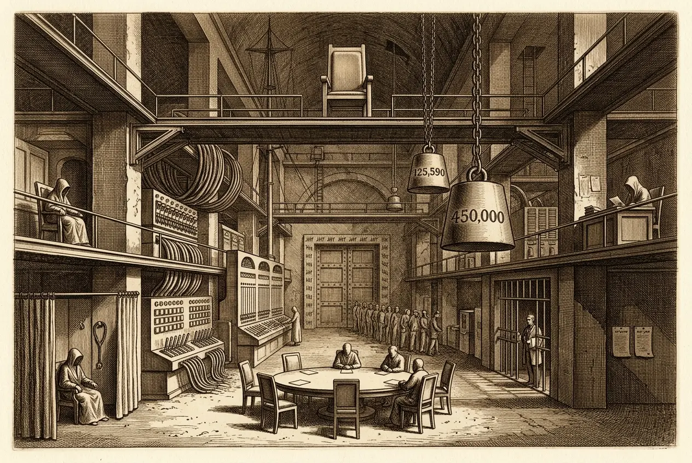

## 0079 – The Captured Regulator (NBTC)
### *How a billion-baht regulator became a stacked-sinecure prize: pay, paralysis, and the jailing of a commissioner*

-----

The National Broadcasting and Telecommunications Commission decides billions and answers to almost no one. This node reads it as a captured regulator — secular throughout (pay, office-stacking, lawfare, duopoly) except for one royal-removal axis kept node-internal.

**Occasion:** NBTC chairman **Sarana Boonbaichaiyapruck** was **disqualified 4:0** by the Senate selection panel on **17 July 2026** (§8(2), NBTC Act 2010); three commissioners boycotted the sitting, the quorum collapsed, and commissioners asked **PM Anutin** to intervene.

## 1. Loyalty over competence
Sarana is a **cardiologist**, a former member of the junta-era National Legislative Assembly, and **personal physician to Deputy PM Prawit** — chair since April 2022, with **no telecoms or media background** (the pattern of [0067](0067-loyalty-over-competence.md)).

## 2. The pay (documented)
The chairman draws **450,000 baht/month = 5.4m/year**; a commissioner draws **360,000/month** (Bangkok Post 3287415, verbatim). Set against the statutory prime-ministerial salary of **125,590 baht/month** (75,590 base + 50,000 allowance — a *separate* source, not the NBTC article), that is **3.6×** and **2.9×** the pay of the elected head of government. This is the compensation-side proof of inverted incentives: **the unelected regulator earns several times the elected head of government.** (Links to the juristocracy of [0078](0078-the-court-as-instrument.md).)

## 3. Stacked sinecures — the disqualification ground (documented)
Concurrently with the NBTC: a **Bangkok Bank directorship** (applied for *one day* before the NBTC appointment; ~several million/year, itemised in BBL's 56-1 filing, clause 8.1.2) and **clinic work** (Ramathibodi hourly, Jan–Apr 2022; Samitivej / Rama 9 — the details **since removed from their websites**). The Act requires full-time service and bars paid outside posts. **Not a formality but documented office-stacking.** (Bangkok Bank is at the same time a Bangkok Post creditor — [0003](0003-bangkok-post-financial-baseline-2024–2026.md).)

## 4. The lawfare shadow (documented)
**Pirongrong Ramasoota** — one of the three commissioners who revolted — was in 2025 sentenced to **two years' imprisonment** on a suit by **True Digital** (over a TrueID OTT warning issued to 127 broadcasters). **The regulated jails the regulator.** Same construction as the [iLaw anti-SLAPP pattern](0061-dsi-senate-investigation-silenced-under-bhumjaithai.md), turned on a regulator. (Links to the True/CP thread.)

## 5. Duopoly stakes
Entry for new competitors is frozen — **MVNO market-opening deferred ~55 times** (protecting AIS/True) — while a spectrum auction (US$1.26bn), a satellite slot (Thaicom 119.5°E) and the digital-TV master plan (two years stalled) all await decision. After the 2022 True–DTAC merger the market is already a duel. **Whoever runs the NBTC decides billions.**

## 6. Paralysis as a weapon
A disqualified chair means every decision taken under him is challengeable → litigation risk; the boycott freezes the board. **Whoever wants to block, profits from the standstill.**

<!-- §112-INTERNAL — royal-removal axis. NEVER in a BP comment.
Pillar 7: Sarana — "only a royal command can terminate my duty." NBTC members are royally appointed → ordinary removal is locked → hence the appeal to the PM. The whole force of this line comes from pointing at the royal apex; there is no de-royalised rescue, so it stays node-internal.
-->

## 7. The whistleblower sub-plot (documented / motive unproven)
The evidence was filed by **Dr Supat Hasuwannakit** — a doctor who had clashed with **Anutin's** Health Ministry and was **purged as a hospital director (Songkhla) in January 2026**. The man who brings down the **Prawit-aligned** Sarana is a **purged Anutin antagonist.** The motive is open (good governance vs a Prawit-vs-Bhumjaithai faction fight) — **not to be presented as a faction fight; only the interlocking is documented** (link [0061](0061-dsi-senate-investigation-silenced-under-bhumjaithai.md)).

## 8. Prawit ↔ Tak Bai (documented; links the patron to the impunity)
Sarana's patron Prawit was **army chief at Tak Bai** (commander-in-chief 1 Oct 2004–30 Sept 2005; the massacre of 25 Oct 2004, **84–85 dead**, 78 suffocated). Documented **from Thaksin's mouth** (Bangkok Post, "18 years after," 2022): "the operation was under then-army chief Gen Prawit," referring compensation questions to Prawit; **Prawit deflects: "Ask Mr Thaksin."** A blame-trade, never a trial; the statute of limitations expired in 2024; Angkhana Neelapaijit (Magsaysay): "a crime of atrocity." The captured regulator thus hangs, through its patron, directly on the **Tak Bai impunity node ([0078](0078-the-court-as-instrument.md)).** Section 133-free (domestic), defamation-safe (attributed to Thaksin/Angkhana). Prawit is today side-lined (left the PPRP chair Jan 2026, aged 80) → "the NBTC decision ran through Prawit" is **rumour, kept separate.**

## 9. The actors
Prawit (patron) · True/CP (jails the regulator) · AIS / Gulf–Intouch (Thaicom) · the Senate / Wisanu Waranyu (panel secretary, vice-president of the Supreme Administrative Court) · Prinya Thaewanarumitkul (Thammasat, confirming the panel's authority) · Anutin (PM, asked to adjudicate).

-----

## Sources *(verified / pinned 4 Aug 2026)*

**Bangkok Post 3287415 – "Senate panel disqualifies NBTC chairman" (17 Jul 2026; chair 450,000/month, commissioner 360,000/month; Sarana profile; BBL directorship one day before appointment; clinic hours; Supat as filer)**
https://www.bangkokpost.com/business/general/3287415/senate-panel-disqualifies-nbtc-chairman

**Statutory PM salary 125,590 baht/month (75,590 + 50,000; SEPARATE source, not the NBTC article)**
https://www.bangkokpost.com/thailand/politics/2654530/pm-to-give-salary-to-charities

**Disqualification 4:0, §8(2) NBTC Act 2010; boycott 27 Jul 2026 (Pirongrong Ramasoota, AM Thanapant Raicharoen, Suphat Suphachalasai walked out; quorum of 4/7 failed); appeal to PM Anutin; Sarana refuses to resign**
https://www.bangkokpost.com/business/general/3292724/pm-urged-to-intervene-as-nbtc-commissioners-revolt ; https://www.bangkokpost.com/business/general/3292289/regulator-on-unsure-footing

**Sarana held the BBL directorship and clinic practice DURING the NBTC term (tax filings show continuous private-sector income through 2023)**
https://www.bangkokpost.com/business/general/3277145/nbtc-head-faces-questions-about-qualifications

**Sarana profile — cardiologist, ex-NLA, Prawit's physician, chair April 2022, entered via the consumer-protection field**
https://www.bangkokpost.com/business/general/2237123/sarana-expected-to-be-named-new-chairman-of-nbtc

**Bangkok Bank 56-1 One Report, clause 8.1.2 — Sarana's exact director remuneration:** not independently quoted in the press; retrieve from the report directly. [VERIFY — figure]
https://www.bangkokbank.com/-/media/files/investor-relations/56-1onereport/2023/56-1_onereport2023_attachment_en.pdf

**Pirongrong Ramasoota — 2-year sentence (Criminal Code §157), ruling 6 February 2025, on a True Digital complaint over the TrueID OTT warning to 127 broadcasters (released on bail pending appeal)**
https://www.bangkokpost.com/business/general/2955468/broadcast-regulator-given-jail-term-over-dispute-with-true ; https://www.nationthailand.com/news/general/40045965

**Supat Hasuwannakit — filer of the evidence; dismissed as Songkhla hospital director (Chana → Saba Yoi), January 2026, on ATK-procurement grounds** — Bangkok Post 3287415 (above)

**Tak Bai — Bangkok Post "18 years after" (2022): Thaksin naming Prawit's command; Prawit deflects. ICJ/HRW on the 2024 limitation expiry; Angkhana "crime of atrocity"**
https://www.bangkokpost.com/thailand/general/2423190/thaksin-prawit-trade-blame-for-tak-bai-massacre ; https://www.bangkokpost.com/thailand/general/2423466/thaksin-prawit-at-odds-over-tak-bai

-----

## Discipline checklist (verification record)

- [x] **§112 confined to the royal-removal axis.** Sarana's "only a royal command" line is node-internal; every public pillar (pay, sinecures, lawfare, duopoly, paralysis) is secular.
- [x] **Court-proven facts vs inference.** Pirongrong's sentence and Sarana's 4:0 disqualification are documented; no intent to corrupt is alleged of any individual.
- [x] **Whistleblower motive left open.** The Supat–Anutin interlocking is stated as documented; it is explicitly not presented as a proven faction fight.
- [x] **Prawit–Tak Bai attributed, §133-free.** The command record is in Thaksin's own words and Angkhana's; "the NBTC decision ran through Prawit" is flagged as rumour and kept separate.
- [x] **Institution, not defamation.** The critique targets the regulator's capture and documented, court-tested cases; no unproven criminal charge against a named person.
- [x] **Facts verified / URLs pinned (4 Aug 2026).** Pay (450k/360k, art. 3287415; PM 125,590 separately sourced); disqualification 4:0 §8(2); the 27 Jul boycott (three named commissioners) and quorum failure; **Sarana held the BBL directorship and clinic practice *during* the NBTC term** (confirmed, art. 3277145, tax filings through 2023); Pirongrong 2 years §157, ruling 6 Feb 2025.
- [ ] **Still open:** Sarana's *exact* BBL remuneration figure (in the 56-1 One Report, not press-quoted); and Supat's motive (inherently open — carried as documented interlocking only).

-----

*Filed under: captured regulator, telecoms/media duopoly, lawfare, civil-military patronage, rule of law*
*Cross-references: [0067 – Loyalty over Competence](0067-loyalty-over-competence.md), [0078 – The Court as Instrument](0078-the-court-as-instrument.md), [0061 – DSI Senate Investigation Silenced](0061-dsi-senate-investigation-silenced-under-bhumjaithai.md), [0003 – Bangkok Post Financial Baseline](0003-bangkok-post-financial-baseline-2024–2026.md)*

