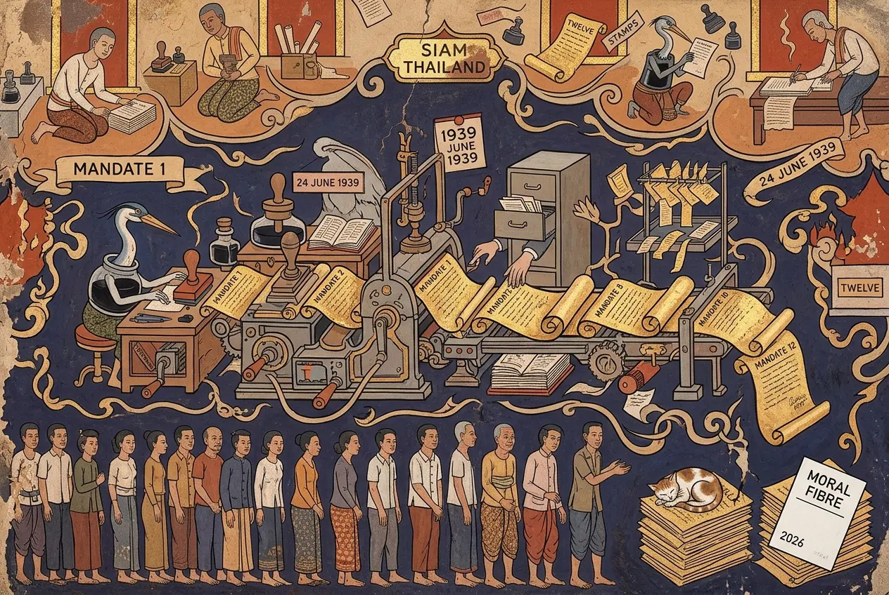
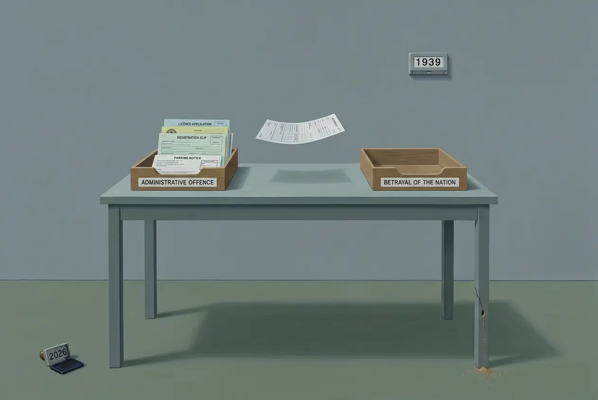
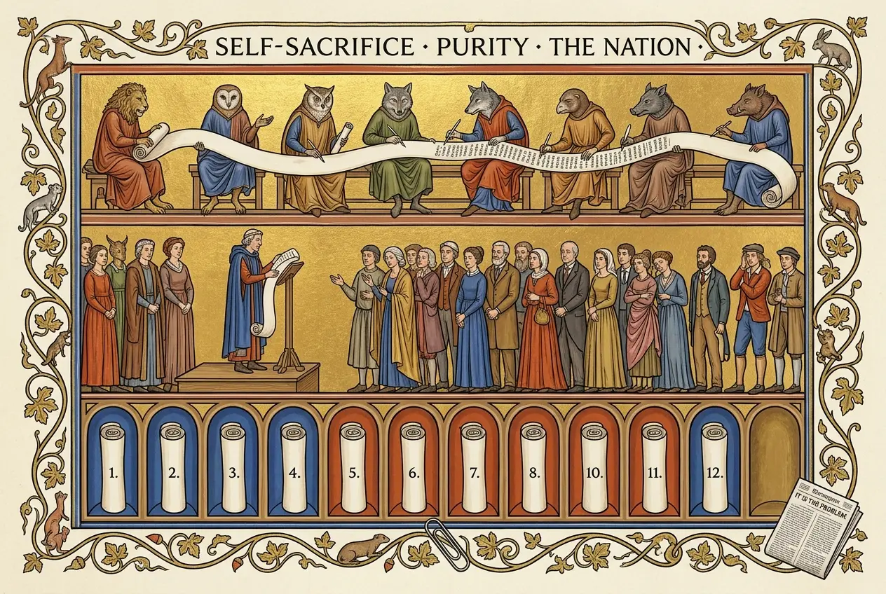

## 0082 – The Sacred Nation and the Internal Traitor
### *Self-sacrifice, purity and betrayal as civic vocabulary: a dated Thai precedent for a 2026 op-ed*

*Last updated: 15 September 2026, 13:30:05 (ICT)*

---

## 1. The question

On 22 August 2026 the Bangkok Post published a column by **Vanich Kittichai**, "Selfishness isn't a problem in Thailand, it is THE problem". It diagnoses a series of administrative and registration offences as **one** moral failing, and proposes three remedies:

> "screening should take place to vet the **moral fibre** of public officials"
>
> "The country's moral education has to shift weight from 'respect for seniors' and 'acting with grace' to **self-sacrifice** and resilience in the face of temptation"
>
> "those crimes … should be collapsed into a single category of offence: **treason**"

The question this node asks is not what the author intends. It is: **where does this vocabulary come from, and why does nobody need to derive it?**

The answer is that it does not need deriving, because it was state doctrine here — with named authors, numbered decrees and dates. The European typology of fascism is not required for that, and as §2 shows it has considerable limits.

**The thesis, in one sentence:**

> The claim is not that the column is a fascist movement — it has no apparatus, no mobilisation and no new order in view. The claim is that it puts the **rhetorical sediment** of the period 1938–1942 back into circulation. **And the origin is not obscure:** anyone writing about national moral education, self-sacrifice and the reclassification of offences as treason is working in a field whose immediate precedent lies exactly there.

The second sentence is a statement about the **subject area**, not about any person's state of knowledge. The node therefore stays with effect rather than intent — and still places the burden where it belongs: whoever objects that none of this can possibly be meant must explain why a columnist on this subject would not know the nearest case.

---

## 2. The typology, and where it does not hold

**Umberto Eco, "Ur-Fascism" (New York Review of Books, 22 June 1995)** — fourteen features, and expressly not a checklist:

> "These features cannot be organized into a system; many of them contradict each other… But it is enough that one of them be present to allow fascism to coagulate around it."

Applied to the column, graded honestly:

- **Feature 11, a clear hit.** Eco: *"in the Ur-Fascist ideology everyone is educated to become a hero."* The column asks that national moral education be shifted to "self-sacrifice". The **operation** is the same — the exceptional virtue is raised to the norm — with different content: Eco ties the heroism to a cult of death, the column ties it to declining a bribe. The difference has to be named, or the comparison is open to attack.
- **Features 7 and 13, partial.** The enemy within ("eating away at the country from within", "infested") and the people as a moral unit ("so many in Thailand", "the general disregard we now witness").
- **Feature 1 runs the other way.** Eco's first feature is the cult of tradition. The column wants to **downgrade** "respect for seniors".
- **Not applicable.** Eco's feature 4 is *"disagreement is treason"* — the criminalisation of **dissent**. The column extends treason to **documentary offences**. That is a different thing and must not be scored as a hit.

**Roger Griffin** (*The Nature of Fascism*, 1991) defines the "fascist minimum" as **palingenetic** ultranationalism — decay **plus rebirth through a new order** — and expressly distinguishes fascism from "para-fascism and other authoritarian, nationalist ideologies". The column has no palingenesis; it proposes education and a screening procedure, not a new order. **On Griffin's definition it is not fascism** — and Griffin supplies the term that does fit.

**Robert Paxton** (*The Anatomy of Fascism*, 2004) ties his "mobilizing passions" to fascist action. A newspaper column mobilises nothing.

**Result:** two of the three authorities argue against the label, the third carries one feature clearly and two partly. Anyone who builds a verdict on these three names loses to the first reader who has read them. **The yield of this node is not in the typology but in §3 to §5.**

### 2.1 What the generic definition leaves out — and why that does not matter here

The generic definitions deliberately abstract from the **racial-ideological** element, because Italian fascism was not antisemitic until 1938 and the aim is a genus covering both cases. That abstraction is contested in the scholarship: **Saul Friedländer** treats antisemitism as the redemptive core of National Socialism rather than an addition; **Zeev Sternhell** declined to subsume National Socialism under fascism at all, because of biological racism. *(Both reported, neither read for this node — §8.)*

**For this node the controversy is beside the point, and for a good reason: the Thai chain does not need a generic definition, because the ethnic element is documented in its own instruments.**

The twelve mandates, in the summary of a peer-reviewed study of them, "transformed Siam into Thailand and all people living within the borders into Thai/Tai people" (Mandates 1 and 3). That is the stated object of the first and third decrees: not the citizenry as a legal body, but a single ethnic designation applied to everyone inside the borders.

**And at the point of import the European model is attested, in an academic attribution (established 15 September 2026).** Thak Chaloemtiarana — the scholar who edited the standard documentary collection of the mandates — writes of Wichit Wathakan's 1938 play *Jaoying Saen Wi* that it "reflected his **fascination with Nazi Germany's policy of creating a new political entity based on race**" (§3). The man who chaired the drafting committee for the decrees was, on this account, taken with a model of political construction organised around race. That is the ideological half of the finding; the instruments above are the legal half.

⚠️ **A stronger version of this point is often made and is not used here.** It is frequently written that the first mandate justified the renaming by reference to the Thai *race*. The justification text has not been read for this node, and the claim is therefore left out. The verified position — the decrees set out to make everyone within the borders Thai — carries the argument without it.

**⚠️ And the limit that must be stated explicitly.** What followed in Thailand was discrimination in education, commerce and naming (§4.1) — **not extermination**. Anyone who draws the European parallel without naming that difference in outcome creates an equation that is neither tenable nor defensible, and that would void the entire node. The adoption of a frame is the finding; the outcome was a different one.

**Two levels that must never be conflated:**

| | The regime, 1938–1942 | The column, 2026 |
|---|---|---|
| Palingenesis (Griffin's minimum) | **present** — rebirth of the Thai ethnos as declared purpose; the Greater Thai doctrine | absent — education and a screening procedure, no new order |
| Mobilisation (Paxton) | **present** — apparatus, decrees, enforcement | absent — a newspaper text |
| Racial-ideological core | **present in the instruments** | not asserted |

The criteria largely fit the regime. **They do not fit the column** — it reproduces the vocabulary without the apparatus. That distinction is precisely the value of this node: it allows the origin of the vocabulary to be shown without attributing a regime to a writer in 2026.

---

## 3. The import: Luang Wichit Wathakan

Chief ideologue of the cultural campaigns under Field Marshal **Plaek Phibunsongkhram**; propagandist; author of plays and songs used as instruments of mobilisation; originator of the Greater Thai doctrine. The standard work is **Scot Barmé, *Luang Wichit Wathakan and the Creation of a Thai Identity*** (ISEAS, Singapore 1993) — *reported, not read.*

**⭐ He did not merely supply the vocabulary — he chaired the drafting (established 15 September 2026).** Thak Chaloemtiarana, the scholar who edited the standard documentary collection of these texts, writes:

> "Between 1939 and 1942, at the height of the nationalistic campaign, Luang Wichit chaired a committee that drafted the famous State Convention proclamations known as **Ratthaniyom**."

*Zwischen 1939 und 1942, auf dem Höhepunkt der nationalistischen Kampagne, leitete Luang Wichit einen Ausschuss, der die berühmten Staatserlasse ausarbeitete, die als Ratthaniyom bekannt sind.*

That closes the gap between §3 and §4. The ideologue and the decrees are not two adjacent facts; the same man presided over the drafting.

**⭐ And on the European model, an attested formulation that is neither of the two circulating versions.** In the same passage Thak describes Wichit's 1938 play *Jaoying Saen Wi*, which argued that the Thai and the Shan in Burma should unite, and adds:

> "The play also reflected his **fascination with Nazi Germany's policy of creating a new political entity based on race**."

*Das Stück spiegelte auch seine Faszination für die Politik NS-Deutschlands wider, ein neues politisches Gebilde auf rassischer Grundlage zu schaffen.*

⇒ **This is the version that can be used.** It is an academic attribution, it concerns the racial-political model rather than any measure against a minority, and it is evidenced in a dated work of his own. It supersedes neither of the weak versions below — it stands instead of them.

**⭐⭐ The Chulalongkorn University address — settled 15 September 2026 against a contemporaneous source.**

Two versions had circulated, both from weak sources: that he *recommended* following German policy towards the Jews, and that he merely *compared*. Neither is what the contemporaneous account says. **Kenneth Perry Landon, *The Chinese in Thailand* (Oxford University Press / Institute of Pacific Relations, 1941), p. 167**, writing three years after the event:

> "On July 15, 1938, Luang Vichitr Vadhakarn made an address at Chulalongkorn University, in which he interpreted events in Europe, particularly the Austro-German *Anschluss*. In the course of his remarks he spoke of the fate of the Jews in Germany. He gave his audience to understand that in its experience with the Chinese Thailand had a problem not unlike Germany's. **Many of the members of the audience carried away the impression that he was advocating** that measures comparable to those applied in Germany to the Jews be used against the Chinese in Thailand. Since he was at the time Minister of State without portfolio and Director of the Department of Fine Arts, his lecture caused a storm. One of the elected members of the Assembly … asked the government whether Luang Vichitr expressed its views."

*Am 15. Juli 1938 hielt Luang Vichitr Vadhakarn eine Ansprache an der Chulalongkorn-Universität, in der er die Ereignisse in Europa deutete, besonders den österreichisch-deutschen Anschluss. Im Verlauf seiner Ausführungen sprach er vom Schicksal der Juden in Deutschland. Er gab seinen Zuhörern zu verstehen, dass Thailand in seiner Erfahrung mit den Chinesen ein Problem habe, das dem deutschen nicht unähnlich sei. Viele der Zuhörer nahmen den Eindruck mit, er befürworte, gegen die Chinesen in Thailand Maßnahmen anzuwenden, die denen vergleichbar wären, die in Deutschland gegen die Juden angewandt wurden. Da er zu dieser Zeit Staatsminister ohne Geschäftsbereich und Direktor der Abteilung für Schöne Künste war, löste sein Vortrag einen Sturm aus. Einer der gewählten Abgeordneten der Versammlung fragte die Regierung, ob Luang Vichitr ihre Ansichten ausgedrückt habe.*

**Landon's account is a third version, and it is the usable one.** He separates what the speaker did from what the audience took away. What is attributed to Wichit is the interpretation of the *Anschluss*, the reference to the fate of the Jews, and the proposition that Thailand's problem was "not unlike" Germany's. The recommendation is attributed to the **impression of the listeners** — *"carried away the impression that he was advocating"*. That is a distinction between effect and intent, drawn by a contemporary, and it is the form this node works in throughout.

Two further things the passage establishes. **The date is exact: 15 July 1938.** And it had a political consequence: an elected member of the Assembly asked in parliament whether the minister had expressed the government's view.

⛔ **What may still not be written:** that he recommended following Hitler's policy towards the Jews. Landon does not support it, and the encyclopedic source for it remains unusable. Verified negatives: the words "Hitler" and "Nazi" do not occur anywhere in the book; the date appears exactly once.

⚠️ *Read on 15 September 2026 via the snippet view of the digitised copy, window by window. Page 168 — the government's reply to the parliamentary question — was not reachable. Whether Landon cites a primary source for the address in a footnote could not be determined.*

**The personality cult is work, not attribution.** He wrote a play comparing Phibunsongkhram to a god capable of working miracles.

Wichit Wathakan is thus the documented connection between European fascism and Thai state practice — not as an interpretation, but as a biography.

---

## 4. The implementation: the twelve Cultural Mandates, 1939–1942

Twelve decrees of the Phibunsongkhram government. Not a mood and not rhetoric: **acts of state with dates.**

| No. | Date | Subject |
|---|---|---|
| 1 | **24 June 1939** | The name of the country, the people and the nationality |
| 2 | **3 July 1939** | Averting danger to the nation |
| 3 | 2 August 1939 | The designation of the Thai |
| 4 | **8 September 1939** | Honouring the national flag and anthems |
| 5 | 1 November 1939 | Use of Thai products |
| 6 | 10 December 1939 | Music and text of the national anthem |
| 7 | 21 March 1940 | Building the nation |
| 8 | 26 April 1940 | The royal anthem |
| 9 | **24 June 1940** | Language, script and the duties of citizens |
| 10 | **15 January 1941** | Thai dress |
| 11 | 8 September 1941 | The daily round |
| 12 | 28 January 1942 | Protection of those in need of protection |

**Mandate 1, verified wording and date:** issued 24 June 1939, it states that "The name of the country is to be 'Thailand'". The kingdom had until then officially been Siam.

**The functional architecture, from a peer-reviewed study of the mandates:** Mandates 1 and 3 transformed Siam into Thailand and all people living within the borders into Thai/Tai people; Mandates 7, 11 and 12 prescribed ways of life; Mandate 10 prescribed dress; **Mandates 2, 5, 7 and 9 set out duties of nation building**; Mandates 4, 6 and 8 concerned the symbols of unity.

**Two features carry the connection to §5 — and their wording is reported, not verified.**

1. **Mandate 2 is reported to describe specified conduct as "a betrayal of the nation"** — conduct such as acting for foreign interests against the nation's benefit. If the wording holds, that is the figure of the internal traitor, in an administrative decree, in 1939.
2. **Mandate 4 is reported to oblige citizens to admonish one another** where the national symbols are not honoured. Not the state supervising the citizen — citizens supervising each other.

⚠️ **Evidential status, stated plainly.** Both wordings come from secondary reproduction. The translation of record for the mandates is **Thak Chaloemtiarana (ed.), *Thai Politics: Extracts and Documents 1932–1957*, Vol. I, Social Science Association of Thailand / Thammasat University Printing Office, 1978, iv + 884 pp.** — and the mandates stand there at **pp. 245–254**, a location Thak himself gives in a later work. **That volume has not been consulted for this node.** Until it is, the two wordings above are carried as reported and are not quoted as established text. §5 is written so that it does not depend on them.

**Two precisions that correct common shorthand:**

- **Mandate 9** requires uniform identification as Thai with one language and forbids distinguishing people by accent or place of birth. That is an **assimilation requirement**, not a literal ban on minority languages in public. The sharper formulation is not supported.
- **Mandate 10** is titled "Thai dress". "Compulsory Western clothing" is a compression of secondary accounts and must not be quoted as the wording of the decree.

### 4.1 Enforcement against the Chinese minority

The decrees did not stand alone. From Phibunsongkhram's accession in December 1938, ethnic unification was translated into administrative practice. **The evidential level differs by measure, and only what is attested is carried here:**

| Measure | Status |
|---|---|
| **The stated object of the decrees:** everyone within the borders to be Thai (Mandates 1 and 3) | **Attested** in a peer-reviewed study of the mandates |
| **Chinese-language schooling curtailed**, school closures | **Reported in several accounts** |
| **Immigration from China restricted** | Reported in several accounts |
| **Commercial displacement**, state-backed Thai enterprise, the slogan "Thailand for the Thai" | Reported in several accounts |
| **Name changes:** Sino-Thai in state service and the military to drop Chinese surnames; **Name Act 1940** | Reported. ⚠️ **Precision: "pressed", and legally tied to naturalisation and state employment — not attested as general compulsion for the whole minority.** "Forced name changes" is not to be written |

**Three claims have been removed from this section for want of evidence** and are listed in §8: a specific limit of two weekly hours of Mandarin instruction; a figure of "more than 100" Chinese newspapers closed by 1941; and occupational bans dated to 1938/39, where what is attested is a policy of commercial displacement and the formal reserved-occupations legislation appears to be later.

**The finding that holds independently of all of them:** ethnic unification was not a side effect of the cultural decrees but their declared object. The internal traitor of Mandate 2 and the ethnically defined nation of Mandates 1 and 3 are two sides of one construction: whoever does not belong to the ethnos, or does not assimilate to it, is not merely foreign but dangerous.

---

## 5. The point of contact

Set side by side, without equation:

| The column, 22 August 2026 | The mandates, 1939–1942 |
|---|---|
| Shift moral education to **"self-sacrifice"** | Mandate 7 "Building the nation", Mandate 11 "The daily round" — the conduct of the citizen's life as an object of the state |
| Administrative offences as **"treason"** | Mandate 2 — specified conduct as betrayal of the nation *(wording reported)* |
| **Screening** the moral fibre of officials | Mandate 4 — citizens admonishing one another *(wording reported)* |
| "the security and **sanctity** of the nation" | Mandates 1 and 3 — nation, people and nationality collapsed into one designation |

**The yield.** The column's three proposals are neither an import nor an aberration. They are the vocabulary of a Thai state doctrine that was in force between 1939 and 1942, had a chief ideologue, and was set out in twelve numbered decrees.

Note that the right-hand column's two strongest rows are marked as reported wording. **The argument does not rest on them.** It rests on the architecture, which is attested: a state that named the nation, the people and the nationality in one act, prescribed the conduct of daily life by decree, and assigned duties of nation building to the citizen. The column proposes to do the same three things.

### 5.1 Not a repetition but a shift of weight

The column does not reproduce the doctrine. It proposes to **shift the weight inside it** — and it names both sides itself:

> "The country's moral education has to shift weight **from 'respect for seniors' and 'acting with grace'** to **self-sacrifice** and resilience in the face of temptation."

Deference is to be downgraded, willingness to sacrifice upgraded. Two pillars that stand side by side in the Thai canon of virtues; the column wants one strengthened at the expense of the other.

**This also resolves the inconsistency in §2.** Eco's first feature, the cult of tradition, appeared to argue against application, because the column devalues deference. But that is exactly the movement Eco's eleventh feature describes: **the exceptional virtue displaces the everyday one.** Not a contradiction of the typology, but the process itself.

**And it disposes of the easiest objection.** Anyone who says this is merely an appeal to decency has to explain why the column expressly asks that decency be downgraded.

---

## 6. The effect, documented the same day

Beneath the column, within roughly two hours, an escalation appeared, each step pitched higher than the column itself invited:

| Step | Formulation in the thread |
|---|---|
| Column | "an epidemic of short-sightedness" among individuals |
| 1 | "very few people have a moral compass **here**" |
| 2 | "the **whole country** is morally bankrupt" |
| 3 | "**Thainess**…" |

**The mechanism, stated precisely.** A moral explanation needs a **bearer of the defect**. Where a text names a bounded bearer — an office, a class — the response stays political. Where it leaves the bearer open ("so many in Thailand", "the general disregard **we** now witness", "an **epidemic**"), the reader supplies the largest available category.

Both are documented in the same thread: contributions with a named bearer ("the current lot are in their positions because of corruption") stay political; contributions without one end at the people.

*Discipline: the sequence is documented, the **causation is not**. Whether Bangkok Post threads on corruption also ethnicise under differently framed articles is open and testable against the comment corpus already held here (§8).*

---

## 7. Sources

**Typology**
- [Umberto Eco, "Eternal Fascism: Fourteen Ways of Looking at a Blackshirt"](https://www.interglacial.com/pub/text/Umberto_Eco_-_Eternal_Fascism.html), New York Review of Books, 22 June 1995 — **full text read, 23 August 2026**; the fourteen features and the "one is enough" sentence in the original wording.
- Roger Griffin, *The Nature of Fascism* (1991) — palingenetic ultranationalism as the fascist minimum; the demarcation from para-fascism. **Via encyclopedic account; primary text not read.**
- Robert Paxton, *The Anatomy of Fascism* (2004) — "mobilizing passions", tied to practice. **Secondary only.**

**Thai genealogy**
- **Kanjana Hubik Thepboriruk, "Dear Thai Sisters: Propaganda, Fashion, and the Corporeal Nation under Phibunsongkhram", *Southeast Asian Studies* (Center for Southeast Asian Studies, Kyoto University), Vol. 8 No. 2, 22 August 2019, DOI 10.20495/seas.8.2_233 — peer-reviewed; read 15 September 2026.** Source for the wording and date of Mandate 1, for the functional grouping of all twelve, and for the identification of Thak et al. (1978, p. 245) as the translation of record.
- Thak Chaloemtiarana (ed.), *Thai Politics: Extracts and Documents 1932–1957*, Vol. I, Social Science Association of Thailand / Thammasat University Printing Office, 1978, iv + 884 pp. — **the scholarly translation of the mandates, at pp. 245–254. Not consulted.** Not digitised: no copy on archive.org, and the Open Library record carries `ebook_access: no_ebook` (both checked 15 September 2026).
- **Thak Chaloemtiarana, *Read till it shatters: Nationalism and identity in modern Thai literature*, ANU Press / open access, 2018 — full text read 15 September 2026**, archived locally. Source for Wichit Wathakan chairing the drafting committee for the Ratthaniyom, for his "fascination with Nazi Germany's policy of creating a new political entity based on race" in the 1938 play *Jaoying Saen Wi*, for the Bushido borrowing in the mandate campaign, and for the page location of the mandate translations in the 1978 volume (n. 12). The same work cites Barmé at p. 87 (n. 13).
- The list of the twelve mandates with dates and subjects: encyclopedic secondary source, read 23 August 2026. **The decree texts themselves have not been read.**
- **Kenneth Perry Landon, *The Chinese in Thailand*, Oxford University Press / Institute of Pacific Relations, 1941, p. 167 — read 15 September 2026** via the snippet view of the digitised copy. Source for the address of 15 July 1938, for the distinction between what the speaker said and what the audience took away, and for the parliamentary question that followed. Catalogue record: HathiTrust 001255830.
- Scot Barmé, *Luang Wichit Wathakan and the Creation of a Thai Identity* (ISEAS, Singapore 1993) — standard work. **Not read; no digital copy located.** Its index records "Hitler: 133 (fn. 50), 162" — the pages to request if the volume is obtained.
- On the Phibunsongkhram play: **secondary only; primary source not seen.**

**Occasion**
- Vanich Kittichai, "Selfishness isn't a problem in Thailand, it is THE problem", Bangkok Post, 22 August 2026, 13:22 — the quotations in §1, §5 and §6 checked against the article text.

---

## 8. Discipline and open points

**Held to throughout:** no intent is attributed to the columnist; the analysis is of a published text and its documented effect. Where the European parallel is drawn, the difference in outcome is stated in the same breath. Where wording is reported rather than verified, it is marked and the argument is built so as not to depend on it.

**Outstanding, in order of priority:**

- **Obtain Thak (1978), pp. 245–254, and read Mandates 2, 4, 9 and 10 in the translation of record.** The two reported wordings in §4 and the two precisions would then be settled. **This is the first step, and it is now precisely scoped:** the volume is not digitised, but the passage is ten pages, which is a document-delivery order rather than a hunt.
- ~~The Chulalongkorn address remains unresolved.~~ **Settled 15 September 2026 against Landon (1941), p. 167 — see §3.** What remains is small: **page 168**, carrying the government's reply to the parliamentary question, and whether Landon footnotes a primary source for the address. Both need a copy reachable beyond snippet view.
- **Barmé (1993)** still to be obtained. If it is, the pages to read are **133 with footnote 50, and 162** — taken from the volume's own index.
- **The justification text of Mandate 1.** Frequently cited as grounding the renaming in race; not read, and therefore not used in §2.1.
- **Three claims removed from §4.1 for want of evidence**, to be either sourced or left out permanently: two weekly hours of Mandarin; "more than 100" newspapers closed by 1941; occupational bans dated to 1938/39.
- **Friedländer and Sternhell** to be read in the original for §2.1; currently reported knowledge without a source.
- **Griffin's demarcation in his own words**, from *The Nature of Fascism* rather than an encyclopedia.
- **Test the null hypothesis to §6:** do Bangkok Post threads on corruption also produce ethnicising comments under structurally framed articles? Comparison cases from the same week: "Fake father scam exposes deeper rot" (3305764) and "Laws aren't the problem" (3305334). The comment corpus is held.

---

## Related

[0066](0066-the-dual-system.md) The standing enemy — the irredenta of 1939–41 as the source of the "lost territories" ·
[0067](0067-loyalty-over-competence.md) Loyalty over competence — the screening of officials, here proposed openly as a programme ·
[0019](0019-the-architecture-of-permissible-speech-2021-2026.md) The architecture of permissible speech ·
[0049](0049-thai-cambodian-border-dispute-2026.md) The border dispute

