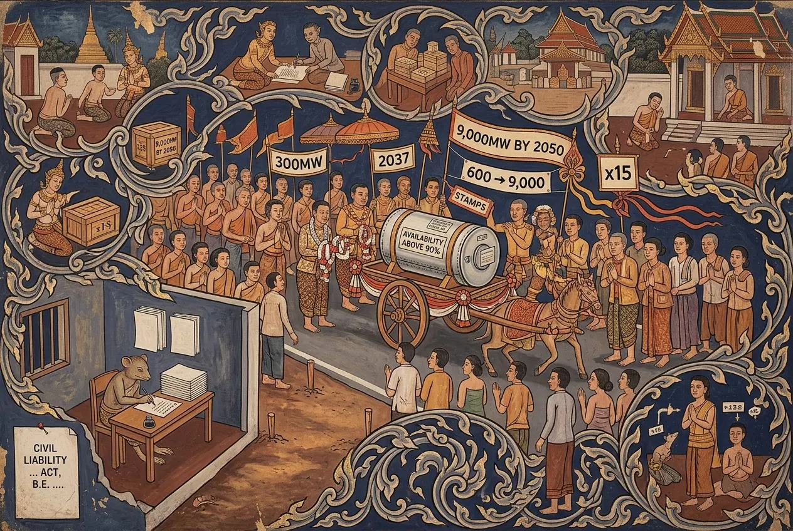

## 0083 – The Plan Before the Law
### *Thailand plans private reactors for 2037 and a 9,000MW fleet by 2050 — while the act saying who pays for an accident is still a draft, and the state's own report to the IAEA records no permanent repository*

*Last updated: 15 September 2026, 13:15:51 (ICT)*

---

## 1. Programmatic note

This node is about sequence, not about nuclear power. Whether Thailand should build reactors is a question this analysis does not answer and does not need to. What it establishes is narrower and checkable: **the decisions are being taken in a particular order, and the order puts the plan ahead of the law.**

Three things are happening at once. The planned capacity has grown fifteenfold in two years. The question of who owns and operates the reactors has been opened from the state to the private sector and is due to be settled within months. And the statute that would say who pays, and how much, if something goes wrong remains a draft without a date.

No company is named in this node. Ownership chains in the Thai energy sector are not the subject, and the finding does not depend on them. No intent is alleged anywhere: what follows is a record of what was published when.

---

## 2. The chronology — what applied, and when

| Date | Source | Content |
|---|---|---|
| PDP 2024 (draft, never in force) | industry reporting | **2 × 300MW = 600MW**, developed and operated by the state utility, sites in the **north-east and south**, construction from 2032, operation towards the end of the plan period in 2037 |
| **14 January 2025** | Bangkok Post 2939225 | The nuclear safety regulator and the energy regulator are recorded in the Royal Gazette as cooperating. An unnamed source: **"The two agencies will not tell the public that Thailand is planning to develop SMRs. This should be the task of policymakers who will give the final say on nuclear power."** Nuclear plus new solutions are put at **1 per cent** of the 2037 mix; renewables 51 per cent; coal and gas 48 per cent. The criticism recorded is that demand is forecast too high and the investment burden falls on the state |
| February 2026 | industry reporting | PDP 2024 still not finalised; disagreement among specialists; the public hearing had already taken place |
| **21 August 2026** | The Nation, "Thailand's draft PDP targets first 300MW SMR by 2037" | PDP 2026 covers **2026–2050**. A first **300MW unit by 2037 in all four scenarios**; **about 9,000MW by 2050**; base case for 2050 is 65 per cent clean — **42 per cent renewables, 18 per cent SMR, 5 per cent new technologies**. **"No conclusion has yet been reached"** on whether the state utility is mandated or private parties bid. Consultation in **early September**; drafts to the National Energy Policy Council **towards the end of 2026** |
| **25 August 2026** | Bangkok Post 3307404 | An unnamed source — "an energy official who asked not to be named" — says private parties may be allowed to develop and operate. The stated drivers are expiring small-power-producer contracts in industrial estates, the EU carbon border mechanism, and net zero by 2050. SMRs are described as supplying electricity **and process steam**, with availability **above 90 per cent**. Finalisation **by the end of the third quarter**. The only speaker quoted by name is an energy-industry chief executive, and what he contributes is a brake: there is no single global safety standard, and **"Bringing an SMR online could easily take over 10 years"** |

**Three shifts in two years.** Capacity **600 → 9,000MW**, a factor of fifteen. Operator **state → open, possibly private**. Siting **north-east and south → industrial estates**.

And the two timetables do not agree. The process described on 21 August runs consultation in September with drafts to the policy council at the end of the year. The unnamed official four days later puts finalisation at the end of the third quarter. **The anonymous timetable is the tighter one.**

---

## 3. The legal frame: private operation was already lawful

The **Nuclear Energy for Peace Act B.E. 2559 (2016)**, as amended by the Act (No. 2) B.E. 2562 (2019), governs licensing, inspection and enforcement, administered by the Office of Atoms for Peace, an agency in existence since 1961. Around 56 ministerial regulations and 67 notifications sit beneath it.

Under that framework private entities may already own and operate nuclear facilities, and the Energy Industry Act places no restriction on foreign shareholding in an operator. Only land ownership is restricted, and that restriction has established routes around it — investment-promotion status, industrial-estate status, or permission from the prime minister.

⇒ **The "opening to the private sector" is not a change in the law.** What is new is only whether the plan allocates capacity to private parties. That matters for how the shift should be described: it is an administrative and planning decision, not a legislative one, and it therefore passes through no parliamentary vote.

---

## 4. The liability gap — the centre of the node

The 2016 Act regulates safety, security and safeguards. **It does not regulate third-party liability.** That is the subject of a separate instrument which, as of this writing, exists only as a draft: the **Civil Liability for Nuclear and Radiation Damage Act, B.E. ....** — the year left blank in the title itself. The English text, fourteen pages, is published on the regulator's own website.

| Section | Content |
|---|---|
| 2 | Enters into force **180 days** after promulgation |
| 3 | "Convention" means the **Vienna Convention** (as amended by protocol) **or** the Convention on Supplementary Compensation |
| 10 | The operator is liable for nuclear damage **irrespective of where it occurs** |
| **13** | The operator **"shall be entitled to limit the liability … for any one nuclear incident to not exceeding 300 million Special Drawing Rights"**, excluding interest and costs; amendable by **royal decree** |
| 14 | Conversion of SDR into baht at the **IMF rate on the day the security is furnished** |
| 15 | **No** limitation where the damage results from the operator's own act or omission |
| 18 | Exemption where the damage would have occurred **even in compliance** and the equipment was not defective |
| 19 | Insurance or financial security is compulsory |
| **20** | The insurance must provide an **initial payment to any one victim of not more than 200,000 baht**; adjustable by decree |
| 21 | That initial payment does **not** foreclose further claims |
| 35 | **Direct action against the insurer**; the operator's insolvency is no defence |
| **36** | The limitation applies **only once** security in the full amount has been deposited with the Intellectual Property and International Trade Court |
| **41** | Limitation periods: **three years** from discovery; outer limits **thirty years** for death and personal injury, **ten years** for other damage, from the incident |
| 44 | Recognition of foreign judgments from convention states, with three exceptions |

**Four features, stated as they are.**

**The ceiling is per incident, not per fleet.** Section 13 caps liability "for any one nuclear incident". As the number of units grows, the number of possible incidents grows with it; the ceiling for each does not.

**The ceiling is denominated in a foreign unit and converted later.** The figure is 300 million Special Drawing Rights, and section 14 fixes the baht equivalent at the IMF rate on the day security is furnished — a date in the future. The real ceiling in baht is therefore not knowable today, and no figure for it appears in the draft.

**The claim period ends long before the hazard does.** Three years from discovery, thirty years at the outside for personal injury. Spent fuel remains hazardous on a scale for which thirty years is not a meaningful unit.

**The limitation is not a Thai peculiarity.** Section 3 refers to the Vienna Convention and the Convention on Supplementary Compensation. Capped operator liability is the international design; without it there would be no civil nuclear industry anywhere. **That is the stronger form of the argument, and it should be made in that form** — the question is not why Thailand caps liability, but why the cap is being set after the operator question is decided rather than before.

### 4.1 The conventions the draft names are conventions Thailand has not joined (verified 15 September 2026)

Section 3 defines "Convention" as the **Vienna Convention** as amended by the 1997 Protocol, **or** the **Convention on Supplementary Compensation (CSC)**. The IAEA is depositary for all three instruments and publishes the status lists. They were read in full:

| Instrument | Signature by Thailand | Ratification / accession | In force for Thailand | List as at |
|---|---|---|---|---|
| Vienna Convention 1963 | **none** | **none** | **—** | 7 November 2025 |
| 1997 Protocol to the Vienna Convention | **none** | **none** | **—** | 17 April 2024 |
| Convention on Supplementary Compensation 1997 | **none** | **none** | **—** | 3 October 2025 |
| Convention on Nuclear Safety | 20 September 1994 | deposited 11 September 1995 | **24 October 1996** | 25 April 2025 |
| Joint Convention (spent fuel and radioactive waste) | not stated | acceded 3 July 2018 | **1 October 2018** | 5 March 2026 |

**Thailand appears in none of the three liability lists — not as a party and not as a signatory.** It is a party to both safety conventions: to the Convention on Nuclear Safety from its general entry into force, and to the Joint Convention since 2018. That second membership is what produced the repository sentence quoted in §5: the state reports on waste under a treaty it has joined, while the treaties on paying for damage are ones it has not.

**Two things follow, and only two.** No supplementary international fund arises from an instrument to which a state is not a party, so in a real incident the operator's capped security would be the whole of the available cover. And the draft's own definition points at a treaty framework Thailand has yet to enter.

⚠️ **What does not follow.** Whether the draft presupposes accession, prepares for it, or merely borrows a definition cannot be settled from depositary tables. That is a question for the draft's explanatory material, which has not been read. **Do not assert an intention here.**

---

## 5. Disposal: the state's own sentence

**National Report of Thailand** to the Joint Convention on the Safety of Spent Fuel Management and on the Safety of Radioactive Waste Management, Eighth Review Meeting, issued by the **Office of Atoms for Peace, August 2024**:

> **"Thailand currently does not have a designated permanent spent fuel repository."**

The same report states that Thailand has no nuclear power plant in operation; that there is no spent fuel management facility **"because all spent fuel elements have been exported to their country of origin"**; and that interim storage exists on the site of the research reactor. Three facilities in the country treat radioactive waste, all operated by the nuclear technology institute.

⇒ The route used until now has been **return to the country of origin**. For a research reactor that is workable. For a 9,000MW fleet it becomes a contractual question with whoever supplies the fuel — and that question appears nowhere in the planning documents examined here.

---

## 6. What an accident has cost in practice: Samut Prakan, 2000

Thailand has one real radiological casualty case, and its record is public.

In early 2000 a scrap collector removed a **cobalt-60** source — the head of a decommissioned teletherapy unit imported in 1969 — from a company car park in Samut Prakan and sold it to a scrapyard, where it was cut open. **Three people died** within the year; ten received high doses; around **1,900 were exposed**. The case is documented by the IAEA in *The Radiological Accident in Samut Prakarn* (18 March 2002).

**The legal path, verified against Bangkok Post 1005141 (8 June 2016):**

| | |
|---|---|
| Claimants | 12 |
| Suit filed | 2004, claiming **100 million baht** |
| Civil Court 2004 | **2 million baht** awarded for negligent storage |
| After deduction of medical bills | **640,270 baht** remained for twelve victims — about **53,400 baht each** |
| Appeal (12.6 million claimed) | dismissed 2009 |
| Supreme Court | affirmed **2016** |

**Sixteen years to a final judgment.** And the state's share was the larger one: the victims had earlier received **5.2 million baht from the Office of Atoms for Peace**, ordered by the Administrative Court — **roughly eight times what the private party paid**, in the country's only real radiation-damage case, at a time when no nuclear liability act existed.

**The fair reading, which must be included.** Against 53,400 baht after sixteen years, the draft act's initial payment of up to 200,000 baht (section 20) is **an improvement**. What the draft does not change is the ceiling in section 13 and the three-year claim period in section 41 — set beside a process that in practice ran for sixteen years.

---

## 7. The procedural duties, and how the strongest lever was blunted

### 7.1 A nuclear plant needs the highest tier of assessment, at any size

The environment ministry designates **11 project types** requiring an **Environmental Health Impact Assessment (EHIA)**, against 35 types requiring an ordinary EIA. Under heading 11 the thresholds sit side by side:

| Project type | Threshold |
|---|---|
| 11.1 Coal-fired power plant | from **100MW** |
| 11.2 Biomass power plant | from **150MW** |
| 11.3 Gas-fired plant (combined cycle / cogeneration) | from **3,000MW** |
| **11.4 Nuclear power plant** | **"All sizes"** |

A 300MW unit therefore falls squarely within the highest tier. The report is due "during the process for a construction permit or a factory operation permit".

**The route:** report to the Office of Natural Resources and Environmental Policy and Planning → preliminary comment to the Expert Review Committee → on approval, recommendations to the permitting authorities. Where a cabinet decision is involved, the office summarises the comments for the National Environment Board and the cabinet. The permitting authority **may withhold** permission until the committee has approved.

**One structural feature, stated without imputation:** the report is prepared by a licensed consultancy registered with the office — **commissioned by the project proponent.** That is how the system is built, not an allegation about anyone operating within it.

### 7.2 The precedent that shows the route works: Map Ta Phut, 2009

The Supreme Administrative Court, in **Order 592/2552 in case 586/2552**, dealt with a challenge by residents and NGOs to the approval of **76 industrial, transport and energy projects** without proper procedure, in Rayong. The 2007 constitution required, in **section 67 paragraph 2**, a health impact assessment in addition to the EIA. The court held that this right applied **directly on the constitution's entry into force, without implementing legislation.** Projects worth billions were suspended.

⇒ **The procedural route has already prevailed once, in exactly this landscape.**

### 7.3 ⚠️ But the lever is blunter now — the most important finding in this section

**2007, section 67 paragraph 2:**
> "…**shall not be permitted, unless** its impacts … have been studied and evaluated; and procedure on public hearing … **including from an independent organization**, consisting of representatives from private environmental and health organizations and from higher education institutions … have been obtained **prior to the operation**."

**2017, section 58:**
> "…the State **shall undertake to study and assess** the impact … and **shall arrange a public hearing** … **in order to take them into consideration** for the implementation or granting of permission **as provided by the law**."

Three changes, read from the two texts side by side: a **prohibition on permitting** becomes a **duty to study**; the **independent organisation** disappears; and a **statutory reservation** is added — "as provided by the law" — in the very area where the Supreme Administrative Court had held in 2009 that the right applied without implementing legislation.

**State this as effect, never as intent.** And note the limit of the finding: **whether and how the case law under section 58 has followed that shift has not been examined here.** That would require administrative court decisions after 2017, and it is the next research step.

---

## 8. Data centres are not a hypothesis — they are one of the two planning axes (corrected 15 September 2026)

**An earlier version of this section stated that the chain "AI data centres → electricity demand → SMRs" was not established, and that data centres appeared in none of the planning texts. That was wrong, and the document that disproves it is the consultation deck itself** — 52 slides, produced 4 September 2026 for the PDP 2026 hearing.

**Slide 13** sets out the additional demand — *New Demand* — expected by 2050:

| Source of new demand | GWh by 2050 |
|---|---|
| Electric vehicles | **91,736** |
| **Data centres** | **42,468 – 55,744** |
| Eastern Economic Corridor projects | 7,791 |
| High-speed rail | 3,552 |
| Metro | 708 |
| New industrial estates | 34 |

Data centres are **the second-largest single item**, ahead of every piece of transport and industrial infrastructure combined. Set against them, the deck puts cumulative savings from the energy efficiency plan at **117,449 GWh**, or **149,146 GWh** with a further 40 per cent of investment.

**Slide 14 goes further, and this is the finding.** The plan is not built on one forecast but on a **scenario matrix**, and its two axes are named on the slide: **Data Center (Low to Mid)** on one, **EEP Success (High to Low)** on the other. The two scenarios chosen as the planning frame are:

- **BASE (High Load)** = data centres at the **mid** level **+ low** efficiency success
- **BASE (Low Load)** = data centres at the **low** level **+ high** efficiency success

The data-centre cases are quantified in capacity: **low 6,799 MW, mid 8,811 MW, high 19,808 MW.**

⇒ **Data-centre demand is not one input among many. It is one of the two variables on which the whole plan is scenario-tested.**

**Two things must be said alongside it, in fairness to the document.**

**The plan does not use the high case.** The slide states that PDP 2026 uses the low and mid cases "to match the capability to develop the infrastructure and the transmission system". The planners considered a data-centre load of 19,808 MW and deliberately did not plan on it. Anyone arguing that AI demand has inflated this plan has to account for that choice.

**And the arithmetic is worth stating plainly, without drawing a causal line.** The data-centre load carried in the two planning cases is **6,799 to 8,811 MW**. The nuclear fleet the same plan foresees by 2050 is **about 9,000 MW**. The two figures are of the same order. That is a juxtaposition of two numbers from one document — **not a claim that the reactors are for the data centres**, which the deck nowhere says and which nothing here establishes.

**The political conflict around the siting is separately on the record:** reporting from March 2026 on water and air concerns around the Thai data-centre build-out; a July 2026 call in parliament for a dedicated body to assess their environmental effects; more than ten large centres outside designated industrial zones; a member for a Rayong constituency stating that **"The data centres need a lot of water, yet regular people have no running tap water"**; residents in Prachin Buri protesting against the eastern-corridor expansion on 17 August 2026; and the government reconsidering data-centre incentives because of power and water.

*Slides 13 and 14 were read as rendered images on 15 September 2026. The Thai labels do not survive text extraction from this file; the figures do, and both were checked against the slide itself rather than against the extracted text.*

---

## 9. How the story was carried

The newspaper counted the attempts itself: **"Third time lucky for nuclear power"**, Bangkok Post 2942305, 18 January 2025 — four days after 2939225. Three pushes are therefore documented: August 2024, January 2025, August 2026.

| Date | Article | Top-level comments | Highest vote counts |
|---|---|---:|---|
| 30 Aug 2024 | 2856482 | over 20 | 58:2 · 32:7 · 31:6 |
| 18 Jan 2025 | 2942305 | 18 | 50:5 · 47:7 · 45:10 · 45:7 |
| 25 Aug 2026 | 3307404 | **2** | 1:0 |

Same subject, same paper, same comment section. The decline is consistent with the general fall in comment volume recorded elsewhere in this archive and should not be read as a measure of public opinion on nuclear power.

**Two findings from the January 2025 thread are worth recording because they are now dated.** A reader asked in 2025 what an SMR costs and how the utility would recover it. **The article of 25 August 2026 still gives no figure.** The asymmetry is therefore eighteen months old and on the record: storage costs for renewables are quantified in the reporting, SMR costs are not quantified at all.

---

## 10. The axes, stated plainly

1. **The plan comes before the law.** The operator question is to be settled within weeks; the liability act has no date.
2. **The ceiling is per incident.** Fleet size raises the number of possible incidents; it does not raise the ceiling for any one of them.
3. **The claim period ends before the hazard does.** Thirty years at the outside; the material outlasts that by orders of magnitude.
4. **Non-information was stated as a principle** in January 2025 — and eighteen months later the public had still not been told by the policymakers to whom the agencies deferred.
5. **Who speaks, and who does not.** The directional statements are anonymous; the caution is attributed. Twice the same reporter, twice the same source formula.
6. **The cost presentation is asymmetric.** Storage costs for renewables carry figures; SMR costs carry none.
7. **The liability limit is international, not Thai.** The draft says so itself. The question is one of sequence, not of the cap.

---

## 11. Sources

**Planning and reporting**
- Bangkok Post 2939225, Yuthana Praiwan, 14 January 2025 — regulator cooperation, the 1 per cent figure, the unnamed source on not telling the public.
- Bangkok Post 2942305, "Third time lucky for nuclear power", 18 January 2025.
- The Nation, "Thailand's draft PDP targets first 300MW SMR by 2037", 21 August 2026 — the 2026–2050 plan period, the 9,000MW figure, the four scenarios, "No conclusion has yet been reached".
- Bangkok Post 3307404, Yuthana Praiwan, 25 August 2026 — private development and operation, the drivers, process steam, the end-of-quarter timetable.
- Bangkok Post 2856482, "Call to rev up small nuclear plant project", 30 August 2024.

**Law and official documents**
- Nuclear Energy for Peace Act B.E. 2559 (2016), as amended B.E. 2562 (2019) — described via Hunton, "Navigating the Nuclear Landscape", 29 January 2025.
- **Draft Civil Liability for Nuclear and Radiation Damage Act, B.E. ....**, English text, 14 pp., published on the regulator's website (file state October 2025) — **read in full, 25 August 2026.** Sections cited above.
- **National Report of Thailand**, Joint Convention on the Safety of Spent Fuel Management and on the Safety of Radioactive Waste Management, 8th Review Meeting, Office of Atoms for Peace, **August 2024** — read; the repository sentence quoted verbatim.
- **PDP 2026 consultation deck**, 52 slides, produced 4 September 2026 for the public hearing — held in the archive since 12 September 2026. **Slides 13 and 14 read as rendered images on 15 September 2026**: the New Demand table, the scenario matrix, and the data-centre capacity cases. The Thai labels do not survive text extraction from this file.
- **IAEA status lists, read in full on 15 September 2026** and archived locally: Vienna Convention 1963 (list as at 7 November 2025), the 1997 Protocol (17 April 2024), the Convention on Supplementary Compensation (3 October 2025), the Convention on Nuclear Safety (25 April 2025) and the Joint Convention (5 March 2026). The IAEA is depositary for all five. Published as static PDFs under `iaea.org/sites/default/files/` — `63_vc_status`, `protamend_status`, `supcomp_status`, `cns_status`, `jointconv_status`.
- Constitution of 2007, section 67; Constitution of 2017, section 58 — **both read in the original wording, 25 August 2026.**
- Board of Investment, "Guide on Environmental Regulations" (2014) — **read in full**; the EHIA project list and thresholds.
- Supreme Administrative Court, Order 592/2552 in case 586/2552 (Map Ta Phut).

**The precedent**
- IAEA, *The Radiological Accident in Samut Prakarn*, 18 March 2002.
- Bangkok Post 1005141, 8 June 2016 — **full text read**; the award, the deductions, the Supreme Court affirmation, the 5.2 million baht from the regulator.

---

## 12. Discipline and open points

**Held to throughout:** no company named; no intent alleged; every figure attributed to the document it comes from; the international character of the liability cap stated rather than concealed; the improvement represented by the 200,000 baht initial payment stated alongside the criticism.

**Open, and marked as such:**

- ~~Is Thailand a party to the conventions?~~ **Settled 15 September 2026 against the IAEA depositary lists — see §4.1. It is party to neither of the two liability instruments the draft names, and to neither as a signatory.** What remains open is narrower: whether the draft presupposes accession or only borrows the definition. That requires the draft's explanatory material.
- **Where the draft stands in the legislative process** — cabinet, Council of State, parliament — is not established.
- **The baht value of 300 million SDR** is deliberately not given: section 14 fixes it at a future date and rate. Any comparison to the cost of a major accident elsewhere would require both a verified exchange rate and a verified damage figure, and neither has been obtained. **The comparison is therefore omitted rather than estimated.**
- ~~The demand forecast in PDP 2026 has not been read.~~ **Read 15 September 2026 — see §8.** What remains open is the criticism of January 2025 that demand is forecast too high: the deck gives the scenarios and the chosen cases, but the underlying GDP and load assumptions were not examined here. The deck does record a GDP growth assumption falling from **3.10 per cent** in PDP 2024 to **2.49 per cent** in PDP 2026, which cuts against the simplest form of that criticism.
- **Case law under section 58** since 2017 has not been examined. §7.3 states a textual change, not a judicial one.
- **Named SMR interests** appear in third-party sources. Category yes, names no — see the programmatic note.

