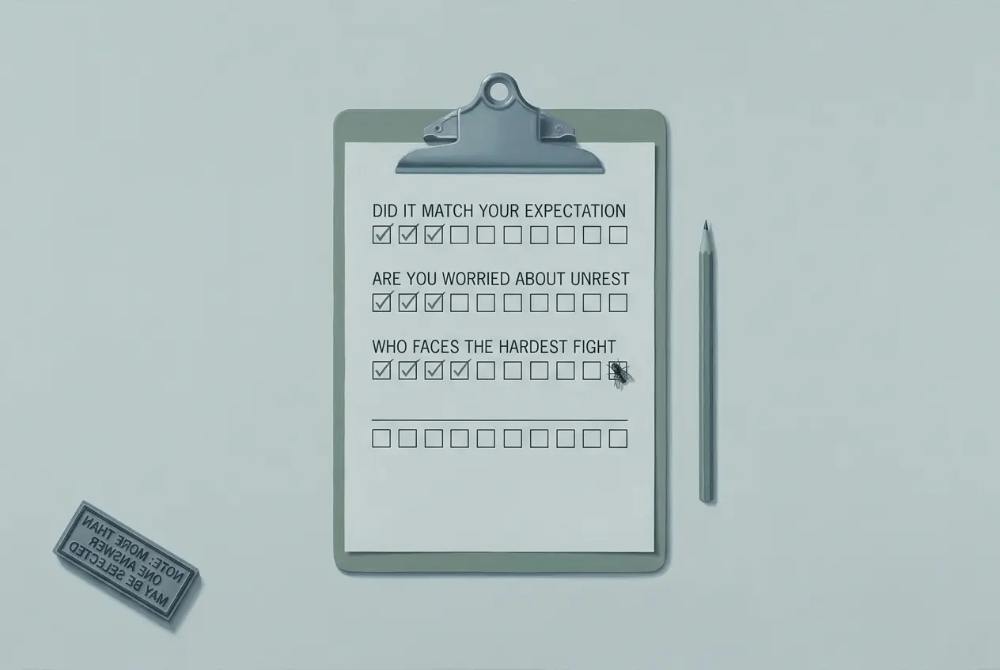

## 0084 – The Question Not Asked
### *What five years of Nida Poll surveys measure, and what they never put to the public (2021–2026)*

*Last updated: 21 September 2026, 05:38:59 (ICT)*

-----

**Occasion (2026, live):** On 20 September the Nida Poll Centre at the National Institute of Development Administration published "มติ กกต." — *The EC Resolution* — a survey on the Election Commission's decision of 14 September to refer 77 people, among them 26 sitting senators, to the Supreme Court. The Bangkok Post reported it twice, on 20 and 21 September. This node does not dispute the findings. It reads the instrument.

## 1. The thesis

Thailand's most-cited pollster asks the public what it **expects**, what it **fears**, and whom it **prefers**. It does not ask whether an exercise of public authority was **rightful**. Across 310 surveys published between 2021 and 2026 the Thai vocabulary of legitimacy does not appear once, and not a single question asks the public to judge a decision of the Election Commission or a ruling of a court.

This is not an accusation of manipulation. Nida discloses its methods, including the footnotes that the press omits. The finding is an **absence**, and the absence is consequential: a public can be recorded as anxious, dissatisfied and pessimistic for years without ever being asked whether what was done to it was lawful.

## 2. The corpus and how it was built

| | |
|---|---|
| Archive listing (`/all-polls/`, Thai) | **310** surveys, 26 pages |
| English listing (`/en/all-polls/`) | **311** |
| Union of both | **312** |
| With a downloadable report | **310** |
| **Secured and analysed here** | **310 PDF reports, c. 80 MB** |
| Oldest report | **2021** — the site archives no further back |

Two survey pages carry no report at all and could not be included.

**Three traps were found in building this corpus, and each would have corrupted the count:**

1. **The upload path is not the survey date.** Reports from 2021, 2022 and 2023 sit in folders dated `2025/12` and `2026/01`, evidently from a site migration. Dating from the file path produces nonsense.
2. **Four different file-naming conventions**, plus 113 reports with a free-form name (`Report-53-65`, `03.bkk-_parliamentary_elections`). Only harvesting each survey page yields the true address.
3. ⚠️ **The embedded Thai fonts swap า and ำ**, and a genuine ำ arrives as *space + า*. Any keyword search run on the raw extraction is worthless. All counts below were run after repair.

## 3. The vocabulary of legitimacy: zero

Four Thai renderings were tested across all 310 reports:

| Term | Meaning | Reports |
|---|---|---|
| **ชอบธรรม / ความชอบธรรม** | legitimate, legitimacy | **0** |
| **ชอบด้วยกฎหมาย** | lawful | **0** |
| **ถูกต้องตามกฎหมาย** | legally correct | **1** |
| **ถูกกฎหมาย** | legal | 6 |

The single "legally correct" hit is a survey on **cannabis reclassification**. All six "legal" hits ask whether something *should be made* legal — casinos, vote-buying, cannabis, gambling, a salary rule. **None asks whether an act of authority *was* lawful.**

The phrase **ยอมรับผล** — *accept the result* — appears **zero** times.

## 4. What is asked instead

Question stems containing **ท่าน** (*you*) were counted; the word never occurs in the methodological boilerplate, so these counts are clean.

| Form | Meaning | Reports | Measures |
|---|---|---|---|
| **ท่านคิดว่า** | do you think / what do you think | **146** — 47.1 % | **prediction, perception** |
| **ท่านเห็นด้วยหรือไม่** | do you agree or not | 48 — 15.5 % | judgement |
| **ท่านมีความคิดเห็นอย่างไร** | what is your view on | 33 — 10.6 % | judgement |
| **A or B combined** | | **71** — 22.9 % | **judgement** |
| **ท่านเชื่อ** | do you believe | 30 — 9.7 % | expectation |
| **ท่านพอใจ** | are you satisfied | 10 — 3.2 % | satisfaction |

**Nearly one report in two asks what the public expects to happen. Fewer than one in four asks it to judge anything at all.**

And what the 71 judgement questions are about: a waste-collection fee, school uniforms, mask removal, the easing of pandemic measures, vaccine distribution by local government, a prime-ministerial announcement, a protest, a party founding, the two-ballot system, pornography, casinos, NGO funding disclosure, making vote-buying legal, small parties in electoral law, trial governor elections, same-sex marriage, cannabis, protest zones, a three-digit lottery, student-loan interest, a drug-code principle.

**Four ask about a มติ — a resolution of an institution.** Two of those concern resolutions of parliament. **About a decision of the Election Commission: none. About a court ruling as such: none. About a party dissolution: none.**

## 5. The two that come closest — and how both step aside

### 5.1 December 2024: the penalty, with the verdict as premise

The survey "ยุบพรรค ตัดสิทธิทางการเมือง" — *Party dissolution, political disqualification* (1 December 2024) — puts three questions in the evaluative form. The second reads:

> *"ท่านมีความคิดเห็นอย่างไรกับการลงโทษยุบพรรคการเมืองที่ถูกศาลรัฐธรรมนูญตัดสินว่าใช้สิทธิเสรีภาพเพื่อล้มล้างการปกครอง…"*
>
> "What is your view on **the penalty** of dissolving a political party **which the Constitutional Court has ruled** used its rights and freedoms to overthrow the system of government…?"

The respondent is invited to assess the **sanction**. The **ruling** stands inside the question as a settled premise. The third question repeats the construction for the disqualification of party executives.

### 5.2 March 2026: the filing, and a constitutional guarantee reduced to a feeling

Three to four weeks after the general election of 8 February 2026, Nida surveyed the dispute over QR and bar codes printed on ballot papers — the matter on which the Constitutional Court rules on **28 September 2026**. Its three questions:

> *"ท่านมีความคิดเห็นอย่างไรเกี่ยวกับการจัดตั้งรัฐบาลใหม่ และ**การฟ้องร้องต่อศาล** กรณีการติดคิวอาร์โค้ด-บาร์โค้ด บนบัตรเลือกตั้ง"*
>
> "What is your view on the formation of the new government and **on the filing of a case with the court** concerning the QR and bar codes on the ballots?"

- **44.81 %** — do not rush; wait until the court has ruled
- **41.68 %** — form the government quickly so the country can move on
- 13.20 % — either way

> *"ท่านคิดว่า … จะนำไปสู่ความวุ่นวายทางการเมืองรอบใหม่หรือไม่"* — "Do you think … it will lead to a new round of political turmoil?"

- 36.56 % — no turmoil
- 34.20 % — turmoil the government can control
- **28.55 % — turmoil the government cannot control**

> *"ท่านกังวลหรือไม่ว่า การไปลงคะแนนเสียงเลือกตั้งของท่าน … จะไม่เป็นความลับ"* — "Are you **worried** that your vote … was not secret?"

- 47.64 % not at all worried · 14.27 % not very · 19.08 % fairly · **18.55 % very worried**
- **Worried in total: 37.63 %**

**Section 83 of the constitution guarantees a secret ballot for both ballot papers.** The question asks whether people are *worried*. It does not ask whether the guarantee held. That is left to the court — and, in the meantime, more than a third of respondents already doubted the secrecy of their own vote in a national election.

A plurality wanted the ruling before a government was formed. The government was formed first. The ruling comes **almost seven months later**.

## 6. The Election Commission: capability, not lawfulness

Five reports mention the Election Commission. Two are provincial election surveys where it merely sets the date. The three substantive ones ask:

- **February 2026** — *Was there fraud in your constituency?* (perception) · *Do you think the EC **will be able** to punish those responsible?* (capability) · *How **satisfied** are you with its work?* (satisfaction)
- **September 2026** — *Did the decision match your expectation?* · *Are you worried about turmoil?* · *Who faces the hardest political or legal fight?*

The most common answer to the first September question — **34.27 %** — was that they had **expected nothing at all**.

## 7. The turmoil question is not the house theme; it is the crisis theme

**ความวุ่นวาย** — *turmoil* — appears in **12 of 310** reports and forms a question in **two**. It is rare. But its placement is not:

| | |
|---|---|
| Aug 2021 | the Free Youth protest of 7 August |
| Jul 2022 | Bangkok's seven designated protest zones |
| Aug 2022 | protests over the eight-year term limit |
| Sep / Oct 2024 | confidence in, and survival of, the Paetongtarn government |
| Mar 2025 | the censure debate |
| **Mar 2026** | **the ballot-code case** |
| **Sep 2026** | **the EC resolution** |

In ordinary weeks the subjects are cannabis, football, the lottery, care of the elderly. **When an institution acts, the question that appears is whether the public is worried.** Three times in two years that moment concerned the constitution, an election, or the Election Commission.

## 8. What the press then does with it

Question three of the September survey carries a footnote in the Thai original:

> *"หมายเหตุ: สามารถเลือกตอบได้มากกว่า 1 ข้อ"* — "Note: more than one answer may be selected."

The eleven answers sum to **165.5 %**. One respondent could be counted in the Election Commission's 35.57 and in the prime minister's 31.53 at once. Nida does not publish how many answers each respondent gave, so whether the 35.57 comes from people who named the commission alone or from people who named six things is not recoverable from the report.

English-language reporting dropped the footnote and rendered the figures as ranks — one name "came second", another "followed". **A share of opinion and a rate of mention are different quantities, and only the second was measured.**

This is the second layer of the problem, and it is not Nida's: the instrument constrains what can be said, and downstream nobody marks the constraint.

## 9. What this node does not claim

- **Not manipulation.** Nida declares its multiple-response questions, publishes its sample tables with absolute numbers, and states its confidence level. The record is open; that is how this node was possible.
- **Not intent.** Why a question is framed one way and not another is nowhere on the record, and is not asserted here.
- **Not that legitimacy is easy to measure.** It is a hard construct. The finding is the absence of the attempt.
- **Not a complete coding.** The counts rest on keyword and question-stem searches across all 310 reports, plus a full reading of every question in the 71 evaluative reports and in the 14 reports that mention a court, the Election Commission or a party dissolution. The remainder was not coded question by question.

## 10. Why it matters

On 8 February 2026, **21,621,638 voters — 60.16 %** — approved the drafting of a new constitution. Since then the instrument that records Thai public opinion has asked whether people are anxious, whether they are satisfied, and what they expect to happen next.

Between a referendum and a mood question lies precisely the distinction at issue in the whole dispute: whether the public is a **source of authority** or an **object of observation**. Trust can fall for five years without anyone once being asked whether what was done was lawful.

-----

*Sources: all 310 Nida Poll reports 2021–2026, obtained from nidapoll.nida.ac.th and held in the working archive; Nida Poll, "มติ กกต.", fielded 15–16 September 2026, n = 1,310; Nida Poll, "จัดตั้งรัฐบาลใหม่ VS ปัญหาบัตรเลือกตั้ง", fielded 2–4 March 2026, n = 1,310; Nida Poll, "ยุบพรรค ตัดสิทธิทางการเมือง", fielded 25–26 November 2024; Nida Poll, "กกต. จะลงโทษผู้ทุจริตการเลือกตั้ง ได้ไหม", fielded 11–12 February 2026; Election Commission results for the referendum of 8 February 2026. Related nodes: [0078](0078-the-court-as-instrument.md), [0077](0077-the-postbag-filter.md), [0011](0011-bangkok-post-comment-ecology.md).*

