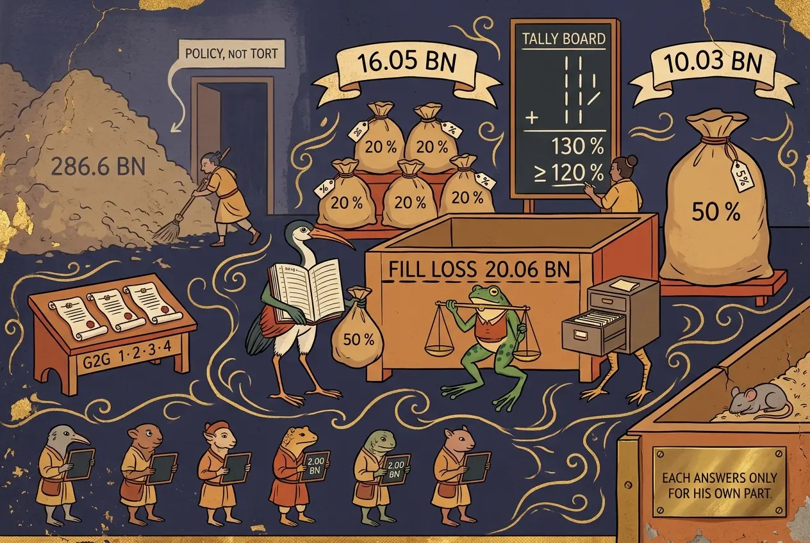
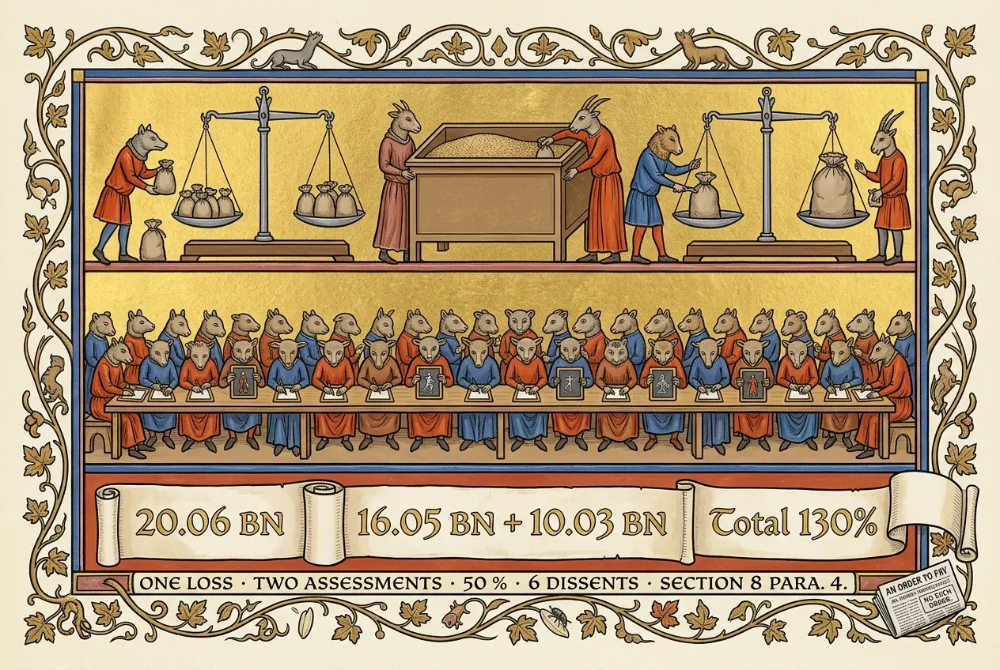

## 0085 – Assessed Above the Loss
### *How liability for the rice-pledging scheme was divided, what the Supreme Administrative Court did and did not decide, and the six judges who disagreed (2016–2026)*

*Last updated: 24 September 2026, 08:05:55 (ICT)*

-----

**Occasion (2026, live):** On 23 September the Supreme Administrative Court upheld the lower court and refused former prime minister Yingluck Shinawatra's request to reopen the rice-pledging liability case. The Bangkok Post reported it the same day as "the case that resulted in an order for her to pay" 10 billion baht. That description is the one the court's own office corrected sixteen months ago. This node reads the record behind the number.

## 1. The thesis

One loss was established: **20,057,723,761.66 baht**, from four government-to-government rice contracts. Liability for it was assessed twice — against the officials who carried out the sales, and against the prime minister who chaired the policy committee. **Added together, the assessments exceed the loss.** The share that pushes them over is hers, at a rate of 50 per cent that the ministry had not used, that the officials were not given, and that six judges of the same court — among them its vice-president and the head of its tort division — rejected.

This is not a claim that she bore no liability. The dissenting judges found her liable too. The finding concerns **the rate and how it relates to the shares already assessed**, and the record does not explain that relation.

## 2. The chain

| Date | Step | Amount (baht) |
|---|---|---|
| 28 Jan 2016 | Finance Ministry fact-finding committee (secret orders 448/2558, 1824/2558) reports; recommends **full** liability | **286,639,648,201.45** |
| 19 Sep 2016 | Commerce Ministry secret order **453/2559** against the officials, G2G contracts | loss basis **20,057,723,761.66** |
| 13 Oct 2016 | Finance Ministry order **1351/2559** against her: **20 %** of losses in the 2012/13 and 2013/14 crop years (178,586,365,141.17) | **35,717,273,028.23** |
| 2017 | Supreme Court, Criminal Division for Holders of Political Positions: the officials convicted; former commerce minister Boonsong Teriyapirom's sentence stands at 48 years after appeal | — |
| 2021 | Central Administrative Court upholds the officials' liability (one share reduced) and **revokes the order against her in full**; the nine state respondents appeal | — |
| **22 May 2025** | Supreme Administrative Court, **general assembly of judges**: order against her unlawful **only insofar as it exceeds** | **10,028,861,880.83** |
| 26 May 2025 | Office of the Administrative Court issues a clarification (§ 4) | — |
| 13 Jan 2026 | Central Administrative Court refuses a retrial | — |
| **23 Sep 2026** | Supreme Administrative Court upholds the refusal | — |

## 3. From 286.6 billion to 20.06 billion: policy and execution

The fact-finding committee counted the losses of the whole scheme. The Finance Ministry's civil-liability panel then excluded the first two crop seasons (**115,341,939,848.81**), on the ground that she could not yet have known of the losses, and charged her 20 per cent of the rest.

The courts drew a different line. **Policy presented to parliament is not a tort; its execution is administrative action**, and in executing it she acted as an official under the Act on Liability for Wrongful Acts of Officials B.E. 2539 (1996). Of the scheme's four stages — farmer registration, pledging and storage, milling, and sale — liability attaches to **one**: the government-to-government sales, where officials were convicted of fraud.

The fall from 286.6 to 20.06 billion is therefore not a discount. It is **the separation of a policy's cost from a fraud's loss**, and only the second is a tort. Whether the 286.6 billion was ever a measure of damage in the legal sense is a question this node leaves open (§ 9).

## 4. What the court decided — and what it did not

Four days after the judgment, the Office of the Administrative Court published a clarification. Its central sentence:

> *"ศาลปกครองสูงสุดไม่ได้มีคำพิพากษาและออกคำบังคับให้ผู้ฟ้องคดีที่ 1 ชดใช้ค่าสินไหมทดแทน …"*
> — "The Supreme Administrative Court did not issue a judgment or an enforcement order requiring the first plaintiff to pay compensation."

In an action to revoke an administrative order, the court can revoke. It revoked the Finance Ministry's order **insofar as it demanded more than 10,028,861,880.83 baht** and left the rest standing. **The obligation to pay comes from the ministry's order of 2016, not from the court.** The court fixed its ceiling.

The same clarification records a procedural sequence. A five-judge chamber heard the appeal on **12 September 2023**, and all five signed the draft. The court's president then referred the case to the general assembly. By the time the judgment was issued, **two of the five had left the service** and could not sign. The judgment came **twenty months** after the chamber hearing.

## 5. The shares

**The officials.** Section 8 of the 1996 Act requires the authority to weigh the gravity of each official's act (para. 2), to deduct the part caused by faults of the agency or the system (para. 3), and — where several officials are involved — **forbids joint liability**: each answers only for his own part (para. 4).

The Commerce Ministry assessed each official at **20 per cent of the loss on each contract he was involved in**:

| Official | Assessed (baht) |
|---|---|
| Plaintiffs 1, 2 and 3 in the officials' case | **4,011,544,752.33** each |
| Plaintiff 4 | 2,242,571,739.67 |
| Plaintiff 5 | 1,768,973,012.66 |
| **Total** | **16,046,179,009.32** |

The Central Administrative Court found the five had acted **deliberately, dividing the work among themselves**, and upheld four assessments as fair. For plaintiff 3 it lowered the rate to **10 per cent** on the two contracts concluded partly before he took up his post.

**The prime minister.** The general assembly set her at **50 per cent** of the loss — **10,028,861,880.83** baht, exactly half of 20,057,723,761.66.

**The sum.** *The following is this node's arithmetic, not a figure from any court.* The ministry's assessments against the officials plus the court's ceiling for her come to **26.08 billion baht — 130 per cent of the loss**. The reduction for plaintiff 3 cannot exceed 10 per cent of the value of two contracts, and so cannot exceed 2.01 billion; after it, the total still stands at **no less than 120 per cent**. Whether the officials' liabilities are final is not established here.

Section 8 para. 4 limits each official to his own share. **What the record does not say is what her own 50 per cent is a share of, once the officials' shares have been assessed against the same loss.**

## 6. The six who disagreed

Of roughly forty judges in the general assembly, six filed dissents, in four groups (Isranews, 24 May 2025, from the judgment):

| Judge | Position |
|---|---|
| **Somchai Watthanakarun** | **Vice-President** of the Supreme Administrative Court (groups 2 and 3) |
| **Anuwat Tharasawaeng** | **President of the Division for Tort and Other Liability** |
| **Manit Wongseri** | President of the Division for Fiscal and Budgetary Discipline |
| **Paiboon Warahapaithoon** | President of the Environmental Division |
| Somyot Watthanaphirom | Judge (groups 2 and 3) |
| Somrit Chaiwong | Judge |

The head of the division that decides tort cases dissented in a tort case.

**The dissent of Paiboon Warahapaithoon is published in detail.** He too finds her liable for gross negligence: as head of government she had direct authority to supervise the policy's execution and to order every ministry to stop the fraud, and she did not. But on the weight of her part:

> *"เหตุแห่งความเสียหายจากการระบายข้าวด้วยวิธีขายแบบรัฐต่อรัฐ เกิดจากการที่เจ้าหน้าที่ในระดับปฏิบัติกระทำทุจริตโดยอาศัยอำนาจหน้าที่ของตน … หาใช่เกิดจากมติของ กขช. หรือมติของคณะรัฐมนตรีในรัฐบาลของผู้ฟ้องคดีที่ 1 แต่อย่างใด อีกทั้งผู้ฟ้องคดีที่ 1 มิได้เป็นหัวหน้าหน่วยงานหรือผู้บังคับบัญชาโดยตรง"*
> — "The cause of the loss from the government-to-government sales was that officials at the operational level committed fraud by using their powers … not a resolution of the National Rice Policy Committee or of the cabinet of the first plaintiff's government. Moreover, the first plaintiff was neither the head of the agency nor the direct superior."

He adds that she was **not accused of being a co-principal** in the fraud. His computation applies all three rules of Section 8 in turn:

| Step | Amount (baht) |
|---|---|
| Loss on the four contracts, as he finds it | 20,014,284,113.16 |
| less 50 % for faults of the agency and the system (para. 3) | 10,007,142,056.58 |
| her share, 20 % (para. 2) | **2,001,428,411.32** |

**One judge's figure is about a fifth of the majority's.** The difference lies in the step the majority's figure does not show: a deduction for the system's own failure. *On this node's arithmetic*, his figure and the ministry's assessments against the officials together come to 18.05 billion baht — **below** the loss. The reasoning of the other five dissenters has not been examined for this node; their figures are not asserted here.

## 7. The amnesty that does not reach it

Since **24 August 2026** Thailand has had an amnesty law, the พระราชบัญญัติสร้างเสริมสังคมสันติสุข พ.ศ. ๒๕๖๙ — the *Act on Strengthening a Peaceful Society B.E. 2569*. Once a person's amnesty is approved, state agencies must, among other things, **discontinue civil proceedings and the enforcement of damages owed to the state** (Thai PBS summary of the Act, 24 August 2026). A claim of the Finance Ministry is exactly such a claim.

It does not reach this one, for two independent reasons:

1. **Scope.** The Act covers acts connected with **political assemblies or political expression** arising from political conflict or motivation, committed between 1 January 2005 and 16 July 2025. Liability for the execution of a rice-sales programme is neither.
2. **Exception.** Section 3 withholds amnesty from offences of *"ทุจริตหรือประพฤติมิชอบ"* — **corruption or misconduct in office** — the category of the officials' convictions and of her own.

*The Act is cited from press reproductions (Section 3 via Komchadluek; scope and effects via Thai PBS). The Gazette text has not been read for this node.*

## 8. What this node does not claim

- **Not that she bears no liability.** Every judge whose reasoning is published here found her liable.
- **Not that the court acted improperly.** The general assembly is a lawful formation; referral by the president is provided for by law. The sequence in § 4 is recorded, not interpreted.
- **Not that the state will collect more than its loss.** Assessment is not collection, and what has in fact been recovered is not established here.
- **Not intent.** Why the rate was set at 50 per cent is not on the record examined. The node records only that the record does not explain it.

## 9. Open questions

- **16.91 or 20.06 billion?** The criminal court's figure for the same four contracts in 2017 and the administrative courts' figure differ by about 3.15 billion. Not resolved.
- **What the 286.6 billion consists of.** If it contains the scheme's price support to farmers, it measured the policy's cost, not a tort.
- **How the majority reached 50 per cent** — in particular, whether it made any deduction under Section 8 para. 3.
- **The other dissents** (groups 2 to 4) and their figures.
- **Sections 4 and 12 of the 1996 Act** — who counts as an official, and how the ministry enforces its own order.

## 10. Why it matters

A former prime minister's liability for a failed programme is the kind of case in which the arithmetic is the argument. When the shares of those who committed the fraud and the share of the one who failed to stop it are added and exceed the loss, the question is no longer political. It is the question Section 8 para. 4 was written to answer — **each answers for his own part** — and six judges of the court that applied it did not find it answered.

-----

*Sources: Office of the Administrative Court, clarification of 26 May 2025, as reproduced by Thai PBS ("ศาลปกครองชี้แจงไม่ได้สั่ง ยิ่งลักษณ์ ชดใช้คดีจำนำข้าว", 26 May 2025); Isranews, "ความเห็นแย้ง'ตุลาการเสียงข้างน้อย'(1)", 24 May 2025 (Supreme Administrative Court, black case อผ.163-166/2564, red case อผ.160-163/2568); Bangkok Biz News, "ศาลยัน 'บุญทรง-พวก' ต้องชดใช้จำนำข้าว 1.6 หมื่นล้าน" (Central Administrative Court, officials' case); Komchadluek and Thai PBS, 23 September 2026 (retrial refused); Thai PBS, 19 May 2026 (Boonsong Teriyapirom, sentence); Act on Liability for Wrongful Acts of Officials B.E. 2539, Section 8, working translation held in the archive; Thai PBS, "บังคับใช้แล้ว! สิ่งที่ต้องรู้เกี่ยวกับ พ.ร.บ.สร้างเสริมสังคมสันติสุข พ.ศ.2569", 24 August 2026; Komchadluek (Section 3 of the Act); Bangkok Post, "Court rejects Yingluck's appeal for rice-graft retrial", 23 September 2026. Related nodes: [0078](0078-the-court-as-instrument.md), [0060](0060-thai-help-thai-plus-constitutional-architecture.md).*

